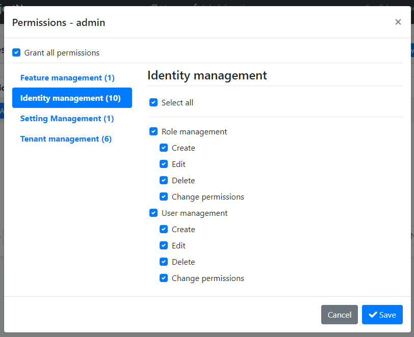
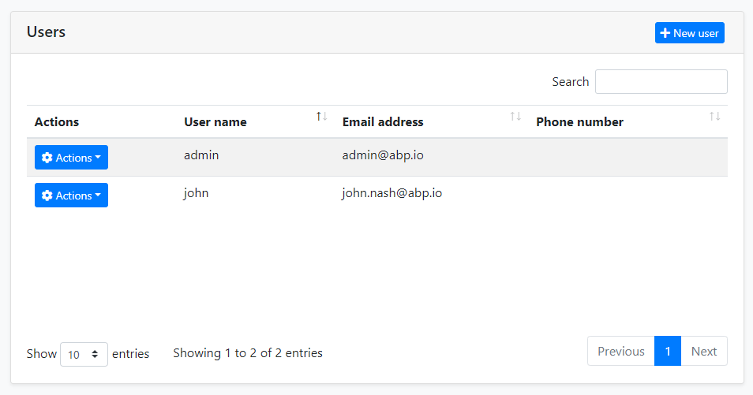

# 身份管理模块

身份模块基于 [Microsoft Identity 库](https://docs.microsoft.com/zh-cn/aspnet/core/security/authentication/identity) 用于管理角色,用户和他们的权限.

## 如何安装

当你使用 ABP 框架 [创建一个新的解决方案](https://abp.io/get-started) 时，此模块将被预安装（作为 NuGet/NPM 包）。你可以继续用其作为包并轻松地获取更新，也可以将其源代码包含在解决方案中（请参阅 `get-source` [CLI](../CLI.md)）以开发自定义模块。

### 源代码

可以 [在此处](https://github.com/abpframework/abp/tree/dev/modules/identity) 访问源代码。源代码使用 [MIT](https://choosealicense.com/licenses/mit/) 许可, 所以你可以免费使用和自定义它.

## 用户界面

此模块提供了 [Blazor](../UI/Blazor/Overall.md), [Angular](../UI/Angular/Quick-Start.md) 和 [MVC / Razor Pages](../UI/AspNetCore/Overall.md) 的 UI 可选.

### 菜单项

此模块在 *管理* 菜单下添加了一个 *身份管理* 菜单项:


这个菜单项和相关页面已获得授权. 这意味着当前用户必须拥有相关权限才能使其可见. `admin` 角色 (和拥有此角色的用户, 如 `admin` 用户) 已经拥有这些权限. 如果你想要使其他角色/用户也启用权限, 请打开 *角色* 或 *用户* 页面的 *权限* 对话框, 并检查如下所示的权限:



请参阅 [授权文档](../Authorization.md) 以了解权限系统.

### 页面

本节介绍此模块提供的主要页面.

#### 用户

此页用于查看用户列表. 您可以创建/编辑和删除用户, 将角色分配给用户.



一个用户可以有零个或多个角色. 用户从其角色继承权限. 此外, 你可以给用户直接分配权限 (通过点击 *操作* 按钮, 然后选择 *权限*) .

#### 角色

角色用于按分组给用户分配权限.


角色除了角色名称之外还有2个属性:

* `Default`: 如果某个角色被标记为 "default", 那么当新用户 (使用 [账户模块](Account.md)) 注册到应用程序时, 其将被作为默认角色分配给新用户.
* `Public`: 用户的公共角色可以被应用程序中的其他用户看到. 这个功能在身份模块中没有用到, 但被提供作为你可能希望在你自己的应用程序中使用的功能.

## 其他功能

本节包括此模块提供的没有 UI 页面的其他功能.

### 组织单元

组织单元 (OU) 可被用于 **按层级对用户和实体进行分组**. 

#### 组织单元实体

组织单元由 **OrganizationUnit** 实体表示. 它的基本属性是:

- **TenantId**: 组织单元的租户Id. 对于宿主可以是 null.
- **ParentId**: 父级组织单元的Id. 如果这是一个根级组织单元，它可以是 null.
- **Code**: 对于租户唯一的层级字符串编码.
- **DisplayName**: 组织单元的显示名称.

#### 组织树

由于组织单元可以有父级, 因此租户的所有组织单元是一个 **树** 结构. 这个树有一些规则;

- 可以有多个根级 (`ParentId` 是 `null` 的) .
- 一个组织单元的第一级子项数量有限制 (因为下面解释的固定的组织单元编码单位长度) .

#### 组织单元编码

组织单元编码是通过 `OrganizationUnitManager` 服务自动生成和维护的. 它是一个字符串, 像这个:

"**00001.00042.00005**"

这个编码常被用于轻易地 (递归) 查询出数据库中组织单元的所有子项. 这个编码有一些规则 (当你使用 `OrganizationUnitManager` 时自动被应用的) : 

- 对 [租户](../Multi-Tenancy.md) 是 **唯一的**.
- 同一组织单元的全部子项都具有 **以父级组织单元编码开头的** 编码
- 如示例中所示, 它是固定长度的且是基于树中组织单元的级别的.
- 尽管组织单元编码是唯一的, 但如果你移动了相关的组织单元, 它也可以被更改.

请注意, 你必须根据Id引用一个组织单元, 而不是编码, 因为编码后续是可以被更改的.

#### 组织单元管理

`OrganizationUnitManager` 类可以被 [注入](../Dependency-Injection.md) 并用来管理组织单元. 常见用例如下:

- 创建, 更新和删除组织单元.
- 在组织单元树中移动一个组织单元.
- 获取关于组织单元树及其项的信息.

## 身份安全日志

安全日志系统可以记录账户的一些重要的操作或者改动 (例如 *登录* 和 *更改密码*) . 如果需要, 你也可以保存安全日志.

你可以注入和使用 `IdentitySecurityLogManager` 或 `ISecurityLogManager` 来写入安全日志. 默认它会创建一个日志对象并填充常用的值, 如 `CreationTime`, `ClientIpAddress`, `BrowserInfo`, `current user/tenant` 等等. 当然你可以覆盖这些值.

```cs
await IdentitySecurityLogManager.SaveAsync(new IdentitySecurityLogContext()
{
    Identity = "IdentityServer";
    Action = "ChangePassword";
});
```

通过配置 `AbpSecurityLogOptions` 来为日志提供应用程序的名称 (如果你有多个应用程序并且想要在日志中区分应用程序) 或者禁用安全日志功能.

```cs
Configure<AbpSecurityLogOptions>(options =>
{
	options.ApplicationName = "AbpSecurityTest";
});
```
## 选项

`IdentityOptions` is the standard [options class](../Options.md) provided by the Microsoft [Identity library](https://docs.microsoft.com/en-us/aspnet/core/security/authentication/identity). So, you can set these options in the `ConfigureServices` method of your [module](../Module-Development-Basics.md) class.

**Example: Set minimum required length of passwords**

````csharp
Configure<IdentityOptions>(options =>
{
    options.Password.RequiredLength = 5;
});
````

ABP takes these options one step further and allows you to change them on runtime by using the [setting system](../Settings.md). You can [inject](../Dependency-Injection.md) `ISettingManager` and use one of the `Set...` methods to change the option values for a user, a tenant or globally for all users.

**Example: Change minimum required length of passwords for the current tenant**

````csharp
public class MyService : ITransientDependency
{
    private readonly ISettingManager _settingManager;

    public MyService(ISettingManager settingManager)
    {
        _settingManager = settingManager;
    }

    public async Task ChangeMinPasswordLength(int minLength)
    {
        await _settingManager.SetForCurrentTenantAsync(
            IdentitySettingNames.Password.RequiredLength,
            minLength.ToString()
        );
    }
}
````

`IdentitySettingNames` class (in the `Volo.Abp.Identity.Settings` namespace) defines constants for the setting names.

## Distributed Events

This module defines the following ETOs (Event Transfer Objects) to allow you to subscribe to changes on the entities of the module;

* `UserEto` is published on changes done on an `IdentityUser` entity.
* `IdentityRoleEto` is published on changes done on an `IdentityRole` entity.
* `IdentityClaimTypeEto` is published on changes done on an `IdentityClaimType` entity.
* `OrganizationUnitEto` is published on changes done on an `OrganizationUnit` entity.

**Example: Get notified when a new user has been created**

````csharp
public class MyHandler :
    IDistributedEventHandler<EntityCreatedEto<UserEto>>,
    ITransientDependency
{
    public async Task HandleEventAsync(EntityCreatedEto<UserEto> eventData)
    {
        UserEto user = eventData.Entity;
        // TODO: ...
    }
}
````

`UserEto` and `IdentityRoleEto` are configured to automatically publish the events. You should configure yourself for the others. See the [Distributed Event Bus document](../Distributed-Event-Bus.md) to learn details of the pre-defined events.

> Subscribing to the distributed events is especially useful for distributed scenarios (like microservice architecture). If you are building a monolithic application, or listening events in the same process that runs the Identity Module, then subscribing to the [local events](../Local-Event-Bus.md) can be more efficient and easier.

## Internals

This section covers some internal details of the module that you don't need much, but may need to use in some cases.

### Domain layer

#### Aggregates

##### User

A user is generally a person logins to and uses the application.

* `IdentityUser` (aggregate root): Represents a user in the system.
  * `IdentityUserRole` (collection): Roles to the user.
  * `IdentityUserClaim` (collection): Custom claims of the user.
  * `IdentityUserLogin` (collection): External logins of the user.
  * `IdentityUserToken` (collection): Tokens of the user (used by the Microsoft Identity services).

##### Role

A role is typically a group of permissions to assign to the users.

* `IdentityRole` (aggregate root): Represents a role in the system.
  * `IdentityRoleClaim` (collection): Custom claims of the role.

##### Claim Type

A claim type is a definition of a custom claim that can be assigned to other entities (like roles and users) in the system.

* `IdentityClaimType` (aggregate root): Represents a claim type definition. It contains some properties (e.g. Required, Regex, Description, ValueType) to define the claim type and the validation rules.

##### Identity Security Log

A `IdentitySecurityLog` object represents an authentication related operation (like *login*) in the system.

* `IdentitySecurityLog` (aggregate root): Represents a security log in the system.

##### OrganizationUnit

An Organization unit is a entity in a hierarchical structure.

* ```OrganizationUnit``` (aggregate root): Represents an organization unit in the system.
  * ```Roles``` (collection): Roles of the organization unit.

#### Repositories

Following custom repositories are defined for this module:

* `IIdentityUserRepository`
* `IIdentityRoleRepository`
* `IIdentityClaimTypeRepository`
* ```IIdentitySecurityLogRepository```
* ```IOrganizationUnitRepository```

#### Domain services

##### User manager

`IdentityUserManager` is used to manage users, their roles, claims, passwords, emails, etc. It is derived from Microsoft Identity's `UserManager<T>` class where `T` is `IdentityUser`.

##### Role manager

`IdentityRoleManager` is used to manage roles and their claims. It is derived from Microsoft Identity's `RoleManager<T>` class where `T` is `IdentityRole`.

##### Claim type manager

`IdenityClaimTypeManager` is used to perform some operations for the `IdentityClaimType` aggregate root.

##### Organization unit manager

```OrganizationUnitManager``` is used to perform some operations for the ```OrganizationUnit``` aggregate root.

##### Security log manager

```IdentitySecurityLogManager``` is used to save security logs.

### Application Layer

#### Application Services

* `IdentityUserAppService` (implements `IIdentityUserAppService`): Implements the use cases of the user management UI.
* `IdentityRoleAppService` (implement `IIdentityRoleAppService`): Implements the use cases of the role management UI.
* `IdentityClaimTypeAppService` (implements `IIdentityClaimTypeAppService`): Implements the use cases of the claim type management UI.
* `IdentitySettingsAppService` (implements `IIdentitySettingsAppService`): Used to get and update settings for the Identity module.
* `IdentityUserLookupAppService` (implements `IIdentityUserLookupAppService`): Used to get information for a user by `id` or `userName`. It is aimed to be used internally by the ABP framework.
* `ProfileAppService` (implements `IProfileAppService`): Used to change a user's profile and the password.
* ```IdentitySecurityLogAppService``` (implements ```IIdentitySecurityLogAppService```): Implements the use cases of the security logs UI.
* ```OrganizationUnitAppService``` (implements ```OrganizationUnitAppService```): Implements the use cases of the organization unit management UI.

### Database Providers

This module provides [Entity Framework Core](../Entity-Framework-Core.md) and [MongoDB](../MongoDB.md) options for the database.

#### Entity Framework Core

[Volo.Abp.Identity.EntityFrameworkCore](https://www.nuget.org/packages/Volo.Abp.Identity.EntityFrameworkCore) NuGet package implements the EF Core integration.

##### Database Tables

* **AbpRoles**
  * AbpRoleClaims
* **AbpUsers**
  * AbpUserClaims
  * AbpUserLogins
  * AbpUserRoles
  * AbpUserTokens
* **AbpClaimTypes**
* **AbpOrganizationUnits**
  * AbpOrganizationUnitRoles
  * AbpUserOrganizationUnits
* **AbpSecurityLogs**

#### MongoDB

[Volo.Abp.Identity.MongoDB](https://www.nuget.org/packages/Volo.Abp.Identity.MongoDB) NuGet package implements the MongoDB integration.

##### Database Collections

* **AbpRoles**
* **AbpUsers**
* **AbpClaimTypes**
* **AbpOrganizationUnits**
* **AbpSecurityLogs**

#### Common Database Properties

You can set the following properties of the `AbpIdentityDbProperties` class to change the database options:

* `DbTablePrefix` (`Abp` by default) is the prefix for table/collection names.
* `DbSchema` (`null` by default) is the database schema.
* `ConnectionStringName` (`AbpIdentity` by default) is the [connection string](../Connection-Strings.md) name for this module.

These are static properties. If you want to set, do it in the beginning of your application (typically, in `Program.cs`).
