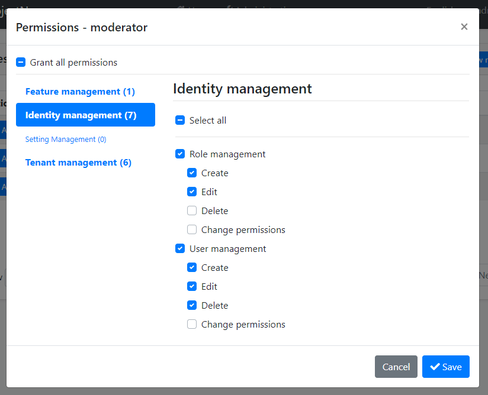

# 权限管理模块

此模块实现了 `IPermissionStore` 接口, 并在数据库中管理权限值.

> 此文档仅介绍了将权限值持续保存到数据库的权限管理模块. 请参阅 [授权文档](../Authorization.md) 来了解授权和权限系统.

## 如何安装

当你使用 ABP 框架 [创建一个新的解决方案](https://abp.io/get-started) 时, 此模块将被预安装(作为 NuGet/NPM 包). 你可以继续用其作为包并轻松地获取更新, 也可以将其源代码包含在解决方案中 (请参阅 `get-source` [CLI](../CLI.md) 命令) 以开发自定义模块.

### 源代码

可以 [在此处](https://github.com/abpframework/abp/tree/dev/modules/permission-management) 访问源代码。源代码使用 [MIT](https://choosealicense.com/licenses/mit/) 许可, 所以你可以免费使用和自定义它.

## 用户界面

### 权限管理对话框

权限管理模块提供了一个可重用的对话框来管理与对象相关的权限. 例如: [身份模块](Identity.md) 用它去管理用户和角色的权限. 下图展示了身份模块的角色管理页面:


当你点击角色的 *操作* -> *权限* 时, 将打开权限管理对话框. 下面是此对话框的一个示例截图:



在对话框中, 你可以为所选角色授予权限. 左侧的选项卡表示主要权限组, 右侧包括了所选权限组中定义的权限.

## IPermissionManager

`IPermissionManager` 是此模块提供的主要服务. 它常用来读取和更改权限值. `IPermissionManager` 通常被 *权限管理对话框* 使用. 但如果需要设置权限值, 你也可以注入它.

> 如果你只是想要读取或检查当前用户的权限值, 请如 [授权文档](../Authorization.md) 中所述那样使用 `IAuthorizationService` 或 `[Authorize]` 特性.

**示例: 使用 `IPermissionManager` 服务为角色和用户授权**

````csharp
public class MyService : ITransientDependency
{
    private readonly IPermissionManager _permissionManager;

    public MyService(IPermissionManager permissionManager)
    {
        _permissionManager = permissionManager;
    }

    public async Task GrantRolePermissionDemoAsync(
        string roleName, string permission)
    {
        await _permissionManager
            .SetForRoleAsync(roleName, permission, true);
    }

    public async Task GrantUserPermissionDemoAsync(
        Guid userId, string roleName, string permission)
    {
        await _permissionManager
            .SetForUserAsync(userId, permission, true);
    }
}
````

## 权限管理提供程序

权限管理模块是可扩展的, 就像 [权限系统](../Authorization.md) 一样. 你可以通过定义权限管理提供程序来扩展它.

[身份模块](Identity.md) 定义了如下权限管理提供程序.

* `UserPermissionManagementProvider`: 管理用户基础权限.
* `RolePermissionManagementProvider`: 管理角色基础权限.

`IPermissionManager` 使用这些提供程序获取或设置权限. 你可以通过实现 `IPermissionManagementProvider` 或从 `PermissionManagementProvider` 基类继承定义你自己的提供程序.

**示例:**

````csharp
public class CustomPermissionManagementProvider : PermissionManagementProvider
{
    public override string Name => "Custom";

    public CustomPermissionManagementProvider(
        IPermissionGrantRepository permissionGrantRepository,
        IGuidGenerator guidGenerator,
        ICurrentTenant currentTenant)
        : base(
            permissionGrantRepository,
            guidGenerator,
            currentTenant)
    {
    }
}
````

`PermissionManagementProvider` 基类 (使用 `IPermissionGrantRepository`) 为你做了默认的实现. 你可以按需重写基础方法. 在这个自定义的示例中, 每个提供程序必须有一个唯一的名称 (请保持简短, 因为每个权限值记录都会被保存到数据库中).

创建提供程序类后, 你应该用 `PermissionManagementOptions` [选项类](../Options.md) 注册它:

````csharp
Configure<PermissionManagementOptions>(options =>
{
    options.ManagementProviders.Add<CustomPermissionManagementProvider>();
});
````

提供程序的顺序很重要. 提供程序按相反的顺序被执行. 这意味着在此示例中 `CustomPermissionManagementProvider` 是第一个被执行的. 你可以在 `Providers` 列表的任意位置插入你的提供程序.

## 另请参见

* [授权](../Authorization.md)