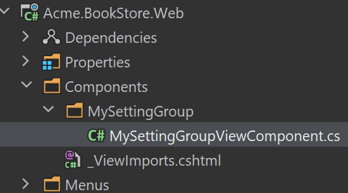
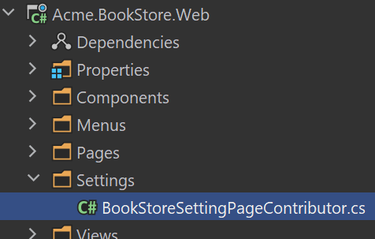
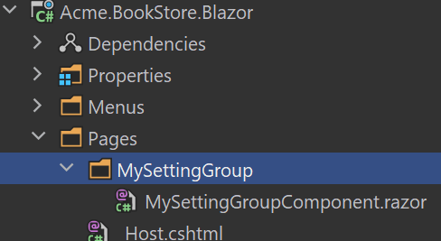
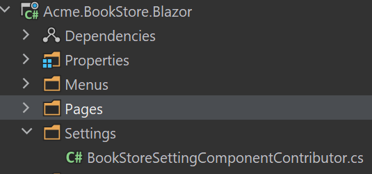
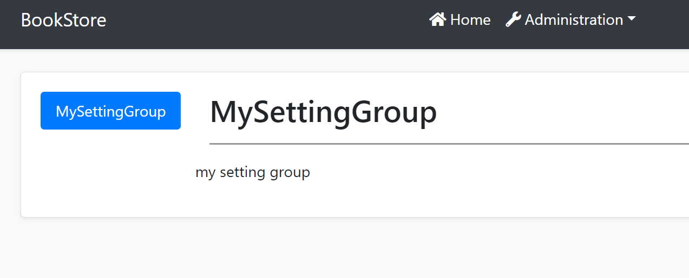
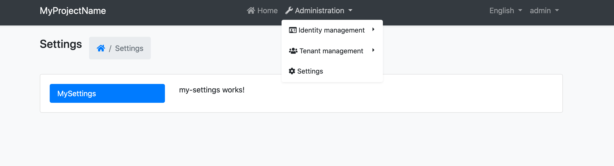

# 设置管理模块

设置管理模块实现了 `ISettingStore` (参阅 [设置系统](../Settings.md)) 将设置值存储在数据库中, 并提供 `ISettingManager` 管理 (更改) 数据库中设置值的功能.

> [启动模板](../Startup-Templates/Index.md)默认安装并配置了设置管理模块. 大部分情况下你不需要手动的添加该到模块到应用程序中.

## ISettingManager

`ISettingManager` 用于获取和设定设置值. 示例:

````csharp
using System;
using System.Threading.Tasks;
using Volo.Abp.DependencyInjection;
using Volo.Abp.SettingManagement;

namespace Demo
{
    public class MyService : ITransientDependency
    {
        private readonly ISettingManager _settingManager;

        //Inject ISettingManager service
        public MyService(ISettingManager settingManager)
        {
            _settingManager = settingManager;
        }

        public async Task FooAsync()
        {
            Guid user1Id = ...;
            Guid tenant1Id = ...;

            //Get/set a setting value for the current user or the specified user
            
            string layoutType1 =
                await _settingManager.GetOrNullForCurrentUserAsync("App.UI.LayoutType");
            string layoutType2 =
                await _settingManager.GetOrNullForUserAsync("App.UI.LayoutType", user1Id);

            await _settingManager.SetForCurrentUserAsync("App.UI.LayoutType", "LeftMenu");
            await _settingManager.SetForUserAsync(user1Id, "App.UI.LayoutType", "LeftMenu");

            //Get/set a setting value for the current tenant or the specified tenant
            
            string layoutType3 =
                await _settingManager.GetOrNullForCurrentTenantAsync("App.UI.LayoutType");
            string layoutType4 =
                await _settingManager.GetOrNullForTenantAsync("App.UI.LayoutType", tenant1Id);
            
            await _settingManager.SetForCurrentTenantAsync("App.UI.LayoutType", "LeftMenu");
            await _settingManager.SetForTenantAsync(tenant1Id, "App.UI.LayoutType", "LeftMenu");

            //Get/set a global and default setting value
            
            string layoutType5 =
                await _settingManager.GetOrNullGlobalAsync("App.UI.LayoutType");
            string layoutType6 =
                await _settingManager.GetOrNullDefaultAsync("App.UI.LayoutType");

            await _settingManager.SetGlobalAsync("App.UI.LayoutType", "TopMenu");
        }
    }
}

````

你可以从不同的设置值提供程序中(默认,全局,用户,租户...等)中获取或设定设置值.

> 如果只需要读取设置值,建议使用 `ISettingProvider` 而不是`ISettingManager`,因为它实现了缓存并支持所有部署场景. 如果要创建设置管理UI,可以使用ISettingManager.

### Setting Cache

设置值缓存在 [分布式缓存](../Caching.md) 系统中. 建议始终使用 `ISettingManager` 更改设置值.

## Setting Management Providers

设置管理模块是可扩展的,像[设置系统](../Settings.md)一样.  你可以通过自定义设置管理提供程序进行扩展. 有5个预构建的设置管理程序程序按以下顺序注册:

* `DefaultValueSettingManagementProvider`: 从设置定义的默认值中获取值,由于默认值是硬编码在设置定义上的,所以无法更改默认值.
* `ConfigurationSettingManagementProvider`:从 [IConfiguration 服务](../Configuration.md)中获取值. 由于无法在运行时更改配置值,所以无法更改配置值.
* `GlobalSettingManagementProvider`: 获取或设定设置的全局 (系统范围)值.
* `TenantSettingManagementProvider`: 获取或设定租户的设置值.
* `UserSettingManagementProvider`: 获取或设定用户的设置值.

`ISettingManager` 在 `get/set` 方法中使用设置管理提供程序. 通常每个设置程序提供程序都在 `ISettingManagement` 服务上定义了模块方法 (比如用户设置管理程序提供定义了 `SetForUserAsync` 方法).

## Setting Management UI.

设置管理模块默认提供了邮件设置页面并且它是可扩展的; 你可以为你的应用程序设置添加设置标签到设置页面.

### MVC UI

#### 创建视图组件

在 `Components` 目录下创建 `MySettingGroup` 文件夹, 添加一个名为 `MySettingGroupViewComponent` 的视图组件:



打开 `MySettingGroupViewComponent.cs` 替换为以下内容:

```csharp
public class MySettingGroupViewComponent : AbpViewComponent
{
    public virtual IViewComponentResult Invoke()
    {
        return View("~/Components/MySettingGroup/Default.cshtml");
    }
}
```

> 你还可以使用 `InvokeAsync` 方法,在这个示例中我们使用 `Invoke` 方法.

#### Default.cshtml

在 `MySettingGroup` 目录下创建 `Default.cshtml` 文件.

打开 `Default.cshtml` 替换为以下内容:

```html
<div>
  <p>My setting group page</p>
</div>
```

#### BookStoreSettingPageContributor

在 `Settings` 目录下创建 `BookStoreSettingPageContributor.cs` 文件.



文件内容如下:

```csharp
public class BookStoreSettingPageContributor : ISettingPageContributor
{
    public Task ConfigureAsync(SettingPageCreationContext context)
    {
        context.Groups.Add(
            new SettingPageGroup(
                "Volo.Abp.MySettingGroup",
                "MySettingGroup",
                typeof(MySettingGroupViewComponent)
            )
        );

        return Task.CompletedTask;
    }

    public Task<bool> CheckPermissionsAsync(SettingPageCreationContext context)
    {
        // You can check the permissions here
        return Task.FromResult(true);
    }
}
```

打开 `BookStoreWebModule.cs` 文件添加以下代码:

```csharp
Configure<SettingManagementPageOptions>(options =>
{
    options.Contributors.Add(new BookStoreSettingPageContributor());
});
```

#### 运行应用程序

导航到 `/SettingManagement` 路由查看更改:


### Blazor UI

#### 创建 Razor 组件

在 `Pages` 目录下创建 `MySettingGroup` 文件夹, 添加一个名为 `MySettingGroupComponent` 的Razor组件:



打开 `MySettingGroupComponent.razor` 替换为以下内容:

```csharp
<Row>
    <p>my setting group</p>
</Row>
```

#### BookStoreSettingComponentContributor

在 `Settings` 目录下创建 `BookStoreSettingComponentContributor.cs` 文件.



文件内容如下:

```csharp
public class BookStoreSettingComponentContributor : ISettingComponentContributor
{
    public Task ConfigureAsync(SettingComponentCreationContext context)
    {
        context.Groups.Add(
            new SettingComponentGroup(
                "Volo.Abp.MySettingGroup",
                "MySettingGroup",
                typeof(MySettingGroupComponent)
            )
        );

        return Task.CompletedTask;
    }

    public Task<bool> CheckPermissionsAsync(SettingComponentCreationContext context)
    {
        // You can check the permissions here
        return Task.FromResult(true);
    }
}
```

打开 `BookStoreBlazorModule.cs` 文件添加以下代码:

```csharp
Configure<SettingManagementComponentOptions>(options =>
{
    options.Contributors.Add(new BookStoreSettingComponentContributor());
});
```

#### 运行应用程序

导航到 `/setting-management` 路由查看更改:



### Angular UI

不同的模块提供它们的设置选项卡. 你可以通过3个步骤在项目中自定义设置页面.

#### 创建组件

使用以下命令创建一个组件

```bash
yarn ng generate component my-settings
```

打开 `app.component.ts` 做以下修改:

```js
import { Component } from '@angular/core';
import { SettingTabsService } from '@abp/ng.setting-management/config'; // imported SettingTabsService
import { MySettingsComponent } from './my-settings/my-settings.component'; // imported MySettingsComponent

@Component(/* component metadata */)
export class AppComponent {
  constructor(private settingTabs: SettingTabsService) // injected MySettingsComponent
  {
    // added below
    settingTabs.add([
      {
        name: 'MySettings',
        order: 1,
        requiredPolicy: 'policy key here',
        component: MySettingsComponent,
      },
    ]);
  }
}
```

#### 运行应用程序

导航到 `/setting-management` 路由你会看到以下变化:


