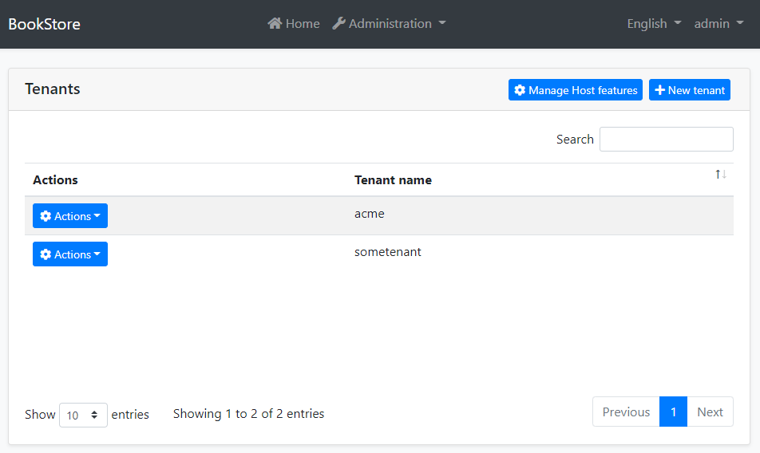
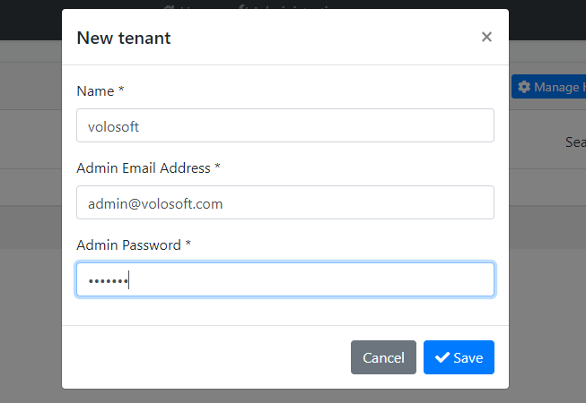
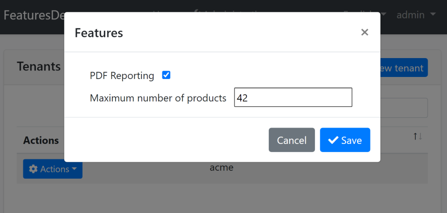

# 租户管理模块

[多租户](../Multi-Tenancy.md) 是 ABP 框架的核心功能之一. 它提供了构建 SaaS (软件及服务) 解决方案的基础架构. ABP 的多租户系统通过提供 `ITenantStore` 接口来抽象租户存储的位置. 您需要做的就是实现该接口.

**租户管理模块是 `ITenantStore` 接口的实现. 它将租户存储在数据库中. 它还提供了 UI 来管理租户及其 [功能](../Features.md).**

> 请参阅 [多租户](../Multi-Tenancy.md) 文档，以了解 ABP 框架的多租户系统. 本文重点介绍租户管理模块.

### 关于商业版 SaaS 模块

[SaaS 模块](https://commercial.abp.io/modules/Volo.Saas) 是此模块的替代实现, 具有更多的功能和可能性. 它作为 [ABP 商业版](https://commercial.abp.io/) 订阅的一部分分发.

## 如何安装

当你使用 ABP 框架 [创建一个新的解决方案](https://abp.io/get-started) 时，此模块将被预安装（作为 NuGet/NPM 包）。你可以继续用其作为包并轻松地获取更新，也可以将其源代码包含在解决方案中（请参阅 `get-source` [CLI](../CLI.md)）以开发自定义模块。

### 源代码

可以 [在此处](https://github.com/abpframework/abp/tree/dev/modules/identity) 访问源代码。源代码使用 [MIT](https://choosealicense.com/licenses/mit/) 许可, 所以你可以免费使用和自定义它.

## 用户界面

此模块将 "管理 -> 租户管理 -> 租户" 菜单项添加到应用程序的主菜单, 这将打开如下页面:

在这个页面中, 你可以查看所有租户. 你可以按照如下所示创建一个新的租户:

在这个模态框中;

* **租户名称**: 租户唯一的名称. 如果为租户使用二级域名, 这将是二级域名名称.
* **管理员电子邮件地址**: 租户管理员的电子邮件地址.
* **管理员密码**: 租户管理员的密码.

当您点击租户附近的 *操作* 按钮时, 您将看见可以执行的操作:

### 管理租户功能

功能操作会打开一个模态框, 来对相关租户进行启用/禁用/设置 [功能](../Features.md). 这有一个模态框的例子:

### 管理主机功能

如果您使用应用程序的功能也在主机端, *管理主机功能* 按钮则用于设置主机端的功能.

## 内部结构

如果要 [自定义](../Customizing-Application-Modules-Guide.md) 此模块而不更改 [其源代码](https://github.com/abpframework/abp/tree/dev/modules/tenant-management), 则可以将此节作为参考.

### 领域层

#### 聚合

* `Tenant`

#### 仓储

* `ITenantRepository`

#### 领域服务

* `TenantManager`

### 应用层

#### 应用服务

* `TenantAppService`

#### 权限

- `AbpTenantManagement.Tenants`: 租户管理.
- `AbpTenantManagement.Tenants.Create`: 创建一个新的租户.
- `AbpTenantManagement.Tenants.Update`: 编辑一个已存在的租户.
- `AbpTenantManagement.Tenants.Delete`: 删除一个已存在的租户.
- `AbpTenantManagement.Tenants.ManageFeatures`: 管理租户的功能.

### EF Core 集成

* `TenantManagementDbContext` (实现了 `ITenantManagementDbContext`)

**数据库表:**

* `AbpTenants`
* `AbpTenantConnectionStrings`

### MongoDB 集成

* `TenantManagementMongoDbContext` (实现了 `ITenantManagementMongoDbContext`)

**数据库集合:**

* `AbpTenants` (也包括连接字符串)

## 注意事项

ABP 框架允许租户有专用的数据库, 以允许 *每个租户用一个数据库*. 此模块具有使该实现成为可能 (查阅其源代码) 的基础架构, 但是它没有实现应用程序层和 UI 功能以使其开箱即用. 您可以自己实现这些功能, 也可以考虑使用已完全实现这些功能并提供了更多业务功能的 [ABP 商业版 Saas 模块](https://docs.abp.io/en/commercial/latest/modules/saas).

## 另请参见

* [多租户](../Multi-Tenancy.md)
* [ABP 商业版 SaaS 模块](https://docs.abp.io/en/commercial/latest/modules/saas)
