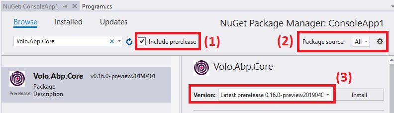

 # 每日构建

所有框架和模块包都每晚都部署到MyGet. 因此你可以使用或测试最新的代码,而无需等待下一个版本.

## 在Visual Studio配置 

> 需要Visual Studio 2017以上

1. 在VS中打开: `工具 > 选项 > NuGet 包管理器 > 程序包源`
2. 单击绿色的`+`图标
3. 在底部输入名称(ABP Nightly)和并粘贴URL(`https://www.myget.org/F/abp-nightly/api/v3/index.json`)到源上.
   
3. 单击`更新`按钮
4. 点击`确定`按钮保存

## 安装包

现在, 你可以从**管理NuGet包** 或 **程序包管理器控制台** 将预览/夜间程序包安装到你的项目中.

1. 在nuget浏览中,选择"包括预发行版".
2. 将包源更改为`全部`.
3. 搜索nuget包. 你将看到包的预发布格式为`(VERSION)-preview(DATE)` (如本示例中的**v0.16.0-preview20190401**).
4. 你可以单击`安装`按钮将包添加到项目中.
