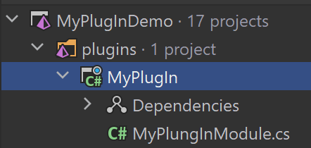
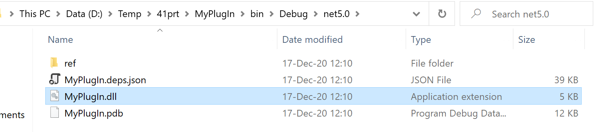
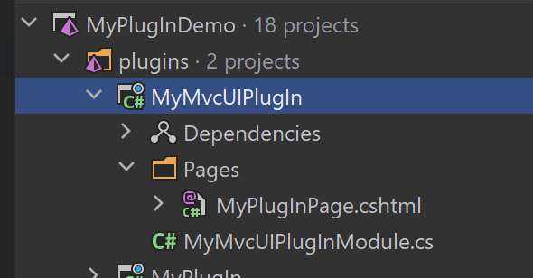
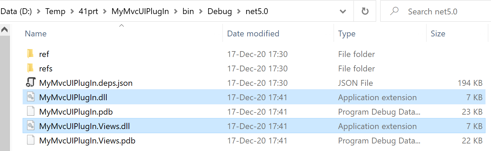
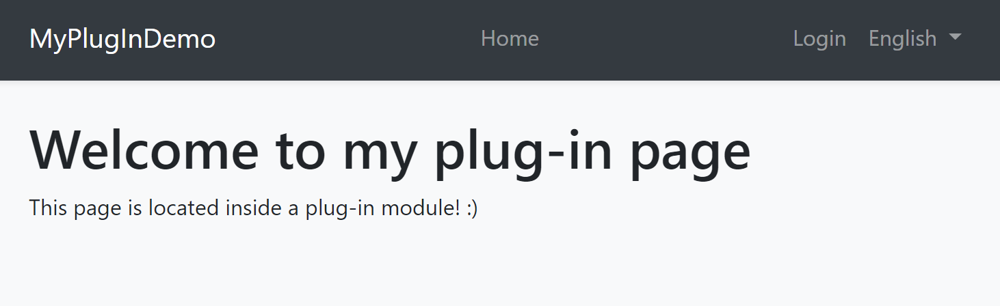

# 模块化插件

可以将[模块](Module-Development-Basics.md)加载为插件.这意味着你可能不需要在解决方案中引用模块的程序集,就可以像其它模块一样在启动应用时加载该模块.

## 基本用法

`IServiceCollection.AddApplication<T>()` 扩展方法可以获取配置插件源的选项.

**示例: 从文件夹加载插件**

````csharp
using Microsoft.AspNetCore.Builder;
using Microsoft.Extensions.DependencyInjection;
using Volo.Abp.Modularity.PlugIns;

namespace MyPlugInDemo.Web
{
    public class Startup
    {
        public void ConfigureServices(IServiceCollection services)
        {
            services.AddApplication<MyPlugInDemoWebModule>(options =>
            {
                options.PlugInSources.AddFolder(@"D:\Temp\MyPlugIns");
            });
        }

        public void Configure(IApplicationBuilder app)
        {
            app.InitializeApplication();
        }
    }
}
````

* 这是典型的ASP.NET Core应用程序的`Startup`类.
* `PlugInSources.AddFolder`从指定的目录中加载程序集(通常为dll).

就这样.ABP将在这个目录中发现这些模块,像其它常规一样配置和初始化它们.

### 插件源

`options.PlugInSources`类实际上是`IPlugInSource`接口的一系列实现并且 `AddFolder`方法仅仅是以下表达式的便捷方法：

````csharp
options.PlugInSources.Add(new FolderPlugInSource(@"D:\Temp\MyPlugIns"));
````

> `AddFolder()`方法仅在给定目录下查找程序集文件,而不在子目录中查找.你可以传递一个`SearchOption.AllDirectories`参数作为第二个参数,来递归地查找它的子目录.

这里有两个内置插件源的示例：

* `PlugInSources.AddFiles()`方法获取程序集(通常是dll)文件列表.这是使用`FilePlugInSource`类的快捷方式.
* `PlugInSources.AddTypes()`方法获取模块类类型的列表.如果实用化此方法,则需要自己加载模块的程序集,但是在需要时它提供了灵活性.这是使用`TypePlugInSource`类的快捷方式.

如果需要,你可以创建自己的`IPlugInSource`的接口实现,并像其它方法一样添加到`options.PlugInSources`中.

## 示例：创建一个简单的插件

在一个解决方案中创建一个简单的**类库项目**



你可以在模块中添加需要使用的ABP框架包.至少,你应该为这个项目添加包`Volo.Abp.Core`：

````
Install-Package Volo.Abp.Core
````

每个[模块](Module-Development-Basics.md)必须声明为一个继承自`AbpModule`的类.这里是一个简单的模块类,用于解析一个服务并在应用启动时对其初始化：

````csharp
using Microsoft.Extensions.DependencyInjection;
using Volo.Abp;
using Volo.Abp.Modularity;

namespace MyPlugIn
{
    public class MyPlungInModule : AbpModule
    {
        public override void OnApplicationInitialization(ApplicationInitializationContext context)
        {
            var myService = context.ServiceProvider
                .GetRequiredService<MyService>();
            
            myService.Initialize();
        }
    }
}
````

`MyService`可以是注册在[依赖注入](Dependency-Injection.md)系统中的任意类,如下所示:

````csharp
using Microsoft.Extensions.Logging;
using Volo.Abp.DependencyInjection;

namespace MyPlugIn
{
    public class MyService : ITransientDependency
    {
        private readonly ILogger<MyService> _logger;

        public MyService(ILogger<MyService> logger)
        {
            _logger = logger;
        }

        public void Initialize()
        {
            _logger.LogInformation("MyService has been initialized");
        }
    }
}
````

编译这个项目,打开build目录,找到`MyPlugIn.dll`：



将`MyPlugIn.dll`复制到到插件目录中(此实例为`D:\Temp\MyPlugIns`).

如果你已经按照上述方式配置了主应用程序(参见“基础用法”部分),那么在应用程序启动时,你可以看到“MyService has been initialized(MyService已经初始化)的日志.

## 示例：创建一个Razor Pages插件

创建内部带视图的插件需要更多的注意.

> 这个示例假设你已经使用应用程序启动模板和MVC / Razor Pages UI[创建了一个新的Web应用程序](https://abp.io/get-started).

在解决方案中创建一个新的**类库**项目：



编辑这个`.csproj`文件内容：

````xml
<Project Sdk="Microsoft.NET.Sdk.Web">

    <PropertyGroup>
        <TargetFramework>net5.0</TargetFramework>
        <OutputType>Library</OutputType>
        <IsPackable>true</IsPackable>
    </PropertyGroup>

    <ItemGroup>
      <PackageReference Include="Volo.Abp.AspNetCore.Mvc.UI.Theme.Shared" Version="4.0.1" />
    </ItemGroup>

</Project>
````

* 将`Sdk`修改为`Microsoft.NET.Sdk.Web`.
* 添加了`OutputType`和`IsPackable`属性.
* 添加了`Volo.Abp.AspNetCore.Mvc.UI.Theme.Shared`NuGet包.

> 不需要[Volo.Abp.AspNetCore.Mvc.UI.Theme.Shared](https://www.nuget.org/packages/Volo.Abp.AspNetCore.Mvc.UI.Theme.Shared) 包.你可以引用更基础的程序包,例如[Volo.Abp.AspNetCore.Mvc](https://www.nuget.org/packages/Volo.Abp.AspNetCore.Mvc/). 但是,如果需要构建一个UI视图/组件,建议参考[Volo.Abp.AspNetCore.Mvc.UI.Theme.Shared](https://www.nuget.org/packages/Volo.Abp.AspNetCore.Mvc.UI.Theme.Shared)程序包,因为它是最高级的程序包,不依赖于特定[theme](UI/AspNetCore/Theming.md).如果依赖特定主题没有问题,则可以直接引用该主题的程序包,以便能够使用插件中特定于主题的功能.

接下来在插件中创建模块类：

````csharp
using System.IO;
using System.Reflection;
using Microsoft.AspNetCore.Mvc.ApplicationParts;
using Microsoft.Extensions.DependencyInjection;
using Volo.Abp.AspNetCore.Mvc.UI.Theme.Shared;
using Volo.Abp.Modularity;

namespace MyMvcUIPlugIn
{
    [DependsOn(typeof(AbpAspNetCoreMvcUiThemeSharedModule))]
    public class MyMvcUIPlugInModule : AbpModule
    {
        public override void PreConfigureServices(ServiceConfigurationContext context)
        {
            PreConfigure<IMvcBuilder>(mvcBuilder =>
            {
                // 添加插件程序集
                mvcBuilder.PartManager.ApplicationParts.Add(new AssemblyPart(typeof(MyMvcUIPlugInModule).Assembly));

                // 添加视图程序集
                var viewDllPath = Path.Combine(Path.GetDirectoryName(typeof(MyMvcUIPlugInModule).Assembly.Location), "MyMvcUIPlugIn.Views.dll");
                var viewAssembly = new CompiledRazorAssemblyPart(Assembly.LoadFrom(viewDllPath));
                mvcBuilder.PartManager.ApplicationParts.Add(viewAssembly);
            });
        }
    }
}
````

* 由于我们添加了相关的NuGet包,因此取决于`AbpAspNetCoreMvcUiThemeSharedModule`.
* 添加插件程序集到ASP.NET Core MVC的`PartManager`中.这是ASP.NET Core所必需的.否则,你插件中的控制器将无法正常工作.
* 添加插件的视图程序集到ASP.NET Core MVC的`PartManager`中.这是ASP.NET Core所必需的.否则,你在插件中的视图将不起作用.

现在,你可以在`Pages`目录下添加一个razor页面,例如`MyPlugInPage.cshtml`：

````html
@page
@model MyMvcUIPlugIn.Pages.MyPlugInPage
<h1>Welcome to my plug-in page</h1>
<p>This page is located inside a plug-in module! :)</p>
````

现在,你可以构建插件项目.它将产生以下输出：



将`MyMvcUIPlugIn.dll`和`MyMvcUIPlugIn.Views.dll`复制到到插件目录下(此示例中为`D:\Temp\MyPlugIns`).

如果你已经按照上述方式配置了主应用程序(参见“基础用法”部分),那么在应用程序启动的时候,你应该能够访问`/MyPlugInPage`URL：



## 讨论

在现实世界中,你的插件可能具有一些外部依赖性.另外,你的应用程序可能被设计为支持插件.所有这些都是你自己的系统要求.ABP做的仅仅是在应用程序启动时加载模块.你在这些模块中执行什么操作由你决定.

但是,我们可以为一些常见情况提供一些建议.

### 库依赖

对于包/dll依赖,你可以将相关的dll复制到插件目录下.ABP会自动将所有程序集加载到该目录下,并且你的插件将按预期工作.

> 请参见[Microsoft文档](https://docs.microsoft.com/zh-cn/dotnet/core/tutorials/creating-app-with-plugin-support#plugin-with-library-dependencies).

### 数据库模式

如果你的模块使用关系型数据库和[Entity Framework Core](Entity-Framework-Core.md), 那么它需要在数据库中提供表.有多种不同的方法可确保在应用程序使用插件时创建表.一些例子；

1. 插件可以检查数据库表是否存在,并在应用程序启动时创建表,或者如果插件已更新且需要进行某些架构更改时,则会迁移它们.你可以使用EF Core的迁移API来做到这一点.
2. 你可以改进`DbMigrator`应用程序,用于查找插件的迁移并执行它们.

可能还有其它解决方案.例如,如果你的数据库管理员不允许你在应用程序代码中更改数据库模式,则可能需要手动将SQL文件发送给数据库管理员,以将其应用于数据库.
