# 微服务解决方案示例

*"作为**面向服务架构**(SOA)的一个变体,微服务是一种将应用程序分解成**松散耦合服务**的新型架构风格. 通过**细粒度**的服务和**轻量级**的协议,微服务提供了更多的**模块化**,使应用程序更容易理解,开发,测试,并且更容易抵抗架构侵蚀. 它使小型团队能够**开发,部署和扩展**各自的服务,实现开发的**并行化**.它还允许通过**连续重构**形成单个服务的架构. 基于微服务架构可以实现**持续交付和部署**."*

— [维基百科](https://zh.wikipedia.org/wiki/Microservices)

## 介绍

ABP框架的主要目标之一就是提供[便捷的基础设施来创建微服务解决方案](../Microservice-Architecture.md).

此示例演示了一个简单而完整的微服务解决方案;

* 拥有多个可独立可单独部署的**微服务**.
* 多个**Web应用程序**, 每一个都使用不同的API网关.
* 使用[Ocelot](https://github.com/ThreeMammals/Ocelot)库开发了多个**网关** / BFFs ([用于前端的后端](https://docs.microsoft.com/zh-cn/azure/architecture/patterns/backends-for-frontends)).
* 包含使用[IdentityServer](https://identityserver.io/)框架开发的 **身份认证服务**. 它也是一个带有UI的SSO(单点登陆)应用程序.
* 有**多个数据库**. 一些微服务有自己的数据库,也有一些服务/应用程序共享同一个数据库(以演示不同的用例).
* 有不同类型的数据库: **SQL Server** (与 **Entity Framework Core** ORM) 和 **MongoDB**.
* 有一个**控制台应用程序**使用身份验证展示使用服务最简单的方法.
* 使用[Redis](https://redis.io/)做**分布式缓存**.
* 使用[RabbitMQ](https://www.rabbitmq.com/)做服务间的**消息**传递.
* 使用 [Docker](https://www.docker.com/) & [Kubernates](https://kubernetes.io/) 来**部署**&**运行**所有的服务和应用程序.
* 使用 [Elasticsearch](https://www.elastic.co/products/elasticsearch) & [Kibana](https://www.elastic.co/products/kibana) 来存储和可视化日志 (使用[Serilog](https://serilog.net/)写日志).

下图展示了该系统:

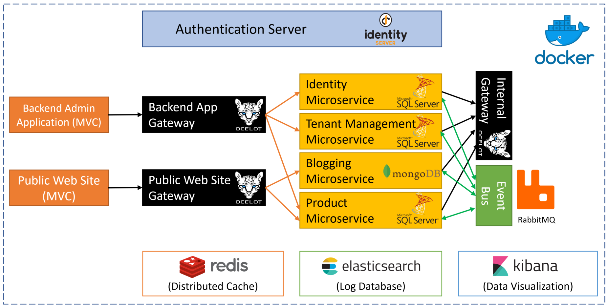

### 源码

你可以从[GitHub仓库](https://github.com/abpframework/abp-samples/tree/master/MicroserviceDemo)获取源码.

## 运行解决方案

### 预先要求

为了能够从源代码运行解决方案, 应在你的计算机上安装并运行以下工具:

* [SQL Server](https://www.microsoft.com/en-us/sql-server/sql-server-downloads) 2015+ (可以是 [express edition](https://www.microsoft.com/en-us/sql-server/sql-server-editions-express))
* [Redis](https://redis.io/download) 5.0+
* [RabbitMQ](https://www.rabbitmq.com/install-windows.html) 3.7.11+
* [MongoDB](https://www.mongodb.com/download-center) 4.0+
* [ElasticSearch](https://www.elastic.co/downloads/elasticsearch) 6.6+
* [Kibana](https://www.elastic.co/downloads/kibana) 6.6+ (可选,建议显示日志)

### 运行基础设施

- 默认情况下运行Docker-compose可以轻松运行预先要求. 如果你没有安装,在windows环境下你可以在[这里](https://docs.docker.com/docker-for-windows/install/)下载并使用[Docker for Windows](https://docs.docker.com/docker-for-windows/).
* 在 `MicroserviceDemo` 目录下运行命令 `docker-compose -f docker-compose.infrastructure.yml -f docker-compose.infrastructure.override.yml up -d` 或使用powershell运行 `MicroserviceDemo/_run` 文件夹下的 `__Run_Infrastructure.ps1` 脚本.
* 如果你不想使用docker运行预先要求的服务在你的本地环境,你需要更改微服务示例解决方案项目中的 `appsettings.json` 文件.

### 打开并构建Visual Studio解决方案

* 在Visual Studio 2017 (15.9.0+)中打开`samples\MicroserviceDemo\MicroserviceDemo.sln`.
* 在`samples\MicroserviceDemo`文件夹中的命令行运行`dotnet restore`命令.
* 在Visual Studio中构建解决方案.

### 创建数据库

MongoDB 数据库是动态创建的,但是你需要创建 SQL server 数据库的结构.其实你可以很轻松的创建数据库,因为这个解决方案配置了使用 Entity Core Code First 来做迁移.

这个解决方案中有两个 SQL server 数据库.

#### MsDemo_Identity 数据库

* 右键 `AuthServer.Host` 项目,然后点击 `设置为启动项目`.
* 打开 **程序包管理器控制台** (工具 -> NuGet 包管理器 -> 程序包管理器控制台)
* 选择 `AuthServer.Host` 成为 **默认项目**.
* 执行 `Update-Database` 命令.

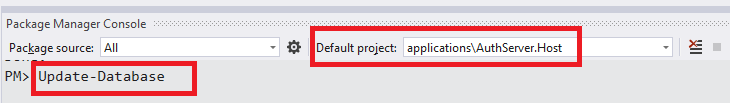

#### MsDemo_ProductManagement

* 右键 `ProductService.Host` 项目,然后点击 `设置为启动项目`.
* 打开 **程序包管理器控制台** (工具 -> NuGet 包管理器 -> 程序包管理器控制台)
* 选择 `ProductService.Host` 成为 **默认项目**.
* 执行 `Update-Database` 命令.

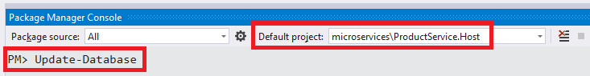

### 运行项目

按以下顺序运行项目(右键单击每个项目设置为启动项目,按Ctrl+F5运行,无需调试):

* AuthServer.Host
* IdentityService.Host
* TenantManagementService.Host
* BloggingService.Host
* ProductService.Host
* InternalGateway.Host
* BackendAdminAppGateway.Host
* PublicWebSiteGateway.Host
* BackendAdminApp.Host
* PublicWebSite.Host

## 解决方案简介

Visual Studio解决方案由多个项目组成,每个项目在系统中具有不同的角色:

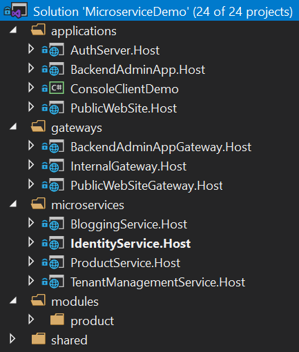

### 应用程序(Applications)

这些是具有用户界面以与用户交互并使用系统的实际应用程序.

- **AuthServer.Host**: 托管IdentityServer4以向其他服务和应用程序提供身份验证服务. 它是一个单点登录服务器,包含登录页面.
- **BackendAdminApp.Host**: 这是一个后端管理应用程序,用于托管身份和产品管理模块的UI.
- **PublicWebSite.Host**: 作为包含简单产品列表页面和博客模块UI的公共网站.
- **ConsoleClientDemo**: 一个简单的控制台应用程序,用于演示C＃应用程序中使用服务.

### 网关/BFF(前端后端)

网关用于为应用程序提供单一入口点.它还可以用于速率限制,负载平衡等. 使用[Ocelot](https://github.com/ThreeMammals/Ocelot)类库.

* **BackendAdminAppGateway.Host**: 由BackendAdminApp.Host应用程序用作后端.
* **PublicWebSiteGateway.Host**: 由PublicWebSite.Host应用程序用作后端.
* **InternalGateway.Host**: 用于服务间通信(微服务之间的通信).

### 微服务

微服务没有UI,但暴露了一些REST API.

- **IdentityService.Host**: 托管用于管理用户和角色的ABP Identity模块. 它没有其他服务,仅托管Identity模块的API.
- **TenantManagementService.Host**: 托管用于管理角色的ABP租户管理模块. 它没有其他服务,仅托管租户管理模块的API.
- **BloggingService.Host**: 托管ABP博客模块,该模块用于管理博客和帖子(典型的博客应用程序). 它没有其他服务,仅托管Blogging模块的API.
- **ProductService.Host**: 托管用于管理产品的产品模块(位于解决方案内). 它还包含用于创建/更新产品管理数据库架构的EF Core迁移.

### 模块

* **产品**: 使用[模块开发最佳实践](../Best-Practices/Index.md)开发的分层模块. 它可以嵌入到单个应用程序中,也可以通过单独部署API和UI作为微服务托管(如本演示解决方案中所述).

### 数据库

此解决方案使用多个数据库:

* **MsDemo_Identity**: 一个SQL数据库. 默认使用**SQL Server**,但可以是EF Core支持的任何DBMS. 由AuthServer,IdentityService和TenantManagementService共享. 审计日志,权限和设置也存储在此数据库中(虽然它们可以轻松拥有自己的数据库,共享相同的数据库以保持简单).
* **MsDemo_ProductManagement**: 一个SQL数据库. 同样默认使用 **SQL Server**,但可以是EF Core支持的任何DBMS. 由ProductService用作专用数据库.
* **MsDemo_Blogging**: **MongoDB**数据库. 由BloggingService使用.
* **Elasticsearch**: 用于在Serilog上写日志.

## 应用

### 认证服务器 (AuthServer.Host)

所有其他服务和应用程序都使用此项目进行身份验证和单点登录. 主要使用**IdentityServer4**来提供这些服务. 它使用了一些[预构建ABP模块](../Modules/Index) 如 *Identity*, *Audit Logging* 和 *Permission Management*.

#### 数据库和EF Core配置

此应用程序使用SQL数据库(将其命名为**MsDemo_Identity**)并通过**Entity Framework Core迁移**维护其架构.

它有一个名为**AuthServerDbContext**的DbContext,定义如下:

````csharp
public class AuthServerDbContext : AbpDbContext<AuthServerDbContext>
{
    public AuthServerDbContext(DbContextOptions<AuthServerDbContext> options) 
        : base(options)
    {

    }

    protected override void OnModelCreating(ModelBuilder modelBuilder)
    {
        base.OnModelCreating(modelBuilder);

        modelBuilder.ConfigureIdentity();
        modelBuilder.ConfigureIdentityServer();
        modelBuilder.ConfigureAuditLogging();
        modelBuilder.ConfigurePermissionManagement();
        modelBuilder.ConfigureSettingManagement();
    }
}
````

在**OnModelCreating**方法中, 你会看到 **ConfigureX()** 方法调用. 具有数据库模式的模块通常声明这样的扩展方法,以便为其自己的实体配置EF Core映射. 这是一种灵活的方法, 可以在其中安排数据库和模块; 可以为每个模块使用不同的数据库,或者将它们中的一些组合在一个共享数据库中. 在AuthServer项目中,我们决定在单个物理数据库中将单个EF Core DbContext中的多个模块模式组合在一起. 这些模块是Identity,IdentityServer,AuditLogging,PermissionManagement和SettingManagement模块.

请注意,此DbContext仅用于数据库迁移. 所有模块都有自己的`DbContext`类,模块在运行时使用这些类.

#### 用户界面

AuthServer有一个简单的主页,如果当前用户已登录,则显示当前用户信息:

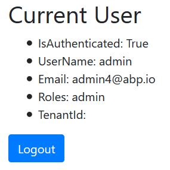

它还提供登录和注册页面:

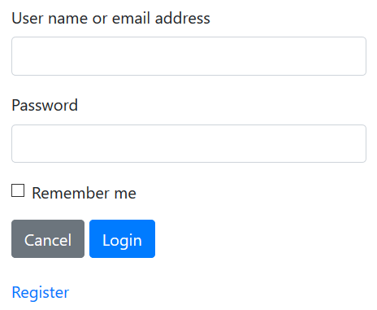

这些页面不包含在项目本身中. 相反,AuthServer项目使用带有IdentityServer扩展的预构建ABP[帐户模块](https://github.com/abpframework/abp/tree/master/modules/account). 这意味着它还可以充当具有必要UI和逻辑的OpenId Connect服务器.

#### 依赖

* **RabbitMQ** 用于向其他服务发送消息.
* **Redis** 用于分布式/共享缓存.
* **Elasticsearch** 用于存储日志.

### 后端管理应用程序 (BackendAdminApp.Host)

这是一个Web应用程序,用于管理系统中的用户,角色,权限和产品.

#### 认证

BackendAdminApp重定向到AuthServer进行身份验证. 用户输入正确的用户名和密码后,页面将再次重定向到后端应用程序. 身份验证配置在`BackendAdminAppHostModule`类中设置:

````charp
context.Services.AddAuthentication(options =>
{
    options.DefaultScheme = "Cookies";
    options.DefaultChallengeScheme = "oidc";
})
.AddCookie("Cookies", options =>
{
    options.Cookie.Expiration = TimeSpan.FromDays(365);
    options.ExpireTimeSpan = TimeSpan.FromDays(365);
})
.AddOpenIdConnect("oidc", options =>
{
    options.Authority = configuration["AuthServer:Authority"];
    options.ClientId = configuration["AuthServer:ClientId"];
    options.ClientSecret = configuration["AuthServer:ClientSecret"];
    options.RequireHttpsMetadata = false;
    options.ResponseType = OpenIdConnectResponseType.CodeIdToken;
    options.SaveTokens = true;
    options.GetClaimsFromUserInfoEndpoint = true;
    options.Scope.Add("role");
    options.Scope.Add("email");
    options.Scope.Add("phone");
    options.Scope.Add("BackendAdminAppGateway");
    options.Scope.Add("IdentityService");
    options.Scope.Add("ProductService");
    options.ClaimActions.MapAbpClaimTypes();
});
````

* 它将"Cookies"身份验证添加为主要身份验证类型.
* "oidc"身份验证配置为使用AuthServer应用程序作为身份验证服务器.
* 它需要额外的身份范围(scopes) *role*, *email* 和 *phone*.
* 它需要API资源范围 *BackendAdminAppGateway*, *IdentityService* 和 *ProductService*,因为它将这些服务用作API.

IdentityServer客户端设置存储在`appsettings.json`文件中:

````json
"AuthServer": {
  "Authority": "http://localhost:64999",
  "ClientId": "backend-admin-app-client",
  "ClientSecret": "1q2w3e*"
}
````

#### 用户界面

BackendAdminApp.Host项目本身没有单个UI元素/页面. 它仅用于提供身份和产品管理模块的UI页面.

`BackendAdminAppHostModule`将依赖关系添加到`AbpIdentityWebModule`(*[Volo.Abp.Identity.Web](https://www.nuget.org/packages/Volo.Abp.Identity.Web)* 包)和`ProductManagementWebModule`(*ProductManagement.Web*项目)为此目的.

用户管理页面的屏幕截图:


来自权限的权限管理模式的屏幕截图:

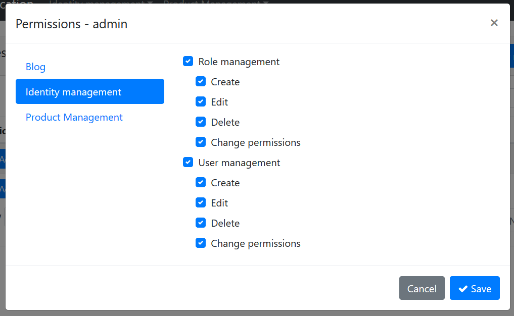

#### 使用微服务

后端管理应用程序通过后端管理网关对所有操作使用Identity和Product微服务(BackendAdminAppGateway.Host).

##### 远程端点

`appsettings.json`文件包含`RemoteServices`部分,用于声明远程服务端点. 每个微服务通常都有不同的端点. 但是,此解决方案使用API网关模式为应用程序提供单个端点:

````json
"RemoteServices": {
  "Default": {
    "BaseUrl": "http://localhost:65115/"
  }
}
````

`http://localhost:65115/` 是 *BackendAdminAppGateway.Host* 项目的URL. 它知道身份和产品服务的位置.

##### HTTP Clients

ABP应用程序模块通常提供C＃客户端库以轻松地使用服务(API)(它们通常使用ABP框架的[Dynamic C# API客户端](../API/Dynamic-CSharp-API-Clients.md)). 这意味着如果你需要使用Identity Service API, 你可以引用其客户端软件包,并通过提供的接口轻松使用API.

为此`BackendAdminAppHostModule`类声明了`AbpIdentityHttpApiClientModule`和`ProductManagementHttpApiClientModule`的依赖关系.

一旦引用这些客户端软件包,就可以直接注入应用程序服务接口(例如`IIdentityUserAppService`)并使用其方法,如本地方法调用. 它实际上通过HTTP调用到相关服务端点的远程服务调用.

##### 传递访问令牌(Access Token)

由于微服务需要身份验证和授权,因此每个远程服务调用都应包含Authentication头. 该头是从当前用户的当前`HttpContext`中的`access_token`获得的. 当你使用`Volo.Abp.Http.Client.IdentityModel`包时,会自动执行此操作. `BackendAdminAppHostModule`声明对此包和相关的`AbpHttpClientIdentityModelModule`类的依赖. 它集成到上面解释的HTTP客户端.

#### 依赖

- **Redis** 用于分布式/共享缓存.
- **Elasticsearch** 用于存储日志.

### 公共网站 (PublicWebSite.Host)

这是一个公共网站项目,具有Web博客和产品列表页面.

#### 认证

公共网站可以在不登录的情况下显示博客文章和产品列表. 如果你登录,你还可以管理博客. 它重定向到AuthServer进行身份验证. 用户输入正确的用户名和密码后,页面将再次重定向到公共网站应用程序. 身份验证配置在`PublicWebSiteHostModule`类中设置:

```charp
context.Services.AddAuthentication(options =>
{
    options.DefaultScheme = "Cookies";
    options.DefaultChallengeScheme = "oidc";
})
.AddCookie("Cookies", options =>
{
    options.Cookie.Expiration = TimeSpan.FromDays(365);
    options.ExpireTimeSpan = TimeSpan.FromDays(365);
})
.AddOpenIdConnect("oidc", options =>
{
    options.Authority = configuration["AuthServer:Authority"];
    options.ClientId = configuration["AuthServer:ClientId"];
    options.ClientSecret = configuration["AuthServer:ClientSecret"];
    options.RequireHttpsMetadata = false;
    options.ResponseType = OpenIdConnectResponseType.CodeIdToken;
    options.SaveTokens = true;
    options.GetClaimsFromUserInfoEndpoint = true;
    options.Scope.Add("role");
    options.Scope.Add("email");
    options.Scope.Add("phone");
    options.Scope.Add("PublicWebSiteGateway");
    options.Scope.Add("ProductService");
    options.Scope.Add("BloggingService");
    options.ClaimActions.MapAbpClaimTypes();
});
```

- 它将"Cookies"身份验证添加为主要身份验证类型.
- "oidc"身份验证配置为使用AuthServer应用程序作为身份验证服务器.
- 它需要额外的身份范围 *role*, *email* and *phone*.
- 它需要API资源范围 *PublicWebSiteGateway*,*BloggingService*和*ProductService*,因为它将这些服务用作API.

IdentityServer客户端设置存储在`appsettings.json`文件中:

```json
"AuthServer": {
  "Authority": "http://localhost:64999",
  "ClientId": "public-website-client",
  "ClientSecret": "1q2w3e*"
}
```

#### 用户界面

PublicWebSite.Host项目有一个列出产品的页面 (`Pages/Products.cshtml`). 它还使用博客模块中的UI. 为此`PublicWebSiteHostModule`加入了`BloggingWebModule`(*[Volo.Blogging.Web](https://www.nuget.org/packages/Volo.Blogging.Web)* 包)的依赖项.

产品页面的屏幕截图:

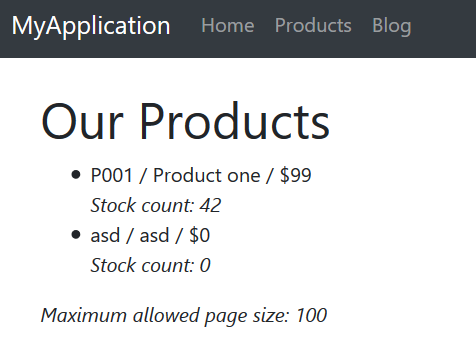

#### 使用微服务

公共网站应用程序使用Blogging和Product微服务通过公共网站网关进行所有操作(PublicWebSiteGateway.Host).

##### 远程端点


`appsettings.json`文件包含`RemoteServices`部分,用于声明远程服务端点. 每个微服务通常都有不同的端点. 但是,此解决方案使用API网关模式为应用程序提供单个端点:

```json
"RemoteServices": {
  "Default": {
    "BaseUrl": "http://localhost:64897/"
  }
}
```

`http://localhost:64897/` 是*PublicWebSiteGateway.Host*项目的URL. 它知道Blogging和产品服务的位置.

##### HTTP Clients

`PublicWebSiteHostModule`类声明`BloggingHttpApiClientModule`和`ProductManagementHttpApiClientModule`的依赖关系,以便能够为这些服务使用远程HTTP API.

##### 传递访问令牌(Access Token)

正如后端管理应用程序部分中所述, Public Web Site项目还使用`AbpHttpClientIdentityModelModule`将`access_token`传递给调用服务进行身份验证.

#### Dependencies

- **Redis** 用于分布式/共享缓存.
- **Elasticsearch** 用于存储日志.

### 控制台客户端演示

最后,该解决方案包括一个非常简单的控制台应用程序,名为ConsoleClientDemo,它通过AuthServer进行身份验证来使用Identity和Product服务. 它使用内部网关(InternalGateway.Host)来执行HTTP API调用.

#### 远程服务配置

`appsettings.json`文件中的`RemoteService`配置很简单:

````json
"RemoteServices": {
  "Default": {
    "BaseUrl": "http://localhost:65129/"
  }
}
````

`http://localhost:65129/` 是内部网关的URL. 对服务的所有API调用都是通过此URL执行的.

#### 身份验证(IdentityServer客户端)配置

`appsettings.json`还有一个IdentityServer身份验证配置:

````json
"IdentityClients": {
  "Default": {
    "GrantType": "client_credentials",
    "ClientId": "console-client-demo",
    "ClientSecret": "1q2w3e*",
    "Authority": "http://localhost:64999",
    "Scope": "InternalGateway IdentityService ProductService"
  }
}
````

此示例使用`client_credentials` 授予类型,该类型需要`ClientId`和`ClientSecret`进行身份验证过程. 还有[其他授予类型](http://docs.identityserver.io/en/latest/topics/grant_types.html). 例如, 你可以使用以下配置切换到`password`(Resource Owner Password)授予类型:

````json
"IdentityClients": {
  "Default": {
    "GrantType": "password",
    "ClientId": "console-client-demo",
    "ClientSecret": "1q2w3e*",
    "UserName": "admin",
    "UserPassword": "1q2w3E*",
    "Authority": "http://localhost:64999",
    "Scope": "InternalGateway IdentityService ProductService"
  }
}
````

除客户端凭据外,Resource Owner Password还需要`UserName` 和 `UserPassword`. 此授权类型对于代表用户调用远程服务很有用.

`Scope` 声明API(和网关)以授予访问权限. 此应用程序使用内部网关.

#### HTTP Client依赖

`ConsoleClientDemoModule`与`AbpIdentityHttpApiClientModule`和`ProductManagementHttpApiClientModule`有依赖关系,以便使用Identity和Product API. 它还具有“AbpHttpClientIdentityModelModule”依赖性,可通过IdentityServer进行身份验证.

#### 使用服务

使用这些服务非常简单. 请参阅`ClientDemoService`类,它只是注入`IIdentityUserAppService`和`IProductAppService`并使用它们. 该类还显示了使用`HttpClient`对象的手动HTTP调用. 有关详细信息,请参阅`ClientDemoService`的源代码.

## API网关/ BFF(前端后端)

网关用于为应用程序提供 **单一入口点**. 通过这种方式,应用程序仅处理单个服务地址(API端点),而不是每个服务的不同地址. 网关还用于速率限制,安全性,身份验证,负载平衡和更多要求.

"**后端前端**"(BFF)是一种常见的架构模式,可为每种不同的应用程序/客户端类型构建**专注而专业的**网关. 此解决方案使用此模式并具有多个网关.

此解决方案使用[Ocelot](https://github.com/ThreeMammals/Ocelot)库来构建API网关. 它是ASP.NET核心广泛接受的API网关库.

### 后端管理应用程序网关 (BackendAdminAppGateway.Host)

这是"后端管理应用程序"的后端(服务器端API)(不要混淆命名;后端管理应用程序实际上是前端Web应用程序,但系统管理员而不是普通用户使用).

#### 认证

此网关使用IdentityServer `Bearer`身份验证并配置如下:

````csharp
context.Services.AddAuthentication("Bearer")
.AddIdentityServerAuthentication(options =>
{
    options.Authority = configuration["AuthServer:Authority"];
    options.ApiName = configuration["AuthServer:ApiName"];
    options.RequireHttpsMetadata = false;    
    options.InboundJwtClaimTypeMap["sub"] = AbpClaimTypes.UserId;
    options.InboundJwtClaimTypeMap["role"] = AbpClaimTypes.Role;
    options.InboundJwtClaimTypeMap["email"] = AbpClaimTypes.Email;
    options.InboundJwtClaimTypeMap["email_verified"] = AbpClaimTypes.EmailVerified;
    options.InboundJwtClaimTypeMap["phone_number"] = AbpClaimTypes.PhoneNumber;
    options.InboundJwtClaimTypeMap["phone_number_verified"] = 
        AbpClaimTypes.PhoneNumberVerified;
    options.InboundJwtClaimTypeMap["name"] = AbpClaimTypes.UserName;
});
````

`AddIdentityServerAuthentication` 扩展方法来自 [IdentityServer4.AccessTokenValidation](https://www.nuget.org/packages/IdentityServer4.AccessTokenValidation) 包, IdentityServer4项目的一部分 (参见 [identityserver文档](http://docs.identityserver.io/en/latest/topics/apis.html)). 

`ApiName`是受保护的API,在这种情况下是`BackendAdminAppGateway`. 因此,此解决方案将网关定义为API资源. 其余配置与声明映射(计划在下一个ABP版本中自动化)相关. `appsettings.json`中的身份验证相关的配置很简单:

````json
"AuthServer": {
  "Authority": "http://localhost:64999",
  "ApiName": "BackendAdminAppGateway"
}
````

#### Ocelot配置

Ocelot需要知道微服务的真实URL才能重定向HTTP请求. 此网关的配置如下所示:

````json
"ReRoutes": [
  {
    "DownstreamPathTemplate": "/api/identity/{everything}",
    "DownstreamScheme": "http",
    "DownstreamHostAndPorts": [
      {
        "Host": "localhost",
        "Port": 63568
      }
    ],
    "UpstreamPathTemplate": "/api/identity/{everything}",
    "UpstreamHttpMethod": [ "Put", "Delete", "Get", "Post" ]
  },
  {
    "DownstreamPathTemplate": "/api/productManagement/{everything}",
    "DownstreamScheme": "http",
    "DownstreamHostAndPorts": [
      {
        "Host": "localhost",
        "Port": 60244
      }
    ],
    "UpstreamPathTemplate": "/api/productManagement/{everything}",
    "UpstreamHttpMethod": [ "Put", "Delete", "Get", "Post" ]
  }
],
"GlobalConfiguration": {
  "BaseUrl": "http://localhost:65115"
}
````

`ReRoutes`是一个URL映射数组. `GlobalConfiguration`部分中的`BaseUrl`是该网关的URL(Ocelot需要知道自己的URL). 参见 [ocelot文档](https://ocelot.readthedocs.io/en/latest/features/configuration.html) 更好地了解配置.

Ocelot是一个终结ASP.NET核心中间件,应该写成管道中的最后一项:

````csharp
app.UseOcelot().Wait();
````

它根据上面的配置处理和重定向请求.

#### ABP 配置端点

ABP提供了一些内置API,以从服务器获取一些配置和信息. 例子:

* `/api/abp/application-configuration` 返回本地化文本,权限和设置值 (http://localhost:65115/api/abp/application-configuration).
* `/Abp/ServiceProxyScript` 返回动态javascript代理以从javascript客户端调用服务 (http://localhost:65115/Abp/ServiceProxyScript ).

这些端点应由网关服务提供,而不是由微服务提供. 微服务只能知道与该微服务相关的权限. 但是,一旦正确配置,网关就可以将多个服务的权限值聚合为一个更适合客户端的列表.

为此, ASP.NET Core管道配置为通过MVC而不是Ocelot处理某些特定路由. 为了实现这一点,MapWhen扩展方法使用如下:

````csharp
app.MapWhen(ctx => ctx.Request.Path.ToString().StartsWith("/api/abp/") || 
                   ctx.Request.Path.ToString().StartsWith("/Abp/"),
    app2 =>
    {
        app2.UseConfiguredEndpoints();
    });

app.UseOcelot().Wait();
````

当请求路径以 `/api/abp/` 或 `/Abp/`.开头时,此配置使用标准MVC中间件.

#### Swagger

此网关配置为使用[swagger UI](https://swagger.io/tools/swagger-ui/), 这是一种用于发现和测试HTTP API的流行工具. 通常,Ocelot不支持在swagger上显示API,因为它无法了解每个微服务API的详细信息. 但是当你遵循ABP分层模块架构[最佳实践](../Best-Practices/Index.md)时,它是可能的.

`BackendAdminAppGatewayHostModule`将依赖性添加到`AbpIdentityHttpApiModule`(*[Volo.Abp.Identity.HttpApi](https://www.nuget.org/packages/Volo.Abp.Identity.HttpApi)* 包)和`ProductManagementHttpApiModule`(*ProductManagement.HttpApi* 项目)以包含它们的HTTP API控制器. 通过这种方式,swagger可以发现它们. 虽然它引用了API层,但它没有引用应用程序服务的实现,因为它们将在相关的微服务端点中运行,并由Ocelot根据请求URL重定向.

无论如何,当你打开URL`http://localhost:65115/swagger/index.html`时, 你将看到所有已配置的微服务的API.

#### 权限管理

后端管理应用程序提供权限管理UI(之前见过),并使用此网关获取/设置权限. 权限管理API托管在网关内,而不是单独的服务. 这是一个设计决策,但如果你愿意,它可以作为另一个微服务托管.

#### Dependencies

- **RabbitMQ** 用于向其他服务发送消息.
- **Redis** 用于分布式/共享缓存.
- **Elasticsearch** 用于存储日志.

### 公共网站网关 (PublicWebSiteGateway.Host)

这是"公共网站"应用程序的后端(服务器端API网关).

#### 认证

此网关使用IdentityServer `Bearer`身份验证并配置如下:

```csharp
context.Services.AddAuthentication("Bearer")
.AddIdentityServerAuthentication(options =>
{
    options.Authority = configuration["AuthServer:Authority"];
    options.ApiName = configuration["AuthServer:ApiName"];
    options.RequireHttpsMetadata = false;    
    options.InboundJwtClaimTypeMap["sub"] = AbpClaimTypes.UserId;
    options.InboundJwtClaimTypeMap["role"] = AbpClaimTypes.Role;
    options.InboundJwtClaimTypeMap["email"] = AbpClaimTypes.Email;
    options.InboundJwtClaimTypeMap["email_verified"] = AbpClaimTypes.EmailVerified;
    options.InboundJwtClaimTypeMap["phone_number"] = AbpClaimTypes.PhoneNumber;
    options.InboundJwtClaimTypeMap["phone_number_verified"] = 
        AbpClaimTypes.PhoneNumberVerified;
    options.InboundJwtClaimTypeMap["name"] = AbpClaimTypes.UserName;
});
```

`AddIdentityServerAuthentication` 扩展方法来自 [IdentityServer4.AccessTokenValidation](https://www.nuget.org/packages/IdentityServer4.AccessTokenValidation)包, IdentityServer4项目的一部分 (参见 [identityserver文档](http://docs.identityserver.io/en/latest/topics/apis.html)). 

`ApiName`是受保护的API,在这种情况下是`PublicWebSiteGateway`. 其余配置与声明映射(计划在下一个ABP版本中自动化)相关. 与`appsettings.json`中的身份验证相关的配置很简单:

```json
"AuthServer": {
  "Authority": "http://localhost:64999",
  "ApiName": "PublicWebSiteGateway"
}
```

#### Ocelot配置

Ocelot需要知道微服务的真实URL才能重定向HTTP请求. 此网关的配置如下所示:

```json
"ReRoutes": [
  {
    "DownstreamPathTemplate": "/api/productManagement/{everything}",
    "DownstreamScheme": "http",
    "DownstreamHostAndPorts": [
      {
        "Host": "localhost",
        "Port": 60244
      }
    ],
    "UpstreamPathTemplate": "/api/productManagement/{everything}",
    "UpstreamHttpMethod": [ "Put", "Delete", "Get", "Post" ]
  },
  {
    "DownstreamPathTemplate": "/api/blogging/{everything}",
    "DownstreamScheme": "http",
    "DownstreamHostAndPorts": [
      {
        "Host": "localhost",
        "Port": 62157
      }
    ],
    "UpstreamPathTemplate": "/api/blogging/{everything}",
    "UpstreamHttpMethod": [ "Put", "Delete", "Get", "Post" ]
  }
],
"GlobalConfiguration": {
  "BaseUrl": "http://localhost:64897"
}
```

参见 [ocelot文档](https://ocelot.readthedocs.io/en/latest/features/configuration.html) 更好地了解配置.

#### 其它

请参阅"后端管理应用程序网关"部分中的"ABP配置端点"和"Swagger"主题,这些主题与此网关非常相似.

#### 依赖

- **RabbitMQ** 用于向其他服务发送消息.
- **Redis** 用于分布式/共享缓存.
- **Elasticsearch** 用于存储日志.

### 内部网关 (InternalGateway.Host)

该网关不是BFF. 它专为微服务间通信而设计,不会公开.

#### 认证

此网关使用IdentityServer `Bearer`身份验证并配置如下:

```csharp
context.Services.AddAuthentication("Bearer")
.AddIdentityServerAuthentication(options =>
{
    options.Authority = configuration["AuthServer:Authority"];
    options.ApiName = configuration["AuthServer:ApiName"];
    options.RequireHttpsMetadata = false;    
    options.InboundJwtClaimTypeMap["sub"] = AbpClaimTypes.UserId;
    options.InboundJwtClaimTypeMap["role"] = AbpClaimTypes.Role;
    options.InboundJwtClaimTypeMap["email"] = AbpClaimTypes.Email;
    options.InboundJwtClaimTypeMap["email_verified"] = AbpClaimTypes.EmailVerified;
    options.InboundJwtClaimTypeMap["phone_number"] = AbpClaimTypes.PhoneNumber;
    options.InboundJwtClaimTypeMap["phone_number_verified"] = AbpClaimTypes.PhoneNumberVerified;
    options.InboundJwtClaimTypeMap["name"] = AbpClaimTypes.UserName;
});
```

`AddIdentityServerAuthentication` 扩展方法来自 [IdentityServer4.AccessTokenValidation](https://www.nuget.org/packages/IdentityServer4.AccessTokenValidation)包, IdentityServer4项目的一部分 (参见 [identityserver文档](http://docs.identityserver.io/en/latest/topics/apis.html)).

`ApiName`是受保护的API,在这种情况下是`InternalGateway`. 其余配置与声明映射(计划在下一个ABP版本中自动化)相关. 与`appsettings.json`中的身份验证相关的配置很简单:

```json
"AuthServer": {
  "Authority": "http://localhost:64999",
  "ApiName": "InternalGateway"
}
```

#### Ocelot 配置

Ocelot需要知道微服务的真实URL才能重定向HTTP请求. 此网关的配置如下所示:

```json
"ReRoutes": [
  {
    "DownstreamPathTemplate": "/api/identity/{everything}",
    "DownstreamScheme": "http",
    "DownstreamHostAndPorts": [
      {
        "Host": "localhost",
        "Port": 63568
      }
    ],
    "UpstreamPathTemplate": "/api/identity/{everything}",
    "UpstreamHttpMethod": [ "Put", "Delete", "Get", "Post" ]
  },
  {
    "DownstreamPathTemplate": "/api/productManagement/{everything}",
    "DownstreamScheme": "http",
    "DownstreamHostAndPorts": [
      {
        "Host": "localhost",
        "Port": 60244
      }
    ],
    "UpstreamPathTemplate": "/api/productManagement/{everything}",
    "UpstreamHttpMethod": [ "Put", "Delete", "Get", "Post" ]
  },
  {
    "DownstreamPathTemplate": "/api/blogging/{everything}",
    "DownstreamScheme": "http",
    "DownstreamHostAndPorts": [
      {
        "Host": "localhost",
        "Port": 62157
      }
    ],
    "UpstreamPathTemplate": "/api/blogging/{everything}",
    "UpstreamHttpMethod": [ "Put", "Delete", "Get", "Post" ]
  }
],
"GlobalConfiguration": {
  "BaseUrl": "http://localhost:65129"
}
```

`ReRoutes`配置涵盖了系统中的所有微服务. 参见 [ocelot文档](https://ocelot.readthedocs.io/en/latest/features/configuration.html) 更好地了解配置.

#### 其它

请参阅"后端管理应用程序网关"部分中的"ABP配置端点"和"Swagger"主题,这些主题与此网关非常相似.

#### 依赖

- **RabbitMQ** 用于向其他服务发送消息.
- **Redis** 用于分布式/共享缓存.
- **Elasticsearch** 用于存储日志.

## 微服务

微服务是独立的HTTP API,它们以分布式方式实现系统业务.

* 它们由应用程序和其他微服务通过网关和HTTP API使用.
* 他们可以提升或注册系统中的事件.
* 它们可以通过异步消息传递相互通信.

### Identity Service (IdentityService.Host)

此服务提供用户和角色管理API.

#### 数据库

与AuthServer应用程序共享相同的数据库(MsDemo_Identity).

#### Identity模块

该服务实际上只托管ABP身份包/模块. 不包含任何API本身. 为了托管它,添加以下依赖项:

* `AbpIdentityHttpApiModule` (*[Volo.Abp.Identity.HttpApi](https://www.nuget.org/packages/Volo.Abp.Identity.HttpApi)* 包) 提供身份API.
* `AbpIdentityApplicationModule` (*[Volo.Abp.Identity.Application](https://www.nuget.org/packages/Volo.Abp.Identity.Application)* 包)承载模块的应用程序和域层的实现.
* `AbpIdentityEntityFrameworkCoreModule` (*[Volo.Abp.Identity.EntityFrameworkCore](https://www.nuget.org/packages/Volo.Abp.Identity.EntityFrameworkCore)* 包) 使用EF Core作为数据库API.

请参阅[module architecture best practice guide](../Best-Practices/Module-Architecture)以更好地理解分层.

#### 认证

这个微服务使用IdentityServer`Bearer`身份验证,并配置如下:

```csharp
context.Services.AddAuthentication("Bearer")
.AddIdentityServerAuthentication(options =>
{
    options.Authority = configuration["AuthServer:Authority"];
    options.ApiName = configuration["AuthServer:ApiName"];
    options.RequireHttpsMetadata = false;
    options.InboundJwtClaimTypeMap["sub"] = AbpClaimTypes.UserId;
    options.InboundJwtClaimTypeMap["role"] = AbpClaimTypes.Role;
    options.InboundJwtClaimTypeMap["email"] = AbpClaimTypes.Email;
    options.InboundJwtClaimTypeMap["email_verified"] = AbpClaimTypes.EmailVerified;
    options.InboundJwtClaimTypeMap["phone_number"] = AbpClaimTypes.PhoneNumber;
    options.InboundJwtClaimTypeMap["phone_number_verified"] = 
        AbpClaimTypes.PhoneNumberVerified;
    options.InboundJwtClaimTypeMap["name"] = AbpClaimTypes.UserName;
});
```

`ApiName`是受保护的API,在这种情况下是`IdentityService`. 其余配置与声明映射(计划在下一个ABP版本中自动化)相关. 与`appsettings.json`中的身份验证相关的配置很简单:

```json
"AuthServer": {
  "Authority": "http://localhost:64999",
  "ApiName": "IdentityService"
}
```

#### Swagger

Swagger UI已配置,是此服务的默认页面. 如果你导航到URL`http://localhost:63568/`, 你将被重定向到swagger页面以查看和测试API.

#### 依赖

- **RabbitMQ** 用于向其他服务发送消息.
- **Redis** 用于分布式/共享缓存.
- **Elasticsearch** 用于存储日志.

### 博客服务 (BloggingService.Host)

此服务托管博客API.

#### 数据库

它有一个专门的MongoDB数据库(MsDemo_Blogging)来存储博客和帖子. 它还使用MsDemo_Identity SQL数据库来审核日志,权限和设置. 因此,`appsettings.json`文件中有两个连接字符串:

````json
"ConnectionStrings": {
  "Default": "Server=localhost;Database=MsDemo_Identity;Trusted_Connection=True;MultipleActiveResultSets=true",
  "Blogging": "mongodb://localhost/MsDemo_Blogging"
}
````

#### 博客模块

该服务实际上只托管ABP Blogging包/模块. 不包含任何API本身. 为了托管它,添加以下依赖项:

- `BloggingHttpApiModule` (*[Volo.Blogging.HttpApi](https://www.nuget.org/packages/Volo.Blogging.HttpApi)* 包) 提供Blogging API.
- `BloggingApplicationModule` (*[Volo.Blogging.Application](https://www.nuget.org/packages/Volo.Blogging.Application)* 包) 承载模块的应用程序和域层的实现.
- `BloggingMongoDbModule` (*[Volo.Blogging.MongoDB](https://www.nuget.org/packages/Volo.Abp.Identity.EntityFrameworkCore)* 包) 使用MongoDB作为数据库.

请参阅[module architecture best practice guide](../Best-Practices/Module-Architecture)以更好地理解分层.

#### 认证

这个微服务使用IdentityServer `Bearer`身份验证,并配置如下:

```csharp
context.Services.AddAuthentication("Bearer")
.AddIdentityServerAuthentication(options =>
{
    options.Authority = configuration["AuthServer:Authority"];
    options.ApiName = configuration["AuthServer:ApiName"];
    options.RequireHttpsMetadata = false;    
    options.InboundJwtClaimTypeMap["sub"] = AbpClaimTypes.UserId;
    options.InboundJwtClaimTypeMap["role"] = AbpClaimTypes.Role;
    options.InboundJwtClaimTypeMap["email"] = AbpClaimTypes.Email;
    options.InboundJwtClaimTypeMap["email_verified"] = AbpClaimTypes.EmailVerified;
    options.InboundJwtClaimTypeMap["phone_number"] = AbpClaimTypes.PhoneNumber;
    options.InboundJwtClaimTypeMap["phone_number_verified"] = 
        AbpClaimTypes.PhoneNumberVerified;
    options.InboundJwtClaimTypeMap["name"] = AbpClaimTypes.UserName;
});
```

`ApiName`是受保护的API,在这种情况下是`BloggingService`. 其余配置与声明映射(计划在下一个ABP版本中自动化)相关.与`appsettings.json`中的身份验证相关的配置很简单:

```json
"AuthServer": {
  "Authority": "http://localhost:64999",
  "ApiName": "BloggingService"
}
```

#### IdentityServer Client

此微服务还通过内部网关使用Identity微服务API, 因为在某些情况下它需要查询用户详细信息(username, email, phone, name 和 surname). 因此,它也是IdentityServer的客户端,并在`appsettings.json`文件中定义了一个部分:

````json
"IdentityClients": {
  "Default": {
    "GrantType": "client_credentials",
    "ClientId": "blogging-service-client",
    "ClientSecret": "1q2w3e*",
    "Authority": "http://localhost:64999",
    "Scope": "InternalGateway IdentityService"
  }
}
````

由于它使用内部网关, 因此它还应配置网关的远程端点:

````json
"RemoteServices": {
  "Default": {
    "BaseUrl": "http://localhost:65129/",
    "UseCurrentAccessToken": "false"
  }
}
````

当你将`UseCurrentAccessToken`设置为`false`时,ABP会忽略当前`HttpContext`中的当前`access_token`,并使用上面定义的凭据对AuthServer进行身份验证.

为什么不在当前请求中使用当前用户的令牌? 因为,用户可能没有Identity模块所需的权限,因此它不能直接将当前身份验证令牌传递给Identity服务. 此外,某些博客服务API是匿名的(不需要经过身份验证的用户),因此在某些情况下,HTTP请求中没有"当前用户". 出于这些原因,应将Blogging服务定义为具有自己的凭据和权限的Identity服务的客户端.

如果检查`MsDemo_Identity`数据库中的`AbpPermissionGrants`表,则可以看到`blogging-service-client`的相关权限.

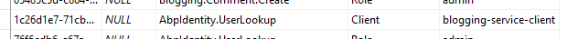

#### Swagger

Swagger UI已配置,是此服务的默认页面. 如果你导航到URL`http://localhost:62157/`, 你将被重定向到swagger页面以查看和测试API.

#### 依赖

- **RabbitMQ** 用于向其他服务发送消息.
- **Redis** 用于分布式/共享缓存.
- **Elasticsearch** 用于存储日志.

### 产品服务 (ProductService.Host)

此服务托管产品管理API.

#### 数据库和EF核心迁移

它有一个单独的SQL数据库,名为**MsDemo_ProductManagement**,用于产品管理模块. 它使用EF Core作为数据库提供程序,并具有名为`ProductServiceMigrationDbContext`的DbContext:

````csharp
public class ProductServiceMigrationDbContext : AbpDbContext<ProductServiceMigrationDbContext>
{
    public ProductServiceMigrationDbContext(
        DbContextOptions<ProductServiceMigrationDbContext> options
        ) : base(options)
    {

    }

    protected override void OnModelCreating(ModelBuilder modelBuilder)
    {
        base.OnModelCreating(modelBuilder);

        modelBuilder.ConfigureProductManagement();
    }
}
````

实际模型配置在`modelBuilder.ConfigureProductManagement()`扩展方法内完成. 此项目使用EF Core迁移维护数据库模式.

请注意,此DbContext仅用于数据库迁移. Product Management模块有自己的`DbContext`类,它在运行时使用(参见ProductManagement.EntityFrameworkCore项目中的`ProductManagementDbContext`类).

`appsettings.json`文件中有两个连接字符串:

````json
"ConnectionStrings": {
  "Default": "Server=localhost;Database=MsDemo_Identity;Trusted_Connection=True;MultipleActiveResultSets=true",
  "ProductManagement": "Server=localhost;Database=MsDemo_ProductManagement;Trusted_Connection=True;MultipleActiveResultSets=true"
}
````

`Default`连接字符串指向MsDemo_Identity数据库,该数据库用于审计日志记录,权限和设置存储. 产品模块使用`ProductManagement`连接字符串.

#### 产品模块

该服务实际上只托管产品管理模块. 不包含任何API本身. 为了托管它,添加以下依赖项:

- `ProductManagementHttpApiModule` 提供产品管理API.
- `ProductManagementApplicationModule` 承载模块的应用程序和域层的实现.
- `ProductManagementEntityFrameworkCoreModule` 使用EF Core作为数据库API.

请参阅[module architecture best practice guide](../Best-Practices/Module-Architecture)以更好地理解分层. 有关此模块的更多信息,请参阅下面的"产品管理"模块部分

#### 认证

这个微服务使用IdentityServer `Bearer`身份验证,并配置如下:

```csharp
context.Services.AddAuthentication("Bearer")
.AddIdentityServerAuthentication(options =>
{
    options.Authority = configuration["AuthServer:Authority"];
    options.ApiName = configuration["AuthServer:ApiName"];
    options.RequireHttpsMetadata = false;
    options.InboundJwtClaimTypeMap["sub"] = AbpClaimTypes.UserId;
    options.InboundJwtClaimTypeMap["role"] = AbpClaimTypes.Role;
    options.InboundJwtClaimTypeMap["email"] = AbpClaimTypes.Email;
    options.InboundJwtClaimTypeMap["email_verified"] = AbpClaimTypes.EmailVerified;
    options.InboundJwtClaimTypeMap["phone_number"] = AbpClaimTypes.PhoneNumber;
    options.InboundJwtClaimTypeMap["phone_number_verified"] = 
        AbpClaimTypes.PhoneNumberVerified;
    options.InboundJwtClaimTypeMap["name"] = AbpClaimTypes.UserName;
});
```

`ApiName`是受保护的API,在这种情况下是`ProductService`. 其余配置与声明映射(计划在下一个ABP版本中自动化)相关. 与`appsettings.json`中的身份验证相关的配置很简单:

```json
"AuthServer": {
  "Authority": "http://localhost:64999",
  "ApiName": "ProductService"
}
```

#### Swagger

Swagger UI已配置,是此服务的默认页面. 如果你导航到URL`http://localhost:60244/`, 你将被重定向到swagger页面以查看和测试API.

#### 依赖

- **RabbitMQ** 用于向其他服务发送消息.
- **Redis** 用于分布式/共享缓存.
- **Elasticsearch** 用于存储日志.

## 模块

ABP提供强大的基础架构,通过提供服务和架构,使模块化应用程序开发更容易(参见[模块开发最佳实践指南](../Best-Practices/Index.md)).

此解决方案演示了如何在分布式体系结构中使用[预构建的应用程序模块](../Modules/Index.md). 该解决方案还包括一个简单的"产品管理"模块,用于显示分层模块示例的实现.

### 产品管理

产品管理是一个由多个层和包/项目组成的模块:

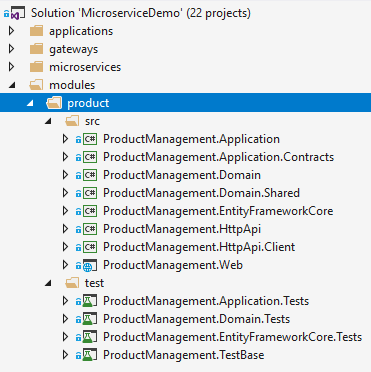

* `ProductManagement.Domain.Shared` 包含所有层之间共享的常量和类型.
* `ProductManagement.Domain` 包含域逻辑并定义实体,域服务,域事件,业务/域异常.
* `ProductManagement.Application.Contracts` 包含应用程序服务接口和DTO.
* `ProductManagement.Application` 包含应用程序服务的实现.
* `ProductManagement.EntityFrameworkCore` 包含DbContext和其他与EF Core相关的类和配置.
* `ProductManagement.HttpApi` 包含API控制器.
* `ProductManagement.HttpApi.Client` 包含C#代理以远程直接使用HTTP API. 使用ABP的[Dynamic C＃API客户端](../API/Dynamic-CSharp-API-Clients.md)功能.

* `ProductManagement.Web` 包含UI元素(页面,脚本,样式..等).

通过此分层的帮助,可以在单个应用程序中使用相同的模块作为包引用,或者用作在另一个服务器中运行的服务. 可以分离UI(Web)和API层,因此它们可以在不同的服务器中运行.

在此解决方案中,Web层在后端管理应用程序中运行,而API层由产品微服务托管.

本教程将重点介绍该模块的一些重要方面. 但是,建议查看源代码以便更好地理解.

#### Domain Layer

`Product`是这个模块的主要[聚合根](../Entities.md):

````csharp
public class Product : AuditedAggregateRoot<Guid>
{
    /// <summary>
    /// A unique value for this product.
    /// ProductManager ensures the uniqueness of it.
    /// It can not be changed after creation of the product.
    /// </summary>
    [NotNull]
    public string Code { get; private set; }

    [NotNull]
    public string Name { get; private set; }

    public float Price { get; private set; }

    public int StockCount { get; private set; }    
    
    //...
}
````

它的所有属性都有私有的set方法,可以防止属性从类中直接更改. 产品类通过自己的构造函数和方法确保其自身的完整性和有效性.

它有两个构造函数:

````csharp
private Product()
{
    //Default constructor is needed for ORMs.
}

internal Product(
    Guid id,
    [NotNull] string code, 
    [NotNull] string name, 
    float price = 0.0f, 
    int stockCount = 0)
{
    Check.NotNullOrWhiteSpace(code, nameof(code));

    if (code.Length >= ProductConsts.MaxCodeLength)
    {
        throw new ArgumentException(
            $"Product code can not be longer than {ProductConsts.MaxCodeLength}"
        );
    }

    Id = id;
    Code = code;
    SetName(Check.NotNullOrWhiteSpace(name, nameof(name)));
    SetPrice(price);
    SetStockCountInternal(stockCount, triggerEvent: false);
}

````

默认(**无参数**)构造函数是私有的,不在应用程序代码中使用. 这是必需的,因为大多数ORM在从数据库获取时需要在反序列化实体时使用无参数构造函数.

第二个构造函数是**internal**,这意味着它只能在域层内使用. 这强制在创建新的`Product`时使用`ProductManager`. 因为`ProductManager`应该在新产品创建上实现业务规则. 此构造函数仅需要最少的必需参数来创建具有一些可选参数的新产品. 它会检查一些简单的业务规则,以确保将实体创建为有效产品.

该类的其余部分具有操纵实体属性的方法. 例:

````csharp
public Product SetPrice(float price)
{
    if (price < 0.0f)
    {
        throw new ArgumentException($"{nameof(price)} can not be less than 0.0!");
    }

    Price = price;
    return this;
}

````

`SetPrice`方法用于以安全的方式更改产品的价格(通过检查验证规则).

`SetStockCount`是另一种用于更改产品库存数量的方法:

````csharp
public Product SetStockCount(int stockCount)
{
    return SetStockCountInternal(stockCount);
}

private Product SetStockCountInternal(int stockCount, bool triggerEvent = true)
{
    if (StockCount < 0)
    {
        throw new ArgumentException($"{nameof(stockCount)} can not be less than 0!");
    }

    if (StockCount == stockCount)
    {
        return this;
    }

    if (triggerEvent)
    {
        AddDistributedEvent(
            new ProductStockCountChangedEto(
                Id, StockCount, stockCount
            )
        );
    }

    StockCount = stockCount;
    return this;
}

````

此方法还触发**分布式事件**,其中带有`ProductStockCountChangedEto`参数(Eto是传统的后缀代表**E**vent **T**ransfer **O**bject,但不是必需的)通知产品库存数量的听众已发生变化. 任何订户都可以接收此事件并根据该知识执行操作.

RabbitMQ为此解决方案分发事件. 但是ABP通过提供必要的抽象来独立于消息代理[Event Bus](../Event-Bus.md)文档).

如前所述,该模块强制始终使用`ProductManager`来创建新的`Product`. `ProductManager`是一个简单的域服务,定义如下:

````csharp
public class ProductManager : DomainService
{
    private readonly IRepository<Product, Guid> _productRepository;

    public ProductManager(IRepository<Product, Guid> productRepository)
    {
        _productRepository = productRepository;
    }

    public async Task<Product> CreateAsync(
        [NotNull] string code,
        [NotNull] string name,
        float price = 0.0f,
        int stockCount = 0)
    {
        var existingProduct = 
            await _productRepository.FirstOrDefaultAsync(p => p.Code == code);
            
        if (existingProduct != null)
        {
            throw new ProductCodeAlreadyExistsException(code);
        }

        return await _productRepository.InsertAsync(
            new Product(
                GuidGenerator.Create(),
                code,
                name,
                price,
                stockCount
            )
        );
    }
}
````

* 它检查之前是否使用过给定的代码. 否则抛出`ProductCodeAlreadyExistsException`.
* 使用`GuidGenerator`(`IGuidGenerator`)服务来创建一个新的`Guid`.
* 它将实体插入存储库.

因此,通过这种设计,产品代码的唯一性得到保证.

`ProductCodeAlreadyExistsException`是一个域/业务异常,定义如下:

````csharp
public class ProductCodeAlreadyExistsException : BusinessException
{
    public ProductCodeAlreadyExistsException(string productCode)
        : base("PM:000001", $"A product with code {productCode} has already exists!")
    {

    }
}
````

`PM:000001`是发送给客户端的异常类型的代码,因此他们可以理解错误类型. 在这种情况下没有实现,但也可以本地化业务异常. 请参阅[异常处理文档](../Exception-Handling.md).

#### 应用层

该模块的应用层有两个服务:

* `ProductAppService`主要由后端管理应用程序用于管理(创建,更新,删除.)产品. 它需要许可才能执行任何操作.
* 公共网站使用`PublicProductAppService`来向访问者显示产品列表. 它不需要任何权限,因为大多数访问者都没有登录到应用程序.

请注意; 每个应用程序分离应用程序层可能是更好的原则, 而不是将两个应用程序服务放入同一个项目中. 但是我们在这个解决方案中简化了它们.

例如,`ProductAppService`具有以下更新产品的方法:

````csharp
[Authorize(ProductManagementPermissions.Products.Update)]
public async Task<ProductDto> UpdateAsync(Guid id, UpdateProductDto input)
{
    var product = await _productRepository.GetAsync(id);

    product.SetName(input.Name);
    product.SetPrice(input.Price);
    product.SetStockCount(input.StockCount);

    return ObjectMapper.Map<Product, ProductDto>(product);
}
````

* 它定义了所需的权限(*ProductManagementPermissions.Products.Update*是一个值为`ProductManagement.Update`的常量)来执行此操作.
* 获取产品的ID,DTO包含要更新的值.
* 从存储库中获取相关的产品实体.
* 使用`Product`类的相关方法(如`SetName`)来更改属性,因为它们是私有set方法,更改值的唯一方法是使用实体方法.
* 通过使用[ObjectMapper](../Object-To-Object-Mapping.md)向客户端返回更新的`ProductDto`(客户端可能由于某种原因需要它).

实施可能会根据要求而有所不同. 此实现遵循此处提供的[最佳实践](../Best-Practices/Application-Services.md).

#### 其他层

请参阅源代码中的其他层.

## 基础设施

### 消息和RabbitMQ

异步消息传递是分布式系统中的关键概念. 它可以以松散耦合的方式与容错进行通信. 在发送消息时,它不要求双方都在线. 因此,它是微服务架构中广泛使用的通信模式.

#### 分布式事件总线

分布式事件(事件总线)是一种消息传递方式,其中服务引发/触发事件,而其他服务注册/侦听这些事件,以便在发生重要事件时得到通知. ABP通过提供约定,服务和集成使分布式事件更易于使用.

你已经看到`Product`类使用以下代码行发布事件:

````csharp
AddDistributedEvent(new ProductStockCountChangedEto(Id, StockCount, stockCount));
````

`ProductStockCountChangedEto` 定义如下:

````csharp
[Serializable]
public class ProductStockCountChangedEto : EtoBase
{
    public Guid Id { get; }

    public int OldCount { get; set; }

    public int CurrentCount { get; set; }

    private ProductStockCountChangedEto()
    {
        //Default constructor is needed for deserialization.
    }

    public ProductStockCountChangedEto(Guid id, int oldCount, int currentCount)
    {
        Id = id;
        OldCount = oldCount;
        CurrentCount = currentCount;
    }
}
````

该对象存储有关该事件的必要信息. 通过使用通用的`ProductStockCountChangedEto`参数实现`IDistributedEventHandler`接口,另一个服务可以轻松注册到此事件:

````csharp
public class MyHandler : IDistributedEventHandler<ProductStockCountChangedEto>
{
    public async Task HandleEventAsync(ProductStockCountChangedEto eventData)
    {
        var productId = eventData.Id;
        //...
    }
}
````

当你使用[Volo.Abp.EventBus.RabbitMQ](https://www.nuget.org/packages/Volo.Abp.EventBus.RabbitMQ)包时,所有集成和通信都由ABP框架完成.如果需要从实体发布事件,只需注入`IDistributedEventBus`并使用`PublishAsync`方法.

有关分布式事件系统的更多信息, 请参见[Event Bus](../Event-Bus.md)文档.

#### RabbitMQ配置

在此解决方案中, [RabbitMQ](https://www.rabbitmq.com/)用于消息传递和分布式事件.

[Volo.Abp.EventBus.RabbitMQ](https://www.nuget.org/packages/Volo.Abp.EventBus.RabbitMQ)包需要集成到RabbitMQ以用于分布式事件系统. 然后你需要为模块的`AbpEventBusRabbitMqModule`添加依赖项. 例如`ProductServiceHostModule`声明了这种依赖.

默认情况下,`abpEventBusRabbitMqModule`从`appsettings.json`获取配置. 例如产品服务具有以下配置:

````json
"RabbitMQ": {
  "Connections": {
    "Default": {
      "HostName": "localhost"
    }
  },
  "EventBus": {
    "ClientName": "MsDemo_ProductService",
    "ExchangeName": "MsDemo"
  }
}
````

### 缓存和Redis

分布式系统显然需要分布式和共享缓存,而不是每个服务的隔离内存缓存.

[Redis](https://redis.io/)在此解决方案中用作分布式缓存. 该解决方案使用Microsoft的标准[Microsoft.Extensions.Caching.Redis](https://www.nuget.org/packages/Microsoft.Extensions.Caching.Redis) 包进行集成. 使用和配置此程序包时,所有应用程序和服务都使用Redis缓存. 有关详细信息请参阅[Microsoft的文档](https://docs.microsoft.com/en-us/aspnet/core/performance/caching/distributed).

该解决方案还使用[Microsoft.AspNetCore.DataProtection.StackExchangeRedis](https://www.nuget.org/packages/Microsoft.AspNetCore.DataProtection.StackExchangeRedis)包在Redis缓存上共享应用程序和服务之间的数据保护密钥.

### Logging,Serilog,Elasticsearch和Kibana

该解决方案使用[Serilog](https://serilog.net/)作为日志库. 它是一个广泛使用的库,有许多数据源集成,包括[Elasticsearch](https://www.elastic.co/products/elasticsearch).

使用类似于下面给出的代码块在`Program.cs`文件中完成日志配置:

````csharp
Log.Logger = new LoggerConfiguration()
    .MinimumLevel.Debug()
    .MinimumLevel.Override("Microsoft", LogEventLevel.Information)
    .Enrich.WithProperty("Application", "ProductService")
    .Enrich.FromLogContext()
    .WriteTo.File("Logs/logs.txt")
    .WriteTo.Elasticsearch(
        new ElasticsearchSinkOptions(new Uri(configuration["ElasticSearch:Url"]))
        {
            AutoRegisterTemplate = true,
            AutoRegisterTemplateVersion = AutoRegisterTemplateVersion.ESv6,
            IndexFormat = "msdemo-log-{0:yyyy.MM}"
        })
    .CreateLogger();
````

这会配置多个日志输出目标:File和Elasticsearch.对于此示例,`Application`属性设置为`ProductService`. 这是一种区分单个数据库中多个服务的日志的方法. 然后, 你可以通过`Application`名称查询日志.

从`appsettings.json`配置文件中读取Elasticsearch URL:

````json
"ElasticSearch": {
  "Url": "http://localhost:9200"
}
````

如果你使用Kibana, 它是一个与Elasticsearch完美集成的可视化工具,可以看到有关你的日志的一些UI:


*Figure - 一个仪表板,显示服务/应用程序的日志和错误计数.*

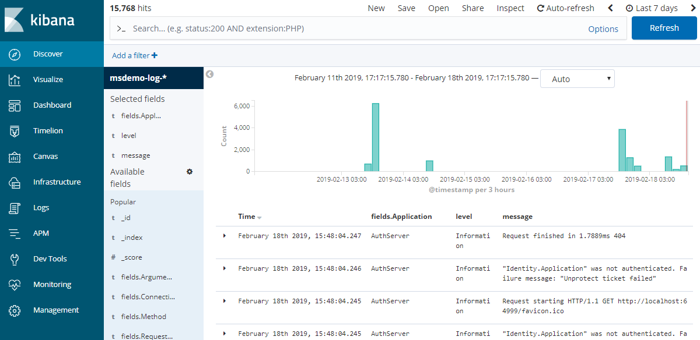

*Figure - 日志条目列表*

Kibana URL默认为`http://localhost:5601/`.

### 审计日志

ABP提供自动审计日志记录,详细保存每个请求(当前用户,浏览器/客户端,执行了哪些操作,哪些实体更改,甚至实体的哪些属性已更新). 有关详细信息,请参阅[审计日志文档](../Audit-Logging.md).

所有服务和应用程序都配置为编写审核日志. 审核日志将保存到MsDemo_Identity SQL数据库中. 因此,你可以从单个点查询所有应用程序的所有审核日志.

审核日志记录具有`CorrelationId`属性,可用于跟踪请求. 当服务在单个Web请求中调用另一个服务时,它们都会使用相同的`CorrelationId`保存审核日志. 请参阅数据库中的`AbpAuditLogs`表.

### 多租户

该解决方案已配置提供[多租户](../Multi-Tenancy.md)系统,其中每个租户可以拥有其隔离的用户,角色,权限和其他数据.
