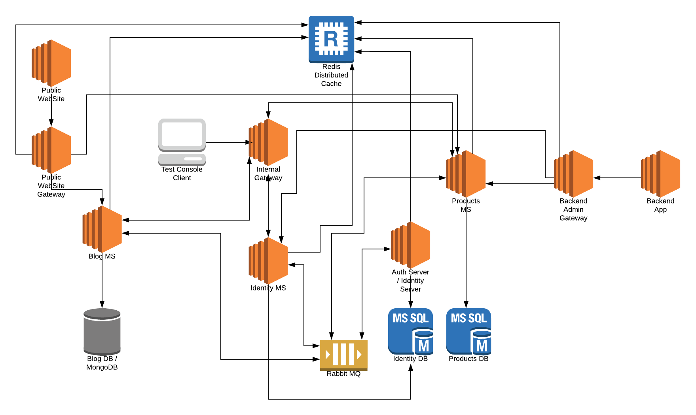

# 微服务解决方案示例

*"作为**面向服务架构**(SOA)的一个变体,微服务是一种将应用程序分解成**松散耦合服务**的新型架构风格. 通过**细粒度**的服务和**轻量级**的协议,微服务提供了更多的**模块化**,使应用程序更容易理解,开发,测试,并且更容易抵抗架构侵蚀. 它使小型团队能够**开发,部署和扩展**各自的服务,实现开发的**并行化**.它还允许通过**连续重构**形成单个服务的架构. 基于微服务架构可以实现**持续交付和部署**."*

— [维基百科](https://zh.wikipedia.org/wiki/Microservices)

## 介绍

ABP框架的主要目标之一就是提供[便捷的基础设施来创建微服务解决方案](../Microservice-Architecture.md).

此示例演示了一个简单而完整的微服务解决方案;

* 拥有多个可独立可单独部署的**微服务**.
* 多个**Web应用程序**, 每一个都使用不同的API网关.
* 使用[Ocelot](https://github.com/ThreeMammals/Ocelot)库开发了多个**网关** / BFFs ([用于前端的后端](https://docs.microsoft.com/zh-cn/azure/architecture/patterns/backends-for-frontends)).
* 包含使用[IdentityServer](https://identityserver.io/)框架开发的 **身份认证服务**. 它也是一个带有UI的SSO(单点登陆)应用程序.
* 有**多个数据库**. 一些微服务有自己的数据库,也有一些服务/应用程序共享同一个数据库(以演示不同的用例).
* 有不同类型的数据库: **SQL Server** (与 **Entity Framework Core** ORM) 和 **MongoDB**.
* 有一个**控制台应用程序**使用身份验证展示使用服务最简单的方法.
* 使用[Redis](https://redis.io/)做**分布式缓存**.
* 使用[RabbitMQ](https://www.rabbitmq.com/)做服务间的**消息**传递.
* 使用[Kubernates](https://kubernetes.io/)**部署**和运行所有的服务和应用程序.

下图显示了该系统:

### 源码

你可以从[GitHub仓库](https://github.com/abpframework/abp/tree/master/samples/MicroserviceDemo)获取源码.

### 状态

此示例仍处于开发阶段,尚未完成.

## 微服务

### 身份认证服务

...