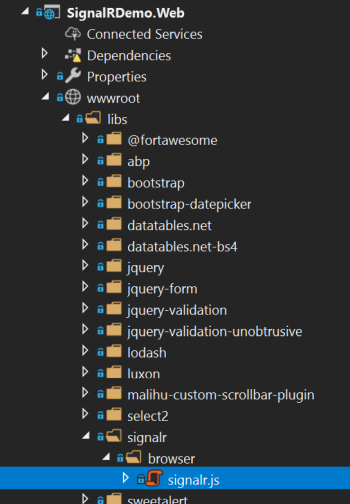
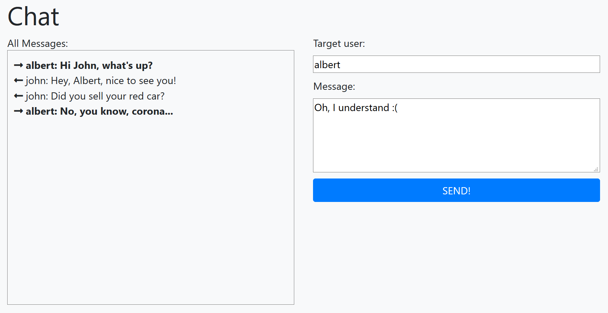

# SignalR 集成

> 你可以按照[标准的微软教程](https://docs.microsoft.com/en-us/aspnet/core/tutorials/signal)添加[SignalR](https://docs.microsoft.com/en-us/aspnet/core/signalr/introduction)到你的应用程序,但ABP提供了简化集成的SignalR集成包.

## 安装

### 服务器端

建议使用[ABP CLI](CLI.md)安装包.

#### 使用 ABP CLI

在项目的文件夹(.csproj文件)中打开命令行窗口,然后输入以下命令:

```bash
abp add-package Volo.Abp.AspNetCore.SignalR
```

> 你通常需要将此软件包添加到应用程序的Web或API层,具体取决于你的架构.

#### 手动安装

如果你想手动安装:

1. 添加[Volo.Abp.AspNetCore.SignalR](https://www.nuget.org/packages/Volo.Abp.AspNetCore.SignalR)NuGet包到你的项目:

   ```
   Install-Package Volo.Abp.AspNetCore.SignalR
   ```

   或者使用VisualStudio提供的UI安装

2. 添加 `AbpAspNetCoreSignalRModule` 到你的模块的依赖列表.

```csharp
[DependsOn(
    //...other dependencies
    typeof(AbpAspNetCoreSignalRModule) //Add the new module dependency
    )]
public class YourModule : AbpModule
{
}
```

> 你不需要 `services.AddSignalR()` 和 `app.UseEndpoints(...)`,它们在 `AbpAspNetCoreSignalRModule` 中已经添加了.

### 客户端

客户端安装取决于你的UI框架/客户端类型.

#### ASP.NET Core MVC / Razor Pages UI

在你的Web项目的根文件夹中运行以下命令:

````bash
yarn add @abp/signalr
````

> 需要 [yarn](https://yarnpkg.com/) 环境.

它会添加 `@abp/signalr` 到你的项目中的 `package.json` 依赖项:

````json
{
  ...
  "dependencies": {
    ...
    "@abp/signalr": "~2.7.0"
  }
}
````

在你的Web项目的根文件夹中运行 `gulp`:

````bash
gulp
````

它会将SignalR JavaScript文件拷贝到你的项目:



最后将以下代码添加到页面/视图中, 添加包含 `signalr.js` 文件:

````xml
@section scripts {
    <abp-script type="typeof(SignalRBrowserScriptContributor)" />
}
````

它需要将 `@using Volo.Abp.AspNetCore.Mvc.UI.Packages.SignalR` 添加到你的页面/视图.

> 你可以用标准方式添加 `signalr.js` 文件. 但是使用 `SignalRBrowserScriptContributor` 具有其他好处. 有关详细信息,请参见[客户端程序包管理](UI/AspNetCore/Client-Side-Package-Management.md)和[捆绑和压缩文档](UI/AspNetCore/Bundling-Minification.md).

这就是全部了,你可以在你的页面使用[SignalR JavaScript API](https://docs.microsoft.com/en-us/aspnet/core/signalr/javascript-client).

#### 其他的UI框架/客户端

其他类型的客户端请参考[微软文档](https://docs.microsoft.com/en-us/aspnet/core/signalr/introduction).

## ABP框架集成

本节介绍了使用ABP框架集成包的其他好处.

### Hub 路由与Mapping

ABP自动将所有集线器注册到[依赖注入](Dependency-Injection.md)(做为transient)并映射集线器端点. 因此你不需要使用 `app.UseEndpoints(...)` 即可映射你的集线器.集线器路由(URL)通常是根据你的集线器名称确定.

示例:

````csharp
public class MessagingHub : Hub
{
    //...
}
````

`MessagingHub` 集线器的路由为 `/signalr-hubs/messaging`:

* 添加了标准 `/signalr-hubs/` 前缀.
* 使用**驼峰命名**集线器名称,不包含 `Hub` 后缀.

如果你想指定路由,你可以使用 `HubRoute` attribute:

````csharp
[HubRoute("/my-messaging-hub")]
public class MessagingHub : Hub
{
    //...
}
````

### AbpHub 基类

你可以从 `AbpHub` 或 `AbpHub<T>` 继承标准的 `Hub` 和 `Hub<T>` 类,它们具有实用的基本属性,如 `CurrentUser`.

示例:

````csharp
public class MessagingHub : AbpHub
{
    public async Task SendMessage(string targetUserName, string message)
    {
        var currentUserName = CurrentUser.UserName; //Access to the current user info
        var txt = L["MyText"]; //Localization
    }
}
````

> 虽然可以将相同的属性注入到集线器构造函数中,但是这种方式简化了集线器类.

### 手动注册/Mapping

ABP会自动将所有集线器注册到[依赖注入](Dependency-Injection.md)作为**transient service**. 如果想要禁用集线器类**自动添加依赖注入**,只需要使用 `DisableConventionalRegistration` attribute. 如果愿意,你仍然可以在模块的 `ConfigureServices` 方法中注册集线器类:

````csharp
context.Services.AddTransient<MessagingHub>();
````

当**你或ABP**将类注册到依赖注入时,如前几节所述,它会自动映射到端点路由配置. 如果要手动映射集线器类,你可以使用 `DisableAutoHubMap` attribute.

对于手动映射,你有两个选择:

1. 使用 `AbpSignalROptions` 添加map配置(在[模块](Module-Development-Basics.md)的 `ConfigureServices` 方法中),ABP会为集线器执行端点映射:

````csharp
Configure<AbpSignalROptions>(options =>
{
    options.Hubs.Add(
        new HubConfig(
            typeof(MessagingHub), //Hub type
            "/my-messaging/route", //Hub route (URL)
            hubOptions =>
            {
                //Additional options
                hubOptions.LongPolling.PollTimeout = TimeSpan.FromSeconds(30);
            }
        )
    );
});
````

这是提供其他SignalR选项的好方式.

如果你不想禁用自动集线器map,但仍想执行其他SignalR配置,可以使用 `options.Hubs.AddOrUpdate(...)` 方法:

````csharp
Configure<AbpSignalROptions>(options =>
{
    options.Hubs.AddOrUpdate(
        typeof(MessagingHub), //Hub type
        config => //Additional configuration
        {
            config.RoutePattern = "/my-messaging-hub"; //override the default route
            config.ConfigureActions.Add(hubOptions =>
            {
                //Additional options
                hubOptions.LongPolling.PollTimeout = TimeSpan.FromSeconds(30);
            });
        }
    );
});
````

你可以通过这种方式修改在依赖模块(没有源代码访问权限)中定义的集线器类的选项.

2. 在[模块](Module-Development-Basics.md)的 `OnApplicationInitialization` 方法中更改 `app.UseConfiguredEndpoints`(添加了lambda方法作为参数).

````csharp
app.UseConfiguredEndpoints(endpoints =>
{
    endpoints.MapHub<MessagingHub>("/my-messaging-hub", options =>
    {
        options.LongPolling.PollTimeout = TimeSpan.FromSeconds(30);
    });
});
````

### UserIdProvider

ABP实现 `SignalR` 的 `IUserIdProvider` 接口,从ABP框架的 `ICurrentUser` 服务提供当前用户ID(请参阅[当前用户服务](CurrentUser.md)),它将集成到应用程序的身份验证系统中,实现类是 `AbpSignalRUserIdProvider` (如果你想更改/覆盖它).

## 示例应用程序

参阅 [SignalR集成Demo](https://github.com/abpframework/abp-samples/tree/master/SignalRDemo),它有一个简单的聊天页面,可以在(经过身份验证的)用户之间发送消息.



## 备注

ABP框架不会更改SignalR. 就像在其他ASP.NET Core应用程序中一样,它也可以在基于ABP框架的应用程序中工作.

参考[微软文档](https://docs.microsoft.com/zh-cn/aspnet/core/signalr/scale)托管和扩展您的应用程序,集成[Azure](https://docs.microsoft.com/zh-cn/aspnet/core/signalr/publish-to-azure-web-app)或[Redis底版](https://docs.microsoft.com/zh-cn/aspnet/core/signalr/redis-backplane)...等.

## 另请参阅

* [微软SignalR文档](https://docs.microsoft.com/zh-cn/aspnet/core/signalr/introduction)
* [使用ABP,SignalR和RabbitMQ在分布式体系结构中的实时消息传递](https://volosoft.com/blog/RealTime-Messaging-Distributed-Architecture-Abp-SingalR-RabbitMQ)