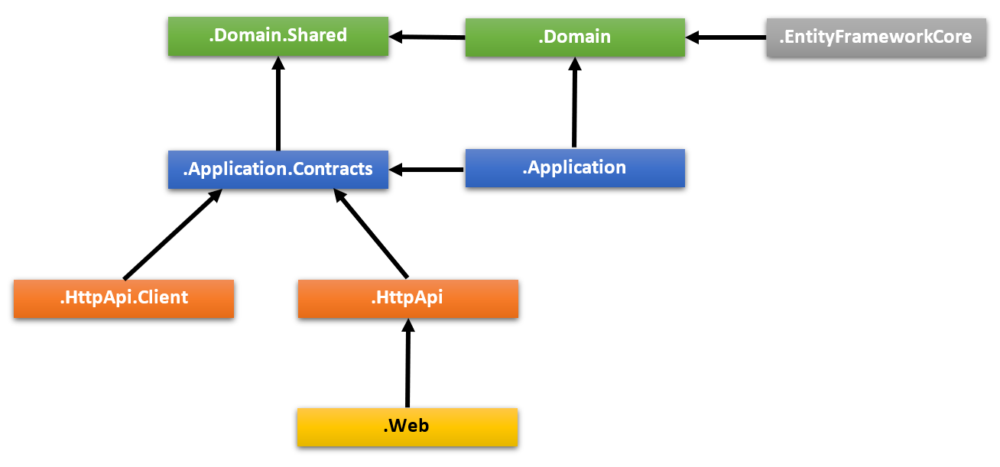
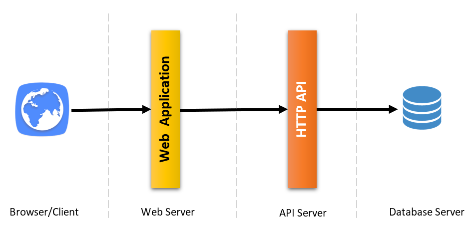
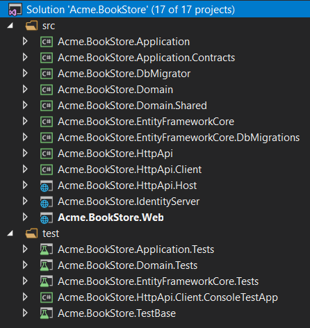
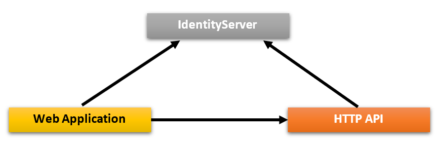
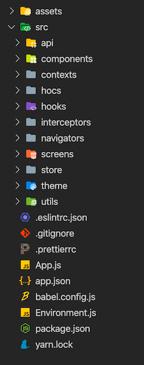
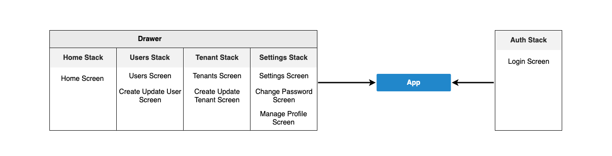
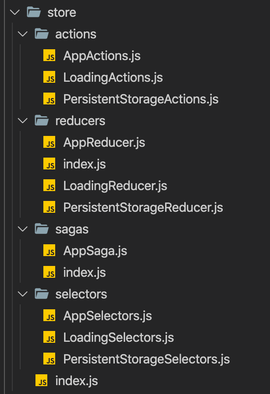

# 应用程序启动模板

## 介绍

应用程序启动模板是基于[领域驱动设计](../Domain-Driven-Design.md)(DDD)分层的应用程序结构.

在这篇文档中详细介绍了**解决方案结构**和项目,如果你想快速入门,请遵循以下指南:

* 参阅[ASP.NET Core MVC 模板入门](../Getting-Started-With-Startup-Templates.md)创建此模板的新解决方案并运行它.
* 参阅[ASP.NET Core MVC 教程](../Tutorials/AspNetCore-Mvc/Part-I.md)学习使用此模板开发应用程序.

* [入门文档](../Getting-Started-AspNetCore-MVC-Template.md) 介绍了如何在几分钟内创建一个新的应用程序.
* [应用程序开发教程](../Tutorials/AspNetCore-Mvc/Part-I.md) 学习使用此模板开发应用程序.

## 如何开始

你可以使用[ABP CLI](../CLI.md)创建基于此启动模板的新项目,或者你也可以在[入门](https://abp.io/get-started)页面创建并下载项目. 在这里我们使用CLI创建新项目.

如果未安装ABP CLI,第一步是安装ABP CLI

````bash
dotnet tool install -g Volo.Abp.Cli
````

然后使用 `abp new` 命令在空文件夹中创建新解决方案:

````bash
abp new Acme.BookStore -t app
````

* `Acme.BookStore` 是解决方案的名称,  如*YourCompany.YourProduct*. 你可以使用单级或多级名称.
* 示例中指定了启动模板 (`-t` 或 `--template` 选项). 示指定模板时,默认模板是`app` .

### 指定UI框架

模板提供了多个UI框架

* `mvc`: ASP.NET Core MVC Razor页面 (默认)
* `angular`: Angular UI

使用 `-u` 或 `--ui` 选择指定UI框架:

````bash
abp new Acme.BookStore -u angular
````

### 指定数据库提供程序

`MVC`模板支持以下数据库提供程序:

- `ef`: Entity Framework Core (默认)
- `mongodb`: MongoDB

使用 `-d` (或 `--database-provider`) 选项指定数据库提供程序:

````bash
abp new Acme.BookStore -d mongodb
````

### 指定移动应用程序框架

该模板支持以下移动应用程序框架:

- `react-native`: React Native

使用 `-m` (or `--mobile`) 选项来指定移动应用程序框架:

````bash
abp new Acme.BookStore -m react-native
````

如果未指定, 则不会创建任何移动应用程序.

## 解决方案结构

根据命令的选项,会创建略有不同的解决方案结构.

### 默认结构

如果未指定附加选项,你会得到如下所示的解决方案:


项目组织在`src`和`test`文件夹中. `src`文件夹包含实际应用程序,该应用程序基于前面提到的[DDD](../Domain-Driven-Design.md)原则进行分层. 下图展示了解决方案的层和项目的依赖关系:



下面介绍解决方案中的项目及依赖关系.

#### .Domain.Shared 项目

项目包含常量,枚举和其他对象,这些对象实际上是领域层的一部分,但是解决方案中所有的层/项目中都会使用到.

例如 `BookType` 枚举和 `BookConsts` 类 (可能是 `Book` 实体用到的常数字段,像`MaxNameLength`)都适合放在这个项目中.

* 该项目不依赖解决方案中的其他项目. 其他项目直接或间接依赖该项目

#### .Domain 项目

解决方案的领域层. 它主要包含 [实体, 集合根](../Entities.md), [领域服务](../Domain-Services.md), [值类型](../Value-Types.md), [仓储接口](../Repositories.md) 和解决方案的其他领域对象.

例如 `Book` 实体和 `IBookRepository` 接口都适合放在这个项目中.

* 它依赖 `.Domain.Shared` 项目,因为项目中会用到它的一些常量,枚举和定义其他对象.

#### .Application.Contracts 项目

项目主要包含 [应用服务](../Application-Services.md) **interfaces** 和应用层的 [数据传输对象](../Data-Transfer-Objects.md) (DTO). 它用于分离应用层的接口和实现. 这种方式可以将接口项目做为约定包共享给客户端.

例如 `IBookAppService` 接口和 `BookCreationDto` 类都适合放在这个项目中.

* 它依赖 `.Domain.Shared` 因为它可能会在应用接口和DTO中使用常量,枚举和其他的共享对象.

#### .Application 项目

项目包含 `.Application.Contracts` 项目的 [应用服务](../Application-Services.md) 接口**实现**.

例如 `BookAppService` 类适合放在这个项目中.

* 它依赖 `.Application.Contracts` 项目, 因为它需要实现接口与使用DTO.
* 它依赖 `.Domain` 项目,因为它需要使用领域对象(实体,仓储接口等)执行应用程序逻辑.

#### .EntityFrameworkCore 项目

这是集成EF Core的项目. 它定义了 `DbContext` 并实现 `.Domain` 项目中定义的仓储接口.

* 它依赖 `.Domain` 项目,因为它需要引用实体和仓储接口.

> 只有在你使用了EF Core做为数据库提供程序时,此项目才会可用. 如果选择的是其他数据库提供程序那么项目的名称会改变

#### .EntityFrameworkCore.DbMigrations 项目

包含解决方案的EF Core数据库迁移. 它有独立的 `DbContext` 来专门管理迁移.

ABP是一个模块化的框架,理想的设计是让每个模块都有自己的 `DbContext` 类. 这时用于迁移的 `DbContext` 就会发挥作用. 它将所有的 `DbContext` 配置统一到单个模型中以维护单个数据库的模式. 对于更高级的场景,可以程序可以拥有多个数据库(每个数据库有一个或多个模块表)和多个迁移`DbContext`(每个都维护不同的数据库模式)

需要注意,迁移 `DbContext` 仅用于数据库迁移,而不在*运行时*使用.

* 它依赖 `.EntityFrameworkCore` 项目,因为它重用了应用程序的 `DbContext` 配置 .

> 只有在你使用了EF Core做为数据库提供程序时,此项目才会可用.
> 参阅[Entity Framework Core迁移指南](../Entity-Framework-Core-Migrations.md)了解这个项目的详细信息.

#### .DbMigrator 项目

这是一个控制台应用程序,它简化了在开发和生产环境执行数据库迁移的操作.当你使用它时;

* 必要时创建数据库(没有数据库时).
* 应用未迁移的数据库迁移.
* 初始化种子数据(当你需要时).

> 这个项目有自己的 `appsettings.json` 文件. 所以如果要更改数据库连接字符串,请记得也要更改此文件.

初始化种子数据很重要,ABP具有模块化的种子数据基础设施. 种子数据的更多信息,请参阅[文档](../Data-Seeding.md).

虽然创建数据库和应用迁移似乎只对关系数据库有用,但即使你选择NoSQL数据库提供程序(如MongoDB),也会生成此项目. 这时,它会为应用程序提供必要的初始数据.

* 它依赖 `.EntityFrameworkCore.DbMigrations` 项目 (针对EF Core),因为它需要访问迁移文件.
* 它依赖 `.Application.Contracts` 项目,因为它需要访问权限定义在初始化种子数据时为管理员用户赋予所有权限.

#### .HttpApi 项目

用于定义API控制器.

大多数情况下,你不需要手动定义API控制器,因为ABP的[动态API](../API/Auto-API-Controllers.md)功能会根据你的应用层自动创建API控制器. 但是,如果你需要编写API控制器,那么它是最合适的地方.

* 它依赖 `.Application.Contracts` 项目,因为它需要注入应用服务接口.

#### .HttpApi.Client 项目

定义C#客户端代理使用解决方案的HTTP API项目. 可以将上编辑共享给第三方客户端,使其轻松的在DotNet应用程序中使用你的HTTP API(其他类型的应用程序可以手动或使用其平台的工具来使用你的API).

ABP有[动态 C# API 客户端](../API/Dynamic-CSharp-API-Clients.md)功能,所以大多数情况下你不需要手动的创建C#客户端代理.

`.HttpApi.Client.ConsoleTestApp` 项目是一个用于演示客户端代理用法的控制台应用程序.

* 它依赖 `.Application.Contracts` 项目,因为它需要使用应用服务接口和DTO.
  
> 如果你不需要为API创建动态C#客户端代理,可以删除此项目和依赖项

#### .Web 项目

包含应用程序的用户界面(UI).如果使用ASP.NET Core MVC UI, 它包括Razor页面,javascript文件,样式文件,图片等...

包含应用程序主要的 `appsettings.json` 配置文件,用于配置数据库连接字符串和应用程序的其他配置

* 依赖 `.HttpApi` 项目,因为UI层需要使用解决方案的API和应用服务接口.

> 如果查看 `.Web.csproj` 源码, 你会看到对 `.Application` 和 `.EntityFrameworkCore.DbMigrations` 项目的引用.
>
> 在编写UI层时实际上不需要这些引用. 因为UI层通常不依赖于EF Core或应用层的实现. 这个启动模板已经为分层部署做好了准备,API层托管在不同与UI层的服务器中.
>
> 但是如果你不选择 `--tiered` 选项, .Web项目会有这些引用,以便能够将Web,Api和应用层托管在单个应用程序站点.
>
> 你可以在表示层中使用领域实体和仓储,但是根据DDD的理论,这被认为是一种不好的做法.

#### Test 项目

解决方案有多个测试项目,每一层都会有一个:

* `.Domain.Tests` 用于测试领域层.
* `.Application.Tests` 用于测试应用层.
* `.EntityFrameworkCore.Tests` 用于测试EF Core配置与自定义仓储.
* `.Web.Tests` 用于测试UI(适用于ASP.NET Core MVC UI).
* `.TestBase` 所有测试项目的基础(共享)项目.

此外,  `.HttpApi.Client.ConsoleTestApp` 是一个控制台应用程序(不是自动化测试项目),它用于演示.Net应用程序中HTTP API的用法.

测试项目是用于做集成测试的:

* 它完全集成到ABP框架和应用程序的所有服务.
* 如果数据库提供程序是EF Core,测试项目会使用SQLite内存数据库,如果是MongoDB,它使用[Mongo2Go](https://github.com/Mongo2Go/Mongo2Go)库.
* 授权被禁用,任何的应用服务都可以在测试中轻松调用.

你依然可以编写单元测试,只不过它很难写(因为你需要准备mock/fake对象),但它的运行速度更快(因为只测试单个类并跳过所有初始化过程).

#### 如何运行?

设置`.Web`为启动项目. 默认用户名 `admin`, 密码 `1q2w3E*`.

更多信息请参阅[ASP.NET Core MVC 模板入门](../Getting-Started-AspNetCore-MVC-Template.md).

### 分层结构

如果你选择了ASP.NET Core UI并指定了 `--tiered` 选项,CLI会创建分层解决方案. 分层结构的目的是**将Web应用程序和HTTP API部署到不同的服务器**:



* 浏览器渲染HTML,执行CSS和JavaScript来运行UI.
* Web服务器托管静态文件(CSS,JavaScript,图片...等)和动态组件(如Razor页面),它通过HTTP请求到API服务器执行应用程序的业务逻辑.
* API服务器托管HTTP API,使用应用程序的应用层和领域层执行业务逻辑.
* 最后数据库服务器托管数据库.

与之前默认结构的三层部署比较,分层解决方案允许四层部署.

> 除非你真的需要四层部署,一般建议采用默认结构,它更易于开发,部署和维护.

解决方案结构如下所示:



与默认结构不同,我们得到了两个新项目: `.IdentityServer` 和 `.HttpApi.Host`.

#### .IdentityServer 项目

用于其他项目的身份验证服务器. `.Web`项目使用OpenId Connect身份验证从IdentityServer获取当前用户的身份和访问令牌. 然后使用访问令牌调用HTTP API服务器. HTTP API服务器使用bearer token从访问令牌获取声明授权当前用户.



ABP使用开源的[IdentityServer4](https://identityserver.io/)框架做应用程序间的身份验证. 有关IdentityServer4和OpenId Connect协议的详细信息请参阅[IdentityServer4文档](http://docs.identityserver.io).

它有自己的`appsettings.json`文件(数据库连接字符串等其他配置).

#### .HttpApi.Host 项目

该项目是一个承载解决方案API的应用程序. 它有自己的`appsettings.json`文件(数据库连接字符串等其他配置).

#### .Web 项目

与默认结构一样,包含应用程序的用户界面(UI). 包括Razor页面,javascript文件,样式文件,图片等...

项目包含`appsetting.json`文件,但没有连接字符串配置, 它不需要连接到数据库. 文件中主要包含远程API服务器端点和身份验证服务器

#### 前置条件

* [Redis](https://redis.io/): 应用程序使用Redis做分布式缓存,你需要安装并运行Redis.

#### 如何运行?

你应该按照以下顺序运行应用:

* 首先运行`.IdentityServer`,因为其他应用程序依赖它做身份验证.
* 然后运行`.HttpApi.Host`,因为`.Web`应用程序需要访问HTTI API.
* 最后运行`.Web`并登录到应用程序(用户名: `admin` 密码: `1q2w3E*`).

### Angular UI

如果你选择Angular做为UI框架(使用 `-u angular` 选择), 解决方案会被分成两个文件夹:

* `angular` 是客户端部分,文件夹中包含了Angular UI 解决方案.
* `aspnet-core` 是服务端部分,文件夹中包含了ASP.NET Core解决方案.

服务端部分与上面的描述的解决方案非常相似. `.HttpApi.Host` 项目提供API接口, Angular应用程序使用它提供的接口.

`angular/src/environments` 文件夹下的文件含有应用程序的基础配置.

#### AppModule（应用程序模块）

`AppModule` 是应用程序的根模块. 一些ABP模块和一些基本模块导入到 `AppModule` 中.

ABP 配置模块也已经导入到 `AppModule` 中, 以满足可延迟加载 ABP 模块的初始需求. 

#### AppRoutingModule（应用程序路由模块）

在 `AppRoutingModule` 中有可延迟加载的 ABP 模块作为路由. 

> 不应更改ABP模块的路径. 

你应该在 `data` 对象中添加 `routes` 属性, 以便在菜单中添加一个链接来重定向到自定义页面. 

```js
{
   path: 'dashboard',
   loadChildren: () => import('./dashboard/dashboard.module').then(m => m.DashboardModule),
   canActivate: [AuthGuard, PermissionGuard],
   data: {
      routes: {
         name: 'ProjectName::Menu:Dashboard',
         order: 2,
         iconClass: 'fa fa-dashboard',
         requiredPolicy: 'ProjectName.Dashboard.Host'
      } as ABP.Route
   }
}
```
在上面的例子中;
*  如果用户没有登录,  AuthGuard 会阻塞访问并重定向到登录页面. 
*  PermissionGuard 使用 `rotues` 对象的 `requiredPolicy` 属性检查用户的权限. 如果用户未被授权访问该页, 则显示403页. 
*  `routes` 的 `name` 属性是菜单链接标签. 可以定义本地化 key. 
*  `routes` 对象的 `iconClass` 属性是菜单链接图标类. 
*  `routes` 对象的 `requiredPolicy` 属性是访问页面所需的策略 key. 

在上述 `routes` 定义之后, 如果用户被授权, 仪表盘链接将出现在菜单上. 

#### Shared Module（共享模块）

所有模块可能需要的模块已导入到 `SharedModule`. 你应该将 `SharedModule` 导入所有模块. 

参见 [Sharing Modules（共享模块）](https://angular.io/guide/sharing-ngmodules) 文档. 

#### Environments（环境）

`src/environments` 文件夹下的文件包含应用程序的基本配置. 

#### Home Module

Home模块是一个可延迟加载的模块, 它加载应用程序的根地址. 

#### Styles（样式）

在 `angular.json` 中向 `styles` 数组添加所需的样式文件. `AppComponent` 在主包加载后通过 `LazyLoadService` 加载一些样式文件, 以缩短第一次绘制的时间. 

#### Testing（测试）

你应该在与要测试的文件相同的文件夹中创建测试. 

参见[测试文档](https://angular.io/guide/testing/).

#### Depended Packages（依赖包）

* [NG Bootstrap](https://ng-bootstrap.github.io/) 被用作UI组件库. 
* [NGXS](https://www.ngxs.io/) 被用作状态管理库. 
* [angular-oauth2-oidc](https://github.com/manfredsteyer/angular-oauth2-oidc) 用于支持OAuth 2和OpenId Connect (OIDC). 
* [Chart.js](https://www.chartjs.org/) 用于创建小部件. 
* [ngx-validate](https://github.com/ng-turkey/ngx-validate) 用于对交互表单进行动态验证. 

### React Native

如果使用 `-m react-native` 选项解决方案将[React Native](https://reactnative.dev/)应用程序作为默认值包含在 `react-native` 文件夹中. 

服务器端类似于上面描述的解决方案. `*.HttpApi.Host` 的项目提供 API, 所以 React 本机应用程序使用它. 

React 本机应用程序是用 [Expo](https://expo.io/)生成的. Expo 是一套基于 React Native 构建的工具, 帮助你快速启动一个应用程序, 尽管它有很多功能. 

React Native 应用文件夹结构, 如下图所示:



* `App.js` 是应用程序的引导组件. 
* `Environment.js` f文件有应用程序的基本配置. 在这个文件中定义了 `prod` and `dev` 配置. 
* [Contexts](https://reactjs.org/docs/context.html) 是在 `src/contexts` 文件夹中创建的. 
* [Higher order components](https://reactjs.org/docs/higher-order-components.html) 是在 `src/hocs` 文件夹中创建的. 
* [Custom hooks](https://reactjs.org/docs/hooks-custom.html#extracting-a-custom-hook) 是在 `src/hooks` 中创建的. 
* [Axios interceptors](https://github.com/axios/axios#interceptors) 是在 `src/interceptors` 文件夹中创建. 
* 工具函数从 `src/utils` 文件夹导出. 

#### Components（组件）

可以在所有屏幕上使用的组件是在 `src/components` 文件夹中创建的. 所有组件都是作为一个能够使用 [hooks](https://reactjs.org/docs/hooks-intro.html) 的函数创建的.

#### Screens（屏幕）



Screens 是通过在 `src/screens` 文件夹中创建将名称分开的文件夹来创建的. 某些 screens 的某些部分可以拆分为组件. 

每个 screen 都在 `src/navigators` 文件夹中的导航器中使用. 

#### Navigation（导航）

[React Navigation](https://reactnavigation.org/) 被用作导航库. 导航器是在 `src/navigators` 中创建的. 一个 [drawer](https://reactnavigation.org/docs/drawer-based-navigation/) 导航器和几个 [stack](https://reactnavigation.org/docs/hello-react-navigation/#installing-the-stack-navigator-library) 导航器在此文件夹中创建. 查看 [上图](#screens) 中的导航结构. 

#### State Management（状态管理）

[Redux](https://redux.js.org/) 被用作状态管理库. [Redux Toolkit](https://redux-toolkit.js.org/) 库被用作高效Redux开发的工具集.

在 `src/store` 文件夹中创建 Actions, reducers, sagas, selectors. 存储文件夹如下:



* [**Store**](https://redux.js.org/basics/store) 在 `src/store/index.js` 文件中定义. 
* [**Actions**](https://redux.js.org/basics/actions/) 是将数据从应用程序发送到存储的有效信息负载. 
* [**Reducers**](https://redux.js.org/basics/reducers) 指定应用程序的状态如何更改以响应发送到存储的操作. 
* [**Redux-Saga**](https://redux-saga.js.org/) 是一个库, 旨在使应用程序的副作用(即异步的事情, 如数据获取和不纯的事情, 如访问浏览器缓存)更容易管理. Sagas 是在 `src/store/sagas` 文件夹中创建的.
* [**Reselect**](https://github.com/reduxjs/reselect) 库用于创建缓存的选择器. 选择器是在 `src/store/selectors` 文件夹中创建的. 

#### APIs

[Axios](https://github.com/axios/axios) 用作HTTP客户端库. Axios 实例从 `src/api/API.js` 导出 . 使用相同的配置进行HTTP调用. `src/api` 文件夹中还有为 API 调用创建的 API 文件.

#### Theming（主题）

[Native Base](https://nativebase.io/) 被用作UI组件库. 本地基本组件可以很容易地进行自定义.参见[Native Base customize](https://docs.nativebase.io/Customize.html#Customize) 文档.我们沿着同样的路走.

* Native Base 主题变量在 `src/theme/variables` 文件夹中.
* Native Base 组件样式在 `src/theme/components` 文件夹中.这些文件是用 Native Base's `ejectTheme` 脚本生成的.
* 组件样式用 `src/theme/overrides` 文件夹下的文件覆盖.

#### Testing（单元测试）

将创建单元测试.

参见[测试概述](https://reactjs.org/docs/testing.html)文档.

#### Depended Libraries（依赖库）

* [Native Base](https://nativebase.io/) 用作UI组件库.
* [React Navigation](https://reactnavigation.org/) 用作导航库.
* [Axios](https://github.com/axios/axios) 用作HTTP客户端库.
* [Redux](https://redux.js.org/) 用作状态管理库.
* [Redux Toolkit](https://redux-toolkit.js.org/) 库被用作高效Redux开发的工具集.
* [Redux-Saga](https://redux-saga.js.org/) 用于管理异步进程.
* [Redux Persist](https://github.com/rt2zz/redux-persist) 被用作状态持久化.
* [Reselect](https://github.com/reduxjs/reselect) 用于创建缓存的选择器.
* [i18n-js](https://github.com/fnando/i18n-js) 作为国际化库使用.
* [expo-font](https://docs.expo.io/versions/latest/sdk/font/) 库可以轻松加载字体.
* [Formik](https://github.com/jaredpalmer/formik) 用于构建表单.
* [Yup](https://github.com/jquense/yup) 用于表单验证.

## 社交/外部登录

如果你想要为你的应用程序配置社交/外部登录,请参阅[社交/外部登录](../Authentication/Social-External-Logins.md)文档.

## 下一步是什么?

* [入门文档](../Getting-Started.md)介绍了如何在几分钟内创建新应用程序.
* [Web应用程序开发教程](../Tutorials/Part-1.md)逐步介绍了应用程序开发.
