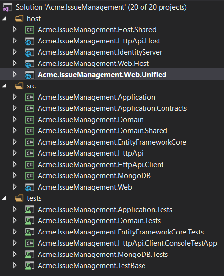
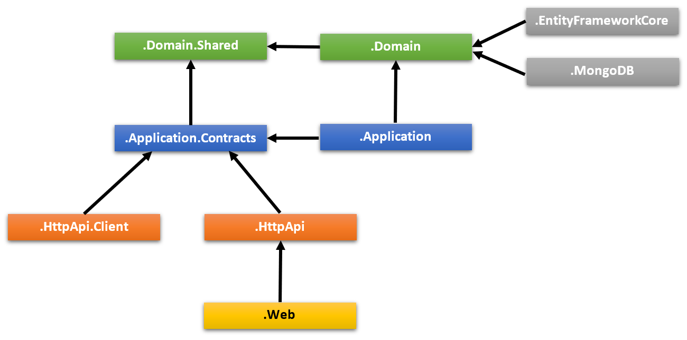

# MVC模块启动模板

可用此模板开发基于[模块开发最佳实践和约定](../Best-Practices/Index.md)的可**复用 [应用程序模块](../Modules/Index.md)** . 它同样适用于开发**微服务**.

## 如何开始?

你可以使用[ABP CLI](../CLI.md)创建基于此启动模板的新项目,或者你也可以在[入门](https://abp.io/get-started)页面创建并下载项目. 在这里我们使用CLI创建新项目.

如果未安装ABP CLI,第一步是安装ABP CLI

````bash
dotnet tool install -g Volo.Abp.Cli
````

然后使用 `abp new` 命令在空文件夹中创建新解决方案:

````bash
abp new Acme.IssueManagement -t module
````

* `Acme.IssueManagement` 是解决方案的名称,  如*YourCompany.YourProduct*. 你可以使用单级或多级名称.

### 无用户界面

默认情况模板附带一个MVC UI,你可以使用`--no-ui`选项指定不包含UI层.

````bash
abp new Acme.IssueManagement -t module --no-ui
````

## 解决方案结构

根据命令的选项,会创建略有不同的解决方案结构. 如果未指定选项,你会得到如下所示的解决方案:



项目组织在`src`和`test`和`host`文件夹中:

* `src` 文件夹包含基于[DDD](../Domain-Driven-Design.md)原则分层的实际模块.
* `test` 文件夹包含单元和集成测试.
* `host` 文件夹包含具有不同配置的应用程序,用于演示在应用程序中如何托管模块. 这些不是模块的一部分,但开发时会很有用.

下图展示了模块的层和项目的依赖关系:



下面介绍解决方案中的项目及依赖关系:

### .Domain.Shared 项目

项目包含常量,枚举和其他对象,这些对象实际上是领域层的一部分,但是解决方案中所有的层/项目中都会使用到.

例如 `IssueType` 枚举和 `IssueConsts` 类 (可能是 `Issue` 实体用到的常数字段,像`MaxTitleLength`)都适合放在这个项目中.

* 该项目不依赖解决方案中的其他项目. 其他项目直接或间接依赖该项目.

### .Domain 项目

解决方案的领域层. 它主要包含 [实体, 集合根](../Entities.md), [领域服务](../Domain-Services.md), 值类型, [仓储接口](../Repositories.md) 和解决方案的其他领域对象.

例如 `Issue` 实体, `IssueManager` 领域服务和 `IIssueRepository` 接口都适合放在这个项目中.

* 它依赖 `.Domain.Shared` 项目,因为项目中会用到它的一些常量,枚举和定义其他对象.

### .Application.Contracts 项目

项目主要包含 [应用服务](../Application-Services.md) **interfaces** 和应用层的 [数据传输对象](../Data-Transfer-Objects.md) (DTO). 它用于分离应用层的接口和实现. 这种方式可以将接口项目做为约定包共享给客户端.

例如 `IIssueAppService` 接口和 `IssueCreationDto` 类都适合放在这个项目中.

* 它依赖 `.Domain.Shared` 因为它可能会在应用接口和DTO中使用常量,枚举和其他的共享对象.

### .Application 项目

项目包含 `.Application.Contracts` 项目的 [应用服务](../Application-Services.md) 接口**实现**.

例如 `IssueAppService` 类适合放在这个项目中.

* 它依赖 `.Application.Contracts` 项目, 因为它需要实现接口与使用DTO.
* 它依赖 `.Domain` 项目,因为它需要使用领域对象(实体,仓储接口等)执行应用程序逻辑.

### .EntityFrameworkCore 项目

这是集成EF Core的项目. 它定义了 `DbContext` 并实现 `.Domain` 项目中定义的仓储接口.

* 它依赖 `.Domain` 项目,因为它需要引用实体和仓储接口.

> 如果不需要使用EF Core,可以删除此项目.

### .MongoDB 项目

这是集成MongoDB的项目.

* 它依赖 `.Domain` 项目,因为它需要引用实体和仓储接口.

> 如果不需要使用MongoDB,可以删除此项目.

#### Test 项目

解决方案有多个测试项目,每一层都会有一个:

* `.Domain.Tests` 用于测试领域层.
* `.Application.Tests` 用于测试应用层.
* `.EntityFrameworkCore.Tests` 用于测试EF Core配置与自定义仓储.
* `.MongoDB.Tests` 用于测试MongoDB配置与自定义仓储.
* `.TestBase` 所有测试项目的基础(共享)项目.

此外,  `.HttpApi.Client.ConsoleTestApp` 是一个控制台应用程序(不是自动化测试项目),它用于演示DotNet应用程序中HTTP API的用法.

测试项目是用于做集成测试的:

* 它完全集成到ABP框架和应用程序的所有服务.
* 如果数据库提供程序是EF Core,测试项目会使用SQLite内存数据库,如果是MongoDB,它使用[Mongo2Go](https://github.com/Mongo2Go/Mongo2Go)库.
* 授权被禁用,任何的应用服务都可以在测试中轻松调用.

你依然可以编写单元测试,只不过它很难写(因为你需要准备mock/fake对象),但它的运行速度更快(因为只测试单个类并跳过所有初始化过程).

> 领域层和应用层测试使用EF Core. 如果你删除了EF Core集成项目或者要使用MongoDB测试这些层,需要手动的修改项目引用和依赖.

### Host 项目

解决方案中有一些宿主应用程序可以在开发时运行模块. 在开发时会很有用. 除了正在开发的模块外,宿主应用程序包括其他模块:

宿主应用程序支持两种类型的场景.

#### 单体 (统一) 应用场景

如果模块含有UI, 那么 `.Web.Unified` 应用程序于在一个站点上托管UI和API. 它有自己的 `appsettings.json` 配置文件(包括数据库连接字符串)和EF Core数据库迁移.

`.Web.Unified` 应用程序有一个名为`YourProjectName_Unified`的数据库(本例中名为 *IssueManagement_Unified*).

> 如果你选择了 `--no-ui` 选项, 这个项目不会出现在你的解决方案中.

##### 如何运行?

将`host/YourProjectName.Web.Unified`设置成启动项, 使用包管理控制台运行 `Update-Database` 命令迁移数据库,然后运行应用程序. 默认用户名: `admin` 密码: `1q2w3E*`.

#### 分离部署&数据库 场景

在这个场景中,有三个应用程序;

* `.IdentityServer` 应用程序是其他应用程序使用的身份验证服务器,它有自己的 `appsettings.json` 包含数据库连接字符串和其他配置.
* `.HttpApi.Host` 托管模块的HTTP API. 它有自己的 `appsettings.json` 包含数据库连接字符串和其他配置.
* `.Web.Host` 托管模块的UI. 它包含 `appsettings.json` 文件, 但是其中没有数据库连接字符串, 因为它不需要连接到数据库, 它主要调用远程API服务器和身份认证服务器.

下图展示了应用程序的关系:


`.Web.Host` 项目使用OpenId Connect身份认证从`.IdentityServer`获取当前用户的身份和访问令牌. 然后使用访问令牌调用 `.HttpApi.Host`. HTTP API 服务器使用bearer token验证访问令牌获取当前用户声明并授权用户.

##### 前置条件

* [Redis](https://redis.io/): 应用程序使用Redis做分布式缓存,你需要安装并运行Redis.

##### 如何运行?

你需要按照以下顺序运行应用程序:

- 首先, 运行 `.IdentityServer`,因为其他应用程序依赖它做身份认证.
- 然后运行 `.HttpApi.Host`,因为`.Web.Host`应用程序使用API接口.
- 最后运行 `.Web.Host` 使用用户名: `admin` 密码: `1q2w3E*` 登录到应用程序.
