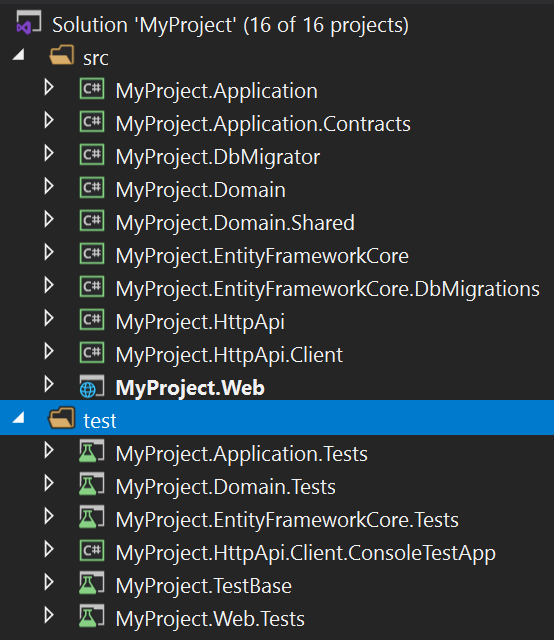
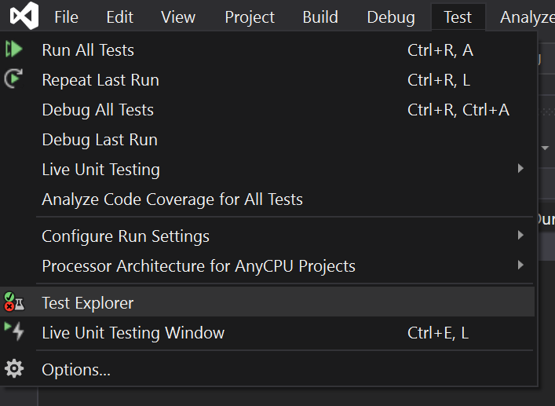
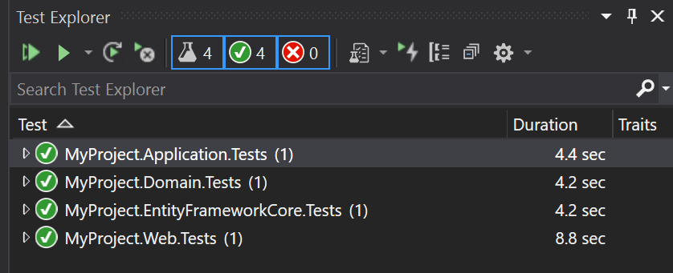
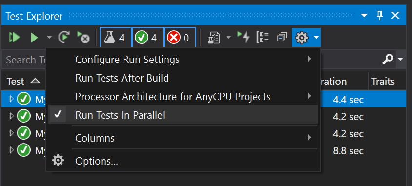
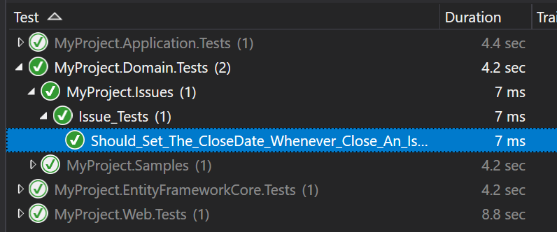

# 自动化测试

## 介绍

ABP框架的设计考虑了可测试性. 有一些不同级别的自动化测试:

* **单元测试**: 通常只测试一个类(或者一起测试几个类). 这些测试会很快. 然而, 你通常需要处理对服务依赖项的模拟.
* **集成测试**: 你通常会测试一个服务, 但这一次你不会模拟基本的基础设施和服务, 以查看它们是否正确地协同工作.
* **用户界面测试**: 测试应用程序的UI, 就像用户与应用程序交互一样.

### 单元测试 vs 集成测试

与单元测试相比, 集成测试有一些显著的**优势**:

* **编写更加简单** 因为你不需要模拟和处理依赖关系.
* 你的测试代码运行于所有真正的服务和基础设施(包括数据库映射和查询), 因此它更接近于**真正的应用程序测试**.

同时它们有一些缺点:

* 与单元测试相比, 它们**更慢**, 因为所有的基础设施都准备好了测试用例.
* 服务中的一个bug可能会导致多个测试用例失败, 因此在某些情况下, 可能会**更难找到真正的问题**.

我们建议混合使用: 在必要的地方编写单元测试或集成测试, 并且有效的编写和维护它.

## 应用程序启动模板

测试基础设施提供[应用程序启动模板](Startup-Templates/Application.md) , 并已经正确安装和配置.

### 测试项目

请参见Visual Studio中的以下解决方案:



按层级系统分为多个测试项目:

* `Domain.Tests` 用于测试领域层对象 (例如[领域服务](Domain-Services.md) 和 [实体](Entities.md)).
* `Application.Tests` 用于测试应用层对象 (例如[应用服务](Application-Services.md)).
* `EntityFrameworkCore.Tests` 用于测试你的自定义仓储实现或EF Core映射(如果你使用其他[数据访问](Data-Access.md))的话, 该项目将有所不同).
* `Web.Tests` 用于测试UI层(如页面、控制器和视图组件). 该项目仅适用于MVC / Razor页面应用程序.
* `TestBase` 包含一些由其他项目共享/使用的类.

> `HttpApi.Client.ConsoleTestApp` 不是自动化测试的应用程序. 它是一个示例的控制台应用程序, 展示了如何从.NET控制台应用程序中调用HTTP API.

以下的部分将介绍这些项目中包含的基类和其他基础设施.

### 测试基础设施

解决方案中已经安装了以下库:

* [xUnit](https://xunit.net/) 作为测试框架.
* [NSubstitute](https://nsubstitute.github.io/) 用于模拟.
* [Shouldly](https://github.com/shouldly/shouldly) 用于断言.

虽然你可以用自己喜欢的工具替换它们, 但本文档和示例将基于这些工具.

## 测试资源管理器

你可以在Visual Studio中使用测试资源管理器查看和运行测试. 其他IDE, 请参阅它们自己的文档.

### 打开测试资源管理器

打开*测试*菜单下的*测试资源管理器*(如果尚未打开):



### 运行测试

然后, 你可以单击在视图中运行所有测试或运行按钮来运行测试. 初始启动模板为你提供了一些测试用例: 



### 并行运行测试

支持并行运行测试. **强烈建议**并行运行所有测试, 这比逐个运行测试要快得多.

要启用它, 请单击设置(齿轮)按钮附近的插入符号图标, 然后选择*并行运行测试*.



## 单元测试

对于单元测试, 不需要太多的配置. 通常会实例化你的类, 并对要测试的对象提供一些预先配置的模拟对象.

### 没有依赖项的类

要测试的类没有依赖项是最简单的情况, 你可以直接实例化类, 调用其方法并做出断言.

#### 示例: 测试实体

假设你有一个 `Issue` [实体](Entities.md), 如下所示:

````csharp
using System;
using Volo.Abp.Domain.Entities;

namespace MyProject.Issues
{
    public class Issue : AggregateRoot<Guid>
    {
        public string Title { get; set; }
        public string Description { get; set; }
        public bool IsLocked { get; set; }
        public bool IsClosed { get; private set; }
        public DateTime? CloseDate { get; private set; }

        public void Close()
        {
            IsClosed = true;
            CloseDate = DateTime.UtcNow;
        }

        public void Open()
        {
            if (!IsClosed)
            {
                return;
            }

            if (IsLocked)
            {
                throw new IssueStateException("You can not open a locked issue!");
            }

            IsClosed = true;
            CloseDate = null;
        }
    }
}

````

请注意, `IsClosed`和`CloseDate`属性具有私有setter, 可以使用`Open()`和`Close()`方法强制执行某些业务逻辑:

* 无论何时关闭issue, `CloseDate`都应设置为[当前时间](Timing.md).
* 如果issue被锁定, 则无法重新打开. 如果它被重新打开, `CloseDate`应该设置为`null`.

由于`Issue`实体是领域层的一部分, 所以我们应该在`Domain.Tests`项目中测试它. 在`Domain.Tests`项目中创建一个`Issue_Tests`类:

````csharp
using Shouldly;
using Xunit;

namespace MyProject.Issues
{
    public class Issue_Tests
    {
        [Fact]
        public void Should_Set_The_CloseDate_Whenever_Close_An_Issue()
        {
            // Arrange

            var issue = new Issue();
            issue.CloseDate.ShouldBeNull(); // null at the beginning

            // Act

            issue.Close();

            // Assert

            issue.IsClosed.ShouldBeTrue();
            issue.CloseDate.ShouldNotBeNull();
        }
    }
}
````

这个测试遵循AAA(Arrange-Act-Assert)模式:

* **Arrange** 部分创建一个`Issue`实体, 并确保`CloseDate`在初始值为`null`.
* **Act** 部分执行我们想要测试的方法.
* **Assert** 部分检查`Issue`属性是否与我们预期的相同.

`[Fact]`属性由[xUnit](https://xunit.net/)并将方法标记为测试方法. `Should...`扩展方法由[Shouldly](https://github.com/shouldly/shouldly)提供. 你可以直接使用xUnit中的`Assert`类, 使用Shouldly让它更舒适、更直观. 

当你执行测试时, 你将看到它成功通过:



让我们再添加两种测试方法:

````csharp
[Fact]
public void Should_Allow_To_ReOpen_An_Issue()
{
    // Arrange

    var issue = new Issue();
    issue.Close();

    // Act

    issue.Open();

    // Assert

    issue.IsClosed.ShouldBeFalse();
    issue.CloseDate.ShouldBeNull();
}

[Fact]
public void Should_Not_Allow_To_ReOpen_A_Locked_Issue()
{
    // Arrange

    var issue = new Issue();
    issue.Close();
    issue.IsLocked = true;

    // Act & Assert

    Assert.Throws<IssueStateException>(() =>
    {
        issue.Open();
    });
}
````

`Assert.Throws` 检查执行的代码是否匹配引发的异常.

> 有关这些库的更多信息, 请参阅xUnit & Shoudly的文档.

### 具有依赖项的类

如果你的服务中有依赖项, 并且你想对该服务进行单元测试, 那么你需要模拟这些依赖项.

#### 示例: 测试领域服务

假设你有一个`IssueManager` [领域服务](Domain-Services.md), 定义如下:

````csharp
using System;
using System.Threading.Tasks;
using Volo.Abp;
using Volo.Abp.Domain.Services;

namespace MyProject.Issues
{
    public class IssueManager : DomainService
    {
        public const int MaxAllowedOpenIssueCountForAUser = 3;

        private readonly IIssueRepository _issueRepository;

        public IssueManager(IIssueRepository issueRepository)
        {
            _issueRepository = issueRepository;
        }

        public async Task AssignToUserAsync(Issue issue, Guid userId)
        {
            var issueCount = await _issueRepository.GetIssueCountOfUserAsync(userId);

            if (issueCount >= MaxAllowedOpenIssueCountForAUser)
            {
                throw new BusinessException(
                    code: "IM:00392",
                    message: $"You can not assign more" +
                             $"than {MaxAllowedOpenIssueCountForAUser} issues to a user!"
                );
            }

            issue.AssignedUserId = userId;
        }
    }
}
````

`IssueManager`依赖于`IssueRepository`服务, 在本例中将模拟该服务.

**业务逻辑**: 示例`AssignToUserAsync`不允许向用户分配超过3个issue (`MaxAllowedOpenIssueCountForAUser`常量). 在这种情况下, 如果要分配issue, 首先需要取消现有issue的分配.

下面的测试用例给出一个有效的赋值:

````csharp
using System;
using System.Threading.Tasks;
using NSubstitute;
using Shouldly;
using Volo.Abp;
using Xunit;

namespace MyProject.Issues
{
    public class IssueManager_Tests
    {
        [Fact]
        public async Task Should_Assign_An_Issue_To_A_User()
        {
            // Arrange

            var userId = Guid.NewGuid();

            var fakeRepo = Substitute.For<IIssueRepository>();
            fakeRepo.GetIssueCountOfUserAsync(userId).Returns(1);

            var issueManager = new IssueManager(fakeRepo);

            var issue = new Issue();

            // Act

            await issueManager.AssignToUserAsync(issue, userId);

            //Assert

            issue.AssignedUserId.ShouldBe(userId);
            await fakeRepo.Received(1).GetIssueCountOfUserAsync(userId);
        }
    }
}
````

* `Substitute.For<IIssueRepository>` 创建一个模拟(假)对象, 该对象被传递到`IssueManager`构造函数中.
* `fakeRepo.GetIssueCountOfUserAsync(userId).Returns(1)` 确保仓储中的`GetIssueContofuseRasync`方法返回`1`.
* `issueManager.AssignToUserAsync` 不会引发任何异常, 因为仓储统计当前分配的issue数量并且返回`1`.
* `issue.AssignedUserId.ShouldBe(userId);` 行检查`AssignedUserId`的值是否正确.
* `await fakeRepo.Received(1).GetIssueCountOfUserAsync(userId);` 检查 `IssueManager` 实际只调用了 `GetIssueCountOfUserAsync` 方法一次.

让我们添加第二个测试, 看看它是否能阻止将issue分配给超过分配数量的用户:

````csharp
[Fact]
public async Task Should_Not_Allow_To_Assign_Issues_Over_The_Limit()
{
    // Arrange

    var userId = Guid.NewGuid();

    var fakeRepo = Substitute.For<IIssueRepository>();
    fakeRepo
        .GetIssueCountOfUserAsync(userId)
        .Returns(IssueManager.MaxAllowedOpenIssueCountForAUser);

    var issueManager = new IssueManager(fakeRepo);

    // Act & Assert

    var issue = new Issue();

    await Assert.ThrowsAsync<BusinessException>(async () =>
    {
        await issueManager.AssignToUserAsync(issue, userId);
    });

    issue.AssignedUserId.ShouldBeNull();
    await fakeRepo.Received(1).GetIssueCountOfUserAsync(userId);
}
````

> 有关模拟的更多信息, 请参阅[NSubstitute](https://nsubstitute.github.io/)文档.

模拟单个依赖项相对容易. 但是, 当依赖关系增长时, 设置测试对象和模拟所有依赖关系变得越来越困难. 请参阅不需要模拟依赖项的*Integration Tests*部分.

### 提示: 共享测试类构造函数

[xUnit](https://xunit.net/) 为每个测试方法创建一个**新测试类实例**(本例中为`IssueManager_Tests`). 因此, 你可以将一些*Arrange*代码移动到构造函数中, 以减少代码重复. 构造函数将针对每个测试用例执行, 并且不会相互影响, 即使它们是并行工作.

**示例: 重构`IssueManager_Tests`以减少代码重复**

````csharp
using System;
using System.Threading.Tasks;
using NSubstitute;
using Shouldly;
using Volo.Abp;
using Xunit;

namespace MyProject.Issues
{
    public class IssueManager_Tests
    {
        private readonly Guid _userId;
        private readonly IIssueRepository _fakeRepo;
        private readonly IssueManager _issueManager;
        private readonly Issue _issue;

        public IssueManager_Tests()
        {
            _userId = Guid.NewGuid();
            _fakeRepo = Substitute.For<IIssueRepository>();
            _issueManager = new IssueManager(_fakeRepo);
            _issue = new Issue();
        }

        [Fact]
        public async Task Should_Assign_An_Issue_To_A_User()
        {
            // Arrange            
            _fakeRepo.GetIssueCountOfUserAsync(_userId).Returns(1);

            // Act
            await _issueManager.AssignToUserAsync(_issue, _userId);

            //Assert
            _issue.AssignedUserId.ShouldBe(_userId);
            await _fakeRepo.Received(1).GetIssueCountOfUserAsync(_userId);
        }

        [Fact]
        public async Task Should_Not_Allow_To_Assign_Issues_Over_The_Limit()
        {
            // Arrange
            _fakeRepo
                .GetIssueCountOfUserAsync(_userId)
                .Returns(IssueManager.MaxAllowedOpenIssueCountForAUser);

            // Act & Assert
            await Assert.ThrowsAsync<BusinessException>(async () =>
            {
                await _issueManager.AssignToUserAsync(_issue, _userId);
            });

            _issue.AssignedUserId.ShouldBeNull();
            await _fakeRepo.Received(1).GetIssueCountOfUserAsync(_userId);
        }
    }
}
````

> 保持测试代码整洁, 以创建可维护的测试组件.

## 集成测试

> 你还可以按照[Web应用程序开发教程](Tutorials/Part-1.md)学习开发全栈应用程序, 包括集成测试.

### 集成测试基础

ABP为编写集成测试提供了完整的基础设施. 所有ABP基础设施和服务都将在你的测试中执行. 应用程序启动模板附带了为你预先配置的必要基础设施;

#### 数据库

启动模板使用EF Core配置**内存中的SQLite**数据库(对于MongoDB, 它使用[Mongo2Go](https://github.com/Mongo2Go/Mongo2Go)). 因此, 所有配置和查询都是针对真实数据库执行的, 你甚至可以测试数据库事务.

使用内存中的SQLite数据库有两个主要优点:

* 它比外部DBMS更快.
* 它会为每个测试用例创建一个**新的数据库**, 这样测试就不会相互影响.

> **提示**: 不要将EF Core的内存数据库用于高级集成测试. 它不是一个真正的DBMS, 在细节上有很多不同. 例如, 它不支持事务和回滚场景, 因此无法真正测试失败的场景. 另一方面, 内存中的SQLite是一个真正的DBMS, 支持SQL数据库的基本功能.

### 种子数据

针对空数据库编写测试是不现实的. 在大多数情况下, 需要在数据库中保存一些初始数据. 例如, 如果你编写了一个查询、更新和删除产品的测试类, 那么在执行测试用例之前, 在数据库中有一些产品数据会很有帮助.

ABP的[种子数据](Data-Seeding.md)系统是一种强大的初始化数据的方法. 应用程序启动模板在`.TestBase`项目中有一个*YourProject*TestDataSeedContributor类. 你可以在其中添加, 以获得可用于每个测试方法的初始数据.

**示例: 创建一些Issue作为种子数据**

````csharp
using System.Threading.Tasks;
using MyProject.Issues;
using Volo.Abp.Data;
using Volo.Abp.DependencyInjection;

namespace MyProject
{
    public class MyProjectTestDataSeedContributor
        : IDataSeedContributor, ITransientDependency
    {
        private readonly IIssueRepository _issueRepository;

        public MyProjectTestDataSeedContributor(IIssueRepository issueRepository)
        {
            _issueRepository = issueRepository;
        }

        public async Task SeedAsync(DataSeedContext context)
        {
            await _issueRepository.InsertAsync(
                new Issue
                {
                    Title = "Test issue one",
                    Description = "Test issue one description",
                    AssignedUserId = TestData.User1Id
                });

            await _issueRepository.InsertAsync(
                new Issue
                {
                    Title = "Test issue two",
                    Description = "Test issue two description",
                    AssignedUserId = TestData.User1Id
                });

            await _issueRepository.InsertAsync(
                new Issue
                {
                    Title = "Test issue three",
                    Description = "Test issue three description",
                    AssignedUserId = TestData.User1Id
                });

            await _issueRepository.InsertAsync(
                new Issue
                {
                    Title = "Test issue four",
                    Description = "Test issue four description",
                    AssignedUserId = TestData.User2Id
                });
        }
    }
}
````

还创建了一个静态类来存储用户的 `Id`:

````csharp
using System;

namespace MyProject
{
    public static class TestData
    {
        public static Guid User1Id = Guid.Parse("41951813-5CF9-4204-8B18-CD765DBCBC9B");
        public static Guid User2Id = Guid.Parse("2DAB4460-C21B-4925-BF41-A52750A9B999");
    }
}
````

通过这种方式, 我们可以使用这些已知Issue和用户的`Id`来运行测试.

### 示例: 测试领域服务

`AbpIntegratedTest<T>`类 (定义在[Volo.Abp.TestBase](https://www.nuget.org/packages/Volo.Abp.TestBase)) 用于编写集成到ABP框架的测试. `T`是用于设置和初始化应用程序的根模块的类型.

应用程序启动模板在每个测试项目中都有基类, 因此你可以从这些基类派生, 以使其更简单.

`IssueManager`测试将被重写成集成测试

````csharp
using System.Threading.Tasks;
using Shouldly;
using Volo.Abp;
using Xunit;

namespace MyProject.Issues
{
    public class IssueManager_Integration_Tests : MyProjectDomainTestBase
    {
        private readonly IssueManager _issueManager;
        private readonly Issue _issue;

        public IssueManager_Integration_Tests()
        {
            _issueManager = GetRequiredService<IssueManager>();
            _issue = new Issue
            {
                Title = "Test title",
                Description = "Test description"
            };
        }

        [Fact]
        public async Task Should_Not_Allow_To_Assign_Issues_Over_The_Limit()
        {
            // Act & Assert
            await Assert.ThrowsAsync<BusinessException>(async () =>
            {
                await _issueManager.AssignToUserAsync(_issue, TestData.User1Id);
            });

            _issue.AssignedUserId.ShouldBeNull();
        }
        
        [Fact]
        public async Task Should_Assign_An_Issue_To_A_User()
        {
            // Act
            await _issueManager.AssignToUserAsync(_issue, TestData.User2Id);

            //Assert
            _issue.AssignedUserId.ShouldBe(TestData.User2Id);
        }
    }
}
````

* 第一个测试方法将issue分配给User1, 其中User1已经分配了种子数据代码中的3个issue. 因此, 它抛出了一个`BusinessException`.
* 第二种测试方法将issue分配给User2, User2只分配了一个issue. 因此, 该方法成功了.

这个类通常位于`.Domain.Tests`项目中, 因为它测试位于`.Domain`项目中的类. 它派生自`MyProjectDomainTestBase`, 并已经为正确运行测试进行了配置.

编写这样一个集成测试类非常简单. 另一个好处是, 在以后向`IssueManager`类添加另一个依赖项时, 不需要更改测试类.

### 示例: 测试应用服务

测试[应用服务](Application-Services.md)并没有太大的不同. 假设你已经创建了一个`IssueAppService`, 定义如下:

````csharp
using System.Collections.Generic;
using System.Threading.Tasks;
using Volo.Abp.Application.Services;

namespace MyProject.Issues
{
    public class IssueAppService : ApplicationService, IIssueAppService
    {
        private readonly IIssueRepository _issueRepository;

        public IssueAppService(IIssueRepository issueRepository)
        {
            _issueRepository = issueRepository;
        }

        public async Task<List<IssueDto>> GetListAsync()
        {
            var issues = await _issueRepository.GetListAsync();

            return ObjectMapper.Map<List<Issue>, List<IssueDto>>(issues);
        }
    }
}
````

*(假设你还定义了`IIssueAppService`和`IssueDto`, 并在`Issue`和`IssueDto`之间创建了[对象映射](Object-To-Object-Mapping.md))*

现在, 你可以在`.Application.Tests`项目中编写一个测试类:

````csharp
using System.Threading.Tasks;
using Shouldly;
using Xunit;

namespace MyProject.Issues
{
    public class IssueAppService_Tests : MyProjectApplicationTestBase
    {
        private readonly IIssueAppService _issueAppService;

        public IssueAppService_Tests()
        {
            _issueAppService = GetRequiredService<IIssueAppService>();
        }

        [Fact]
        public async Task Should_Get_All_Issues()
        {
            //Act
            var issueDtos = await _issueAppService.GetListAsync();

            //Assert
            issueDtos.Count.ShouldBeGreaterThan(0);
        }
    }
}
````

就这么简单. 此测试方法测试的所有内容, 包括应用服务、EF Core映射、对象到对象映射和仓储实现. 通过这种方式, 你可以完全测试解决方案的应用层和领域层.

### 处理集成测试中的工作单元

ABP的[工作单元](Unit-Of-Work.md)系统控制应用程序中的数据库连接和事务管理. 它可以在你编写应用程序代码时无缝工作, 因此你可能没有意识到它.

在ABP框架中, 所有数据库操作都必须在一个工作单元作用域内执行. 当你测试[应用服务](Application-Services.md)方法时, 工作单元的作用域将是应用服务方法的作用域. 如果你正在测试[仓储](Repositories.md)方法, 那么工作单元作用域将是你的仓储方法的作用域.

在某些情况下, 你可能需要手动控制工作单元作用域. 可以考虑下面的测试方法:

````csharp
public class IssueRepository_Tests : MyProjectDomainTestBase
{
    private readonly IRepository<Issue, Guid> _issueRepository;

    public IssueRepository_Tests()
    {
        _issueRepository = GetRequiredService<IRepository<Issue, Guid>>();
    }

    public async Task Should_Query_By_Title()
    {
        IQueryable<Issue> queryable = await _issueRepository.GetQueryableAsync();
        var issue = queryable.FirstOrDefaultAsync(i => i.Title == "My issue title");
        issue.ShouldNotBeNull();
    }
}
````

我们正在使用`_issueRepository.GetQueryableAsync`获取`IQueryable<Issue>` 对象. 然后, 我们使用`FirstOrDefaultAsync`方法按标题查询issue. 此时执行数据库查询, 你将会得到一个异常, 表明没有起作用的工作单元.

要使该测试正常工作, 你应该手动启动工作单元作用域, 如下所示:

````csharp
public class IssueRepository_Tests : MyProjectDomainTestBase
{
    private readonly IRepository<Issue, Guid> _issueRepository;
    private readonly IUnitOfWorkManager _unitOfWorkManager;

    public IssueRepository_Tests()
    {
        _issueRepository = GetRequiredService<IRepository<Issue, Guid>>();
        _unitOfWorkManager = GetRequiredService<IUnitOfWorkManager>();
    }

    public async Task Should_Query_By_Title()
    {
        using (var uow = _unitOfWorkManager.Begin())
        {
            IQueryable<Issue> queryable = await _issueRepository.GetQueryableAsync();
            var issue = queryable.FirstOrDefaultAsync(i => i.Title == "My issue title");
            issue.ShouldNotBeNull();
            await uow.CompleteAsync();
        }
    }
}
````

我们已经使用了`IUnitOfWorkManager`服务来创建一个工作单元作用域, 然后在该作用域内调用了`FirstOrDefaultAsync`方法, 所以不再有问题了.

> 请注意, 我们测试了`FirstOrDefaultAsync`来演示工作单元的问题. 作为一个好的标准, 编写自己的代码.

### 使用DbContext

在某些情况下, 你可能希望使用Entity Framework的`DbContext`对象来执行测试方法中的数据库操作. 在这种情况下, 可以使用`IDbContextProvider<T>`服务在工作单元内获取`DbContext`实例.

下面的示例展示了如何在测试方法中创建`DbContext`对象:

````csharp
public class MyDbContext_Tests : MyProjectDomainTestBase
{
    private readonly IDbContextProvider<MyProjectDbContext> _dbContextProvider;
    private readonly IUnitOfWorkManager _unitOfWorkManager;

    public IssueRepository_Tests()
    {
        _dbContextProvider = GetRequiredService<IDbContextProvider<MyProjectDbContext>>();
        _unitOfWorkManager = GetRequiredService<IUnitOfWorkManager>();
    }

    public async Task Should_Query_By_Title()
    {
        using (var uow = _unitOfWorkManager.Begin())
        {
            var dbContext = await _dbContextProvider.GetDbContextAsync();
            var issue = await dbContext.Issues.FirstOrDefaultAsync(i => i.Title == "My issue title");
            issue.ShouldNotBeNull();
            await uow.CompleteAsync();
        }
    }
}
````

就像我们在*集成测试中处理工作单元*一节中所做的那样, 我们应该在起作用的工作单元内执行`DbContext`操作.

对于[MongoDB](MongoDB.md), 你可以使用`IMongoDbContextProvider<T>`服务获取`DbContext`对象, 并在测试方法中直接使用MongoDB APIs.

## 用户界面测试

一般来说, 有两种类型的UI测试:

### 非可视化测试

此类测试完全取决于UI框架的选择:

* 对于MVC / Razor页面UI, 通常向服务器发出请求, 获取HTML, 并测试返回的结果中是否存在一些预期的DOM元素.
* Angular有自己的基础设施和实践来测试组件、视图和服务.

请参阅以下文档以了解非可视化UI测试:

* [Testing in ASP.NET Core MVC / Razor Pages](UI/AspNetCore/Testing.md)
* [Testing in Angular](UI/Angular/Testing.md)
* [Testing in Blazor](UI/Blazor/Testing.md)

### 可视化测试

与真实用户一样, 可视化测试用于与应用程序UI交互. 它全面测试应用程序, 包括页面和组件的外观.

可视化UI测试超出了ABP框架的范围. 行业中有很多工具(比如[Selenium](https://www.selenium.dev/))可以用来测试应用程序的UI.
