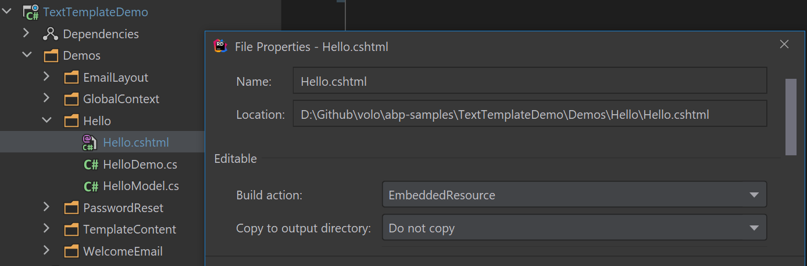
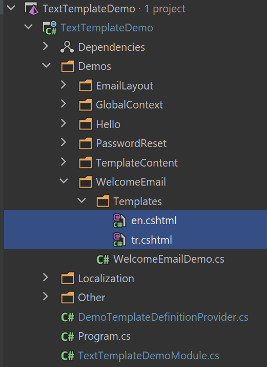
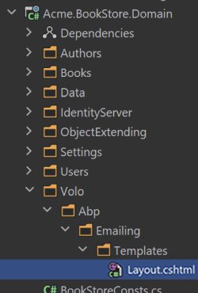

# Razor 集成

Razor模板是标准的C#类, 所以你可以使用任何C#的功能, 例如`依赖注入`, 使用`LINQ`, 自定义方法甚至使用`仓储`

## 安装

建议使用[ABP CLI](CLI.md)安装此包．

### 使用ABP CLI

在项目文件夹(.csproj 文件)中打开命令行窗口并输入以下命令:

````bash
abp add-package Volo.Abp.TextTemplating.Razor
````

### 手动安装

如果你想要手动安装:

1. 添加 [Volo.Abp.TextTemplating.Razor](https://www.nuget.org/packages/Volo.Abp.TextTemplating.Razor) NuGet 包到你的项目:

````
Install-Package Volo.Abp.TextTemplating.Razor
````

2.添加 `AbpTextTemplatingRazorModule` 到你的模块的依赖列表:

````csharp
[DependsOn(
    //...other dependencies
    typeof(AbpTextTemplatingRazorModule) //Add the new module dependency
    )]
public class YourModule : AbpModule
{
}
````

## 添加 MetadataReference到CSharpCompilerOptions

你需要将添加`MetadataReference`模板中使用的类型添加到 `CSharpCompilerOptions` 的 `References`.

```csharp
public override void ConfigureServices(ServiceConfigurationContext context)
{
    Configure<AbpRazorTemplateCSharpCompilerOptions>(options =>
    {
        options.References.Add(MetadataReference.CreateFromFile(typeof(YourModule).Assembly.Location));
    });
}
```

## 添加MetadataReference到模板

你可以添加一些`MetadataReference`到模板

```csharp
public override void ConfigureServices(ServiceConfigurationContext context)
{
    services.Configure<AbpCompiledViewProviderOptions>(options =>
    {
        //Hello is template name.
        options.TemplateReferences.Add("Hello", new List<Assembly>()
            {
                Assembly.Load("Microsoft.Extensions.Logging.Abstractions"),
                Assembly.Load("Microsoft.Extensions.Logging")
            }
            .Select(x => MetadataReference.CreateFromFile(x.Location))
            .ToList());
    });
}
```

## 定义模板

在渲染模板之前,需要定义它. 创建一个继承自 `TemplateDefinitionProvider` 的类:

````csharp
public class DemoTemplateDefinitionProvider : TemplateDefinitionProvider
{
    public override void Define(ITemplateDefinitionContext context)
    {
        context.Add(
            new TemplateDefinition("Hello") //template name: "Hello"
                .WithRazorEngine()
                .WithVirtualFilePath(
                    "/Demos/Hello/Hello.cshtml", //template content path
                    isInlineLocalized: true
                )
        );
    }
}
````

* `context` 对象用于添加新模板或获取依赖模块定义的模板. 使用 `context.Add(...)` 定义新模板.
* `TemplateDefinition` 是代表模板的类,每个模板必须有唯一的名称(在渲染模板时使用).
* `/Demos/Hello/Hello.cshtml` 是模板文件的路径.
* `isInlineLocalized` 声明针对所有语言使用一个模板(`true` 还是针对每种语言使用不同的模板(`false`). 更多内容参阅下面的本地化部分.
* `WithRenderEngine` 方法为模板设置渲染引擎.

### 模板基类

每个 `cshtml` 模板页面都需要继承`RazorTemplatePageBase` 或 `RazorTemplatePageBase<Model>`. 基类提供了一些使用实用的属性可以在模板中使用. 例如: `Localizer`, `ServiceProvider`.

### 模板内容

`WithVirtualFilePath` 表示我们使用[虚拟文件系统](Virtual-File-System.md)存储模板内容. 在项目内创建一个 `Hello.cshtml` 文件,并在属性窗口中将其标记为"**嵌入式资源**":



示例 `Hello.cshtml` 内容如下所示:

```csharp
namespace HelloModelNamespace
{
    public class HelloModel
    {
        public string Name { get; set; }
    }
}
```

[虚拟文件系统](Virtual-File-System.md) 需要在[模块](Module-Development-Basics.md)类的 `ConfigureServices` 方法添加你的文件:

````csharp
Configure<AbpVirtualFileSystemOptions>(options =>
{
    options.FileSets.AddEmbedded<TextTemplateDemoModule>("TextTemplateDemo");
});
````

* `TextTemplateDemoModule`是模块类.
* `TextTemplateDemo` 是你的项目的根命名空间.

## 渲染模板

`ITemplateRenderer` 服务用于渲染模板内容.

### 示例: 渲染一个简单的模板

````csharp
public class HelloDemo : ITransientDependency
{
    private readonly ITemplateRenderer _templateRenderer;

    public HelloDemo(ITemplateRenderer templateRenderer)
    {
        _templateRenderer = templateRenderer;
    }

    public async Task RunAsync()
    {
        var result = await _templateRenderer.RenderAsync(
            "Hello", //the template name
            new HelloModel
            {
                Name = "John"
            }
        );

        Console.WriteLine(result);
    }
}
````

* `HelloDemo` 是一个简单的类,在构造函数注入了 `ITemplateRenderer` 并在 `RunAsync` 方法中使用它.
* `RenderAsync` 有两个基本参数:
  * `templateName`: 要渲染的模板名称 (本示例中是 `Hello`).
  * `model`: 在模板内部用做 `model` 的对象 (本示例中是 `HelloModel` 对象).

示例会返回以下结果:

````csharp
Hello John :)
````

## 本地化

可以基于当前文化对模板内容进行本地化. 以下部分描述了两种类型的本地化选项.

### 内联本地化

内联本地化使用[本地化系统](Localization.md)本地化模板内的文本.

#### 示例: 重置密码链接

假设你需要向用户发送电子邮件重置密码. 模板内容:

```csharp
namespace ResetMyPasswordModelNamespace
{
    public class ResetMyPasswordModel
    {
        public string Link { get; set; }

        public string Name { get; set; }
    }
}
```

```csharp
@inherits Volo.Abp.TextTemplating.Razor.RazorTemplatePageBase<ResetMyPasswordModelNamespace.ResetMyPasswordModel>
<a title="@Localizer["ResetMyPasswordTitle"]" href="@Model.Link">@Localizer["ResetMyPassword", Model.Name]</a>
```

`Localizer` 函数用于根据当前用户的文化来定位给定的Key,你需要在本地化文件中定义 `ResetMyPassword` 键:

````json
"ResetMyPasswordTitle": "Reset my password",
"ResetMyPassword": "Hi {0}, Click here to reset your password"
````

你还需要在模板定义提供程序类中声明要与此模板一起使用的本地化资源:

````csharp
context.Add(
    new TemplateDefinition(
            "PasswordReset", //Template name
            typeof(DemoResource) //LOCALIZATION RESOURCE
        )
        .WithRazorEngine()
        .WithVirtualFilePath(
            "/Demos/PasswordReset/PasswordReset.cshtml", //template content path
            isInlineLocalized: true
        )
);
````

当你这样渲染模板时:

````csharp
var result = await _templateRenderer.RenderAsync(
    "PasswordReset", //the template name
    new PasswordResetModel
    {
        Name = "john",
        Link = "https://abp.io/example-link?userId=123&token=ABC"
    }
);
````

你可以看到以下本地化结果:

````csharp
<a title="Reset my password" href="https://abp.io/example-link?userId=123&token=ABC">Hi john, Click here to reset your password</a>
````

> 如果你为应用程序定义了 [默认本地化资源](Localization.md), 则无需声明模板定义的资源类型.

### 多个内容本地化

你可能希望为每种语言创建不同的模板文件,而不是使用本地化系统本地化单个模板. 如果模板对于特定的文化(而不是简单的文本本地化)应该是完全不同的,则可能需要使用它.

#### 示例: 欢迎电子邮件模板

假设你要发送电子邮件欢迎用户,但要定义基于用户的文化完全不同的模板.

首先创建一个文件夹,将模板放在里面，像 `en.cshtml`, `tr.cshtml` 每一个你支持的文化:



然后在模板定义提供程序类中添加模板定义:

````csharp
context.Add(
    new TemplateDefinition(
            name: "WelcomeEmail",
            defaultCultureName: "en"
        )
        .WithRazorEngine()
        .WithVirtualFilePath(
            "/Demos/WelcomeEmail/Templates", //template content folder
            isInlineLocalized: false
        )
);
````

* 设置 **默认文化名称**, 当没有所需的文化模板,回退到缺省文化.
* 指定 **模板文件夹** 而不是单个模板文件.
* 设置 `isInlineLocalized` 为 `false`.

就这些,你可以渲染当前文化的模板:

````csharp
var result = await _templateRenderer.RenderAsync("WelcomeEmail");
````

> 为了简单我们跳过了模型,但是你可以使用前面所述的模型.

### 指定文化

`ITemplateRenderer` 服务如果没有指定则使用当前文化 (`CultureInfo.CurrentUICulture`). 如果你需要你可以使用 `cultureName` 参数指定文化.

````csharp
var result = await _templateRenderer.RenderAsync(
    "WelcomeEmail",
    cultureName: "en"
);
````

## 布局模板

布局模板用于在其他模板之间创建共享布局. 它类似于ASP.NET Core MVC / Razor Pages中的布局系统.

### 示例: 邮件HTML布局模板

例如,你想为所有电子邮件模板创建一个布局.

首先像之前一样创建一个模板文件:

```csharp
@inherits Volo.Abp.TextTemplating.Razor.RazorTemplatePageBase
<!DOCTYPE html>
<html lang="en" xmlns="http://www.w3.org/1999/xhtml">
<head>
    <meta charset="utf-8" />
</head>
<body>
    @Body
</body>
</html>
```

* 布局模板必须具有 **Body** 部分作为渲染的子内容的占位符.

在模板定义提供程序中注册模板:

````csharp
context.Add(
    new TemplateDefinition(
        "EmailLayout",
        isLayout: true //SET isLayout!
    )
    .WithRazorEngine()
    .WithVirtualFilePath(
        "/Demos/EmailLayout/EmailLayout.cshtml",
        isInlineLocalized: true
    )
);
````

现在你可以将此模板用作任何其他模板的布局:

````csharp
context.Add(
    new TemplateDefinition(
            name: "WelcomeEmail",
            defaultCultureName: "en",
            layout: "EmailLayout" //Set the LAYOUT
        )
        .WithRazorEngine()
        .WithVirtualFilePath(
            "/Demos/WelcomeEmail/Templates",
            isInlineLocalized: false
        )
);
````

## 全局上下文

ABP传递 `model`,可用于访问模板内的模型. 如果需要,可以传递更多的全局变量.

示例模板内容:

````csharp
@inherits Volo.Abp.TextTemplating.Razor.RazorTemplatePageBase
A global object value: @GlobalContext["myGlobalObject"]
````

模板假定它渲染上下文中的 `myGlobalObject` 对象. 你可以如下所示提供它:

````csharp
var result = await _templateRenderer.RenderAsync(
    "GlobalContextUsage",
    globalContext: new Dictionary<string, object>
    {
        {"myGlobalObject", "TEST VALUE"}
    }
);
````

渲染的结果将是:

````
A global object value: TEST VALUE
````

## 替换存在的模板

通过替换应用程序中使用的模块定义的模板. 这样你可以根据自己的需求自定义模板,而无需更改模块代码.

### 选项-1: 使用虚拟文件系统

[虚拟文件系统](Virtual-File-System.md)允许你通过将相同文件放入项目中的相同路径来覆盖任何文件.

#### 示例: 替换标准电子邮件布局模板

ABP框架提供了一个[邮件发送系统](Emailing.md), 它在内部使用文本模板来渲染邮件内容. 它在 `/Volo/Abp/Emailing/Templates/Layout.cshtml` 路径定义了一个标准邮件布局模板. 模板的唯一名称是 `Abp.StandardEmailTemplates.Layout` 并且这个字符中`Volo.Abp.Emailing.Templates.StandardEmailTemplates`静态类上定义为常量.

执行以下步骤将替换模板替换成你自定义的;

**1)** 在你的项目中相同的路径添加一个新文件 (`/Volo/Abp/Emailing/Templates/Layout.cshtml`):



**2)** 准备你的邮件布局模板:

````html
@inherits Volo.Abp.TextTemplating.Razor.RazorTemplatePageBase
<!DOCTYPE html>
<html lang="en" xmlns="http://www.w3.org/1999/xhtml">
<head>
    <meta charset="utf-8" />
</head>
<body>
    <h1>This my header</h1>

    @Body

    <footer>
      This is my footer...
    </footer>
</body>
</html>
````

此示例只是向模板添加页眉和页脚并呈现它们之间的内容(请参阅上面的布局模板部分).


**3)** 在`.csproj`文件配置嵌入式资源e

* 添加 [Microsoft.Extensions.FileProviders.Embedded](https://www.nuget.org/packages/Microsoft.Extensions.FileProviders.Embedded) NuGet 包到你的项目.
* 在  `.csproj` 中添加 `<GenerateEmbeddedFilesManifest>true</GenerateEmbeddedFilesManifest>` 到 `<PropertyGroup>...</PropertyGroup>` 部分.
* 添加以下代码到你的 `.csproj` 文件:

````xml
<ItemGroup>
  <None Remove="Volo\Abp\Emailing\Templates\*.cshtml" />
  <EmbeddedResource Include="Volo\Abp\Emailing\Templates\*.cshtml" />
</ItemGroup>
````

这将模板文件做为"嵌入式资源".

**4)** 配置虚拟文件系统

在[模块](Module-Development-Basics.md)  `ConfigureServices` 方法配置 `AbpVirtualFileSystemOptions` 将嵌入的文件添加到虚拟文件系统中:

```csharp
Configure<AbpVirtualFileSystemOptions>(options =>
{
    options.FileSets.AddEmbedded<BookStoreDomainModule>();
});
```

`BookStoreDomainModule` 应该是你的模块名称

> 确保你的模块(支持或间接)[依赖](Module-Development-Basics.md) `AbpEmailingModule`. 因为VFS可以基于依赖顺序覆盖文件.

现在渲染邮件布局模板时会使用你的模板.

### 选项-2: 使用模板定义提供者

你可以创建一个模板定义提供者类来获取邮件布局模板来更改它的虚拟文件路径.

**示例: 使用 `/MyTemplates/EmailLayout.cshtml` 文件而不是标准模板**

```csharp
using Volo.Abp.DependencyInjection;
using Volo.Abp.Emailing.Templates;
using Volo.Abp.TextTemplating;

namespace MyProject
{
    public class MyTemplateDefinitionProvider
        : TemplateDefinitionProvider, ITransientDependency
    {
        public override void Define(ITemplateDefinitionContext context)
        {
            var emailLayoutTemplate = context.GetOrNull(StandardEmailTemplates.Layout);

            emailLayoutTemplate
                .WithVirtualFilePath(
                    "/MyTemplates/EmailLayout.cshtml",
                    isInlineLocalized: true
                );
        }
    }
}
```

你依然应该添加 `/MyTemplates/EmailLayout.cshtml` 到虚拟文件系统. 这种方法允许你在任何文件夹中找到模板,而不是在依赖模块定义的文件夹中.

除了模板内容之外你还可以操作模板定义属性, 例如`DisplayName`, `Layout`或`LocalizationSource`.

## 高级功能

本节介绍文本模板系统的一些内部知识和高级用法.

### 模板内容Provider

`TemplateRenderer` 用于渲染模板,这是大多数情况下所需的模板. 但是你可以使用 `ITemplateContentProvider` 获取原始(未渲染的)模板内容.

> `ITemplateRenderer` 内部使用 `ITemplateContentProvider` 获取原始模板内容.

示例:

````csharp
public class TemplateContentDemo : ITransientDependency
{
    private readonly ITemplateContentProvider _templateContentProvider;

    public TemplateContentDemo(ITemplateContentProvider templateContentProvider)
    {
        _templateContentProvider = templateContentProvider;
    }

    public async Task RunAsync()
    {
        var result = await _templateContentProvider
            .GetContentOrNullAsync("Hello");

        Console.WriteLine(result);
    }
}
````

结果是原始模板内容:

````
@inherits Volo.Abp.TextTemplating.Razor.RazorTemplatePageBase<HelloModelNamespace.HelloModel>
Hello @Model.Name
````

* `GetContentOrNullAsync` 如果没有为请求的模板定义任何内容,则返回 `null`.
* 它可以获取 `cultureName` 参数,如果模板针对不同的文化具有不同的文件,则可以使用该参数(请参见上面的"多内容本地化"部分).

### 模板内容贡献者

`ITemplateContentProvider` 服务使用 `ITemplateContentContributor` 实现来查找模板内容. 有一个预实现的内容贡献者 `VirtualFileTemplateContentContributor`,它从上面描述的虚拟文件系统中获取模板内容.

你可以实现 `ITemplateContentContributor` 从另一个源读取原始模板内容.

示例:

````csharp
public class MyTemplateContentProvider
    : ITemplateContentContributor, ITransientDependency
{
    public async Task<string> GetOrNullAsync(TemplateContentContributorContext context)
    {
        var templateName = context.TemplateDefinition.Name;

        //TODO: Try to find content from another source
        return null;
    }
}
````

如果源无法找到内容, 则返回 `null`, `ITemplateContentProvider` 将回退到下一个贡献者.

### Template Definition Manager

`ITemplateDefinitionManager` 服务可用于获取模板定义(由模板定义提供程序创建).

## 另请参阅

* 本文开发和引用的[应用程序示例源码](https://github.com/abpframework/abp-samples/tree/master/TextTemplateDemo).
* [本地化系统](Localization.md).
* [虚拟文件系统](Virtual-File-System.md).