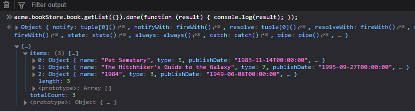
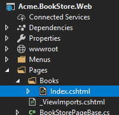
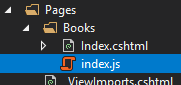

## ASP.NET Core MVC 介绍 - 第一章

### 关于本教程

在本系列教程中, 你将构建一个用于管理书籍及其作者列表的应用程序. **Entity Framework Core**(EF Core)将用作ORM提供者,因为它是默认数据库提供者.

这是本教程所有章节中的第一章,下面是所有的章节:

- **Part I: 创建项目和书籍列表页面(本章)**
- [Part II: 创建,编辑,删除书籍](Part-II.md)
- [Part III: 集成测试](Part-III.md)

你可以从[GitHub存储库](https://github.com/abpframework/abp/tree/master/samples/BookStore)访问应用程序的**源代码**.

> 你也可以观看由ABP社区成员为本教程录制的[视频课程](https://amazingsolutions.teachable.com/p/lets-build-the-bookstore-application).

### 创建项目

创建一个名为`Acme.BookStore`的新项目, 创建数据库并按照[入门文档](../../Getting-Started-AspNetCore-MVC-Template.md)运行应用程序.

### 解决方案的结构

下面的图片展示了从启动模板创建的项目是如何分层的.


> 你可以查看[应用程序模板文档](../../Startup-Templates/Application.md)以详细了解解决方案结构.但是,你将通过本教程了解基础知识.

### 创建Book实体

启动模板中的域层分为两个项目:

 - `Acme.BookStore.Domain`包含你的[实体](../../Entities.md), [领域服务](../../Domain-Services.md)和其他核心域对象.
 - `Acme.BookStore.Domain.Shared`包含可与客户共享的常量,枚举或其他域相关对象.

在解决方案的**领域层**(`Acme.BookStore.Domain`项目)中定义[实体](../../Entities.md). 该应用程序的主要实体是`Book`. 在`Acme.BookStore.Domain`项目中创建一个名为`Book`的类，如下所示：

````C#
using System;
using Volo.Abp.Domain.Entities.Auditing;

namespace Acme.BookStore
{
    public class Book : AuditedAggregateRoot<Guid>
    {
        public string Name { get; set; }

        public BookType Type { get; set; }

        public DateTime PublishDate { get; set; }

        public float Price { get; set; }

        protected Book()
        {
        }
        public Book(Guid id, string name, BookType type, DateTime publishDate, float price)
        :base(id)
        {
            Name = name;
            Type = type;
            PublishDate = publishDate;
            Price = price;
        }
    }
}
````

* ABP为实体提供了两个基本的基类: `AggregateRoot`和`Entity`. **Aggregate Root**是**域驱动设计(DDD)** 概念之一. 有关详细信息和最佳做法,请参阅[实体文档](../../Entities.md).
* `Book`实体继承了`AuditedAggregateRoot`,`AuditedAggregateRoot`类在`AggregateRoot`类的基础上添加了一些审计属性(`CreationTime`, `CreatorId`, `LastModificationTime` 等).
* `Guid`是`Book`实体的主键类型.
* 使用 **数据注解** 为EF Core添加映射.或者你也可以使用 EF Core 自带的[fluent mapping API](https://docs.microsoft.com/en-us/ef/core/modeling).

#### BookType枚举

上面所用到的`BookType`枚举定义如下:

````C#
namespace Acme.BookStore
{
    public enum BookType
    {
        Undefined,
        Adventure,
        Biography,
        Dystopia,
        Fantastic,
        Horror,
        Science,
        ScienceFiction,
        Poetry
    }
}
````

#### 将Book实体添加到DbContext中

EF Core需要你将实体和DbContext建立关联.最简单的做法是在`Acme.BookStore.EntityFrameworkCore`项目的`BookStoreDbContext`类中添加`DbSet`属性.如下所示:

````C#
public class BookStoreDbContext : AbpDbContext<BookStoreDbContext>
{
    public DbSet<Book> Books { get; set; }
    ...
}
````

#### 配置你的Book实体

在`Acme.BookStore.EntityFrameworkCore`项目中打开`BookStoreDbContextModelCreatingExtensions.cs`文件,并将以下代码添加到`ConfigureBookStore`方法的末尾以配置Book实体:

````C#
builder.Entity<Book>(b =>
{
    b.ToTable(BookStoreConsts.DbTablePrefix + "Books", BookStoreConsts.DbSchema);
    b.ConfigureByConvention(); //auto configure for the base class props
    b.Property(x => x.Name).IsRequired().HasMaxLength(128);
});
````

#### 添加新的Migration并更新数据库

这个启动模板使用了[EF Core Code First Migrations](https://docs.microsoft.com/en-us/ef/core/managing-schemas/migrations/)来创建并维护数据库结构.打开 **程序包管理器控制台(Package Manager Console) (PMC)** (工具/Nuget包管理器菜单),选择 `Acme.BookStore.EntityFrameworkCore.DbMigrations`作为默认的项目然后执行下面的命令:


这样就会在`Migrations`文件夹中创建一个新的migration类.然后执行`Update-Database`命令更新数据库结构.

````
PM> Update-Database
````

#### 添加示例数据

`Update-Database`命令在数据库中创建了`AppBooks`表. 打开数据库并输入几个示例行，以便在页面上显示它们:


### 创建应用服务

下一步是创建[应用服务](../../Application-Services.md)来管理(创建,列出,更新,删除)书籍. 启动模板中的应用程序层分为两个项目:

* `Acme.BookStore.Application.Contracts`主要包含你的DTO和应用程序服务接口.
* `Acme.BookStore.Application`包含应用程序服务的实现.

#### BookDto

在`Acme.BookStore.Application.Contracts`项目中创建一个名为`BookDto`的DTO类:

````C#
using System;
using Volo.Abp.Application.Dtos;

namespace Acme.BookStore
{
    public class BookDto : AuditedEntityDto<Guid>
    {
        public string Name { get; set; }

        public BookType Type { get; set; }

        public DateTime PublishDate { get; set; }

        public float Price { get; set; }
    }
}
````

* **DTO**类被用来在 **表示层** 和 **应用层** **传递数据**.查看[DTO文档](../../Data-Transfer-Objects.md)查看更多信息.
* 为了在页面上展示书籍信息,`BookDto`被用来将书籍数据传递到表示层.
* `BookDto`继承自 `AuditedEntityDto<Guid>`.跟上面定义的`Book`类一样具有一些审计属性.

在将书籍返回到表示层时,需要将`Book`实体转换为`BookDto`对象. [AutoMapper](https://automapper.org)库可以在定义了正确的映射时自动执行此转换. 启动模板配置了AutoMapper,因此你只需在`Acme.BookStore.Application`项目的`BookStoreApplicationAutoMapperProfile`类中定义映射:

````csharp
using AutoMapper;

namespace Acme.BookStore
{
    public class BookStoreApplicationAutoMapperProfile : Profile
    {
        public BookStoreApplicationAutoMapperProfile()
        {
            CreateMap<Book, BookDto>();
        }
    }
}
````

#### CreateUpdateBookDto

在`Acme.BookStore.Application.Contracts`项目中创建一个名为`CreateUpdateBookDto`的DTO类:

````c#
using System;
using System.ComponentModel.DataAnnotations;
using Volo.Abp.AutoMapper;

namespace Acme.BookStore
{
    public class CreateUpdateBookDto
    {
        [Required]
        [StringLength(128)]
        public string Name { get; set; }

        [Required]
        public BookType Type { get; set; } = BookType.Undefined;

        [Required]
        public DateTime PublishDate { get; set; }

        [Required]
        public float Price { get; set; }
    }
}
````

* 这个DTO类被用于在创建或更新书籍的时候从用户界面获取图书信息.
* 它定义了数据注释属性(如`[Required]`)来定义属性的验证. DTO由ABP框架[自动验证](../../Validation.md).

就像上面的`BookDto`一样,创建一个从`CreateUpdateBookDto`对象到`Book`实体的映射:

````csharp
CreateMap<CreateUpdateBookDto, Book>();
````

#### IBookAppService

在`Acme.BookStore.Application.Contracts`项目中定义一个名为`IBookAppService`的接口:

````C#
using System;
using Volo.Abp.Application.Dtos;
using Volo.Abp.Application.Services;

namespace Acme.BookStore
{
    public interface IBookAppService : 
        ICrudAppService< //定义了CRUD方法
            BookDto, //用来展示书籍
            Guid, //Book实体的主键
            PagedAndSortedResultRequestDto, //获取书籍的时候用于分页和排序
            CreateUpdateBookDto, //用于创建书籍
            CreateUpdateBookDto> //用于更新书籍
    {

    }
}
````

* 框架定义应用程序服务的接口<u>不是必需的</u>. 但是,它被建议作为最佳实践.
* `ICrudAppService`定义了常见的**CRUD**方法:`GetAsync`,`GetListAsync`,`CreateAsync`,`UpdateAsync`和`DeleteAsync`. 你可以从空的`IApplicationService`接口继承并手动定义自己的方法.
* `ICrudAppService`有一些变体, 你可以在每个方法中使用单独的DTO,也可以分别单独指定.


#### BookAppService

在`Acme.BookStore.Application`项目中实现名为`BookAppService`的`IBookAppService`:

````C#
using System;
using Volo.Abp.Application.Dtos;
using Volo.Abp.Application.Services;
using Volo.Abp.Domain.Repositories;

namespace Acme.BookStore
{
    public class BookAppService : 
        CrudAppService<Book, BookDto, Guid, PagedAndSortedResultRequestDto,
                            CreateUpdateBookDto, CreateUpdateBookDto>,
        IBookAppService
    {
        public BookAppService(IRepository<Book, Guid> repository) 
            : base(repository)
        {

        }
    }
}
````

* `BookAppService`继承了`CrudAppService<...>`.它实现了上面定义的CRUD方法.
* `BookAppService`注入`IRepository <Book,Guid>`,这是`Book`实体的默认仓储. ABP自动为每个聚合根(或实体)创建默认仓储. 请参阅[仓储文档](../../Repositories.md)
* `BookAppService`使用`IObjectMapper`将`Book`对象转换为`BookDto`对象, 将`CreateUpdateBookDto`对象转换为`Book`对象. 启动模板使用[AutoMapper](http://automapper.org/)库作为对象映射提供程序. 你之前定义了映射, 因此它将按预期工作.

### 自动生成API Controllers

你通常创建**Controller**以将应用程序服务公开为**HTTP API**端点. 因此允许浏览器或第三方客户端通过AJAX调用它们. ABP可以[**自动**](../../AspNetCore/Auto-API-Controllers.md)按照惯例将你的应用程序服务配置为MVC API控制器.

#### Swagger UI

启动模板配置为使用[Swashbuckle.AspNetCore](https://github.com/domaindrivendev/Swashbuckle.AspNetCore)运行[swagger UI](https://swagger.io/tools/swagger-ui/). 运行应用程序并在浏览器中输入`https://localhost:XXXX/swagger/`(用您自己的端口替换XXXX)作为URL.

你会看到一些内置的接口和`Book`的接口,它们都是REST风格的:


Swagger有一个很好的UI来测试API. 你可以尝试执行`[GET] /api/app/book` API来获取书籍列表.

### 动态JavaScript代理

在Javascript端通过AJAX的方式调用HTTP API接口是很常见的,你可以使用`$.ajax`或者其他的工具来调用接口.当然,ABP中提供了更好的方式.

ABP **自动** 为所有的API接口创建了JavaScript **代理**.因此,你可以像调用 **JavaScript function**一样调用任何接口.

#### 在浏览器的开发者控制台中测试接口

你可以使用你钟爱的浏览器的 **开发者控制台** 中轻松测试JavaScript代理.运行程序,并打开浏览器的 **开发者工具**(快捷键:F12),切换到 **Console** 标签,输入下面的代码并回车:

````js
acme.bookStore.book.getList({}).done(function (result) { console.log(result); });
````

* `acme.bookStore`是`BookAppService`的命名空间,转换成了[驼峰命名](https://en.wikipedia.org/wiki/Camel_case).
* `book`是`BookAppService`转换后的名字(去除了AppService后缀并转成了驼峰命名).
* `getList`是定义在`AsyncCrudAppService`基类中的`GetListAsync`方法转换后的名字(去除了Async后缀并转成了驼峰命名).
* `{}`参数用于将空对象发送到`GetListAsync`方法,该方法通常需要一个类型为`PagedAndSortedResultRequestDto`的对象,用于向服务器发送分页和排序选项(所有属性都是可选的,所以你可以发送一个空对象).
* `getList`方法返回了一个`promise`.因此,你可以传递一个回调函数到`done`(或者`then`)方法中来获取服务返回的结果.

运行这段代码会产生下面的输出:



你可以看到服务器返回的 **book list**.你还可以切换到开发者工具的 **network** 查看客户端到服务器端的通讯信息:


我们使用`create`方法 **创建一本新书**:

````js
acme.bookStore.book.create({ name: 'Foundation', type: 7, publishDate: '1951-05-24', price: 21.5 }).done(function (result) { console.log('successfully created the book with id: ' + result.id); });
````

你会看到控制台会显示类似这样的输出:

````
successfully created the book with id: f3f03580-c1aa-d6a9-072d-39e75c69f5c7
````

检查数据库中的`Books`表以查看新书. 你可以自己尝试`get`,`update`和`delete`功能.

### 创建书籍页面

现在我们来创建一些可见和可用的东西,取代经典的MVC,我们使用微软推荐的[Razor Pages UI](https://docs.microsoft.com/en-us/aspnet/core/tutorials/razor-pages/razor-pages-start).


在 `Acme.BookStore.Web`项目的`Pages`文件夹下创建一个新的文件夹叫`Books`并添加一个名为`Index.cshtml`的Razor Page.



打开`Index.cshtml`并把内容修改成下面这样:

````html
@page
@using Acme.BookStore.Web.Pages.Books
@inherits Acme.BookStore.Web.Pages.BookStorePage
@model IndexModel

<h2>Books</h2>
````

* 此代码更改了Razor View Page Model的默认继承,因此它从`BookStorePage`类(而不是`PageModel`)继承.启动模板附带的`BookStorePage`类,提供所有页面使用的一些共享属性/方法.
* 确保`IndexModel`(Index.cshtml.cs)具有`Acme.BookStore.Web.Pages.Books`命名空间,或者在`Index.cshtml`中更新它.

#### 将Books页面添加到主菜单

打开`Menus`文件夹中的 `BookStoreMenuContributor` 类,在`ConfigureMainMenuAsync`方法的底部添加如下代码:

````c#
context.Menu.AddItem(
    new ApplicationMenuItem("BooksStore", l["Menu:BookStore"])
        .AddItem(new ApplicationMenuItem("BooksStore.Books", l["Menu:Books"], url: "/Books"))
);
````

#### 本地化菜单

本地化文本位于`Acme.BookStore.Domain.Shared`项目的`Localization/BookStore`文件夹下:


打开`en.json`文件,将`Menu：BookStore`和`Menu：Books`键的本地化文本添加到文件末尾:

````json
{
  "culture": "en",
  "texts": {
    "Menu:BookStore": "Book Store",
    "Menu:Books": "Books"
  }
}
````

* ABP的本地化功能建立在[ASP.NET Core's standard localization]((https://docs.microsoft.com/en-us/aspnet/core/fundamentals/localization))之上并增加了一些扩展.查看[本地化文档](../../Localization.md).
* 本地化key是任意的. 你可以设置任何名称. 我们更喜欢为菜单项添加`Menu:`前缀以区别于其他文本. 如果未在本地化文件中定义文本,则它将**返回**到本地化的key(ASP.NET Core的标准行为).

运行该应用程序,看到新菜单项已添加到顶部栏:


点击Books菜单项就会跳转到新增的书籍页面.

#### 书籍列表

我们将使用[Datatables.net](https://datatables.net/)JQuery插件来显示页面上的表格列表. 数据表可以完全通过AJAX工作,速度快,并提供良好的用户体验. Datatables插件在启动模板中配置,因此你可以直接在任何页面中使用它,而需要在页面中引用样式和脚本文件.

##### Index.cshtml

将`Pages/Books/Index.cshtml`改成下面的样子:

````html
@page
@inherits Acme.BookStore.Web.Pages.BookStorePage
@model Acme.BookStore.Web.Pages.Books.IndexModel
@section scripts
{
    <abp-script src="/Pages/Books/index.js" />
}
<abp-card>
    <abp-card-header>
        <h2>@L["Books"]</h2>
    </abp-card-header>
    <abp-card-body>
        <abp-table striped-rows="true" id="BooksTable">
            <thead>
                <tr>
                    <th>@L["Name"]</th>
                    <th>@L["Type"]</th>
                    <th>@L["PublishDate"]</th>
                    <th>@L["Price"]</th>
                    <th>@L["CreationTime"]</th>
                </tr>
            </thead>
        </abp-table>
    </abp-card-body>
</abp-card>
````

* `abp-script` [tag helper](https://docs.microsoft.com/en-us/aspnet/core/mvc/views/tag-helpers/intro)用于将外部的 **脚本** 添加到页面中.它比标准的`script`标签多了很多额外的功能.它可以处理 **最小化**和 **版本**.查看[捆绑 & 压缩文档](../../AspNetCore/Bundling-Minification.md)获取更多信息.
* `abp-card` 和 `abp-table` 是为Twitter Bootstrap的[card component](http://getbootstrap.com/docs/4.1/components/card/)封装的 **tag helpers**.ABP中有很多tag helpers,可以很方便的使用大多数[bootstrap](https://getbootstrap.com/)组件.你也可以使用原生的HTML标签代替tag helpers.使用tag helper可以通过智能提示和编译时类型检查减少HTML代码并防止错误.查看[tag helpers 文档](../../AspNetCore/Tag-Helpers/Index.md).
* 你可以像上面本地化菜单一样 **本地化** 列名.

#### 添加脚本文件

在`Pages/Books/`文件夹中创建 `index.js`文件



`index.js`的内容如下:

````js
$(function () {
    var dataTable = $('#BooksTable').DataTable(abp.libs.datatables.normalizeConfiguration({
        ajax: abp.libs.datatables.createAjax(acme.bookStore.book.getList),
        columnDefs: [
            { data: "name" },
            { data: "type" },
            { data: "publishDate" },
            { data: "price" },
            { data: "creationTime" }
        ]
    }));
});
````

* `abp.libs.datatables.createAjax`是帮助ABP的动态JavaScript API代理跟Datatable的格式相适应的辅助方法.
* `abp.libs.datatables.normalizeConfiguration`是另一个辅助方法.不是必须的, 但是它通过为缺少的选项提供常规值来简化数据表配置.
* `acme.bookStore.book.getList`是获取书籍列表的方法(上面已经介绍过了)
* 查看 [Datatable文档](https://datatables.net/manual/) 了解更多配置项.

最终的页面如下:


### 下一章

点击查看  [下一章](Part-II.md) 的介绍.
