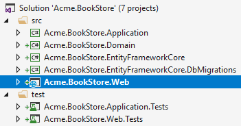
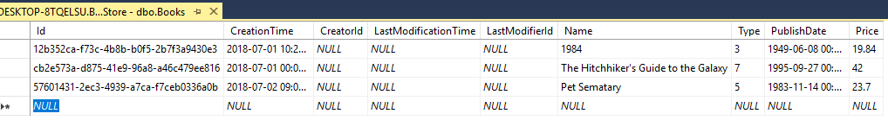
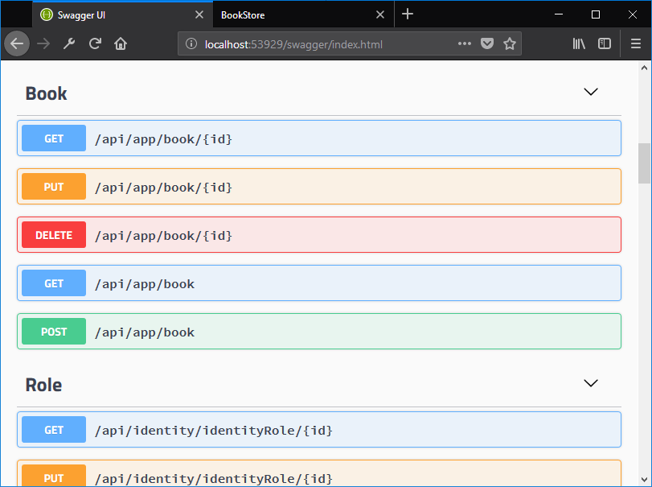
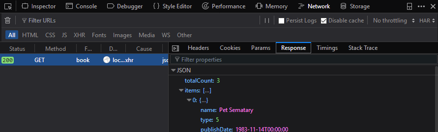
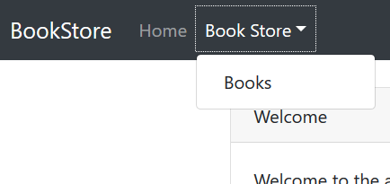
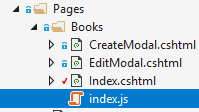
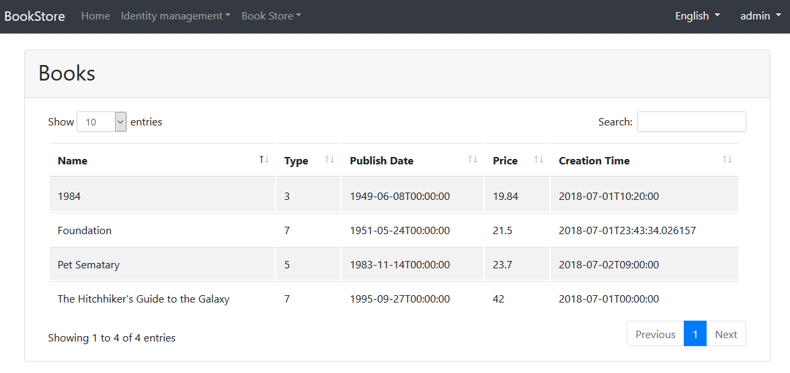

## ASP.NET Core MVC 介绍 - 第一章

### 关于本教程

本教程中,你会创建一个用于管理书籍和书籍作者的程序.会用到 **Entity Framework Core** (EF Core)作为ORM([启动模板](https://abp.io/Templates)中预配置的ORM).

这是本教程所有章节中的第一章,下面是所有的章节:

- **Part I: 创建项目和书籍列表页面(本章)**
- [Part II: 创建,编辑,删除书籍](Part-II.md)
- [Part III: 集成测试](Part-III.md)

你可以从[这里](https://github.com/volosoft/abp/tree/master/samples/BookStore)下载本程序的源码.

### 创建项目

打开[启动模板页](https://abp.io/Templates)并下载一个新的项目叫做`Acme.BookStore`.根据[模板文档](../../Getting-Started-AspNetCore-MVC-Template.md)创建数据库并运行这个程序.

### 解决方案的结构

下面的图片展示了从启动模板创建的项目是如何分层的.



### 创建Book实体

在 **领域层** 定义[实体](../../Entities.md)(`Acme.BookStore.Domain` 项目中).这个项目最主要的实体就是`Book`:

````C#
using System;
using System.ComponentModel.DataAnnotations;
using System.ComponentModel.DataAnnotations.Schema;
using Volo.Abp.Domain.Entities.Auditing;

namespace Acme.BookStore
{
    [Table("Books")]
    public class Book : AuditedAggregateRoot<Guid>
    {
        [Required]
        [StringLength(128)]
        public string Name { get; set; }

        public BookType Type { get; set; }

        public DateTime PublishDate { get; set; }

        public float Price { get; set; }
    }
}
````

* ABP有两个基本的实体基类: `AggregateRoot` 和 `Entity`.**Aggregate Root**是 **领域驱动设计(DDD)** 的概念之一.更多信息和最佳实践请查看[实体文档](../../Entities.md).
* `Book`实体继承了`AuditedAggregateRoot`,`AuditedAggregateRoot`类在`AggregateRoot`类的基础上添加了一些审计属性(`CreationTime`, `CreatorId`, `LastModificationTime`... 等.).
* `Guid`是`Book`实体的主键类型.
* 使用 **数据注解** 为EF Core添加映射.或者你也可以使用 EF Core 自带的[fluent mapping API](https://docs.microsoft.com/en-us/ef/core/modeling).

#### BookType枚举

上面所用到的`BookType`枚举定义如下:

````C#
namespace Acme.BookStore
{
    public enum BookType : byte
    {
        Undefined,
        Advanture,
        Biography,
        Dystopia,
        Fantastic,
        Horror,
        Science,
        ScienceFiction,
        Poetry
    }
}
````

#### 将Book实体添加到DbContext中

EF Core需要你将实体和DbContext建立关联.最简单的做法是在`Acme.BookStore.EntityFrameworkCore`项目的`BookStoreDbContext`类中添加`DbSet`属性.如下所示:

````C#
public class BookStoreDbContext : AbpDbContext<BookStoreDbContext>
{
    public DbSet<Book> Books { get; set; }
    ...
}
````

#### 添加新的Migration并更新数据库

这个启动模板使用了[EF Core Code First Migrations](https://docs.microsoft.com/en-us/ef/core/managing-schemas/migrations/)来创建并维护数据库结构.打开 **程序包管理器控制台(Package Manager Console) (PMC)** (工具/Nuget包管理器菜单),选择 `Acme.BookStore.EntityFrameworkCore.DbMigrations`作为默认的项目然后执行下面的命令:


这样就会在`Migrations`文件夹中创建一个新的migration类.然后执行`Update-Database`命令更新数据库结构.

````
PM> Update-Database
````

#### 添加示例数据

`Update-Database`命令会在数据库中创建`Books`表.打开这个表添加几行数据,然后就可以把这些数据展示到页面上:



### 创建应用服务

下一步是创建[应用服务](../../Application-Services.md)来管理(创建,列出,更新,删除...)书籍.

#### BookDto

在`Acme.BookStore.Application`项目中添加一个名为`BookDto`的DTO类:

````C#
using System;
using Volo.Abp.Application.Dtos;
using Volo.Abp.AutoMapper;

namespace Acme.BookStore
{
    [AutoMapFrom(typeof(Book))]
    public class BookDto : AuditedEntityDto<Guid>
    {
        public string Name { get; set; }

        public BookType Type { get; set; }

        public DateTime PublishDate { get; set; }

        public float Price { get; set; }
    }
}
````

* **DTO**类被用来在 **表示层** 和 **应用层** **传递数据**.查看[DTO文档](../../Data-Transfer-Objects.md)查看更多信息.
* 为了在页面上展示书籍信息,`BookDto`被用来将书籍数据传递到表示层.
* `BookDto`继承自 `AuditedEntityDto<Guid>`.跟上面定义的`Book`类一样具有一些审计属性.
* `[AutoMapFrom(typeof(Book))]`用来创建从`Book`类到`BookDto`的AutoMapper映射.使用这种方法.你可以将`Book`对象自动转换成`BookDto`对象(而不是手动复制所有的属性).

#### CreateUpdateBookDto

在`Acme.BookStore.Application`项目中创建一个名为`CreateUpdateBookDto`的DTO类:

````c#
using System;
using System.ComponentModel.DataAnnotations;
using Volo.Abp.AutoMapper;

namespace Acme.BookStore
{
    [AutoMapTo(typeof(Book))]
    public class CreateUpdateBookDto
    {
        [Required]
        [StringLength(128)]
        public string Name { get; set; }

        [Required]
        public BookType Type { get; set; } = BookType.Undefined;

        [Required]
        public DateTime PublishDate { get; set; }

        [Required]
        public float Price { get; set; }
    }
}
````

* 这个DTO类被用于在创建或更新书籍的时候从用户界面获取图书信息.
* 类中的属性定义了数据注解(如`[Required]`)用来定义有效性验证.ABP会自动校验DTO的数据有效性.

#### IBookAppService

为应用服务定义一个名为 `IBookAppService` 的接口:

````C#
using System;
using Volo.Abp.Application.Dtos;
using Volo.Abp.Application.Services;

namespace Acme.BookStore
{
    public interface IBookAppService : 
        IAsyncCrudAppService< //定义了CRUD方法
            BookDto, //用来展示书籍
            Guid, //Book实体的主键
            PagedAndSortedResultRequestDto, //获取书籍的时候用于分页和排序
            CreateUpdateBookDto, //用于创建书籍
            CreateUpdateBookDto> //用于更新书籍
    {

    }
}
````

* 为应用服务定义接口不是必须的,不过,这是推荐的最佳实践.
* `IAsyncCrudAppService`中定义了基础的 **CRUD**方法:`GetAsync`, `GetListAsync`, `CreateAsync`, `UpdateAsync` 和 `DeleteAsync`.不需要扩展它.取而代之,你可以继承空的`IApplicationService`接口定义你自己的方法.
* `IAsyncCrudAppService`有一些变体,你可以为每一个方法使用单个或者多个的DTO.(译者注:意思是类似EntityDto和UpdateEntityDto可以用同一个,也可以分别单独指定
)


#### BookAppService

创建 `BookAppService` 并实现 `IBookAppService`接口:

````C#
using System;
using Volo.Abp.Application.Dtos;
using Volo.Abp.Application.Services;
using Volo.Abp.Domain.Repositories;

namespace Acme.BookStore
{
    public class BookAppService : 
        AsyncCrudAppService<Book, BookDto, Guid, PagedAndSortedResultRequestDto,
                            CreateUpdateBookDto, CreateUpdateBookDto>,
        IBookAppService
    {
        public BookAppService(IRepository<Book, Guid> repository) 
            : base(repository)
        {

        }
    }
}
````

* `BookAppService`继承了`AsyncCrudAppService<...>`.`AsyncCrudAppService<...>`实现了上面定义的CRUD方法.
* `BookAppService`注入了`IRepository<Book, Guid>`,`IRepository<Book, Guid>`是默认为`Book`创建的仓储.ABP会自动为每一个聚合根(或实体)创建仓储.参考[仓储文档](../../Repositories.md).
*  `BookAppService`使用了 `IObjectMapper` 将`Book`转换成`BookDto`,将`CreateUpdateBookDto`转换成`Book`.启动模板中使用了[AutoMapper](http://automapper.org/)作为对象映射提供程序.你可以像上面那样使用`AutoMapFrom` 和 `AutoMapTo`定义映射.查看[AutoMapper集成文档](../../AutoMapper-Integration.md)获取更多信息.

### 自动生成API Controllers

你通常需要创建 **Controllers** 将应用服务暴露为 **HTTP API**.这样浏览器或第三方客户端可以通过AJAX的方式访问它们.

ABP可以通过约定[**自动**](../../AspNetCore/Auto-API-Controllers.md)将应用服务转换成MVC API Controllers.

#### Swagger UI

启动模板使用了[Swashbuckle.AspNetCore](https://github.com/domaindrivendev/Swashbuckle.AspNetCore)库配置了[swagger UI](https://swagger.io/tools/swagger-ui/).运行程序并在浏览器中输入`http://localhost:53929/swagger/`.

你会看到一些内置的接口和`Book`的接口,它们都是REST风格的:



### 动态JavaScript代理

在Javascript端通过AJAX的方式调用HTTP API接口是很常见的,你可以使用`$.ajax`或这其他的工具来调用接口.当然,ABP中提供了更好的方式.

ABP **自动** 为所有的API接口创建了JavaScript **代理**.因此,你可以像调用 **JavaScript function**一样调用任何接口.

#### 在浏览器的开发者控制台中测试接口

你可以使用你钟爱的浏览器的 **开发者控制台** 中轻松测试JavaScript代理.运行程序,并打开浏览器的 **开发者工具**(快捷键:F12),切换到 **Console** 标签,输入下面的代码并回车:

````js
acme.bookStore.book.getList({}).done(function (result) { console.log(result); });
````

* `acme.bookStore`是`BookAppService`的命名空间,转换成了[驼峰命名](https://en.wikipedia.org/wiki/Camel_case).
* `book`是`BookAppService`转换后的名字(去除了AppService后缀并转成了驼峰命名).
* `getList`是定义在`AsyncCrudAppService`基类中的`GetListAsync`方法转换后的名字(去除了Async后缀并转成了驼峰命名).
* `{}`参数用来传递一个空的对象给`GetListAsync`方法.GetListAsync期望的参数是`PagedAndSortedResultRequestDto`类型的对象,`PagedAndSortedResultRequestDto`类型中定义了分页和排序选项.
* `getList`方法返回了一个`promise`.因此,你可以传递一个回调函数到`done`(或者`then`)方法中来获取服务返回的结果.

运行这段代码会产生下面的输出:


你可以看到服务器返回的 **book list**.你还可以切换到开发者工具的 **network** 查看客户端到服务器端的通讯信息:



我们使用`create`方法 **创建一本新书**:

````js
acme.bookStore.book.create({ name: 'Foundation', type: 7, publishDate: '1951-05-24', price: 21.5 }).done(function (result) { console.log('successfully created the book with id: ' + result.id); });
````

你会看到控制台会显示类似这样的输出:

````
successfully created the book with id: f3f03580-c1aa-d6a9-072d-39e75c69f5c7
````

检查数据库表`books`中的数据,你会发现多了一行新数据,你也可以尝试`get`, `update` 和 `delete`方法.

### 创建书籍页面

现在我们来创建一些可见和可用的东西,取代经典的MVC,我们使用微软推荐的[Razor Pages UI](https://docs.microsoft.com/en-us/aspnet/core/tutorials/razor-pages/razor-pages-start).


在 `Acme.BookStore.Web`项目的`Pages`文件夹下创建一个新的文件夹叫`Books`并添加一个名为`Index.cshtml`的Razor Page.


打开`Index.cshtml`并把内容修改成下面这样:

````html
@page
@using Acme.BookStore.Pages.Books
@inherits Acme.BookStore.Pages.BookStorePageBase
@model IndexModel

<h2>Books</h2>
````

* 修改Razor View Page Model的默认继承,使页面 **继承** 自`BookStorePageBase`类(代替`PageModel`).`BookStorePageBase`类来自于启动模板,它提供了一些公开的可以被所有的页面使用的属性/方法.

#### 将Books页面添加到主菜单

打开`Menus`文件夹中的 `BookStoreMenuContributor` 类,在`ConfigureMainMenuAsync`方法的底部添加如下代码:

````c#
context.Menu.AddItem(
    new ApplicationMenuItem("BooksStore", l["Menu:BookStore"])
        .AddItem(new ApplicationMenuItem("BooksStore.Books", l["Menu:Books"], url: "/Books"))
);
````

#### 本地化菜单

本地化的文本在`Acme.BookStore.Domain`项目的`Localization/BookStore`文件夹中.


打开`en.json`文件,为`Menu:BookStore` 和 `Menu:Books`添加本地化文本:

````json
{
  "culture": "en",
  "texts": {
    //...
    "Menu:BookStore": "Book Store",
    "Menu:Books": "Books"
  }
}
````

* ABP的本地化功能建立在[ASP.NET Core's standard localization]((https://docs.microsoft.com/en-us/aspnet/core/fundamentals/localization))之上并增加了一些扩展.查看[本地化文档](../../Localization.md).
* 本地化中key的名字是随便定义的,你可以随意命名.我们喜欢为菜单添加`Menu`命名空间,以区别于其他的文本.如果文本没有在本地化文件中定义,就会 **返回** 本地的化的key(ASP.NET Core的标准做法).

运行程序就会看到菜单已经添加到了顶部:



点击Books菜单项就会跳转到新增的书籍页面.

#### 书籍列表

我们会在页面上使用JQuery插件[Datatables.net](https://datatables.net/)来展示列表.Datatables可以完全通过AJAX工作,所以它很快而且有良好的用户体验.启动模板中已经配置好了Datatables插件,因此你可以在你的页面中直接使用,不需要引用样式和脚本文件.

##### 修改Index.cshtml

将`Pages/Books/Index.cshtml`改成下面的样子:

````html
@page
@using Acme.BookStore.Pages.Books
@inherits Acme.BookStore.Pages.BookStorePageBase
@model IndexModel
@section scripts
{
    <abp-script src="/Pages/Books/index.js" />
}
<abp-card>
    <abp-card-header>
        <h2>@L["Books"]</h2>
    </abp-card-header>
    <abp-card-body>
        <abp-table striped-rows="true" id="BooksTable">
            <thead>
                <tr>
                    <th>@L["Name"]</th>
                    <th>@L["Type"]</th>
                    <th>@L["PublishDate"]</th>
                    <th>@L["Price"]</th>
                    <th>@L["CreationTime"]</th>
                </tr>
            </thead>
        </abp-table>
    </abp-card-body>
</abp-card>
````

* `abp-script` [tag helper](https://docs.microsoft.com/en-us/aspnet/core/mvc/views/tag-helpers/intro)用于将外部的 **脚本** 添加到页面中.它比标准的`script`标签多了很多额外的功能.它可以处理 **最小化**和 **版本**.查看[捆绑 & 压缩文档](../../AspNetCore/Bundling-Minification.md)获取更多信息.
* `abp-card` 和 `abp-table` 是为Twitter Bootstrap的[card component](http://getbootstrap.com/docs/4.1/components/card/)封装的 **tag helpers**.ABP中有很多tag helpers,可以很方便的使用大多数[bootstrap](https://getbootstrap.com/)组件.你也可以使用原生的HTML标签代替tag helpers.使用tag helper可以通过智能提示和编译时类型检查减少HTML代码并防止错误.查看[tag helpers 文档](../../AspNetCore/Tag-Helpers.md).
* 你可以像上面本地化菜单一样 **本地化** 列名.

#### 添加脚本文件

在`Pages/Books/`文件夹中创建 `index.js`文件



`index.js`的内容如下:

````js
$(function () {
    var dataTable = $('#BooksTable').DataTable(abp.libs.datatables.normalizeConfiguration({
        ajax: abp.libs.datatables.createAjax(acme.bookStore.book.getList),
        columnDefs: [
            { data: "name" },
            { data: "type" },
            { data: "publishDate" },
            { data: "price" },
            { data: "creationTime" }
        ]
    }));
});
````

* `abp.libs.datatables.createAjax`是帮助ABP的动态JavaScript API代理跟Datatable的格式相适应的辅助方法.
* `abp.libs.datatables.normalizeConfiguration`是另一个辅助方法.不是必须的, 但是它通过为缺少的选项提供常规值来简化数据表配置.
* `acme.bookStore.book.getList`是获取书籍列表的方法(上面已经介绍过了)
* 查看 [Datatable's 文档](https://datatables.net/manual/) 了解更多配置项.

最终的页面如下:



### 下一章

点击查看  [下一章](Part-II.md) 的介绍.
