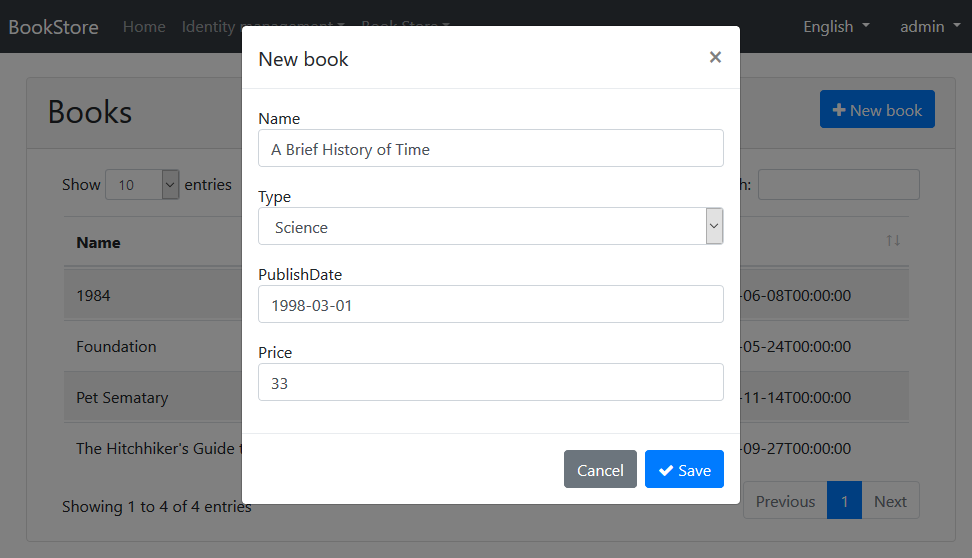
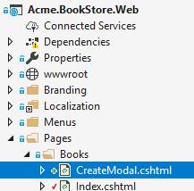
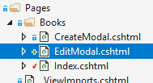
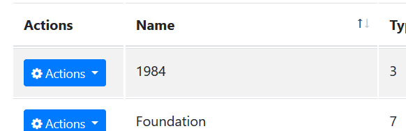

## ASP.NET Core MVC 教程 - 第二章

### 关于本教程

这是本教程所有章节中的第二章.下面是所有的章节:

* [Part I: 创建项目和书籍列表页面](Part-I.md)
* **Part II: 创建,编辑,删除书籍(本章)**
* [Part III: 集成测试](Part-III.md)

你可以从 [这里](https://github.com/volosoft/abp/tree/master/samples/BookStore) 下载本程序的**源码**.

### 新增 Book 实体

通过本节, 你将会了解如何创建一个 modal form 来实现新增书籍的功能. 最终成果如下图所示:



#### 新建 modal form

在 `Acme.BookStore.Web` 项目的 `Pages/Books` 目录下新建一个 `CreateModal.cshtml` Razor页面:



##### CreateModal.cshtml.cs

展开 `CreateModal.cshtml`,打开 `CreateModal.cshtml.cs` 代码文件,用如下代码替换 `CreateModalModel` 类的实现:

````C#
using System.Threading.Tasks;
using Microsoft.AspNetCore.Mvc;

namespace Acme.BookStore.Pages.Books
{
    public class CreateModalModel : BookStorePageModelBase
    {
        [BindProperty]
        public CreateUpdateBookDto Book { get; set; }

        private readonly IBookAppService _bookAppService;

        public CreateModalModel(IBookAppService bookAppService)
        {
            _bookAppService = bookAppService;
        }

        public async Task<IActionResult> OnPostAsync()
        {
            await _bookAppService.CreateAsync(Book);
            return NoContent();
        }
    }
}
````

* 这个类继承了 `BookStorePageModelBase` 而非默认的 `PageModel`. `BookStorePageModelBase` 继承了 `PageModel` 并且添加了一些Razor页面模型通用的属性和方法.
* 该类在 `Book` 属性上标记的 `[BindProperty]` 特性绑定了post请求提交上来的数据.
* 该类通过构造函数注入了 `IBookAppService` 应用服务,并且在 `OnPostAsync` 方法中调用了服务的 `CreateAsync` 方法.

##### CreateModal.cshtml

打开 `CreateModal.cshtml` 文件并粘贴如下代码:

````html
@page
@inherits Acme.BookStore.Pages.BookStorePageBase
@using Volo.Abp.AspNetCore.Mvc.UI.Bootstrap.TagHelpers.Modal
@model Acme.BookStore.Pages.Books.CreateModalModel
@{
    Layout = null;
}
<abp-dynamic-form abp-model="Book" data-ajaxForm="true" asp-page="/Books/CreateModal">
    <abp-modal>
        <abp-modal-header title="@L["NewBook"].Value"></abp-modal-header>
        <abp-modal-body>
            <abp-form-content />
        </abp-modal-body>
        <abp-modal-footer buttons="@(AbpModalButtons.Cancel|AbpModalButtons.Save)"></abp-modal-footer>
    </abp-modal>
</abp-dynamic-form>
````

* 这个 modal 使用 `abp-dynamic-form` Tag Helper 根据 `CreateBookViewModel` 类自动构建了表单.
  * `abp-model` 指定了 `Book` 属性为模型对象.
  * `data-ajaxForm` 设置了表单通过AJAX提交.
  * `abp-form-content` tag helper 作为表单控件渲染位置的占位符 (这是可选的,只有你在 `abp-dynamic-form` 中像本示例这样添加了其他内容才需要).

#### 添加 "New book" 按钮

打开 `Pages/Books/Index.cshtml` 并按如下代码修改 `abp-card-header` :

````html
<abp-card-header>
    <abp-row>
        <abp-column size-md="_6">
            <h2>@L["Books"]</h2>
        </abp-column>
        <abp-column size-md="_6" class="text-right">
            <abp-button id="NewBookButton"
                        text="@L["NewBook"].Value"
                        icon="plus"
                        button-type="Primary" />
        </abp-column>
    </abp-row>
</abp-card-header>
````

如下图所示,只是在表格 **右上方** 添加了 **New book** 按钮:


打开 `Pages/books/index.js` 在datatable配置代码后面添加如下代码:

````js
var createModal = new abp.ModalManager(abp.appPath + 'Books/CreateModal');

createModal.onResult(function () {
    dataTable.ajax.reload();
});

$('#NewBookButton').click(function (e) {
    e.preventDefault();
    createModal.open();
});
````

* `abp.ModalManager` 是一个在客户端打开和管理modal的辅助类.它基于Twitter Bootstrap的标准modal组件通过简化的API抽象隐藏了许多细节.

现在,你可以 **运行程序** 通过新的 modal form 来创建书籍了.

### 编辑更新已存在的 Book 实体

在 `Acme.BookStore.Web` 项目的 `Pages/Books` 目录下新建一个名叫 `EditModal.cshtml` 的Razor页面:



#### EditModal.cshtml.cs

展开 `EditModal.cshtml`,打开 `EditModal.cshtml.cs` 文件（ `EditModalModel` 类） 并替换成以下代码:

````C#
using System;
using System.Threading.Tasks;
using Microsoft.AspNetCore.Mvc;

namespace Acme.BookStore.Pages.Books
{
    public class EditModalModel : BookStorePageModelBase
    {
        [HiddenInput]
        [BindProperty(SupportsGet = true)]
        public Guid Id { get; set; }

        [BindProperty]
        public CreateUpdateBookDto Book { get; set; }
        
        private readonly IBookAppService _bookAppService;

        public EditModalModel(IBookAppService bookAppService)
        {
            _bookAppService = bookAppService;
        }

        public async Task OnGetAsync()
        {
            var bookDto = await _bookAppService.GetAsync(Id);
            Book = ObjectMapper.Map<BookDto, CreateUpdateBookDto>(bookDto);
        }

        public async Task<IActionResult> OnPostAsync()
        {
            await _bookAppService.UpdateAsync(Id, Book);
            return NoContent();
        }
    }
}
````

* `[HiddenInput]` 和 `[BindProperty]` 是标准的 ASP.NET Core MVC 特性.这里启用 `SupportsGet` 从Http请求的查询字符串中获取Id的值.
* 在 `OnGetAsync` 方法中,将 `BookAppService.GetAsync` 方法返回的 `BookDto` 映射成 `CreateUpdateBookDto` 并赋值给Book属性.
* `OnPostAsync` 方法直接使用 `BookAppService.UpdateAsync` 来更新实体.

#### CreateUpdateBookDto

为了执行从 `BookDto` 到 `CreateUpdateBookDto` 的对象映射, 按如下所示修改 `CreateUpdateBookDto`类:

````C#
using System;
using System.ComponentModel.DataAnnotations;
using Volo.Abp.AutoMapper;

namespace Acme.BookStore
{
    [AutoMapTo(typeof(Book))]
    [AutoMapFrom(typeof(BookDto))]
    public class CreateUpdateBookDto
    {
        [Required]
        [StringLength(128)]
        public string Name { get; set; }

        [Required]
        public BookType Type { get; set; } = BookType.Undefined;

        [Required]
        public DateTime PublishDate { get; set; }

        [Required]
        public float Price { get; set; }
    }
}
````

* 仅仅是添加 `[AutoMapFrom(typeof(BookDto))]` 特性就可以创建上述映射关系.

#### EditModal.cshtml

将 `EditModal.cshtml` 页面内容替换成如下代码:

````html
@page
@inherits Acme.BookStore.Pages.BookStorePageBase
@using Acme.BookStore.Pages.Books
@using Volo.Abp.AspNetCore.Mvc.UI.Bootstrap.TagHelpers.Modal
@model EditModalModel
@{
    Layout = null;
}
<abp-dynamic-form abp-model="Book" data-ajaxForm="true" asp-page="/Books/EditModal">
    <abp-modal>
        <abp-modal-header title="@L["Update"].Value"></abp-modal-header>
        <abp-modal-body>
            <abp-input asp-for="Id" />
            <abp-form-content/>
        </abp-modal-body>
        <abp-modal-footer buttons="@(AbpModalButtons.Cancel|AbpModalButtons.Save)"></abp-modal-footer>
    </abp-modal>
</abp-dynamic-form>
````

除了以下几点,这个页面内容和 `CreateModal.cshtml` 非常相似:

* 此页面包含了一个 `abp-input` 以保存所编辑book实体的 `Id` 属性.
* 此页面指定的post地址是 `Books/EditModal` ,并用文本 *Update* 作为 modal 标题.

#### 为表格添加 "操作（Actions）" 下拉菜单

我们将为表格每行添加下拉按钮 ("Actions") . 最终效果如下:



打开 `Pages/Books/Index.cshtml` 页面,并按下方所示修改表格部分的代码:

````html
<abp-table striped-rows="true" id="BooksTable">
    <thead>
        <tr>
            <th>@L["Actions"]</th>
            <th>@L["Name"]</th>
            <th>@L["Type"]</th>
            <th>@L["PublishDate"]</th>
            <th>@L["Price"]</th>
            <th>@L["CreationTime"]</th>
        </tr>
    </thead>
</abp-table>
````

* 只是为"Actions"增加了一个 `th` 标签.

打开 `Pages/books/index.js` 并用以下内容进行替换:

````js
$(function () {

    var l = abp.localization.getResource('BookStore');

    var createModal = new abp.ModalManager(abp.appPath + 'Books/CreateModal');
    var editModal = new abp.ModalManager(abp.appPath + 'Books/EditModal');

    var dataTable = $('#BooksTable').DataTable(abp.libs.datatables.normalizeConfiguration({
        order: [[1, "asc"]],
        ajax: abp.libs.datatables.createAjax(acme.bookStore.book.getList),
        columnDefs: [
            {
                rowAction: {
                    items:
                        [
                            {
                                text: l('Edit'),
                                action: function (data) {
                                    editModal.open({ id: data.record.id });
                                }
                            }
                        ]
                }
            },
            { data: "name" },
            { data: "type" },
            { data: "publishDate" },
            { data: "price" },
            { data: "creationTime" }
        ]
    }));

    createModal.onResult(function () {
        dataTable.ajax.reload();
    });

    editModal.onResult(function () {
        dataTable.ajax.reload();
    });

    $('#NewBookButton').click(function (e) {
        e.preventDefault();
        createModal.open();
    });
});
````

* 通过 `abp.localization.getResource('BookStore')` 可以在客户端使用服务器端定义的相同的本地化语言文本.
* 定义 `editModal` 为 `ModalManager` 来打开编辑用的 modal 对话框.
* 在 `columnDefs` 起始处新增一列作为 "Actions" 下拉按钮.
* "Edit" 操作只是简单调用 `editModal.open` 来打开编辑对话框.

现在,你可以运行程序,通过编辑操作来更新任一个book实体.

### 删除一个已有的Book实体

打开 `Pages/books/index.js` 文件,在 `rowAction` `items` 下新增一项:

````js
{
    text: l('Delete'),
    confirmMessage: function (data) {
        return l('BookDeletionConfirmationMessage', data.record.name);
    },
    action: function (data) {
        acme.bookStore.book
            .delete(data.record.id)
            .then(function() {
                abp.notify.info(l('SuccessfullyDeleted'));
                dataTable.ajax.reload();
            });
    }
}
````

* `confirmMessage` 用来在实际执行 `action` 之前向用户进行确认.
* 通过javascript代理方法 `acme.bookStore.book.delete` 执行一个AJAX请求来删除一个book实体.
* `abp.notify.info` 用来提示用户操作成功.

最终的 `index.js` 文件内容如下所示:

````js
$(function () {

    var l = abp.localization.getResource('BookStore');

    var createModal = new abp.ModalManager(abp.appPath + 'Books/CreateModal');
    var editModal = new abp.ModalManager(abp.appPath + 'Books/EditModal');

    var dataTable = $('#BooksTable').DataTable(abp.libs.datatables.normalizeConfiguration({
        order: [[1, "asc"]],
        ajax: abp.libs.datatables.createAjax(acme.bookStore.book.getList),
        columnDefs: [
            {
                rowAction: {
                    items:
                    [
                        {
                            text: l('Edit'),
                            action: function (data) {
                                editModal.open({ id: data.record.id });
                            }
                        },
                        {
                            text: l('Delete'),
                            confirmMessage: function (data) {
                                return l('BookDeletionConfirmationMessage', data.record.name);
                            },
                            action: function (data) {
                                acme.bookStore.book
                                    .delete(data.record.id)
                                    .then(function() {
                                        abp.notify.info(l('SuccessfullyDeleted'));
                                        dataTable.ajax.reload();
                                    });
                            }
                        }
                    ]
                }
            },
            { data: "name" },
            { data: "type" },
            { data: "publishDate" },
            { data: "price" },
            { data: "creationTime" }
        ]
    }));

    createModal.onResult(function () {
        dataTable.ajax.reload();
    });

    editModal.onResult(function () {
        dataTable.ajax.reload();
    });

    $('#NewBookButton').click(function (e) {
        e.preventDefault();
        createModal.open();
    });
});
````

运行程序并尝试删除一个book实体.

### 下一章

查看本教程的 [下一章](Part-III.md) .
