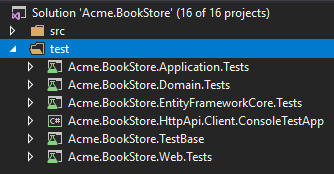
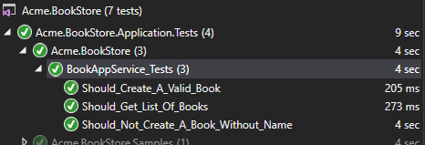

## ASP.NET Core MVC 教程 - 第三章

### 关于本教程

这是ASP.NET Core MVC教程系列的第三章. 查看其它章节

- [Part I: 创建项目和书籍列表页面](Part-I.md)
- [Part II: 创建,编辑,删除书籍](Part-II.md)
- **Part III: 集成测试(本章)**

你可以从[GitHub存储库](https://github.com/volosoft/abp/tree/master/samples/BookStore)访问应用程序的**源代码**.

> 你也可以观看由ABP社区成员为本教程录制的[视频课程](https://amazingsolutions.teachable.com/p/lets-build-the-bookstore-application).

### 解决方案中的测试项目

解决方案中有多个测试项目：



每个项目用于测试相关的应用程序项目.测试项目使用以下库进行测试:

* [xunit](https://xunit.github.io/) 作为主测试框架.
* [Shoudly](http://shouldly.readthedocs.io/en/latest/) 作为断言库.
* [NSubstitute](http://nsubstitute.github.io/) 作为模拟库.

### 添加测试用数据

启动模板包含`Acme.BookStore.TestBase`项目中的`BookStoreTestDataSeedContributor`类,它创建一些数据来运行测试.
更改`BookStoreTestDataSeedContributor`类如下所示:

````C#
using System;
using System.Threading.Tasks;
using Volo.Abp.Data;
using Volo.Abp.DependencyInjection;
using Volo.Abp.Domain.Repositories;
using Volo.Abp.Guids;

namespace Acme.BookStore
{
    public class BookStoreTestDataSeedContributor
        : IDataSeedContributor, ITransientDependency
    {
        private readonly IRepository<Book, Guid> _bookRepository;
        private readonly IGuidGenerator _guidGenerator;

        public BookStoreTestDataSeedContributor(
            IRepository<Book, Guid> bookRepository, 
            IGuidGenerator guidGenerator)
        {
            _bookRepository = bookRepository;
            _guidGenerator = guidGenerator;
        }

        public async Task SeedAsync(DataSeedContext context)
        {
            await _bookRepository.InsertAsync(
                new Book
                {
                    Id = _guidGenerator.Create(),
                    Name = "Test book 1",
                    Type = BookType.Fantastic,
                    PublishDate = new DateTime(2015, 05, 24),
                    Price = 21
                }
            );

            await _bookRepository.InsertAsync(
                new Book
                {
                    Id = _guidGenerator.Create(),
                    Name = "Test book 2",
                    Type = BookType.Science,
                    PublishDate = new DateTime(2014, 02, 11),
                    Price = 15
                }
            );
        }
    }
}
````

* 注入`IRepository<Book,Guid>`并在`SeedAsync`中使用它来创建两个书实体作为测试数据.
* 使用`IGuidGenerator`服务创建GUID. 虽然`Guid.NewGuid()`非常适合测试，但`IGuidGenerator`在使用真实数据库时还有其他特别重要的功能(参见[Guid生成文档](../../Guid-Generation.md)了解更多信息).

### 测试 BookAppService

在 `Acme.BookStore.Application.Tests` 项目中创建一个名叫 `BookAppService_Tests` 的测试类:

````C#
using System.Threading.Tasks;
using Shouldly;
using Volo.Abp.Application.Dtos;
using Xunit;

namespace Acme.BookStore
{
    public class BookAppService_Tests : BookStoreApplicationTestBase
    {
        private readonly IBookAppService _bookAppService;

        public BookAppService_Tests()
        {
            _bookAppService = GetRequiredService<IBookAppService>();
        }

        [Fact]
        public async Task Should_Get_List_Of_Books()
        {
            //Act
            var result = await _bookAppService.GetListAsync(
                new PagedAndSortedResultRequestDto()
            );

            //Assert
            result.TotalCount.ShouldBeGreaterThan(0);
            result.Items.ShouldContain(b => b.Name == "Test book 1");
        }
    }
}
````

* 测试方法 `Should_Get_List_Of_Books` 直接使用 `BookAppService.GetListAsync` 方法来获取用户列表,并执行检查.

新增测试方法,用以测试创建一个合法book实体的场景:

````C#
[Fact]
public async Task Should_Create_A_Valid_Book()
{
    //Act
    var result = await _bookAppService.CreateAsync(
        new CreateUpdateBookDto
        {
            Name = "New test book 42",
            Price = 10,
            PublishDate = DateTime.Now,
            Type = BookType.ScienceFiction
        }
    );

    //Assert
    result.Id.ShouldNotBe(Guid.Empty);
    result.Name.ShouldBe("New test book 42");
}
````

新增测试方法,用以测试创建一个非法book实体失败的场景:

````C#
[Fact]
public async Task Should_Not_Create_A_Book_Without_Name()
{
    var exception = await Assert.ThrowsAsync<AbpValidationException>(async () =>
    {
        await _bookAppService.CreateAsync(
            new CreateUpdateBookDto
            {
                Name = "",
                Price = 10,
                PublishDate = DateTime.Now,
                Type = BookType.ScienceFiction
            }
        );
    });

    exception.ValidationErrors
        .ShouldContain(err => err.MemberNames.Any(mem => mem == "Name"));
}
````

* 由于 `Name` 是空值, ABP 抛出一个 `AbpValidationException` 异常.

打开**测试资源管理器**(测试 -> Windows -> 测试资源管理器)并**执行**所有测试:



恭喜, 绿色图标表示测试已成功通过!
