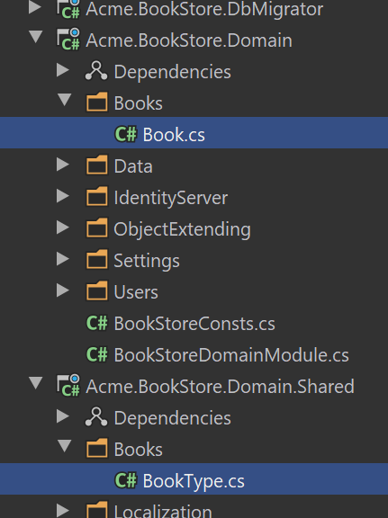
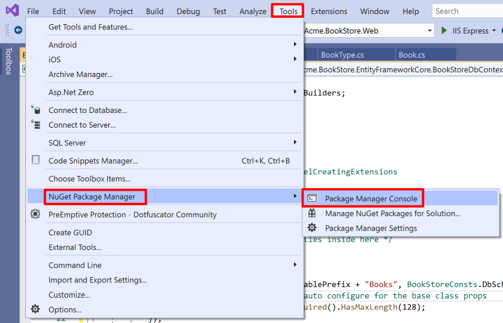
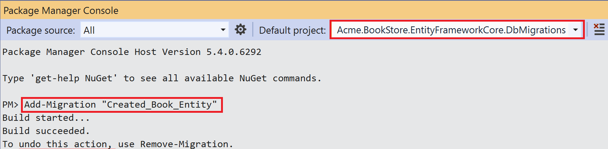
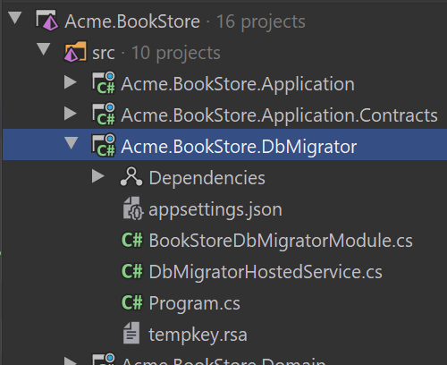
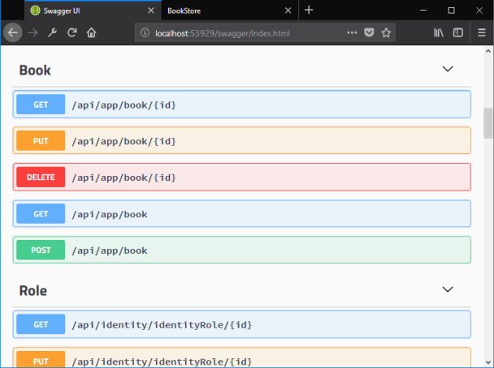

# Web应用程序开发教程 - 第一章: 创建服务端
````json
//[doc-params]
{
    "UI": ["MVC","NG"],
    "DB": ["EF","Mongo"]
}
````
{{
if UI == "MVC"
  UI_Text="mvc"
else if UI == "NG"
  UI_Text="angular"
else
  UI_Text="?"
end
if DB == "EF"
  DB_Text="Entity Framework Core"
else if DB == "Mongo"
  DB_Text="MongoDB"
else
  DB_Text="?"
end
}}

## 关于本教程

在本系列教程中, 你将构建一个名为 `Acme.BookStore` 的用于管理书籍及其作者列表的基于ABP的应用程序.  它是使用以下技术开发的:

* **{{DB_Text}}** 做为ORM提供程序.
* **{{UI_Value}}** 做为UI框架.

本教程分为以下部分:

- **Part 1: 创建服务端 (本章)**
- [Part 2: 图书列表页面](Part-2.md)
- [Part 3: 创建,更新和删除图书](Part-3.md)
- [Part 4: 集成测试](Part-4.md)
- [Part 5: 授权](Part-5.md)
- [Part 6: 作者: 领域层](Part-6.md)
- [Part 7: 作者: 数据库集成](Part-7.md)
- [Part 8: 作者: 应用服务层](Part-8.md)
- [Part 9: 作者: 用户页面](Part-9.md)
- [Part 10: 图书到作者的关系](Part-10.md)

## 下载源码

本教程根据你的**UI** 和 **Database**偏好有多个版,我们准备了两种可供下载的源码组合:

* [MVC (Razor Pages) UI 与 EF Core](https://github.com/abpframework/abp-samples/tree/master/BookStore-Mvc-EfCore)
* [Angular UI 与 MongoDB](https://github.com/abpframework/abp-samples/tree/master/BookStore-Angular-MongoDb)

## 创建解决方案

在开始开发之前,请按照[入门教程](../Getting-Started.md)创建名为 `Acme.BookStore` 的新解决方案.

## 创建Book实体

启动模板中的**领域层**分为两个项目:

 - `Acme.BookStore.Domain`包含你的[实体](https://docs.abp.io/zh-Hans/abp/latest/Entities), [领域服务](https://docs.abp.io/zh-Hans/abp/latest/Domain-Services)和其他核心域对象.
 - `Acme.BookStore.Domain.Shared`包含可与客户共享的常量,枚举或其他域相关对象.

在解决方案的**领域层**(`Acme.BookStore.Domain`项目)中定义你的实体. 

该应用程序的主要实体是`Book`. 在`Acme.BookStore.Domain`项目中创建一个 `Books` 文件夹并在其中添加一个名为 `Book` 的类,如下所示:

````csharp
using System;
using Volo.Abp.Domain.Entities.Auditing;

namespace Acme.BookStore.Books
{
    public class Book : AuditedAggregateRoot<Guid>
    {
        public string Name { get; set; }

        public BookType Type { get; set; }

        public DateTime PublishDate { get; set; }

        public float Price { get; set; }
    }
}
````

* ABP为实体提供了两个基本的基类: `AggregateRoot`和`Entity`. **Aggregate Root**是[**领域驱动设计**](./Domain-Driven-Design.md) 概念之一. 可以视为直接查询和处理的根实体(请参阅[实体文档](../Entities.md)).
* `Book`实体继承了`AuditedAggregateRoot`,`AuditedAggregateRoot`类在`AggregateRoot`类的基础上添加了一些审计属性(`CreationTime`, `CreatorId`, `LastModificationTime` 等). ABP框架自动为你管理这些属性.
* `Guid`是`Book`实体的主键类型.

> 为了保持简单,本教程将实体属性保留为 **public get/set** . 如果你想了解关于DDD最佳实践,请参阅[实体文档](../Entities.md).

### BookType枚举

上面所用到了 `BookType` 枚举,在 `Acme.BookStore.Domain.Shared` 项目创建 `BookType`.

````csharp
namespace Acme.BookStore.Books
{
    public enum BookType
    {
        Undefined,
        Adventure,
        Biography,
        Dystopia,
        Fantastic,
        Horror,
        Science,
        ScienceFiction,
        Poetry
    }
}
````

最终的文件夹/文件结构应该如下所示:



### 将Book实体添加到DbContext中

{{if DB == "EF"}}

EF Core需要你将实体和 `DbContext` 建立关联.最简单的做法是在`Acme.BookStore.EntityFrameworkCore`项目的`BookStoreDbContext`类中添加`DbSet`属性.如下所示:

````csharp
public class BookStoreDbContext : AbpDbContext<BookStoreDbContext>
{
    public DbSet<Book> Books { get; set; }
    //...
}
````

{{end}}

{{if DB == "Mongo"}}

添加 `IMongoCollection<Book> Book` 属性到 `Acme.BookStore.MongoDB` 项目的 `BookStoreMongoDbContext` 中.

```csharp
public class BookStoreMongoDbContext : AbpMongoDbContext
{
    public IMongoCollection<Book> Books => Collection<Book>();
    //...
}
```

{{end}}

{{if DB == "EF"}}

### 将Book实体映射到数据库表

在 `Acme.BookStore.EntityFrameworkCore` 项目中打开 `BookStoreDbContextModelCreatingExtensions.cs` 文件,添加 `Book` 实体的映射代码. 最终类应为:

````csharp
using Acme.BookStore.Books;
using Microsoft.EntityFrameworkCore;
using Volo.Abp;
using Volo.Abp.EntityFrameworkCore.Modeling;

namespace Acme.BookStore.EntityFrameworkCore
{
    public static class BookStoreDbContextModelCreatingExtensions
    {
        public static void ConfigureBookStore(this ModelBuilder builder)
        {
            Check.NotNull(builder, nameof(builder));

            /* Configure your own tables/entities inside here */

            builder.Entity<Book>(b =>
            {
                b.ToTable(BookStoreConsts.DbTablePrefix + "Books",
                          BookStoreConsts.DbSchema);
                b.ConfigureByConvention(); //auto configure for the base class props
                b.Property(x => x.Name).IsRequired().HasMaxLength(128);
            });
        }
    }
}
````

* `BookStoreConsts` 含有用于表的架构和表前缀的常量值. 你不必使用它,但建议在单点控制表前缀.
* `ConfigureByConvention()` 方法优雅的配置/映射继承的属性,应始终对你所有的实体使用它.

### 添加数据迁移

启动模板使用[EF Core Code First Migrations](https://docs.microsoft.com/zh-cn/ef/core/managing-schemas/migrations/)创建和维护数据库架构. 打开菜单*工具 > NuGet包管理器*下的**程序包管理控制台 (PMC)**.



选择 `Acme.BookStore.EntityFrameworkCore.DbMigrations` 做为**默认项目**然后执行以下命令:

```bash
Add-Migration "Created_Book_Entity"
```



它会在 `Acme.BookStore.EntityFrameworkCore.DbMigrations` 项目中的 `Migrations` 文件内创建一个新的迁移类.

在更新数据库之前,请阅读下面的部分了解如何将一些初始数据插入到数据库.

> 如果你使用其他IDE而不是Visual Studio, 你可以使用 [`dotnet-ef`](https://docs.microsoft.com/zh-cn/ef/core/managing-schemas/migrations/?tabs=dotnet-core-cli#create-a-migration) 工具.

{{end}}

#### 添加种子数据

> >在运行应用程序之前最好将初始数据添加到数据库中. 本节介绍ABP框架的[数据种子系统](../Data-Seeding.md). 如果你不想创建种子数据可以跳过本节,但是建议你遵循它来学习这个有用的ABP Framework功能。

在 `*.Domain` 项目下创建派生 `IDataSeedContributor` 的类,并且拷贝以下代码:

```csharp
using System;
using System.Threading.Tasks;
using Acme.BookStore.Books;
using Volo.Abp.Data;
using Volo.Abp.DependencyInjection;
using Volo.Abp.Domain.Repositories;

namespace Acme.BookStore
{
    public class BookStoreDataSeederContributor
        : IDataSeedContributor, ITransientDependency
    {
        private readonly IRepository<Book, Guid> _bookRepository;

        public BookStoreDataSeederContributor(IRepository<Book, Guid> bookRepository)
        {
            _bookRepository = bookRepository;
        }

        public async Task SeedAsync(DataSeedContext context)
        {
            if (await _bookRepository.GetCountAsync() <= 0)
            {
                await _bookRepository.InsertAsync(
                    new Book
                    {
                        Name = "1984",
                        Type = BookType.Dystopia,
                        PublishDate = new DateTime(1949, 6, 8),
                        Price = 19.84f
                    },
                    autoSave: true
                );

                await _bookRepository.InsertAsync(
                    new Book
                    {
                        Name = "The Hitchhiker's Guide to the Galaxy",
                        Type = BookType.ScienceFiction,
                        PublishDate = new DateTime(1995, 9, 27),
                        Price = 42.0f
                    },
                    autoSave: true
                );
            }
        }
    }
}
```

* 如果数据库中当前没有图书,则此代码使用 `IRepository<Book, Guid>`(默认为[repository](../Repositories.md))将两本书插入数据库.

### 更新数据库

运行 `Acme.BookStore.DbMigrator` 应用程序来更新数据库:



`.DbMigrator`  是一个控制台使用程序,可以在**开发**和**生产**环境**迁移数据库架构**和**初始化种子数据**.

## 创建应用程序

应用程序层由两个分离的项目组成:

* `Acme.BookStore.Application.Contracts` 包含你的[DTO](../Data-Transfer-Objects.md)和[应用服务](../Application-Services.md)接口.
* `Acme.BookStore.Application` 包含你的应用服务实现.

在本部分中,你将创建一个应用程序服务,使用ABP Framework的 `CrudAppService` 基类来获取,创建,更新和删除书籍.

### BookDto

`CrudAppService` 基类需要定义实体的基本DTO. 在 `Acme.BookStore.Application.Contracts` 项目中创建一个名为 `BookDto` 的DTO类:

````C#
using System;
using Volo.Abp.Application.Dtos;

namespace Acme.BookStore
{
    public class BookDto : AuditedEntityDto<Guid>
    {
        public string Name { get; set; }

        public BookType Type { get; set; }

        public DateTime PublishDate { get; set; }

        public float Price { get; set; }
    }
}
````

* **DTO**类被用来在 **表示层** 和 **应用层** **传递数据**.查看[DTO文档](https://docs.abp.io/zh-Hans/abp/latest/Data-Transfer-Objects)查看更多信息.
* 为了在页面上展示书籍信息,`BookDto`被用来将书籍数据传递到表示层.
* `BookDto`继承自 `AuditedEntityDto<Guid>`.跟上面定义的 `Book` 实体一样具有一些审计属性.

在将书籍返回到表示层时,需要将`Book`实体转换为`BookDto`对象. [AutoMapper](https://automapper.org)库可以在定义了正确的映射时自动执行此转换. 启动模板配置了AutoMapper,因此你只需在`Acme.BookStore.Application`项目的`BookStoreApplicationAutoMapperProfile`类中定义映射:

````csharp
using Acme.BookStore.Books;
using AutoMapper;

namespace Acme.BookStore
{
    public class BookStoreApplicationAutoMapperProfile : Profile
    {
        public BookStoreApplicationAutoMapperProfile()
        {
            CreateMap<Book, BookDto>();
        }
    }
}
````

> 参阅 [对象对对象映射](../Object-To-Object-Mapping.md) 文档了解详情.

### CreateUpdateBookDto

在`Acme.BookStore.Application.Contracts`项目中创建一个名为 `CreateUpdateBookDto` 的DTO类:

````csharp
using System;
using System.ComponentModel.DataAnnotations;

namespace Acme.BookStore.Books
{
    public class CreateUpdateBookDto
    {
        [Required]
        [StringLength(128)]
        public string Name { get; set; }

        [Required]
        public BookType Type { get; set; } = BookType.Undefined;

        [Required]
        [DataType(DataType.Date)]
        public DateTime PublishDate { get; set; } = DateTime.Now;

        [Required]
        public float Price { get; set; }
    }
}
````

* 这个DTO类被用于在创建或更新书籍的时候从用户界面获取图书信息.
* 它定义了数据注释属性(如`[Required]`)来定义属性的验证. DTO由ABP框架[自动验证](https://docs.abp.io/zh-Hans/abp/latest/Validation).

就像上面的`BookDto`一样,创建一个从`CreateUpdateBookDto`对象到`Book`实体的映射,最终映射配置类如下:


````csharp
using Acme.BookStore.Books;
using AutoMapper;

namespace Acme.BookStore
{
    public class BookStoreApplicationAutoMapperProfile : Profile
    {
        public BookStoreApplicationAutoMapperProfile()
        {
            CreateMap<Book, BookDto>();
            CreateMap<CreateUpdateBookDto, Book>();
        }
    }
}
````

### IBookAppService

下一步是为应用程序定义接口,在`Acme.BookStore.Application.Contracts`项目中定义一个名为`IBookAppService`的接口:

````csharp
using System;
using Volo.Abp.Application.Dtos;
using Volo.Abp.Application.Services;

namespace Acme.BookStore.Books
{
    public interface IBookAppService :
        ICrudAppService< //Defines CRUD methods
            BookDto, //Used to show books
            Guid, //Primary key of the book entity
            PagedAndSortedResultRequestDto, //Used for paging/sorting
            CreateUpdateBookDto> //Used to create/update a book
    {

    }
}
````

* 框架定义应用程序服务的接口**不是必需的**. 但是,它被建议作为最佳实践.
* `ICrudAppService`定义了常见的**CRUD**方法:`GetAsync`,`GetListAsync`,`CreateAsync`,`UpdateAsync`和`DeleteAsync`. 你可以从空的`IApplicationService`接口继承并手动定义自己的方法(将在下一部分中完成).
* `ICrudAppService`有一些变体, 你可以在每个方法中使用单独的DTO,也可以分别单独指定(例如使用不同的DTO进行创建和更新).

### BookAppService

在`Acme.BookStore.Application`项目中创建名为 `BookAppService` 的 `IBookAppService` 实现:

````csharp
using System;
using Volo.Abp.Application.Dtos;
using Volo.Abp.Application.Services;
using Volo.Abp.Domain.Repositories;

namespace Acme.BookStore.Books
{
    public class BookAppService :
        CrudAppService<
            Book, //The Book entity
            BookDto, //Used to show books
            Guid, //Primary key of the book entity
            PagedAndSortedResultRequestDto, //Used for paging/sorting
            CreateUpdateBookDto>, //Used to create/update a book
        IBookAppService //implement the IBookAppService
    {
        public BookAppService(IRepository<Book, Guid> repository)
            : base(repository)
        {

        }
    }
}
````

* `BookAppService`继承了`CrudAppService<...>`.它实现了 `ICrudAppService` 定义的CRUD方法.
* `BookAppService`注入`IRepository <Book,Guid>`,这是`Book`实体的默认仓储. ABP自动为每个聚合根(或实体)创建默认仓储. 请参阅[仓储文档](https://docs.abp.io/zh-Hans/abp/latest/Repositories)
* `BookAppService`使用[`IObjectMapper`](../Object-To-Object-Mapping.md)将`Book`对象转换为`BookDto`对象, 将`CreateUpdateBookDto`对象转换为`Book`对象. 启动模板使用[AutoMapper](http://automapper.org/)库作为对象映射提供程序. 我们之前定义了映射, 因此它将按预期工作.

### 自动生成API Controllers

你通常创建**Controller**以将应用程序服务公开为**HTTP API**端点. 因此允许浏览器或第三方客户端通过AJAX调用它们. 

ABP可以[**自动**](../API/Auto-API-Controllers.md)按照惯例将你的应用程序服务配置为MVC API控制器.

### Swagger UI

启动模板配置为使用[Swashbuckle.AspNetCore](https://github.com/domaindrivendev/Swashbuckle.AspNetCore)运行[swagger UI](https://swagger.io/tools/swagger-ui/). 运行应用程序并在浏览器中输入`https://localhost:XXXX/swagger/`(用你自己的端口替换XXXX)作为URL.

你会看到一些内置的接口和`Book`的接口,它们都是REST风格的:



Swagger有一个很好的UI来测试API. 

你可以尝试执行`[GET] /api/app/book` API来获取书籍列表, 服务端会返回以下JSON结果:

````json
{
  "totalCount": 2,
  "items": [
    {
      "name": "The Hitchhiker's Guide to the Galaxy",
      "type": 7,
      "publishDate": "1995-09-27T00:00:00",
      "price": 42,
      "lastModificationTime": null,
      "lastModifierId": null,
      "creationTime": "2020-07-03T21:04:18.4607218",
      "creatorId": null,
      "id": "86100bb6-cbc1-25be-6643-39f62806969c"
    },
    {
      "name": "1984",
      "type": 3,
      "publishDate": "1949-06-08T00:00:00",
      "price": 19.84,
      "lastModificationTime": null,
      "lastModifierId": null,
      "creationTime": "2020-07-03T21:04:18.3174016",
      "creatorId": null,
      "id": "41055277-cce8-37d7-bb37-39f62806960b"
    }
  ]
}
````

这很酷,因为我们没有编写任何代码来创建API控制器,但是现在我们有了一个可以正常使用的REST API!

## 下一章

参阅教程的[下一章](part-2.md).
