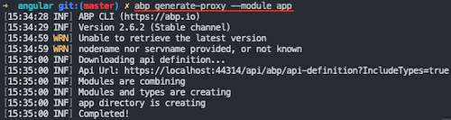

## ASP.NET Core {{UI_Value}} 教程 - 第一章
````json
//[doc-params]
{
    "UI": ["MVC","NG"]
}
````
{{
if UI == "MVC"
  DB="ef"
  DB_Text="Entity Framework Core"
  UI_Text="mvc"
else if UI == "NG"
  DB="mongodb"
  DB_Text="MongoDB"
  UI_Text="angular"
else 
  DB ="?"
  UI_Text="?"
end
}}

### 关于本教程

在本系列教程中, 你将构建一个名为 `Acme.BookStore` 的用于管理书籍及其作者列表的应用程序.  **{{DB_Text}}**将用作ORM提供者,前端使用{{UI_Value}} 和 JavaScript.

ASP.NET Core {{UI_Value}} 系列教程包括三个3个部分:

- **Part-1: 创建项目和书籍列表页面(本章)**
- [Part-2: 创建,编辑,删除书籍](Part-2.md)
- [Part-3: 集成测试](Part-3.md)

> 你也可以观看由ABP社区成员为本教程录制的[视频课程](https://amazingsolutions.teachable.com/p/lets-build-the-booktore-application).

### 创建新项目

创建一个名为 `Acme.BookStore` 的新项目,其中 `Acme` 是公司名 `BookStore` 是项目名. 你可以参阅[入门](../Getting-Started?UI={{UI}}#run-the-application) 文档了解如何创建新项目. 我们将使用CLI创建新项目.

#### 创建项目

使用以下命令创建一个新的ABP项目,使用 `{{DB_Text}}` 做为数据库提供者, UI选项使用 `{{UI_Value}}`. 其他CLI选项请参考[ABP CLI](https://docs.abp.io/en/abp/latest/CLI)文档.

```bash
abp new Acme.BookStore --template app --database-provider {{DB}} --ui {{UI_Text}} --mobile none
```


### 应用迁移

项目创建后,需要应用初始化迁移创建数据库. 运行 `Acme.BookStore.DbMigrator` 应用程序. 它会应用所有迁移,完成流程后你会看到以下结果,数据库已经准备好了!


> 另外你也可以在 Visual Studio 包管理控制台运行 `Update-Database` 命令应用迁移.

#### 初始化数据库表


### 运行应用程序

右键单击{{if UI == "MVC"}} `Acme.BookStore.Web`{{end}} {{if UI == "NG"}} `Acme.BookStore.HttpApi.Host` {{end}} 项目**设置为启动项**. 使用 **CTRL+F5** 或 **F5** 运行应用程序. {{if UI == "NG"}}你会看到BookStore API的Swagger UI.{{end}}

更多信息,参阅[入门教程](../../Getting-Started?UI={{UI}})的运行应用程序部分.


{{if UI == "NG"}}

在 `angular` 下打开命令行终端,执行 `yarn` 命令:

```bash
yarn
```

所有的模块加载后,执行 `yarn start` 命令:

```bash
yarn start
```

默认网站从以下URL访问:

http://localhost:4200/

如果你成功看到登录页面,可以按 `ctrl-c` 退出Angular托管.(我们稍后再运行).

> 注意, Firefox不使用Windows凭据存储,你需要手动将自签名的开发人员证书导入到Firefox. 打开Firefox并导航到以下网址:
>
> https://localhost:44322/api/abp/application-configuration
>
> 如果你看到下图,单击 **Accept the Risk 和 Continue** 按钮绕过警告.
>
> 

{{end}}

默认的登录凭证:

* **Username**: admin
* **Password**: 1q2w3E*

### 解决方案的结构

下面的图片展示了从启动模板创建的项目是如何分层的.


> 你可以查看[应用程序模板文档](../startup-templates/application#solution-structure)以详细了解解决方案结构.

### 创建Book实体

启动模板中的域层分为两个项目:

 - `Acme.BookStore.Domain`包含你的[实体](https://docs.abp.io/zh-Hans/abp/latest/Entities), [领域服务](https://docs.abp.io/zh-Hans/abp/latest/Domain-Services)和其他核心域对象.
 - `Acme.BookStore.Domain.Shared`包含可与客户共享的常量,枚举或其他域相关对象.

在解决方案的**领域层**(`Acme.BookStore.Domain`项目)中定义[实体](https://docs.abp.io/zh-Hans/abp/latest/Entities). 该应用程序的主要实体是`Book`. 在`Acme.BookStore.Domain`项目中创建一个名为`Book`的类,如下所示:

````C#
using System;
using Volo.Abp.Domain.Entities.Auditing;

namespace Acme.BookStore
{
    public class Book : AuditedAggregateRoot<Guid>
    {
        public string Name { get; set; }

        public BookType Type { get; set; }

        public DateTime PublishDate { get; set; }

        public float Price { get; set; }

        protected Book()
        {
        }
        public Book(Guid id, string name, BookType type, DateTime publishDate, float price)
        :base(id)
        {
            Name = name;
            Type = type;
            PublishDate = publishDate;
            Price = price;
        }
    }
}
````

* ABP为实体提供了两个基本的基类: `AggregateRoot`和`Entity`. **Aggregate Root**是**域驱动设计(DDD)** 概念之一. 有关详细信息和最佳做法,请参阅[实体文档](https://docs.abp.io/zh-Hans/abp/latest/Entities).
* `Book`实体继承了`AuditedAggregateRoot`,`AuditedAggregateRoot`类在`AggregateRoot`类的基础上添加了一些审计属性(`CreationTime`, `CreatorId`, `LastModificationTime` 等).
* `Guid`是`Book`实体的主键类型.
* 使用 **数据注解** 为EF Core添加映射.或者你也可以使用 EF Core 自带的[fluent mapping API](https://docs.microsoft.com/en-us/ef/core/modeling).

#### BookType枚举

上面所用到的`BookType`枚举定义如下:

````C#
namespace Acme.BookStore
{
    public enum BookType
    {
        Undefined,
        Adventure,
        Biography,
        Dystopia,
        Fantastic,
        Horror,
        Science,
        ScienceFiction,
        Poetry
    }
}
````

#### 将Book实体添加到DbContext中

{{if DB == "ef"}}

EF Core需要你将实体和 `DbContext` 建立关联.最简单的做法是在`Acme.BookStore.EntityFrameworkCore`项目的`BookStoreDbContext`类中添加`DbSet`属性.如下所示:

````C#
public class BookStoreDbContext : AbpDbContext<BookStoreDbContext>
{
    public DbSet<Book> Book { get; set; }
    ...
}
````

{{end}}

{{if DB == "mongodb"}}

添加 `IMongoCollection<Book> Book` 属性到 `Acme.BookStore.MongoDB` 项目的 `BookStoreMongoDbContext` 中.

```csharp
public class BookStoreMongoDbContext : AbpMongoDbContext
{
        public IMongoCollection<AppUser> Users => Collection<AppUser>();
        public IMongoCollection<Book> Book => Collection<Book>();//<--added this line-->
        //...
}
```

{{end}}

{{if DB == "ef"}}

#### 配置你的Book实体

在 `Acme.BookStore.EntityFrameworkCore` 项目中打开 `BookStoreDbContextModelCreatingExtensions.cs` 文件,并将以下代码添加到 `ConfigureBookStore` 方法的末尾以配置Book实体:

````csharp
builder.Entity<Book>(b =>
{
    b.ToTable(BookStoreConsts.DbTablePrefix + "Book", BookStoreConsts.DbSchema);
    b.ConfigureByConvention(); //auto configure for the base class props
    b.Property(x => x.Name).IsRequired().HasMaxLength(128);
});
````

添加 `using Volo.Abp.EntityFrameworkCore.Modeling;` 以使用 `ConfigureByConvention` 扩展方法.

{{end}}

{{if DB == "mongodb"}}

#### 添加种子数据

添加种子数据是可选的,但第一次运行时最好将初始数据添加到数据库中. ABP提供了[数据种子系统](https://docs.abp.io/en/abp/latest/Data-Seeding). 在 `*.Domain` 项目下创建派生 `IDataSeedContributor` 的类:

```csharp
using System;
using System.Threading.Tasks;
using Volo.Abp.Data;
using Volo.Abp.DependencyInjection;
using Volo.Abp.Domain.Repositories;
using Volo.Abp.Guids;

namespace Acme.BookStore
{
    public class BookStoreDataSeederContributor
        : IDataSeedContributor, ITransientDependency
    {
        private readonly IRepository<Book, Guid> _bookRepository;
        private readonly IGuidGenerator _guidGenerator;

        public BookStoreDataSeederContributor(
            IRepository<Book, Guid> bookRepository,
            IGuidGenerator guidGenerator)
        {
            _bookRepository = bookRepository;
            _guidGenerator = guidGenerator;
        }

        public async Task SeedAsync(DataSeedContext context)
        {
            if (await _bookRepository.GetCountAsync() > 0)
            {
                return;
            }

            await _bookRepository.InsertAsync(
                new Book(
                    id: _guidGenerator.Create(),
                    name: "1984",
                    type: BookType.Dystopia,
                    publishDate: new DateTime(1949, 6, 8),
                    price: 19.84f
                )
            );

            await _bookRepository.InsertAsync(
                new Book(
                    id: _guidGenerator.Create(),
                    name: "The Hitchhiker's Guide to the Galaxy",
                    type: BookType.ScienceFiction,
                    publishDate: new DateTime(1995, 9, 27),
                    price: 42.0f
                )
            );
        }
    }
}
```

{{end}}

{{if DB == "ef"}}

#### 添加新的Migration并更新数据库

这个启动模板使用了[EF Core Code First Migrations](https://docs.microsoft.com/en-us/ef/core/managing-schemas/migrations/)来创建并维护数据库结构.打开 **程序包管理器控制台(Package Manager Console) (PMC)** (工具/Nuget包管理器菜单)


选择 `Acme.BookStore.EntityFrameworkCore.DbMigrations`作为默认的项目然后执行下面的命令:

```bash
Add-Migration "Created_Book_Entity"
```


这样就会在 `Migrations` 文件夹中创建一个新的migration类.然后执行 `Update-Database` 命令更新数据库结构:

````bash
Update-Database
````


#### 添加示例数据

`Update-Database`命令在数据库中创建了`AppBook`表. 打开数据库并输入几个示例行,以便在页面上显示它们:

```mssql
INSERT INTO AppBook (Id,CreationTime,[Name],[Type],PublishDate,Price) VALUES
('f3c04764-6bfd-49e2-859e-3f9bfda6183e', '2018-07-01', '1984',3,'1949-06-08','19.84')

INSERT INTO AppBook (Id,CreationTime,[Name],[Type],PublishDate,Price) VALUES
('13024066-35c9-473c-997b-83cd8d3e29dc', '2018-07-01', 'The Hitchhiker`s Guide to the Galaxy',7,'1995-09-27','42')

INSERT INTO AppBook (Id,CreationTime,[Name],[Type],PublishDate,Price) VALUES
('4fa024a1-95ac-49c6-a709-6af9e4d54b54', '2018-07-02', 'Pet Sematary',5,'1983-11-14','23.7')
```


{{end}}

### 创建应用服务

下一步是创建[应用服务](../Application-Services.md)来管理(创建,列出,更新,删除)书籍. 启动模板中的应用程序层分为两个项目:

* `Acme.BookStore.Application.Contracts`主要包含你的DTO和应用程序服务接口.
* `Acme.BookStore.Application`包含应用程序服务的实现.

#### BookDto

在`Acme.BookStore.Application.Contracts`项目中创建一个名为`BookDto`的DTO类:

````C#
using System;
using Volo.Abp.Application.Dtos;

namespace Acme.BookStore
{
    public class BookDto : AuditedEntityDto<Guid>
    {
        public string Name { get; set; }

        public BookType Type { get; set; }

        public DateTime PublishDate { get; set; }

        public float Price { get; set; }
    }
}
````

* **DTO**类被用来在 **表示层** 和 **应用层** **传递数据**.查看[DTO文档](https://docs.abp.io/zh-Hans/abp/latest/Data-Transfer-Objects)查看更多信息.
* 为了在页面上展示书籍信息,`BookDto`被用来将书籍数据传递到表示层.
* `BookDto`继承自 `AuditedEntityDto<Guid>`.跟上面定义的`Book`类一样具有一些审计属性.

在将书籍返回到表示层时,需要将`Book`实体转换为`BookDto`对象. [AutoMapper](https://automapper.org)库可以在定义了正确的映射时自动执行此转换. 启动模板配置了AutoMapper,因此你只需在`Acme.BookStore.Application`项目的`BookStoreApplicationAutoMapperProfile`类中定义映射:

````csharp
using AutoMapper;

namespace Acme.BookStore
{
    public class BookStoreApplicationAutoMapperProfile : Profile
    {
        public BookStoreApplicationAutoMapperProfile()
        {
            CreateMap<Book, BookDto>();
        }
    }
}
````

#### CreateUpdateBookDto

在`Acme.BookStore.Application.Contracts`项目中创建一个名为`CreateUpdateBookDto`的DTO类:

````c#
using System;
using System.ComponentModel.DataAnnotations;
using Volo.Abp.AutoMapper;

namespace Acme.BookStore
{
    public class CreateUpdateBookDto
    {
        [Required]
        [StringLength(128)]
        public string Name { get; set; }

        [Required]
        public BookType Type { get; set; } = BookType.Undefined;

        [Required]
        public DateTime PublishDate { get; set; }

        [Required]
        public float Price { get; set; }
    }
}
````

* 这个DTO类被用于在创建或更新书籍的时候从用户界面获取图书信息.
* 它定义了数据注释属性(如`[Required]`)来定义属性的验证. DTO由ABP框架[自动验证](https://docs.abp.io/zh-Hans/abp/latest/Validation).

就像上面的`BookDto`一样,创建一个从`CreateUpdateBookDto`对象到`Book`实体的映射:

````csharp
using AutoMapper;

namespace Acme.BookStore
{
    public class BookStoreApplicationAutoMapperProfile : Profile
    {
        public BookStoreApplicationAutoMapperProfile()
        {
            CreateMap<Book, BookDto>();
            CreateMap<CreateUpdateBookDto, Book>(); //<--added this line-->
        }
    }
}
````

#### IBookAppService

在`Acme.BookStore.Application.Contracts`项目中定义一个名为`IBookAppService`的接口:

````C#
using System;
using Volo.Abp.Application.Dtos;
using Volo.Abp.Application.Services;

namespace Acme.BookStore
{
    public interface IBookAppService : 
        ICrudAppService< //定义了CRUD方法
            BookDto, //用来展示书籍
            Guid, //Book实体的主键
            PagedAndSortedResultRequestDto, //获取书籍的时候用于分页和排序
            CreateUpdateBookDto, //用于创建书籍
            CreateUpdateBookDto> //用于更新书籍
    {

    }
}
````

* 框架定义应用程序服务的接口**不是必需的**. 但是,它被建议作为最佳实践.
* `ICrudAppService`定义了常见的**CRUD**方法:`GetAsync`,`GetListAsync`,`CreateAsync`,`UpdateAsync`和`DeleteAsync`. 你可以从空的`IApplicationService`接口继承并手动定义自己的方法.
* `ICrudAppService`有一些变体, 你可以在每个方法中使用单独的DTO,也可以分别单独指定.

#### BookAppService

在`Acme.BookStore.Application`项目中实现名为`BookAppService`的`IBookAppService`:

````C#
using System;
using Volo.Abp.Application.Dtos;
using Volo.Abp.Application.Services;
using Volo.Abp.Domain.Repositories;

namespace Acme.BookStore
{
    public class BookAppService : 
        CrudAppService<Book, BookDto, Guid, PagedAndSortedResultRequestDto,
                            CreateUpdateBookDto, CreateUpdateBookDto>,
        IBookAppService
    {
        public BookAppService(IRepository<Book, Guid> repository) 
            : base(repository)
        {

        }
    }
}
````

* `BookAppService`继承了`CrudAppService<...>`.它实现了上面定义的CRUD方法.
* `BookAppService`注入`IRepository <Book,Guid>`,这是`Book`实体的默认仓储. ABP自动为每个聚合根(或实体)创建默认仓储. 请参阅[仓储文档](https://docs.abp.io/zh-Hans/abp/latest/Repositories)
* `BookAppService`使用`IObjectMapper`将`Book`对象转换为`BookDto`对象, 将`CreateUpdateBookDto`对象转换为`Book`对象. 启动模板使用[AutoMapper](http://automapper.org/)库作为对象映射提供程序. 你之前定义了映射, 因此它将按预期工作.

### 自动生成API Controllers

你通常创建**Controller**以将应用程序服务公开为**HTTP API**端点. 因此允许浏览器或第三方客户端通过AJAX调用它们. ABP可以[**自动**](https://docs.abp.io/zh-Hans/abp/latest/API/Auto-API-Controllers)按照惯例将你的应用程序服务配置为MVC API控制器.

#### Swagger UI

启动模板配置为使用[Swashbuckle.AspNetCore](https://github.com/domaindrivendev/Swashbuckle.AspNetCore)运行[swagger UI](https://swagger.io/tools/swagger-ui/). 运行应用程序并在浏览器中输入`https://localhost:XXXX/swagger/`(用你自己的端口替换XXXX)作为URL.

你会看到一些内置的接口和`Book`的接口,它们都是REST风格的:


Swagger有一个很好的UI来测试API. 你可以尝试执行`[GET] /api/app/book` API来获取书籍列表.

{{if UI == "MVC"}}

### 动态JavaScript代理

在Javascript端通过AJAX的方式调用HTTP API接口是很常见的,你可以使用`$.ajax`或者其他的工具来调用接口.当然,ABP中提供了更好的方式.

ABP **自动** 为所有的API接口创建了JavaScript **代理**.因此,你可以像调用 **JavaScript function**一样调用任何接口.

#### 在浏览器的开发者控制台中测试接口

你可以使用你钟爱的浏览器的 **开发者控制台** 中轻松测试JavaScript代理.运行程序,并打开浏览器的 **开发者工具**(快捷键:F12),切换到 **Console** 标签,输入下面的代码并回车:

````js
acme.bookStore.book.getList({}).done(function (result) { console.log(result); });
````

* `acme.bookStore`是`BookAppService`的命名空间,转换成了[驼峰命名](https://en.wikipedia.org/wiki/Camel_case).
* `book`是`BookAppService`转换后的名字(去除了AppService后缀并转成了驼峰命名).
* `getList`是定义在`AsyncCrudAppService`基类中的`GetListAsync`方法转换后的名字(去除了Async后缀并转成了驼峰命名).
* `{}`参数用于将空对象发送到`GetListAsync`方法,该方法通常需要一个类型为`PagedAndSortedResultRequestDto`的对象,用于向服务器发送分页和排序选项(所有属性都是可选的,所以你可以发送一个空对象).
* `getList`方法返回了一个`promise`.因此,你可以传递一个回调函数到`done`(或者`then`)方法中来获取服务返回的结果.

运行这段代码会产生下面的输出:


你可以看到服务器返回的 **book list**.你还可以切换到开发者工具的 **network** 查看客户端到服务器端的通讯信息:


我们使用`create`方法 **创建一本新书**:

````js
acme.bookStore.book.create({ name: 'Foundation', type: 7, publishDate: '1951-05-24', price: 21.5 }).done(function (result) { console.log('successfully created the book with id: ' + result.id); });
````

你会看到控制台会显示类似这样的输出:

````text
successfully created the book with id: 439b0ea8-923e-8e1e-5d97-39f2c7ac4246
````

检查数据库中的`Book`表以查看新书. 你可以自己尝试`get`,`update`和`delete`功能.

### 创建书籍页面

现在我们来创建一些可见和可用的东西,取代经典的MVC,我们使用微软推荐的[Razor Pages UI](https://docs.microsoft.com/en-us/aspnet/core/tutorials/razor-pages/razor-pages-start).

在 `Acme.BookStore.Web`项目的`Pages`文件夹下创建一个新的文件夹叫`Book`并添加一个名为`Index.cshtml`的Razor Page.


打开`Index.cshtml`并把内容修改成下面这样:

**Index.cshtml:**

````html
@page
@using Acme.BookStore.Web.Pages.Book
@inherits Acme.BookStore.Web.Pages.BookStorePage
@model IndexModel

<h2>Book</h2>
````

* 此代码更改了Razor View Page Model的默认继承,因此它从`BookStorePage`类(而不是`PageModel`)继承.启动模板附带的`BookStorePage`类,提供所有页面使用的一些共享属性/方法.
* 确保`IndexModel`(Index.cshtml.cs)具有`Acme.BookStore.Web.Pages.Book`命名空间,或者在`Index.cshtml`中更新它.

**Index.cshtml.cs:**

```csharp
using Microsoft.AspNetCore.Mvc.RazorPages;

namespace Acme.BookStore.Web.Pages.Book
{
    public class IndexModel : PageModel
    {
        public void OnGet()
        {

        }
    }
}
```

#### 将Book页面添加到主菜单

打开`Menus`文件夹中的 `BookStoreMenuContributor` 类,在`ConfigureMainMenuAsync`方法的底部添加如下代码:

````csharp
//...
namespace Acme.BookStore.Web.Menus
{
    public class BookStoreMenuContributor : IMenuContributor
    { 
        private async Task ConfigureMainMenuAsync(MenuConfigurationContext context)
        {
            //<-- added the below code
            context.Menu.AddItem(
                new ApplicationMenuItem("BookStore", l["Menu:BookStore"])
                    .AddItem(
                        new ApplicationMenuItem("BookStore.Book", l["Menu:Book"], url: "/Book")
                    )
            );
            //-->
        }
    }
}
````

{{end}}

#### 本地化菜单

本地化文本位于`Acme.BookStore.Domain.Shared`项目的`Localization/BookStore`文件夹下:


打开`en.json`文件,将`Menu:BookStore`和`Menu:Book`键的本地化文本添加到文件末尾:

````json
{
  "Culture": "en",
  "Texts": {
    "Menu:Home": "Home",
    "Welcome": "Welcome",
    "LongWelcomeMessage": "Welcome to the application. This is a startup project based on the ABP framework. For more information, visit abp.io.",

    "Menu:BookStore": "Book Store",
    "Menu:Book": "Book",
    "Actions": "Actions",
    "Edit": "Edit",
    "PublishDate": "Publish date",
    "NewBook": "New book",
    "Name": "Name",
    "Type": "Type",
    "Price": "Price",
    "CreationTime": "Creation time",
    "AreYouSureToDelete": "Are you sure you want to delete this item?"
  }
}
````

* ABP的本地化功能建立在[ASP.NET Core's standard localization]((https://docs.microsoft.com/en-us/aspnet/core/fundamentals/localization))之上并增加了一些扩展.查看[本地化文档](https://docs.abp.io/zh-Hans/abp/latest/Localization).
* 本地化key是任意的. 你可以设置任何名称. 我们更喜欢为菜单项添加`Menu:`前缀以区别于其他文本. 如果未在本地化文件中定义文本,则它将**返回**到本地化的key(ASP.NET Core的标准行为).

运行该应用程序,看到新菜单项已添加到顶部栏:


点击BookStore下Book子菜单项就会跳转到新增的书籍页面.

#### 书籍列表

我们将使用[Datatables.net](https://datatables.net/)JQuery插件来显示页面上的表格列表. [Datatables](https://datatables.net/)可以完全通过AJAX工作,速度快,并提供良好的用户体验. Datatables插件在启动模板中配置,因此你可以直接在任何页面中使用它,而需要在页面中引用样式和脚本文件.

##### Index.cshtml

将`Pages/Book/Index.cshtml`改成下面的样子:

````html
@page
@inherits Acme.BookStore.Web.Pages.BookStorePage
@model Acme.BookStore.Web.Pages.Book.IndexModel
@section scripts
{
    <abp-script src="/Pages/Book/index.js" />
}
<abp-card>
    <abp-card-header>
        <h2>@L["Book"]</h2>
    </abp-card-header>
    <abp-card-body>
        <abp-table striped-rows="true" id="BookTable">
            <thead>
                <tr>
                    <th>@L["Name"]</th>
                    <th>@L["Type"]</th>
                    <th>@L["PublishDate"]</th>
                    <th>@L["Price"]</th>
                    <th>@L["CreationTime"]</th>
                </tr>
            </thead>
        </abp-table>
    </abp-card-body>
</abp-card>
````

* `abp-script` [tag helper](https://docs.microsoft.com/en-us/aspnet/core/mvc/views/tag-helpers/intro)用于将外部的 **脚本** 添加到页面中.它比标准的`script`标签多了很多额外的功能.它可以处理 **最小化**和 **版本**.查看[捆绑 & 压缩文档](https://docs.abp.io/zh-Hans/abp/latest/UI/AspNetCore/Bundling-Minification)获取更多信息.
* `abp-card` 和 `abp-table` 是为Twitter Bootstrap的[card component](http://getbootstrap.com/docs/4.1/components/card/)封装的 **tag helpers**.ABP中有很多tag helpers,可以很方便的使用大多数[bootstrap](https://getbootstrap.com/)组件.你也可以使用原生的HTML标签代替tag helpers.使用tag helper可以通过智能提示和编译时类型检查减少HTML代码并防止错误.查看[tag helpers 文档](https://docs.abp.io/zh-Hans/abp/latest/UI/AspNetCore/Tag-Helpers/Index).
* 你可以像上面本地化菜单一样 **本地化** 列名.

#### 添加脚本文件

在`Pages/Book/`文件夹中创建 `index.js`文件


`index.js`的内容如下:

````js
$(function () {
    var dataTable = $('#BookTable').DataTable(abp.libs.datatables.normalizeConfiguration({
        ajax: abp.libs.datatables.createAjax(acme.bookStore.book.getList),
        columnDefs: [
            { data: "name" },
            { data: "type" },
            { data: "publishDate" },
            { data: "price" },
            { data: "creationTime" }
        ]
    }));
});
````

* `abp.libs.datatables.createAjax`是帮助ABP的动态JavaScript API代理跟[Datatable](https://datatables.net/)的格式相适应的辅助方法.
* `abp.libs.datatables.normalizeConfiguration`是另一个辅助方法.不是必须的, 但是它通过为缺少的选项提供常规值来简化数据表配置.
* `acme.bookStore.book.getList`是获取书籍列表的方法(上面已经介绍过了)
* 查看 [Datatable文档](https://datatables.net/manual/) 了解更多配置项.

最终的页面如下:


{{end}}

{{if UI == "NG"}}

### Angular 开发

#### 创建book页面

是时候创建可见和可用的东西了!开发ABP Angular前端应用程序时,需要使用一些工具:

- [Angular CLI](https://angular.io/cli) 用于创建模块,组件和服务.
- [NGXS](https://ngxs.gitbook.io/ngxs/) 用于管理状态库.
- [Ng Bootstrap](https://ng-bootstrap.github.io/#/home) 用做UI组件库.
- [Visual Studio Code](https://code.visualstudio.com/) 用做代码编辑器 (你可以选择自己喜欢的编辑器).

#### 安装 NPM 包

在 `angular` 目录下打开命令行窗口,选择 `yarn` 命令安装NPM包:

```bash
yarn
```

#### BookModule

运行以下命令创建一个名为 `BookModule` 的新模块:

```bash
yarn ng generate module book --routing true
```


#### 路由

打开位于 `src\app` 目录下的 `app-routing.module.ts` 文件. 添加新的 `import` 和路由:

```js
import { ApplicationLayoutComponent } from '@abp/ng.theme.basic'; //==> added this line to imports <==

//...added book path with the below to the routes array
{
  path: 'book',
  component: ApplicationLayoutComponent,
  loadChildren: () => import('./book/book.module').then(m => m.BookModule),
  data: {
    routes: {
      name: '::Menu:Book',
      iconClass: 'fas fa-book'
    } as ABP.Route
  },
}
```

* `ApplicationLayoutComponent` 配置将应用程序布局设置为新页面, 我们添加了 `data` 对象. `name` 是菜单项的名称,`iconClass` 是菜单项的图标.

#### Book 列表组件

在命令行运行以下命令,生成名为 book-list 的新组件:

```bash
yarn ng generate component book/book-list
```


打开 `app\book` 目录下的 `book.module.ts` 文件,使用以下内容替换它:

```js
import { NgModule } from '@angular/core';
import { CommonModule } from '@angular/common';
import { BookRoutingModule } from './book-routing.module';
import { BookListComponent } from './book-list/book-list.component';
import { SharedModule } from '../shared/shared.module'; //<== added this line ==>

@NgModule({
  declarations: [BookListComponent],
  imports: [
    CommonModule,
    BookRoutingModule,
    SharedModule, //<== added this line ==>
  ],
})
export class BookModule {}
```

* 我们导入了 `SharedModule` 并添加到 `imports` 数组.

打开 `app\book` 目录下的 `book-routing.module.ts` 文件用以下内容替换它:

```js
import { NgModule } from '@angular/core';
import { Routes, RouterModule } from '@angular/router';
import { BookListComponent } from './book-list/book-list.component'; // <== added this line ==>

// <== replaced routes ==>
const routes: Routes = [
  {
    path: '',
    component: BookListComponent,
  },
];

@NgModule({
  imports: [RouterModule.forChild(routes)],
  exports: [RouterModule]
})
export class BookRoutingModule { }
```

* 我们导入了 `BookListComponent` 并替换 `routes` 常量.

运行 `yarn start`,等待Angular启动服务:

```bash
yarn start
```

我们将看到book页面的 **book-list works!**:


#### 创建 BookState

运行以下命令创建名为 `BookState` 的新state:

```bash
npx @ngxs/cli --name book --directory src/app/book
```

* 此命令在 `src/app/book/state` 文件夹下创建了 `book.state.ts` 和 `book.actions.ts` 文件. 参阅 [NGXS CLI文档](https://www.ngxs.io/plugins/cli)了解更多.

将 `BookState` 导入到 `src/app` 文件夹中的 `app.module.ts` 中. 然后添加 `BookState` 到 `NgxsModule` 的 `forRoot` 静态方法,作为该方法的第一个参数的数组元素.

```js
// ...
import { BookState } from './book/state/book.state'; //<== imported BookState ==>

@NgModule({
  imports: [
    // other imports

    NgxsModule.forRoot([BookState]), //<== added BookState ==>

    //other imports
  ],
  // ...
})
export class AppModule {}
```

#### 生成代理

ABP CLI提供了 `generate-proxy` 命令为你的服务HTTP API生成客户端代理简化客户端使用服务的成本. 运行 `generate-proxy` 命令前你的host必须正在运行. 参阅 [CLI 文档](../CLI.md).

在 `angular` 文件夹下运行以下命令:

```bash
abp generate-proxy --module app
```



生成的文件如下:


#### GetBook 动作

动作可以被认为是一个命令,它应该触发某些事情发生,或者是已经发生的事情的结果事件.[See NGXS Actions文档](https://www.ngxs.io/concepts/actions).

打开 `app/book/state` 目录下的 `book.actions.ts` 文件用以下内容替换它:

```js
export class GetBook {
  static readonly type = '[Book] Get';
}
```

#### 实现 BookState

打开 `app/book/state` 目录下的 `book.state.ts` 文件用以下内容替换它:

```js
import { PagedResultDto } from '@abp/ng.core';
import { State, Action, StateContext, Selector } from '@ngxs/store';
import { GetBooks } from './book.actions';
import { BookService } from '../services';
import { tap } from 'rxjs/operators';
import { Injectable } from '@angular/core';
import { BookDto } from '../models';

export class BookStateModel {
  public book: PagedResultDto<BookDto>;
}

@State<BookStateModel>({
  name: 'BookState',
  defaults: { book: {} } as BookStateModel,
})
@Injectable()
export class BookState {
  @Selector()
  static getBooks(state: BookStateModel) {
    return state.book.items || [];
  }

  constructor(private bookService: BookService) {}

  @Action(GetBooks)
  get(ctx: StateContext<BookStateModel>) {
    return this.bookService.getListByInput().pipe(
      tap((booksResponse) => {
        ctx.patchState({
          book: booksResponse,
        });
      })
    );
  }
}
```

* 我们添加了book属性到BookStateModel模态框.
* 我们添加了 `GetBook` 动作. 它通过 ABP CLI生成的 `BookService` 检索图书数据.
* `NGXS` 需要在不订阅get函数的情况下返回被观察对象.

#### BookListComponent

打开 `app\book\book-list` 目录下的 `book-list.component.ts` 用以下内容替换它:

```js
import { Component, OnInit } from '@angular/core';
import { Select, Store } from '@ngxs/store';
import { Observable } from 'rxjs';
import { finalize } from 'rxjs/operators';
import { BookDto, BookType } from '../models';
import { GetBooks } from '../state/book.actions';
import { BookState } from '../state/book.state';

@Component({
  selector: 'app-book-list',
  templateUrl: './book-list.component.html',
  styleUrls: ['./book-list.component.scss'],
})
export class BookListComponent implements OnInit {
  @Select(BookState.getBooks)
  books$: Observable<BookDto[]>;

  booksType = BookType;

  loading = false;

  constructor(private store: Store) {}

  ngOnInit() {
    this.get();
  }

  get() {
    this.loading = true;
    this.store
      .dispatch(new GetBooks())
      .pipe(finalize(() => (this.loading = false)))
      .subscribe(() => {});
  }
}
```

* 我们添加了 `get` 函数获取book更新store.
* 有关 `NGXS` 特性的更多信息请参见NGXS文档中的[Dispatching actions](https://ngxs.gitbook.io/ngxs/concepts/store#dispatching-actions)和[Select](https://ngxs.gitbook.io/ngxs/concepts/select).

打开 `app\book\book-list` 目录下的 `book-list.component.html` 用以下内容替换它:

```html
<div class="card">
  <div class="card-header">
    <div class="row">
      <div class="col col-md-6">
        <h5 class="card-title">
          
        </h5>
      </div>
      <div class="text-right col col-md-6"></div>
    </div>
  </div>
  <div class="card-body">
    <abp-table
      [value]="book$ | async"
      [abpLoading]="loading"
      [headerTemplate]="tableHeader"
      [bodyTemplate]="tableBody"
      [rows]="10"
      [scrollable]="true"
    >
    </abp-table>
    <ng-template #tableHeader>
      <tr>
        <th></th>
        <th></th>
        <th></th>
        <th></th>
      </tr>
    </ng-template>
    <ng-template #tableBody let-data>
      <tr>
        <td></td>
        <td></td>
        <td></td>
        <td></td>
      </tr>
    </ng-template>
  </div>
</div>
```

* 我们添加了图书列表页面的HTML代码.

现在你可以在浏览器看到最终结果:


项目的文件系统结构:


在本教程中我们遵循了官方的[Angular风格指南](https://angular.io/guide/styleguide#file-tree).

{{end}}

### 下一章

参阅[第二章](part-2.md)了解创建,更新和删除图书.