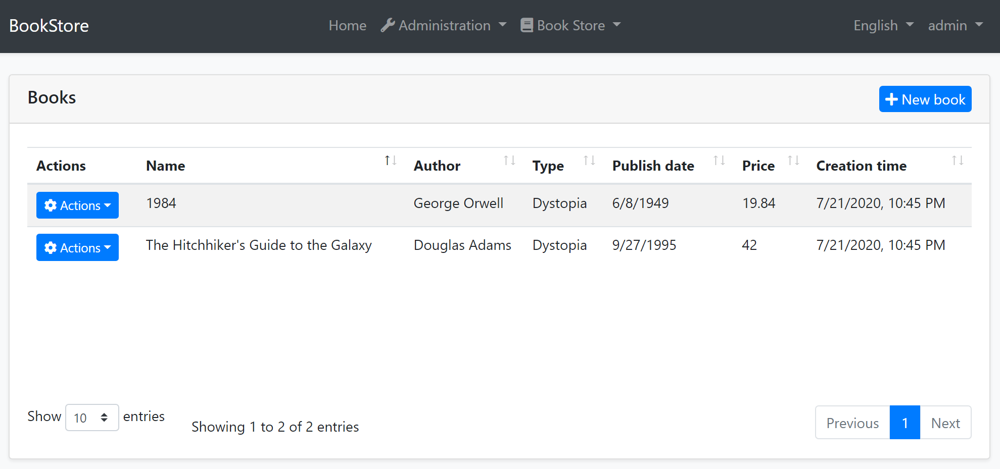
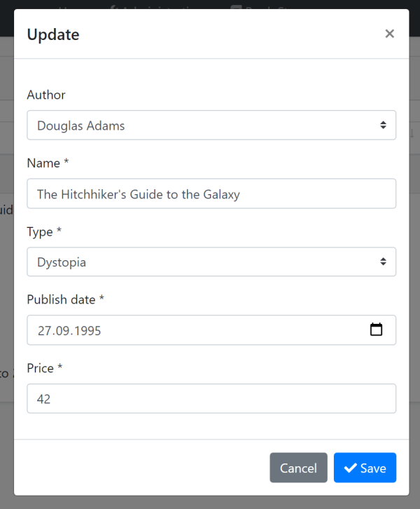
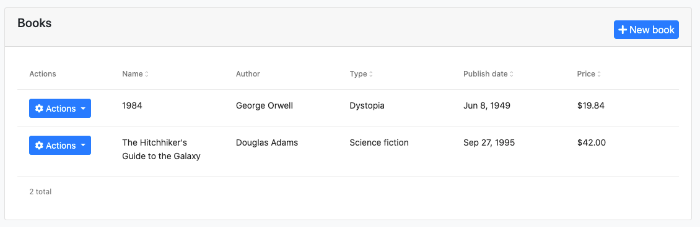
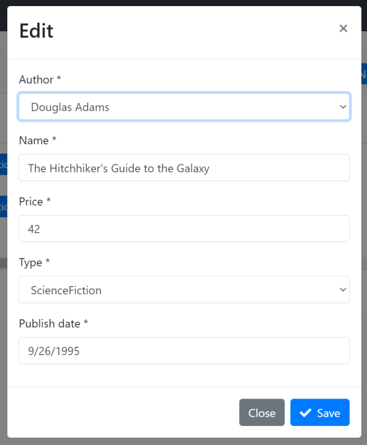
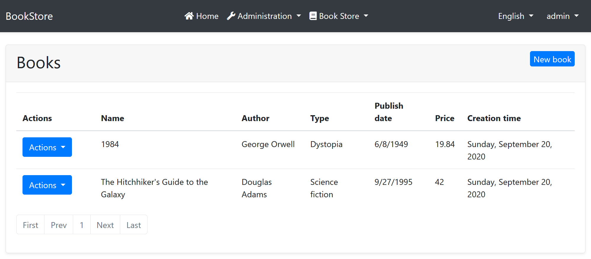
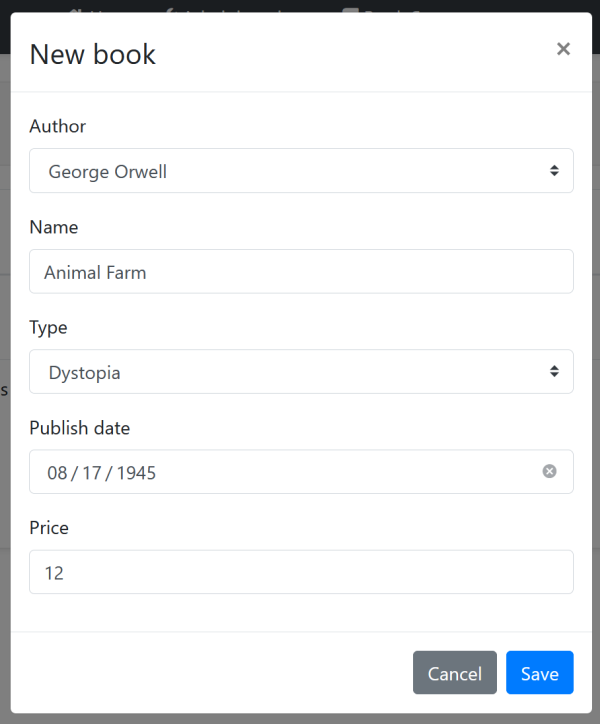

# Web应用程序开发教程 - 第十章: 图书到作者的关系
````json
//[doc-params]
{
    "UI": ["MVC","Blazor","BlazorServer","NG"],
    "DB": ["EF","Mongo"]
}
````
## 关于本教程

在本系列教程中, 你将构建一个名为 `Acme.BookStore` 的用于管理书籍及其作者列表的基于ABP的应用程序.  它是使用以下技术开发的:

* **{{DB_Text}}** 做为ORM提供程序.
* **{{UI_Value}}** 做为UI框架.

本教程分为以下部分:

- [Part 1: 创建服务端](Part-1.md)
- [Part 2: 图书列表页面](Part-2.md)
- [Part 3: 创建,更新和删除图书](Part-2.md)
- [Part 4: 集成测试](Part-4.md)
- [Part 5: 授权](Part-5.md)
- [Part 6: 作者: 领域层](Part-6.md)
- [Part 7: 作者: 数据库集成](Part-7.md)
- [Part 8: 作者: 应用服务层](Part-8.md)
- [Part 9: 作者: 用户页面](Part-9.md)
- **Part 10: 图书到作者的关系 (本章)**

## 下载源码

本教程根据你的**UI** 和 **数据库**偏好有多个版本,我们准备了几种可供下载的源码组合:

* [MVC (Razor Pages) UI 与 EF Core](https://github.com/abpframework/abp-samples/tree/master/BookStore-Mvc-EfCore)
* [Blazor UI 与 EF Core](https://github.com/abpframework/abp-samples/tree/master/BookStore-Blazor-EfCore)
* [Angular UI 与 MongoDB](https://github.com/abpframework/abp-samples/tree/master/BookStore-Angular-MongoDb)

> 如果你在Windows中遇到 "文件名太长" or "解压错误", 很可能与Windows最大文件路径限制有关. Windows文件路径的最大长度为250字符. 为了解决这个问题,参阅 [在Windows 10中启用长路径](https://docs.microsoft.com/en-us/windows/win32/fileio/maximum-file-path-limitation?tabs=cmd#enable-long-paths-in-windows-10-version-1607-and-later).

> 如果你遇到与Git相关的长路径错误, 尝试使用下面的命令在Windows中启用长路径. 参阅 https://github.com/msysgit/msysgit/wiki/Git-cannot-create-a-file-or-directory-with-a-long-path
> `git config --system core.longpaths true`

## 简介

我们已经为图书管理应用程序创建了 `图书` 和 `作者` 功能. 然而, 这些实体间还没有关联.

在本章, 我们会在 `作者` 和 `图书` 实体间建立 **1 对 N** 的关系.

## 在图书实体中加入关系

打开 `Acme.BookStore.Domain` 项目中的 `Books/Book.cs`, 在 `Book` 实体中加入下列属性:

````csharp
public Guid AuthorId { get; set; }
````

{{if DB=="EF"}}

> 在本章中, 我们选择不在 `Book` 类中加入 `Author` 实体的 **导航属性** (例如 `public Author Author { get; set; }`). 这是为了遵循 DDD 最佳实践 (规则: 仅通过id引用其它聚合对象). 但是, 你自己可以添加这样的导航属性, 并为EF Core配置它. 这样, 你在获取图书和它们的作者时就不需要写join查询了(如同下面我们做的一样), 这会使代码更简洁一些.

{{end}}

## 数据库 & 数据迁移

为 `Book` 实体新增一个不为空的 `AuthorId` 属性. 但是, 数据库中**已存在的图书怎么办**? 它们没有 `AuthorId`s, 当我们尝试运行应用程序时会出问题.

这是一个 **典型的迁移问题**, 解决方案依赖于你的具体情况;

* 如果你还没有发布应用程序到生产环境, 你可以直接删除数据库中的图书数据, 甚至你可以删除开发环境中的整个数据库.
* 你可以在数据迁移或生成种子阶段使用代码更新已有数据.
* 你可以手工处理这些数据.

我们倾向于 **删除数据库** {{if DB=="EF"}}(你可以在 *Package Manager 控制台*中运行 `Drop-Database`){{end}}, 因为这只是个示例项目, 数据丢失并不要紧. 因为这个主题不是关于ABP框架的, 我们不会深入所有的场景.

{{if DB=="EF"}}

### 更新 EF Core 映射

定位到 `Acme.BookStore.EntityFrameworkCore` 项目的 `EntityFrameworkCore` 文件夹下的 `BookStoreDbContext` 类的 `OnModelCreating` 方法, 修改 `builder.Entity<Book>` 部分如下:

````csharp
builder.Entity<Book>(b =>
{
    b.ToTable(BookStoreConsts.DbTablePrefix + "Books", BookStoreConsts.DbSchema);
    b.ConfigureByConvention(); //auto configure for the base class props
    b.Property(x => x.Name).IsRequired().HasMaxLength(128);

    // ADD THE MAPPING FOR THE RELATION
    b.HasOne<Author>().WithMany().HasForeignKey(x => x.AuthorId).IsRequired();
});
````

### 新增 EF Core 迁移

启动解决方案被配置为使用 [Entity Framework Core Code First Migrations](https://docs.microsoft.com/en-us/ef/core/managing-schemas/migrations/). 因为我们修改了数据库映射配置, 我们需要新建一个迁移并应用于数据库.

在 `Acme.BookStore.EntityFrameworkCore` 项目的文件目录打开命令行终端, 输入命令:

````bash
dotnet ef migrations add Added_AuthorId_To_Book
````

这会创建一个新的迁移类, 在它的 `Up` 方法中使用下列方法:

````csharp
migrationBuilder.AddColumn<Guid>(
    name: "AuthorId",
    table: "AppBooks",
    nullable: false,
    defaultValue: new Guid("00000000-0000-0000-0000-000000000000"));

migrationBuilder.CreateIndex(
    name: "IX_AppBooks_AuthorId",
    table: "AppBooks",
    column: "AuthorId");

migrationBuilder.AddForeignKey(
    name: "FK_AppBooks_AppAuthors_AuthorId",
    table: "AppBooks",
    column: "AuthorId",
    principalTable: "AppAuthors",
    principalColumn: "Id",
    onDelete: ReferentialAction.Cascade);
````

* `AppBooks` 表增加一个 `AuthorId` 字段 .
* 根据 `AuthorId` 字段新建一个索引.
* 声明到 `AppAuthors` 表的外键.

> 如果你使用 Visual Studio, 可能希望在 *Package Manager Console (PMC)* 使用 `Add-Migration Added_AuthorId_To_Book -c BookStoreMigrationsDbContext` 和 `Update-Database -c BookStoreMigrationsDbContext` 命令. 如果这样, 保证 {{if UI=="MVC"}}`Acme.BookStore.Web`{{else if UI=="BlazorServer"}}`Acme.BookStore.Blazor`{{else if UI=="Blazor" || UI=="NG"}}`Acme.BookStore.HttpApi.Host`{{end}} 是启动项目并且在PMC中 `Acme.BookStore.EntityFrameworkCore` 是 *默认项目* .

{{end}}

## 修改数据种子

因为 `AuthorId` 是 `Book` 实体的不可为空属性, 当前的数据种子代码不能工作. 打开 `Acme.BookStore.Domain` 项目中的 `BookStoreDataSeederContributor`, 修改成以下代码:

````csharp
using System;
using System.Threading.Tasks;
using Acme.BookStore.Authors;
using Acme.BookStore.Books;
using Volo.Abp.Data;
using Volo.Abp.DependencyInjection;
using Volo.Abp.Domain.Repositories;

namespace Acme.BookStore
{
    public class BookStoreDataSeederContributor
        : IDataSeedContributor, ITransientDependency
    {
        private readonly IRepository<Book, Guid> _bookRepository;
        private readonly IAuthorRepository _authorRepository;
        private readonly AuthorManager _authorManager;

        public BookStoreDataSeederContributor(
            IRepository<Book, Guid> bookRepository,
            IAuthorRepository authorRepository,
            AuthorManager authorManager)
        {
            _bookRepository = bookRepository;
            _authorRepository = authorRepository;
            _authorManager = authorManager;
        }

        public async Task SeedAsync(DataSeedContext context)
        {
            if (await _bookRepository.GetCountAsync() > 0)
            {
                return;
            }

            var orwell = await _authorRepository.InsertAsync(
                await _authorManager.CreateAsync(
                    "George Orwell",
                    new DateTime(1903, 06, 25),
                    "Orwell produced literary criticism and poetry, fiction and polemical journalism; and is best known for the allegorical novella Animal Farm (1945) and the dystopian novel Nineteen Eighty-Four (1949)."
                )
            );

            var douglas = await _authorRepository.InsertAsync(
                await _authorManager.CreateAsync(
                    "Douglas Adams",
                    new DateTime(1952, 03, 11),
                    "Douglas Adams was an English author, screenwriter, essayist, humorist, satirist and dramatist. Adams was an advocate for environmentalism and conservation, a lover of fast cars, technological innovation and the Apple Macintosh, and a self-proclaimed 'radical atheist'."
                )
            );

            await _bookRepository.InsertAsync(
                new Book
                {
                    AuthorId = orwell.Id, // SET THE AUTHOR
                    Name = "1984",
                    Type = BookType.Dystopia,
                    PublishDate = new DateTime(1949, 6, 8),
                    Price = 19.84f
                },
                autoSave: true
            );

            await _bookRepository.InsertAsync(
                new Book
                {
                    AuthorId = douglas.Id, // SET THE AUTHOR
                    Name = "The Hitchhiker's Guide to the Galaxy",
                    Type = BookType.ScienceFiction,
                    PublishDate = new DateTime(1995, 9, 27),
                    Price = 42.0f
                },
                autoSave: true
            );
        }
    }
}
````

唯一的区别是设置 `Book` 实体的 `AuthorId` 属性.

> 执行 `DbMigrator` 前删除已有图书或数据库. 参阅上面的 *数据库 & 数据迁移* 小节获取详细信息.

{{if DB=="EF"}}

你现在可以运行 `.DbMigrator` 控制台应用程序, **迁移** **数据库 schema** 并生成 **种子** 初始数据.

{{else if DB=="Mongo"}}

你现在可以运行 `.DbMigrator` 控制台应用程序, **迁移** **数据库 schema** 并生成 **种子** 初始数据.

{{end}}

## 应用层

我们将修改 `BookAppService`, 支持作者关系.

### 数据传输对象

让我们从DTOs开始.

#### BookDto

打开 `Acme.BookStore.Application.Contracts` 项目的 `Books` 文件夹下的 `BookDto` 类, 添加如下属性:

```csharp
public Guid AuthorId { get; set; }
public string AuthorName { get; set; }
```

最终的 `BookDto` 类应该如下:

```csharp
using System;
using Volo.Abp.Application.Dtos;

namespace Acme.BookStore.Books
{
    public class BookDto : AuditedEntityDto<Guid>
    {
        public Guid AuthorId { get; set; }

        public string AuthorName { get; set; }

        public string Name { get; set; }

        public BookType Type { get; set; }

        public DateTime PublishDate { get; set; }

        public float Price { get; set; }
    }
}
```

#### CreateUpdateBookDto

打开 `Acme.BookStore.Application.Contracts` 项目的 `Books` 文件夹下的 `CreateUpdateBookDto` 类, 添加 `AuthorId` 属性:

````csharp
public Guid AuthorId { get; set; }
````

#### AuthorLookupDto

在 `Acme.BookStore.Application.Contracts` 项目的 `Books` 文件夹下新建一个类 `AuthorLookupDto`:

````csharp
using System;
using Volo.Abp.Application.Dtos;

namespace Acme.BookStore.Books
{
    public class AuthorLookupDto : EntityDto<Guid>
    {
        public string Name { get; set; }
    }
}
````

它会被一个将要添加到 `IBookAppService` 的新方法使用.

### IBookAppService

打开 `Acme.BookStore.Application.Contracts` 项目的 `Books` 文件夹下的 `IBookAppService` 接口, 添加一个名为 `GetAuthorLookupAsync` 的新方法:

````csharp
using System;
using System.Threading.Tasks;
using Volo.Abp.Application.Dtos;
using Volo.Abp.Application.Services;

namespace Acme.BookStore.Books
{
    public interface IBookAppService :
        ICrudAppService< //Defines CRUD methods
            BookDto, //Used to show books
            Guid, //Primary key of the book entity
            PagedAndSortedResultRequestDto, //Used for paging/sorting
            CreateUpdateBookDto> //Used to create/update a book
    {
        // ADD the NEW METHOD
        Task<ListResultDto<AuthorLookupDto>> GetAuthorLookupAsync();
    }
}
````

这个新方法将被UI用来获取作者列表, 填充一个下拉框. 使用这个下拉框选择图书作者.

### BookAppService

打开 `Acme.BookStore.Application` 项目的 `Books` 文件夹下的 `BookAppService` 类, 更新为以下代码:

{{if DB=="EF"}}

```csharp
using System;
using System.Collections.Generic;
using System.Linq;
using System.Linq.Dynamic.Core;
using System.Threading.Tasks;
using Acme.BookStore.Authors;
using Acme.BookStore.Permissions;
using Microsoft.AspNetCore.Authorization;
using Volo.Abp.Application.Dtos;
using Volo.Abp.Application.Services;
using Volo.Abp.Domain.Entities;
using Volo.Abp.Domain.Repositories;

namespace Acme.BookStore.Books
{
    [Authorize(BookStorePermissions.Books.Default)]
    public class BookAppService :
        CrudAppService<
            Book, //The Book entity
            BookDto, //Used to show books
            Guid, //Primary key of the book entity
            PagedAndSortedResultRequestDto, //Used for paging/sorting
            CreateUpdateBookDto>, //Used to create/update a book
        IBookAppService //implement the IBookAppService
    {
        private readonly IAuthorRepository _authorRepository;

        public BookAppService(
            IRepository<Book, Guid> repository,
            IAuthorRepository authorRepository)
            : base(repository)
        {
            _authorRepository = authorRepository;
            GetPolicyName = BookStorePermissions.Books.Default;
            GetListPolicyName = BookStorePermissions.Books.Default;
            CreatePolicyName = BookStorePermissions.Books.Create;
            UpdatePolicyName = BookStorePermissions.Books.Edit;
            DeletePolicyName = BookStorePermissions.Books.Create;
        }

        public override async Task<BookDto> GetAsync(Guid id)
        {
            //Get the IQueryable<Book> from the repository
            var queryable = await Repository.GetQueryableAsync();

            //Prepare a query to join books and authors
            var query = from book in queryable
                join author in _authorRepository on book.AuthorId equals author.Id
                where book.Id == id
                select new { book, author };

            //Execute the query and get the book with author
            var queryResult = await AsyncExecuter.FirstOrDefaultAsync(query);
            if (queryResult == null)
            {
                throw new EntityNotFoundException(typeof(Book), id);
            }

            var bookDto = ObjectMapper.Map<Book, BookDto>(queryResult.book);
            bookDto.AuthorName = queryResult.author.Name;
            return bookDto;
        }

        public override async Task<PagedResultDto<BookDto>> GetListAsync(PagedAndSortedResultRequestDto input)
        {
            //Get the IQueryable<Book> from the repository
            var queryable = await Repository.GetQueryableAsync();

            //Prepare a query to join books and authors
            var query = from book in queryable
                join author in _authorRepository on book.AuthorId equals author.Id
                select new {book, author};

            //Paging
            query = query
                .OrderBy(NormalizeSorting(input.Sorting))
                .Skip(input.SkipCount)
                .Take(input.MaxResultCount);

            //Execute the query and get a list
            var queryResult = await AsyncExecuter.ToListAsync(query);

            //Convert the query result to a list of BookDto objects
            var bookDtos = queryResult.Select(x =>
            {
                var bookDto = ObjectMapper.Map<Book, BookDto>(x.book);
                bookDto.AuthorName = x.author.Name;
                return bookDto;
            }).ToList();

            //Get the total count with another query
            var totalCount = await Repository.GetCountAsync();

            return new PagedResultDto<BookDto>(
                totalCount,
                bookDtos
            );
        }

        public async Task<ListResultDto<AuthorLookupDto>> GetAuthorLookupAsync()
        {
            var authors = await _authorRepository.GetListAsync();

            return new ListResultDto<AuthorLookupDto>(
                ObjectMapper.Map<List<Author>, List<AuthorLookupDto>>(authors)
            );
        }

        private static string NormalizeSorting(string sorting)
        {
            if (sorting.IsNullOrEmpty())
            {
                return $"book.{nameof(Book.Name)}";
            }

            if (sorting.Contains("authorName", StringComparison.OrdinalIgnoreCase))
            {
                return sorting.Replace(
                    "authorName",
                    "author.Name",
                    StringComparison.OrdinalIgnoreCase
                );
            }

            return $"book.{sorting}";
        }
    }
}
```

我们做了以下修改:

* 给所有新建/覆写的方法增加 `[Authorize(BookStorePermissions.Books.Default)]` 进行授权(当授权特性应用于类时, 它对这个类的所有方法有效).
* 注入 `IAuthorRepository`, 从作者中查询.
* 覆写基类 `CrudAppService` 的 `GetAsync` 方法. 这个方法根据给定的 `id` 返回单一 `BookDto` 对象.
  * 使用一个简单的LINQ表达式关联图书和作者, 根据给定的图书id查询, 查询结果同时包含图书和作者.
  * 使用 `AsyncExecuter.FirstOrDefaultAsync(...)` 执行查询并得到一个结果. 这是一种无需依赖database provider API, 使用异步LINQ扩展的方法. 参阅 [repository文档](../Repositories.md)以理解我们为什么使用它.
  * 如果请求的图书在数据库中不存在, 抛出一个 `EntityNotFoundException`, 这会导致一个 `HTTP 404` (not found) 状态码.
  * 最后, 使用 `ObjectMapper`创建一个 `BookDto` 对象, 然后手工给 `AuthorName` 赋值.
* 覆写 `CrudAppService` 基类的 `GetListAsync` 方法, 返回图书列表. 逻辑与前一个方法类似, 所以很容易理解.
* 新建一个方法: `GetAuthorLookupAsync`. 这个方法只是简单地获取所有作者. UI使用这个方法填充一个下拉框, 当编辑图书时用来选择作者.

{{else if DB=="Mongo"}}

```csharp
using System;
using System.Collections.Generic;
using System.Linq.Dynamic.Core;
using System.Linq;
using System.Threading.Tasks;
using Acme.BookStore.Authors;
using Acme.BookStore.Permissions;
using Microsoft.AspNetCore.Authorization;
using Volo.Abp.Application.Dtos;
using Volo.Abp.Application.Services;
using Volo.Abp.Domain.Repositories;

namespace Acme.BookStore.Books
{
    [Authorize(BookStorePermissions.Books.Default)]
    public class BookAppService :
        CrudAppService<
            Book, //The Book entity
            BookDto, //Used to show books
            Guid, //Primary key of the book entity
            PagedAndSortedResultRequestDto, //Used for paging/sorting
            CreateUpdateBookDto>, //Used to create/update a book
        IBookAppService //implement the IBookAppService
    {
        private readonly IAuthorRepository _authorRepository;

        public BookAppService(
            IRepository<Book, Guid> repository,
            IAuthorRepository authorRepository)
            : base(repository)
        {
            _authorRepository = authorRepository;
            GetPolicyName = BookStorePermissions.Books.Default;
            GetListPolicyName = BookStorePermissions.Books.Default;
            CreatePolicyName = BookStorePermissions.Books.Create;
            UpdatePolicyName = BookStorePermissions.Books.Edit;
            DeletePolicyName = BookStorePermissions.Books.Create;
        }

        public async override Task<BookDto> GetAsync(Guid id)
        {
            var book = await Repository.GetAsync(id);
            var bookDto = ObjectMapper.Map<Book, BookDto>(book);

            var author = await _authorRepository.GetAsync(book.AuthorId);
            bookDto.AuthorName = author.Name;

            return bookDto;
        }

        public async override Task<PagedResultDto<BookDto>>
            GetListAsync(PagedAndSortedResultRequestDto input)
        {
            //Set a default sorting, if not provided
            if (input.Sorting.IsNullOrWhiteSpace())
            {
                input.Sorting = nameof(Book.Name);
            }

            //Get the IQueryable<Book> from the repository
            var queryable = await Repository.GetQueryableAsync();

            //Get the books
            var books = await AsyncExecuter.ToListAsync(
                queryable
                    .OrderBy(input.Sorting)
                    .Skip(input.SkipCount)
                    .Take(input.MaxResultCount)
            );

            //Convert to DTOs
            var bookDtos = ObjectMapper.Map<List<Book>, List<BookDto>>(books);

            //Get a lookup dictionary for the related authors
            var authorDictionary = await GetAuthorDictionaryAsync(books);

            //Set AuthorName for the DTOs
            bookDtos.ForEach(bookDto => bookDto.AuthorName =
                             authorDictionary[bookDto.AuthorId].Name);

            //Get the total count with another query (required for the paging)
            var totalCount = await Repository.GetCountAsync();

            return new PagedResultDto<BookDto>(
                totalCount,
                bookDtos
            );
        }

        public async Task<ListResultDto<AuthorLookupDto>> GetAuthorLookupAsync()
        {
            var authors = await _authorRepository.GetListAsync();

            return new ListResultDto<AuthorLookupDto>(
                ObjectMapper.Map<List<Author>, List<AuthorLookupDto>>(authors)
            );
        }

        private async Task<Dictionary<Guid, Author>>
            GetAuthorDictionaryAsync(List<Book> books)
        {
            var authorIds = books
                .Select(b => b.AuthorId)
                .Distinct()
                .ToArray();

            var queryable = await _authorRepository.GetQueryableAsync();

            var authors = await AsyncExecuter.ToListAsync(
                queryable.Where(a => authorIds.Contains(a.Id))
            );

            return authors.ToDictionary(x => x.Id, x => x);
        }
    }
}
```

我们做了以下修改:

* 给所有新建/覆写的方法增加 `[Authorize(BookStorePermissions.Books.Default)]` 进行授权(当授权特性应用于类时, 它对这个类的所有方法有效).
* 注入 `IAuthorRepository`, 从作者中查询.
* 覆写基类 `CrudAppService` 的 `GetAsync` 方法. 这个方法根据给定的 `id` 返回单一 `BookDto` 对象.
* 覆写 `CrudAppService` 基类的 `GetListAsync` 方法, 返回图书列表. 这里将从数据库中查询作者和在应用层设置作者名进行了分离. 你也可以创建一个自定义repository方法, 执行一个join查询, 或者利用MongoDB AP在一个查询中获取图书的作者, 这种做法性能会更好.
* 新建一个方法: `GetAuthorLookupAsync`. 这个方法只是简单地获取所有作者. UI使用这个方法填充一个下拉框, 当编辑图书时用来选择作者.

{{end}}

### 对象到对象映射映射

引入 `AuthorLookupDto` 类, 在 `GetAuthorLookupAsync` 方法中使用对象映射. 所以, 我们需要在 `Acme.BookStore.Application` 项目的 `BookStoreApplicationAutoMapperProfile.cs` 文件中加入一个新的映射定义.

````csharp
CreateMap<Author, AuthorLookupDto>();
````

## 单元测试

因为修改了 `AuthorAppService`, 一些单元测试失败了. 打开 `Acme.BookStore.Application.Tests` 项目的 `Books` 目录中的 `BookAppService_Tests`, 修改成以下代码:

```csharp
using System;
using System.Linq;
using System.Threading.Tasks;
using Acme.BookStore.Authors;
using Shouldly;
using Volo.Abp.Application.Dtos;
using Volo.Abp.Validation;
using Xunit;

namespace Acme.BookStore.Books
{ {{if DB=="Mongo"}}
    [Collection(BookStoreTestConsts.CollectionDefinitionName)]{{end}}
    public class BookAppService_Tests : BookStoreApplicationTestBase
    {
        private readonly IBookAppService _bookAppService;
        private readonly IAuthorAppService _authorAppService;

        public BookAppService_Tests()
        {
            _bookAppService = GetRequiredService<IBookAppService>();
            _authorAppService = GetRequiredService<IAuthorAppService>();
        }

        [Fact]
        public async Task Should_Get_List_Of_Books()
        {
            //Act
            var result = await _bookAppService.GetListAsync(
                new PagedAndSortedResultRequestDto()
            );

            //Assert
            result.TotalCount.ShouldBeGreaterThan(0);
            result.Items.ShouldContain(b => b.Name == "1984" &&
                                       b.AuthorName == "George Orwell");
        }

        [Fact]
        public async Task Should_Create_A_Valid_Book()
        {
            var authors = await _authorAppService.GetListAsync(new GetAuthorListDto());
            var firstAuthor = authors.Items.First();

            //Act
            var result = await _bookAppService.CreateAsync(
                new CreateUpdateBookDto
                {
                    AuthorId = firstAuthor.Id,
                    Name = "New test book 42",
                    Price = 10,
                    PublishDate = System.DateTime.Now,
                    Type = BookType.ScienceFiction
                }
            );

            //Assert
            result.Id.ShouldNotBe(Guid.Empty);
            result.Name.ShouldBe("New test book 42");
        }

        [Fact]
        public async Task Should_Not_Create_A_Book_Without_Name()
        {
            var exception = await Assert.ThrowsAsync<AbpValidationException>(async () =>
            {
                await _bookAppService.CreateAsync(
                    new CreateUpdateBookDto
                    {
                        Name = "",
                        Price = 10,
                        PublishDate = DateTime.Now,
                        Type = BookType.ScienceFiction
                    }
                );
            });

            exception.ValidationErrors
                .ShouldContain(err => err.MemberNames.Any(m => m == "Name"));
        }
    }
}
```

* 修改 `Should_Get_List_Of_Books` 中的断言条件, 从 `b => b.Name == "1984"` 修改为 `b => b.Name == "1984" && b.AuthorName == "George Orwell"`, 检查用户名是否被填充.
* 修改 `Should_Create_A_Valid_Book` 方法, 当新建图书时, 设置 `AuthorId`, 因为它现在是不可为空的了.

## 用户页面

{{if UI=="MVC"}}

### 图书列表

图书列表页面的修改很小. 打开 `Acme.BookStore.Web` 项目上的 `Pages/Books/Index.js`, 在 `name` and `type` 列之间加入如下列定义:

````js
...
{
    title: l('Name'),
    data: "name"
},

// ADDED the NEW AUTHOR NAME COLUMN
{
    title: l('Author'),
    data: "authorName"
},

{
    title: l('Type'),
    data: "type",
    render: function (data) {
        return l('Enum:BookType:' + data);
    }
},
...
````

运行应用程序, 你会在表格中看到 *Author* 列:



### 新建模态窗口

打开 `Acme.BookStore.Web` 项目中的 `Pages/Books/CreateModal.cshtml.cs`, 修改文件内容为:

```csharp
using System;
using System.Collections.Generic;
using System.ComponentModel;
using System.ComponentModel.DataAnnotations;
using System.Linq;
using System.Threading.Tasks;
using Acme.BookStore.Books;
using Microsoft.AspNetCore.Mvc;
using Microsoft.AspNetCore.Mvc.Rendering;
using Volo.Abp.AspNetCore.Mvc.UI.Bootstrap.TagHelpers.Form;

namespace Acme.BookStore.Web.Pages.Books
{
    public class CreateModalModel : BookStorePageModel
    {
        [BindProperty]
        public CreateBookViewModel Book { get; set; }

        public List<SelectListItem> Authors { get; set; }

        private readonly IBookAppService _bookAppService;

        public CreateModalModel(
            IBookAppService bookAppService)
        {
            _bookAppService = bookAppService;
        }

        public async Task OnGetAsync()
        {
            Book = new CreateBookViewModel();

            var authorLookup = await _bookAppService.GetAuthorLookupAsync();
            Authors = authorLookup.Items
                .Select(x => new SelectListItem(x.Name, x.Id.ToString()))
                .ToList();
        }

        public async Task<IActionResult> OnPostAsync()
        {
            await _bookAppService.CreateAsync(
                ObjectMapper.Map<CreateBookViewModel, CreateUpdateBookDto>(Book)
                );
            return NoContent();
        }

        public class CreateBookViewModel
        {
            [SelectItems(nameof(Authors))]
            [DisplayName("Author")]
            public Guid AuthorId { get; set; }

            [Required]
            [StringLength(128)]
            public string Name { get; set; }

            [Required]
            public BookType Type { get; set; } = BookType.Undefined;

            [Required]
            [DataType(DataType.Date)]
            public DateTime PublishDate { get; set; } = DateTime.Now;

            [Required]
            public float Price { get; set; }
        }
    }
}
```

* 将 `Book` 属性的类型从 `CreateUpdateBookDto` 修改为这个文件中新定义的 `CreateBookViewModel` 类. 这个修改的主要动机是根据UI需求自定义模型类. 我们不希望在 `CreateUpdateBookDto` 类中使用UI相关的 `[SelectItems(nameof(Authors))]` 和 `[DisplayName("Author")]` 特性.
* 新增 `Authors` 属性, 在 `OnGetAsync` 方法中使用前面定义的 `IBookAppService.GetAuthorLookupAsync` 方法填充它.
* 修改 `OnPostAsync` 方法, 映射 `CreateBookViewModel` 对象到 `CreateUpdateBookDto` 对象, 因为 `IBookAppService.CreateAsync` 需要一个这种类型的参数.

### 编辑模态窗口

打开 `Acme.BookStore.Web` 项目中的 `Pages/Books/EditModal.cshtml.cs`, 修改文件内容为:

```csharp
using System;
using System.Collections.Generic;
using System.ComponentModel;
using System.ComponentModel.DataAnnotations;
using System.Linq;
using System.Threading.Tasks;
using Acme.BookStore.Books;
using Microsoft.AspNetCore.Mvc;
using Microsoft.AspNetCore.Mvc.Rendering;
using Volo.Abp.AspNetCore.Mvc.UI.Bootstrap.TagHelpers.Form;

namespace Acme.BookStore.Web.Pages.Books
{
    public class EditModalModel : BookStorePageModel
    {
        [BindProperty]
        public EditBookViewModel Book { get; set; }

        public List<SelectListItem> Authors { get; set; }

        private readonly IBookAppService _bookAppService;

        public EditModalModel(IBookAppService bookAppService)
        {
            _bookAppService = bookAppService;
        }

        public async Task OnGetAsync(Guid id)
        {
            var bookDto = await _bookAppService.GetAsync(id);
            Book = ObjectMapper.Map<BookDto, EditBookViewModel>(bookDto);

            var authorLookup = await _bookAppService.GetAuthorLookupAsync();
            Authors = authorLookup.Items
                .Select(x => new SelectListItem(x.Name, x.Id.ToString()))
                .ToList();
        }

        public async Task<IActionResult> OnPostAsync()
        {
            await _bookAppService.UpdateAsync(
                Book.Id,
                ObjectMapper.Map<EditBookViewModel, CreateUpdateBookDto>(Book)
            );

            return NoContent();
        }

        public class EditBookViewModel
        {
            [HiddenInput]
            public Guid Id { get; set; }

            [SelectItems(nameof(Authors))]
            [DisplayName("Author")]
            public Guid AuthorId { get; set; }

            [Required]
            [StringLength(128)]
            public string Name { get; set; }

            [Required]
            public BookType Type { get; set; } = BookType.Undefined;

            [Required]
            [DataType(DataType.Date)]
            public DateTime PublishDate { get; set; } = DateTime.Now;

            [Required]
            public float Price { get; set; }
        }
    }
}
```

* 将 `Book` 属性的类型从 `CreateUpdateBookDto` 修改为这个文件中新定义的 `EditBookViewModel` 类, 和我们前面所做的创建模型的修改一样.
* 移动新类 `EditBookViewModel` 的 `Id` 属性.
* 新增 `Authors` 属性, 在 `OnGetAsync` 方法中使用前面定义的 `IBookAppService.GetAuthorLookupAsync` 方法填充它.
* 修改 `OnPostAsync` 方法, 映射 `EditBookViewModel` 对象到 `CreateUpdateBookDto` 对象, 因为 `IBookAppService.UpdateAsync` 需要一个这种类型的参数.

这些修改需要对 `EditModal.cshtml` 进行一些小修改. 移除 `<abp-input asp-for="Id" />` 标签, 因为我们不再需要它了 (因为它被移动到 `EditBookViewModel` 中了). `EditModal.cshtml` 的最终内容应为:

````html
@page
@using Acme.BookStore.Localization
@using Acme.BookStore.Web.Pages.Books
@using Microsoft.Extensions.Localization
@using Volo.Abp.AspNetCore.Mvc.UI.Bootstrap.TagHelpers.Modal
@model EditModalModel
@inject IStringLocalizer<BookStoreResource> L
@{
    Layout = null;
}
<abp-dynamic-form abp-model="Book" asp-page="/Books/EditModal">
    <abp-modal>
        <abp-modal-header title="@L["Update"].Value"></abp-modal-header>
        <abp-modal-body>
            <abp-form-content />
        </abp-modal-body>
        <abp-modal-footer buttons="@(AbpModalButtons.Cancel|AbpModalButtons.Save)"></abp-modal-footer>
    </abp-modal>
</abp-dynamic-form>
````

### 对象到对象映射配置

以下修改需要定义一些对象到对象映射. 打开 `Acme.BookStore.Web` 项目中的 `BookStoreWebAutoMapperProfile.cs`, 在构造函数中添加下列映射定义:

```csharp
CreateMap<Pages.Books.CreateModalModel.CreateBookViewModel, CreateUpdateBookDto>();
CreateMap<BookDto, Pages.Books.EditModalModel.EditBookViewModel>();
CreateMap<Pages.Books.EditModalModel.EditBookViewModel, CreateUpdateBookDto>();
```

你可以运行应用程序, 尝试新建或更新一本书. 你将在新建/更新表单上看到一个下拉框, 使用它指定图书的作者:



{{else if UI=="NG"}}

### 生成服务代理

因为修改了 HTTP APIs, 你需要更新 Angular 客户端 [服务代理](../UI/Angular/Service-Proxies.md). 运行 `generate-proxy` 命令前, 应用程序必须启动运行.

在 `angular` 文件夹中运行下面的命令 (你可能需要停止angular应用程序):

```bash
abp generate-proxy -t ng
```
这个命令将会更新 `/src/app/proxy/` 文件夹中的服务代理文件.

### 图书列表

图书列表页面的修改很小. 打开 `/src/app/book/book.component.html`, 在 `Name` 和 `Type` 列之间加入以下列定义:

````html
<ngx-datatable-column
  [name]="'::Author' | abpLocalization"
  prop="authorName"
  [sortable]="false"
></ngx-datatable-column>
````

运行应用程序, 你会在表格中看到 *作者* 列:



### 新建/编辑 表单

下一步是添加作者选择下拉框到新建/编辑表单. 最终的页面如下图:



添加作者下拉框, 作为表单中的第一个元素.

打开 `/src/app/book/book.component.ts`, 修改文件内容为:

````js
import { ListService, PagedResultDto } from '@abp/ng.core';
import { Component, OnInit } from '@angular/core';
import { BookService, BookDto, bookTypeOptions, AuthorLookupDto } from '@proxy/books';
import { FormGroup, FormBuilder, Validators } from '@angular/forms';
import { NgbDateNativeAdapter, NgbDateAdapter } from '@ng-bootstrap/ng-bootstrap';
import { ConfirmationService, Confirmation } from '@abp/ng.theme.shared';
import { Observable } from 'rxjs';
import { map } from 'rxjs/operators';

@Component({
  selector: 'app-book',
  templateUrl: './book.component.html',
  styleUrls: ['./book.component.scss'],
  providers: [ListService, { provide: NgbDateAdapter, useClass: NgbDateNativeAdapter }],
})
export class BookComponent implements OnInit {
  book = { items: [], totalCount: 0 } as PagedResultDto<BookDto>;

  form: FormGroup;

  selectedBook = {} as BookDto;

  authors$: Observable<AuthorLookupDto[]>;

  bookTypes = bookTypeOptions;

  isModalOpen = false;

  constructor(
    public readonly list: ListService,
    private bookService: BookService,
    private fb: FormBuilder,
    private confirmation: ConfirmationService
  ) {
    this.authors$ = bookService.getAuthorLookup().pipe(map((r) => r.items));
  }

  ngOnInit() {
    const bookStreamCreator = (query) => this.bookService.getList(query);

    this.list.hookToQuery(bookStreamCreator).subscribe((response) => {
      this.book = response;
    });
  }

  createBook() {
    this.selectedBook = {} as BookDto;
    this.buildForm();
    this.isModalOpen = true;
  }

  editBook(id: string) {
    this.bookService.get(id).subscribe((book) => {
      this.selectedBook = book;
      this.buildForm();
      this.isModalOpen = true;
    });
  }

  buildForm() {
    this.form = this.fb.group({
      authorId: [this.selectedBook.authorId || null, Validators.required],
      name: [this.selectedBook.name || null, Validators.required],
      type: [this.selectedBook.type || null, Validators.required],
      publishDate: [
        this.selectedBook.publishDate ? new Date(this.selectedBook.publishDate) : null,
        Validators.required,
      ],
      price: [this.selectedBook.price || null, Validators.required],
    });
  }

  save() {
    if (this.form.invalid) {
      return;
    }

    const request = this.selectedBook.id
      ? this.bookService.update(this.selectedBook.id, this.form.value)
      : this.bookService.create(this.form.value);

    request.subscribe(() => {
      this.isModalOpen = false;
      this.form.reset();
      this.list.get();
    });
  }

  delete(id: string) {
    this.confirmation.warn('::AreYouSureToDelete', 'AbpAccount::AreYouSure').subscribe((status) => {
      if (status === Confirmation.Status.confirm) {
        this.bookService.delete(id).subscribe(() => this.list.get());
      }
    });
  }
}
````

* 为 `AuthorLookupDto`, `Observable` 和 `map` 添加引用.
* 在 `selectedBook` 后添加 `authors$: Observable<AuthorLookupDto[]>;` 成员.
* 在构造函数中添加 `this.authors$ = bookService.getAuthorLookup().pipe(map((r) => r.items));`.
* 在 `buildForm()` 函数中添加 `authorId: [this.selectedBook.authorId || null, Validators.required]`.

打开 `/src/app/book/book.component.html`, 在图书名称表单组前加入下列表单组:

````html
<div class="form-group">
  <label for="author-id">Author</label><span> * </span>
  <select class="form-control" id="author-id" formControlName="authorId">
    <option [ngValue]="null">Select author</option>
    <option [ngValue]="author.id" *ngFor="let author of authors$ | async">
      
    </option>
  </select>
</div>
````

这就是全部了. 运行应用程序, 尝试新建或编辑一个作者.

{{end}}

{{if UI == "Blazor" || UI == "BlazorServer"}}

### The Book List

在图书列表上显示 *作者姓名* 非常容易. 打开 `Acme.BookStore.Blazor` 项目中的 the `/Pages/Books.razor` 文件, 在 `名称` (图书名) 列后加入下列 `DataGridColumn` 定义:

````xml
<DataGridColumn TItem="BookDto"
                Field="@nameof(BookDto.AuthorName)"
                Caption="@L["Author"]"></DataGridColumn>
````

运行应用程序, 你将在表格上看到 *作者* 列:



### 新建图书模态窗口

在 `Books.razor` 文件的 `@code` 小节加入以下成员变量:

````csharp
IReadOnlyList<AuthorLookupDto> authorList = Array.Empty<AuthorLookupDto>();
````

覆写 `OnInitializedAsync` 方法, 加入以下代码:

````csharp
protected override async Task OnInitializedAsync()
{
    await base.OnInitializedAsync();
    authorList = (await AppService.GetAuthorLookupAsync()).Items;
}
````

* 调用 `base.OnInitializedAsync()` 是有必要的, 因为 `AbpCrudPageBase` 有一些初始化代码要执行.

最终的 `@code` 代码如下:

````csharp
@code
{
    //ADDED A NEW FIELD
    IReadOnlyList<AuthorLookupDto> authorList = Array.Empty<AuthorLookupDto>();

    public Books() // Constructor
    {
        CreatePolicyName = BookStorePermissions.Books.Create;
        UpdatePolicyName = BookStorePermissions.Books.Edit;
        DeletePolicyName = BookStorePermissions.Books.Delete;
    }

    //GET AUTHORS ON INITIALIZATION
    protected override async Task OnInitializedAsync()
    {
        await base.OnInitializedAsync();
        authorList = (await AppService.GetAuthorLookupAsync()).Items;
    }
}
````

最后, 在 *新建* 模态窗口的 `ModalBody` 加入以下 `Field` 定义, 在 `Name` field之前, 做为第一项:

````xml
<Field>
    <FieldLabel>@L["Author"]</FieldLabel>
    <Select TValue="Guid" @bind-SelectedValue="@NewEntity.AuthorId">
        <SelectItem TValue="Guid" Value="Guid.Empty">@L["PickAnAuthor"]</SelectItem>
        @foreach (var author in authorList)
        {
            <SelectItem TValue="Guid" Value="@author.Id">
                @author.Name
            </SelectItem>
        }
        </Select>
</Field>
````

这需要在 `en.json` 文件中加入一个新的本地化键:

````js
"PickAnAuthor": "Pick an author"
````

你可以运行应用程序, 当新建图书时, 可以看见 *作者选择*:



### 编辑图书模态窗口

在 *编辑* 模态窗口的 `ModalBody` 加入以下 `Field` 定义, 在 `Name` field之前, 做为第一项:

````xml
<Field>
    <FieldLabel>@L["Author"]</FieldLabel>
    <Select TValue="Guid" @bind-SelectedValue="@EditingEntity.AuthorId">
        @foreach (var author in authorList)
        {
            <SelectItem TValue="Guid" Value="@author.Id">
                @author.Name
            </SelectItem>
        }
    </Select>
</Field>
````

这就是全部了. 我们重用了定义在 *新建* 模态窗口中的 `authorList`.

{{end}}
