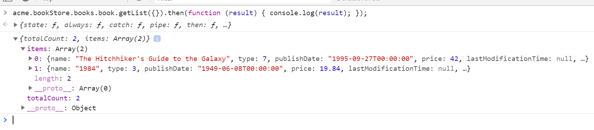
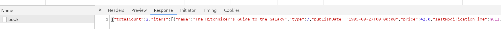
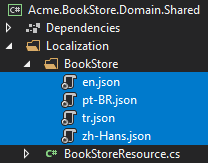
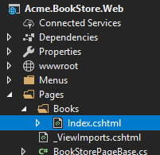
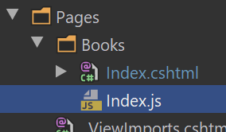
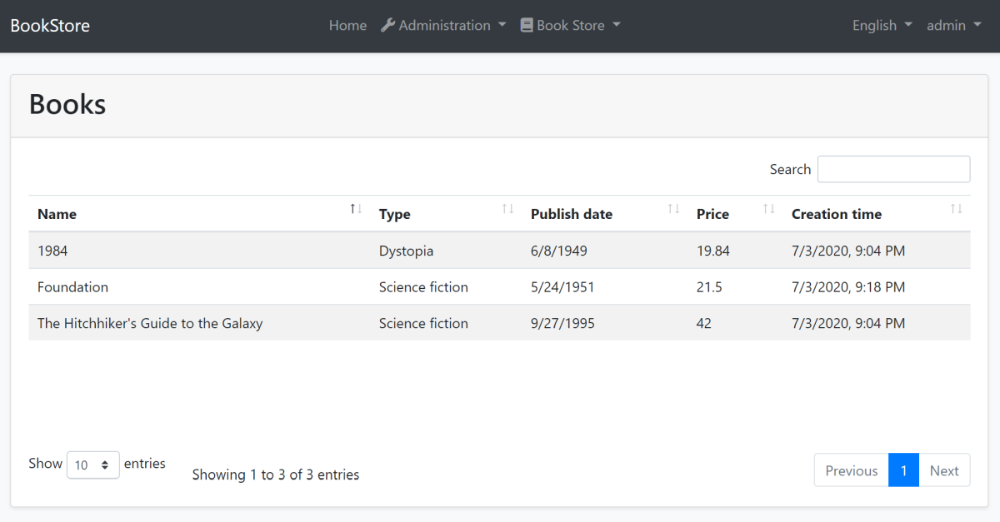
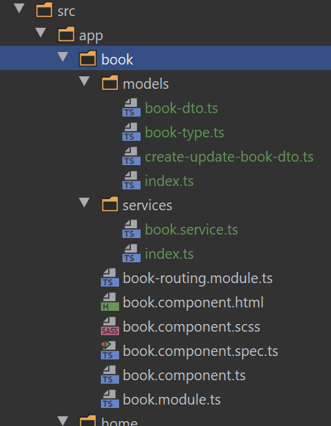
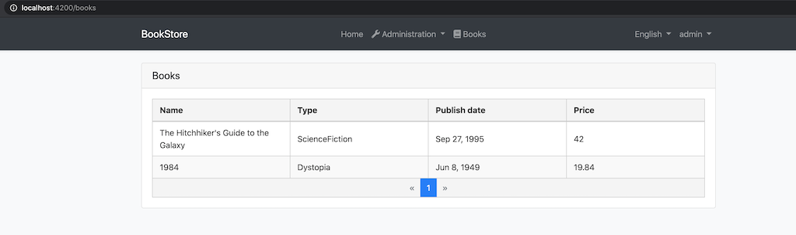

# Web应用程序开发教程 - 第二章: 图书列表页面
````json
//[doc-params]
{
    "UI": ["MVC","NG"],
    "DB": ["EF","Mongo"]
}
````

{{
if UI == "MVC"
  DB="ef"
  DB_Text="Entity Framework Core"
  UI_Text="mvc"
else if UI == "NG"
  DB="mongodb"
  DB_Text="MongoDB"
  UI_Text="angular"
else
  DB ="?"
  UI_Text="?"
end
}}

## 关于本教程

在本系列教程中, 你将构建一个名为 `Acme.BookStore` 的用于管理书籍及其作者列表的基于ABP的应用程序.  它是使用以下技术开发的:

* **{{DB_Text}}** 做为ORM提供程序.
* **{{UI_Value}}** 做为UI框架.

本教程分为以下部分:

- [Part 1: 创建服务端](Part-1.md)
- **Part 2: 图书列表页面**(本章)
- [Part 3: 创建,更新和删除图书](Part-3.md)
- [Part 4: 集成测试](Part-4.md)
- [Part 5: 授权](Part-5.md)
- [Part 6: 作者: 领域层](Part-6.md)
- [Part 7: 作者: 数据库集成](Part-7.md)
- [Part 8: 作者: 应用服务层](Part-8.md)
- [Part 9: 作者: 用户页面](Part-9.md)
- [Part 10: 图书到作者的关系](Part-10.md)

## 下载源码

本教程根据你的**UI** 和 **Database**偏好有多个版,我们准备了两种可供下载的源码组合:

* [MVC (Razor Pages) UI 与 EF Core](https://github.com/abpframework/abp-samples/tree/master/BookStore-Mvc-EfCore)
* [Angular UI 与 MongoDB](https://github.com/abpframework/abp-samples/tree/master/BookStore-Angular-MongoDb)

{{if UI == "MVC"}}

## 动态JavaScript代理

通常在 **JavaScript** 端通过AJAX调用HTTP API端点. 你可以使用 `$.ajax` 或其他工具来调用端点. 但是ABP提供了更好的方法.

ABP**动态**为所有API端点创建 **[JavaScript代理](../UI/AspNetCore/Dynamic-JavaScript-Proxies.md)**. 所以你可以像调用**Javascript本地方法**一样使用任何**端点**.

### 在开发者控制台中进行测试

你可以在自己喜欢的浏览器的**开发者控制台**轻松的测试JavaScript代理. 运行应用程序,打开浏览器的**开发者人员工具**(*快捷键通常是F12*),切换到**控制台**选项卡,输入以下代码然后按回车:

````js
acme.bookStore.books.book.getList({}).done(function (result) { console.log(result); });
````

* `acme.bookStore.books` 是 `BookAppService` 的命令空间转换成[小驼峰](https://en.wikipedia.org/wiki/Camel_case)形式.
* `book` 是 `BookAppService` 的约定名称(删除`AppService`后缀并且转换为小驼峰).
* `getList` 是 `CrudAppService` 基类定义的 `GetListAsync` 方法的约定名称(删除`Async`后缀并且转换为小驼峰).
* `{}` 参数将空对象发送到 `GetListAsync` 方法,该方法通常需要一个类型为 `PagedAndSortedResultRequestDto` 的对象,该对象用于将分页和排序选项发送到服务器(所有属性都是可选的,具有默认值. 因此你可以发送一个空对象).
* `getList` 函数返回一个 `promise`. 你可以传递一个回调到 `then`(或`done`)函数来获取从服务器返回的结果.

运行该代码会产生以下输出:



你可以看到服务端返回的 **图书列表**. 你也可以在开发者人员工具的 **网络** 选项卡查看客户端到服务端的通信:



Let's **create a new book** using the `create` function:

让我们使用 `create` 函数**创建一本书**:

````js
acme.bookStore.books.book.create({ 
        name: 'Foundation', 
        type: 7, 
        publishDate: '1951-05-24', 
        price: 21.5 
    }).then(function (result) { 
        console.log('successfully created the book with id: ' + result.id); 
    });
````

您应该在控制台中看到类似以下的消息:

````text
successfully created the book with id: 439b0ea8-923e-8e1e-5d97-39f2c7ac4246
````

检查数据库中的 `Books` 表你会看到新的一行. 你可以自己尝试使用 `get`, `update` 和 `delete` 函数.

我们将利用这些动态代理功能在接下来的章节来与服务器通信.

{{end}}

## 本地化

开始的UI开发之前,我们首先要准备本地化的文本(这是你通常在开发应用程序时需要做的).

本地化文本位于 `Acme.BookStore.Domain.Shared` 项目的 `Localization/BookStore` 文件夹下:



打开 `en.json` (*英文翻译*)文件并更改内容,如下所示:

````json
{
  "Culture": "en",
  "Texts": {
    "Menu:Home": "Home",
    "Welcome": "Welcome",
    "LongWelcomeMessage": "Welcome to the application. This is a startup project based on the ABP framework. For more information, visit abp.io.",
    "Menu:BookStore": "Book Store",
    "Menu:Books": "Books",
    "Actions": "Actions",
    "Close": "Close",
    "Delete": "Delete",
    "Edit": "Edit",
    "PublishDate": "Publish date",
    "NewBook": "New book",
    "Name": "Name",
    "Type": "Type",
    "Price": "Price",
    "CreationTime": "Creation time",
    "AreYouSure": "Are you sure?",
    "AreYouSureToDelete": "Are you sure you want to delete this item?",
    "Enum:BookType:0": "Undefined",
    "Enum:BookType:1": "Adventure",
    "Enum:BookType:2": "Biography",
    "Enum:BookType:3": "Dystopia",
    "Enum:BookType:4": "Fantastic",
    "Enum:BookType:5": "Horror",
    "Enum:BookType:6": "Science",
    "Enum:BookType:7": "Science fiction",
    "Enum:BookType:8": "Poetry"
  }
}
````

* 本地化关键字名称是任意的. 你可以设置任何名称. 对于特定的文本类型,我们更喜欢遵循一些约定:
  * 为按钮项添加 `Menu:` 前缀.
  * 使用 `Enum:<enum-type>:<enum-value>` 命名约定来本地化枚举成员. 当您这样做时ABP可以在某些适当的情况下自动将枚举本地化.

如果未在本地化文件中定义文本,则文本将**回退**到本地化键(作为ASP.NET Core的标准行为).

> ABP本地化系统建立在[ASP.NET Core标准本地化](https://docs.microsoft.com/en-us/aspnet/core/fundamentals/localization)系统之上,并以多种方式进行了扩展. 有关详细信息请参见[本地化文档](../Localization.md).

{{if UI == "MVC"}}

## 创建图书页面

是时候创建可见的和可用的东西了! 代替经典的MVC,我们将使用微软推荐的[Razor Pages UI](https://docs.microsoft.com/zh-cn/aspnet/core/tutorials/razor-pages/razor-pages-start).

在 `Acme.BookStore.Web` 项目的 `Pages` 文件夹下创建一个名为新的 `Books` 的文件夹. 然后在文件夹右键选择 **添加 > Razor Page** 菜单. 输入名称 `Index`:



打开 `Index.cshtml` 并把内容修改成下面这样:

````html
@page
@using Acme.BookStore.Web.Pages.Books
@model IndexModel

<h2>Books</h2>
````

`Index.cshtml.cs` 内容应该是:

```csharp
using Microsoft.AspNetCore.Mvc.RazorPages;

namespace Acme.BookStore.Web.Pages.Books
{
    public class IndexModel : PageModel
    {
        public void OnGet()
        {
  
        }
    }
}
```

### 将Book页面添加到主菜单

打开 `Menus` 文件夹中的 `BookStoreMenuContributor` 类,在 `ConfigureMainMenuAsync` 方法的底部添加如下代码:

````csharp
context.Menu.AddItem(
    new ApplicationMenuItem(
        "BooksStore",
        l["Menu:BookStore"],
        icon: "fa fa-book"
    ).AddItem(
        new ApplicationMenuItem(
            "BooksStore.Books",
            l["Menu:Books"],
            url: "/Books"
        )
    )
);
````

运行项目,使用用户名 `admin` 和密码 `1q2w3E*` 登录到应用程序. 看到新菜单项已添加到顶部栏:


点击BookStore下的Books子菜单项就会跳转到空的图书页面.

### 图书列表

We will use the [Datatables.net](https://datatables.net/) jQuery library to show the book list. Datatables library completely work via AJAX, it is fast, popular and provides a good user experience.

我们将使用[Datatables.net](https://datatables.net/)JQuery插件来显示页面上的表格列表. [Datatables](https://datatables.net/)可以完全通过AJAX工作,速度快,并提供良好的用户体验.

> Datatables插件在启动模板中配置,因此你可以直接在任何页面中使用它,无需在页面中引用样式和脚本文件.

#### Index.cshtml

将 `Pages/Book/Index.cshtml` 改成下面的样子:

````html
@page
@using Acme.BookStore.Localization
@using Acme.BookStore.Web.Pages.Books
@using Microsoft.Extensions.Localization
@model IndexModel
@inject IStringLocalizer<BookStoreResource> L
@section scripts
{
    <abp-script src="/Pages/Books/Index.js" />
}
<abp-card>
    <abp-card-header>
        <h2>@L["Books"]</h2>
    </abp-card-header>
    <abp-card-body>
        <abp-table striped-rows="true" id="BooksTable"></abp-table>
    </abp-card-body>
</abp-card>
````

* `abp-script` [tag helper](https://docs.microsoft.com/en-us/aspnet/core/mvc/views/tag-helpers/intro)用于将外部的 **脚本** 添加到页面中.它比标准的`script`标签多了很多额外的功能.它可以处理 **最小化**和 **版本**.查看[捆绑 & 压缩文档](../UI/AspNetCore/Bundling-Minification.md)获取更多信息.
* `abp-card` 和 `abp-table` 是为Twitter Bootstrap的[card component](http://getbootstrap.com/docs/4.5/components/card/)封装的 **tag helpers**.ABP中有很多tag helpers,可以很方便的使用大多数[bootstrap](https://getbootstrap.com/)组件.你也可以使用原生的HTML标签代替tag helpers.使用tag helper可以通过智能提示和编译时类型检查减少HTML代码并防止错误.查看[tag helpers 文档](../UI/AspNetCore/Tag-Helpers/Index.md).

#### Index.js

在 `Pages/Books/` 文件夹中创建 `index.js`文件



`index.js` 的内容如下:

````js
$(function () {
    var l = abp.localization.getResource('BookStore');

    var dataTable = $('#BooksTable').DataTable(
        abp.libs.datatables.normalizeConfiguration({
            serverSide: true,
            paging: true,
            order: [[1, "asc"]],
            searching: false,
            scrollX: true,
            ajax: abp.libs.datatables.createAjax(acme.bookStore.books.book.getList),
            columnDefs: [
                {
                    title: l('Name'),
                    data: "name"
                },
                {
                    title: l('Type'),
                    data: "type",
                    render: function (data) {
                        return l('Enum:BookType:' + data);
                    }
                },
                {
                    title: l('PublishDate'),
                    data: "publishDate",
                    render: function (data) {
                        return luxon
                            .DateTime
                            .fromISO(data, {
                                locale: abp.localization.currentCulture.name
                            }).toLocaleString();
                    }
                },
                {
                    title: l('Price'),
                    data: "price"
                },
                {
                    title: l('CreationTime'), data: "creationTime",
                    render: function (data) {
                        return luxon
                            .DateTime
                            .fromISO(data, {
                                locale: abp.localization.currentCulture.name
                            }).toLocaleString(luxon.DateTime.DATETIME_SHORT);
                    }
                }
            ]
        })
    );
});
````

* `abp.localization.getResource` 获取一个函数,该函数用于使用服务器端定义的相同JSON文件对文本进行本地化. 通过这种方式你可以与客户端共享本地化值.
* `abp.libs.datatables.normalizeConfiguration`是另一个辅助方法.不是必须的, 但是它通过为缺少的选项提供常规值来简化数据表配置.
* `abp.libs.datatables.createAjax`是帮助ABP的动态JavaScript API代理跟[Datatable](https://datatables.net/)的格式相适应的辅助方法.
* `acme.bookStore.books.book.getList` 是动态JavaScript代理函数(上面已经介绍过了)
* [luxon](https://moment.github.io/luxon/) 库也是该解决方案中预先配置的标准库,你可以轻松地执行日期/时间操作.

> 查看 [Datatable文档](https://datatables.net/manual/) 了解更多配置项.

## 运行最终应用程序

你可以运行应用程序!该部分的最终用户界面如下所示:



这是一个完全正常工作的服务端分页,排序和本地化的图书列表.

{{end}}

{{if UI == "NG"}}

## 安装NPM包

>注意: 本教程基于ABP Framework v3.0.3+. 如果你的项目版本较旧,请升级您的解决方案. 如果要升级现有的v2.x项目,请参阅[迁移指南](../UI/Angular/Migration-Guide-v3.md).

在 `angular` 目录下打开命令行窗口,选择 `yarn` 命令安装NPM包:

```bash
yarn
```

## 创建图书页面

是时候创建可见和可用的东西了!开发ABP Angular前端应用程序时,需要使用一些工具:

- [Ng Bootstrap](https://ng-bootstrap.github.io/#/home) 用做UI组件库.
- [ngx-datatable](https://swimlane.gitbook.io/ngx-datatable/) 用做 datatable 类库.

### BookModule

运行以下命令创建一个名为 `BookModule` 的新模块:

```bash
yarn ng generate module book --module app --routing --route books
```

该命令应该产生以下的输出:

````bash
> yarn ng generate module book --module app --routing --route books

yarn run v1.19.1
$ ng generate module book --module app --routing --route books
CREATE src/app/book/book-routing.module.ts (336 bytes)
CREATE src/app/book/book.module.ts (335 bytes)
CREATE src/app/book/book.component.html (19 bytes)
CREATE src/app/book/book.component.spec.ts (614 bytes)
CREATE src/app/book/book.component.ts (268 bytes)
CREATE src/app/book/book.component.scss (0 bytes)
UPDATE src/app/app-routing.module.ts (1289 bytes)
Done in 3.88s.
````

### BookModule

打开 `/src/app/book/book.module.ts` 并使用以下内容替换:

````js
import { NgModule } from '@angular/core';
import { SharedModule } from '../shared/shared.module';
import { BookRoutingModule } from './book-routing.module';
import { BookComponent } from './book.component';

@NgModule({
  declarations: [BookComponent],
  imports: [
    BookRoutingModule,
    SharedModule
  ]
})
export class BookModule { }

````

* 添加了 `SharedModule`. `SharedModule` 导出了一些创建用户界面所需的通用模块.
* `SharedModule` 已经导出了 `CommonModule`,所以我们删除了 `CommonModule`.

### 路由

生成的代码将新的路由定义放在 `src/app/app-routing.module.ts` 文件中,如下所示:

````js
const routes: Routes = [
  // other route definitions...
  { path: 'books', loadChildren: () => import('./book/book.module').then(m => m.BookModule) },
];
````

现在打开 `src/app/route.provider.ts` 以下替换 `configureRoutes` 函数:

```js
function configureRoutes(routes: RoutesService) {
  return () => {
    routes.add([
      {
        path: '/',
        name: '::Menu:Home',
        iconClass: 'fas fa-home',
        order: 1,
        layout: eLayoutType.application,
      },
      {
        path: '/book-store',
        name: '::Menu:BookStore',
        iconClass: 'fas fa-book',
        order: 2,
        layout: eLayoutType.application,
      },
      {
        path: '/books',
        name: '::Menu:Books',
        parentName: '::Menu:BookStore',
        layout: eLayoutType.application,
      },
    ]);
  };
}
```

`RoutesService` 是ABP框架提供的用于配置主菜单和路由的服务.

* `path` 路由的URL.	
* `name` 菜单项的名称(参阅[本地化文档](../UI/Angular/Localization.md)了解更多).
* `iconClass` 菜单项的图标(你可以使用默认的[Font Awesome](https://fontawesome.com/)图标).	
* `order` 菜单项的排序.我们定义了101,它显示在 "Administration" 项的后面.	
* `layout` BooksModule路由的布局. 可以定义 `eLayoutType.application`, `eLayoutType.account` 或 `eLayoutType.empty`.

更多信息请参阅[RoutesService 文档](https://docs.abp.io/en/abp/latest/UI/Angular/Modifying-the-Menu.md#via-routesservice).

### 生成代理

ABP CLI提供了 `generate-proxy` 命令为你的服务HTTP API生成客户端代理简化客户端使用服务的成本. 运行 `generate-proxy` 命令前你的host必须正在运行. 参阅 [CLI 文档](../CLI.md).

在 `angular` 文件夹下运行以下命令:

```bash
abp generate-proxy -t ng
```

生成的文件如下:



### BookComponent

打开 `/src/app/book/book.component.ts` 用以下内容替换它:

```js
import { ListService, PagedResultDto } from '@abp/ng.core';
import { Component, OnInit } from '@angular/core';
import { BookDto } from './models';
import { BookService } from './services';

@Component({
  selector: 'app-book',
  templateUrl: './book.component.html',
  styleUrls: ['./book.component.scss'],
  providers: [ListService],
})
export class BookComponent implements OnInit {
  book = { items: [], totalCount: 0 } as PagedResultDto<BookDto>;

  constructor(public readonly list: ListService, private bookService: BookService) {}

  ngOnInit() {
    const bookStreamCreator = (query) => this.bookService.getListByInput(query);

    this.list.hookToQuery(bookStreamCreator).subscribe((response) => {
      this.book = response;
    });
  }
}
```

* 我们注入了生成的 `BookService`.	
* 我们实现了 [ListService](https://docs.abp.io/en/abp/latest/UI/Angular/List-Service),它是一个公用服务,提供了简单的分页,排序和搜索.

打开 `/src/app/book/book.component.html` 用以下内容替换它:

```html
<div class="card">
  <div class="card-header">
    <div class="row">
      <div class="col col-md-6">
        <h5 class="card-title">
          
        </h5>
      </div>
      <div class="text-end col col-md-6"></div>
    </div>
  </div>
  <div class="card-body">
    <ngx-datatable [rows]="book.items" [count]="book.totalCount" [list]="list" default>
      <ngx-datatable-column [name]="'::Name' | abpLocalization" prop="name"></ngx-datatable-column>
      <ngx-datatable-column [name]="'::Type' | abpLocalization" prop="type">
        <ng-template let-row="row" ngx-datatable-cell-template>
          
        </ng-template>
      </ngx-datatable-column>
      <ngx-datatable-column [name]="'::PublishDate' | abpLocalization" prop="publishDate">
        <ng-template let-row="row" ngx-datatable-cell-template>
          
        </ng-template>
      </ngx-datatable-column>
      <ngx-datatable-column [name]="'::Price' | abpLocalization" prop="price">
        <ng-template let-row="row" ngx-datatable-cell-template>
          
        </ng-template>
      </ngx-datatable-column>
    </ngx-datatable>
  </div>
</div>
```

现在你可以在浏览器看到最终结果:



{{end}}

## 下一章

查看本教程的[下一章](Part-3.md).
