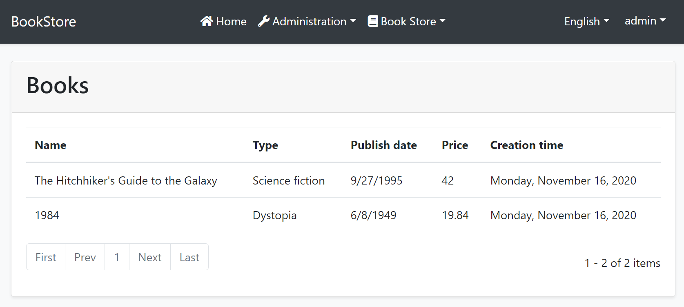

# Web应用程序开发教程 - 第二章: 图书列表页面
````json
//[doc-params]
{
    "UI": ["MVC","Blazor","BlazorServer","NG"],
    "DB": ["EF","Mongo"]
}
````
## 关于本教程

在本系列教程中, 你将构建一个名为 `Acme.BookStore` 的用于管理书籍及其作者列表的基于ABP的应用程序.  它是使用以下技术开发的:

* **{{DB_Value}}** 做为ORM提供程序.
* **{{UI_Value}}** 做为UI框架.

本教程分为以下部分:

- [Part 1: 创建服务端](Part-1.md)
- **Part 2: 图书列表页面**(本章)
- [Part 3: 创建,更新和删除图书](Part-3.md)
- [Part 4: 集成测试](Part-4.md)
- [Part 5: 授权](Part-5.md)
- [Part 6: 作者: 领域层](Part-6.md)
- [Part 7: 作者: 数据库集成](Part-7.md)
- [Part 8: 作者: 应用服务层](Part-8.md)
- [Part 9: 作者: 用户页面](Part-9.md)
- [Part 10: 图书到作者的关系](Part-10.md)

## 下载源码

本教程根据你的**UI** 和 **数据库**偏好有多个版本,我们准备了几种可供下载的源码组合:

* [MVC (Razor Pages) UI 与 EF Core](https://github.com/abpframework/abp-samples/tree/master/BookStore-Mvc-EfCore)
* [Blazor UI 与 EF Core](https://github.com/abpframework/abp-samples/tree/master/BookStore-Blazor-EfCore)
* [Angular UI 与 MongoDB](https://github.com/abpframework/abp-samples/tree/master/BookStore-Angular-MongoDb)

> 如果你在Windows中遇到 "文件名太长" or "解压错误", 很可能与Windows最大文件路径限制有关. Windows文件路径的最大长度为250字符. 为了解决这个问题,参阅 [在Windows 10中启用长路径](https://docs.microsoft.com/en-us/windows/win32/fileio/maximum-file-path-limitation?tabs=cmd#enable-long-paths-in-windows-10-version-1607-and-later).

> 如果你遇到与Git相关的长路径错误, 尝试使用下面的命令在Windows中启用长路径. 参阅 https://github.com/msysgit/msysgit/wiki/Git-cannot-create-a-file-or-directory-with-a-long-path
> `git config --system core.longpaths true`

{{if UI == "MVC" && DB == "EF"}}

### 视频教程

本章也被录制为视频教程 **<a href="https://www.youtube.com/watch?v=UDNlLiPiBiw&list=PLsNclT2aHJcPNaCf7Io3DbMN6yAk_DgWJ&index=2" target="_blank">发布在YouTube</a>**.

{{end}}

{{if UI == "MVC"}}

## 动态JavaScript代理

在 **JavaScript** 端通过AJAX调用HTTP API端点是常见的做法. 你可以使用 `$.ajax` 或其他工具来调用端点. 但是ABP提供了更好的方法.

ABP**动态**为所有API端点创建 **[JavaScript代理](../UI/AspNetCore/Dynamic-JavaScript-Proxies.md)**. 所以你可以像调用**Javascript本地方法**一样使用任何**端点**.

### 在开发者控制台中进行测试

你可以在自己喜欢的浏览器的**开发者控制台**轻松的测试JavaScript代理. 运行应用程序,打开浏览器的**开发者人员工具**(*快捷键通常是F12*),切换到**控制台**选项卡,输入以下代码然后按回车:

````js
acme.bookStore.books.book.getList({}).done(function (result) { console.log(result); });
````

* `acme.bookStore.books` 是 `BookAppService` 的命令空间转换成[小驼峰](https://en.wikipedia.org/wiki/Camel_case)形式.
* `book` 是 `BookAppService` 的约定名称(删除`AppService`后缀并且转换为小驼峰).
* `getList` 是 `CrudAppService` 基类定义的 `GetListAsync` 方法的约定名称(删除`Async`后缀并且转换为小驼峰).
* `{}` 参数将空对象发送到 `GetListAsync` 方法,该方法通常需要一个类型为 `PagedAndSortedResultRequestDto` 的对象,该对象用于将分页和排序选项发送到服务器(所有属性都是可选的,具有默认值. 因此你可以发送一个空对象).
* `getList` 函数返回一个 `promise`. 你可以传递一个回调到 `then`(或`done`)函数来获取从服务器返回的结果.

运行该代码会产生以下输出:


你可以看到服务端返回的 **图书列表**. 你也可以在开发者人员工具的 **网络** 选项卡查看客户端到服务端的通信:


让我们使用 `create` 函数**创建一本书**:

````js
acme.bookStore.books.book.create({
        name: 'Foundation',
        type: 7,
        publishDate: '1951-05-24',
        price: 21.5
    }).then(function (result) {
        console.log('successfully created the book with id: ' + result.id);
    });
````

> 如果你下载了本教程的源代码并按照示例中的步骤操作,你需要传递`authorId`参数给创建方法以**创建一本新书**.

您应该在控制台中看到类似以下的消息:

````text
successfully created the book with id: 439b0ea8-923e-8e1e-5d97-39f2c7ac4246
````

检查数据库中的 `Books` 表你会看到新的一行. 你可以自己尝试使用 `get`, `update` 和 `delete` 函数.

在接下来的章节,我们将利用这些动态代理函数与服务器通信.

{{end}}

## 本地化

开始的UI开发之前,我们首先要准备本地化的文本(这是你通常在开发应用程序时需要做的).

本地化文本位于 `Acme.BookStore.Domain.Shared` 项目的 `Localization/BookStore` 文件夹下:


打开 `en.json` (*英文翻译*)文件并更改内容,如下所示:

````json
{
  "Culture": "en",
  "Texts": {
    "Menu:Home": "Home",
    "Welcome": "Welcome",
    "LongWelcomeMessage": "Welcome to the application. This is a startup project based on the ABP framework. For more information, visit abp.io.",
    "Menu:BookStore": "Book Store",
    "Menu:Books": "Books",
    "Actions": "Actions",
    "Close": "Close",
    "Delete": "Delete",
    "Edit": "Edit",
    "PublishDate": "Publish date",
    "NewBook": "New book",
    "Name": "Name",
    "Type": "Type",
    "Price": "Price",
    "CreationTime": "Creation time",
    "AreYouSure": "Are you sure?",
    "AreYouSureToDelete": "Are you sure you want to delete this item?",
    "Enum:BookType:0": "Undefined",
    "Enum:BookType:1": "Adventure",
    "Enum:BookType:2": "Biography",
    "Enum:BookType:3": "Dystopia",
    "Enum:BookType:4": "Fantastic",
    "Enum:BookType:5": "Horror",
    "Enum:BookType:6": "Science",
    "Enum:BookType:7": "Science fiction",
    "Enum:BookType:8": "Poetry"
  }
}
````

> 简体中文翻译请打开`zh-Hans.json`文件 ,并将"Texts"对象中对应的值替换为中文.

* 本地化关键字名称是任意的. 你可以设置任何名称. 对于特定的文本类型,我们更喜欢遵循一些约定:
  * 为按钮项添加 `Menu:` 前缀.
  * 使用 `Enum:<enum-type>:<enum-value>` 命名约定来本地化枚举成员. 当您这样做时ABP可以在某些适当的情况下自动将枚举本地化.

如果未在本地化文件中定义文本,则文本将**回退**到本地化键(ASP.NET Core的标准行为).

> ABP本地化系统建立在[ASP.NET Core标准本地化](https://docs.microsoft.com/en-us/aspnet/core/fundamentals/localization)系统之上,并以多种方式进行了扩展. 有关详细信息请参见[本地化文档](../Localization.md).

{{if UI == "MVC"}}

## 创建图书页面

是时候创建可见的和可用的东西了! 我们将使用微软推荐的[Razor Pages UI](https://docs.microsoft.com/zh-cn/aspnet/core/tutorials/razor-pages/razor-pages-start),而不是经典的MVC.

在 `Acme.BookStore.Web` 项目的 `Pages` 文件夹下创建一个名为新的 `Books` 的文件夹. 然后在文件夹右键选择 **添加 > Razor Page** 菜单. 输入名称 `Index`:


打开 `Index.cshtml` 并把内容修改成下面这样:

````html
@page
@using Acme.BookStore.Web.Pages.Books
@model IndexModel

<h2>Books</h2>
````

`Index.cshtml.cs` 内容应该是:

```csharp
using Microsoft.AspNetCore.Mvc.RazorPages;

namespace Acme.BookStore.Web.Pages.Books
{
    public class IndexModel : PageModel
    {
        public void OnGet()
        {

        }
    }
}
```

### 将图书页面添加到主菜单

打开 `Menus` 文件夹中的 `BookStoreMenuContributor` 类,在 `ConfigureMainMenuAsync` 方法的底部添加如下代码:

````csharp
context.Menu.AddItem(
    new ApplicationMenuItem(
        "BooksStore",
        l["Menu:BookStore"],
        icon: "fa fa-book"
    ).AddItem(
        new ApplicationMenuItem(
            "BooksStore.Books",
            l["Menu:Books"],
            url: "/Books"
        )
    )
);
````

运行项目,使用用户名 `admin` 和密码 `1q2w3E*` 登录到应用程序. 看到新菜单项已添加到顶部栏:


点击BookStore下的Books子菜单项就会跳转到空的图书页面.

### 图书列表

我们将使用[Datatables.net](https://datatables.net/)JQuery插件来显示图书列表. [Datatables](https://datatables.net/)可以完全通过AJAX工作,速度快,并提供良好的用户体验.

> Datatables插件在启动模板中配置,因此你可以直接在任何页面中使用它,无需在页面中引用样式和脚本文件.

#### Index.cshtml

将 `Pages/Book/Index.cshtml` 改成下面的样子:

````html
@page
@using Acme.BookStore.Localization
@using Acme.BookStore.Web.Pages.Books
@using Microsoft.Extensions.Localization
@model IndexModel
@inject IStringLocalizer<BookStoreResource> L
@section scripts
{
    <abp-script src="/Pages/Books/Index.js" />
}
<abp-card>
    <abp-card-header>
        <h2>@L["Books"]</h2>
    </abp-card-header>
    <abp-card-body>
        <abp-table striped-rows="true" id="BooksTable"></abp-table>
    </abp-card-body>
</abp-card>
````

* `abp-script` [tag helper](https://docs.microsoft.com/en-us/aspnet/core/mvc/views/tag-helpers/intro)用于将外部的 **脚本** 添加到页面中.它比标准的`script`标签多了很多额外的功能.它可以处理 **最小化**和 **版本**.查看[捆绑 & 压缩文档](../UI/AspNetCore/Bundling-Minification.md)获取更多信息.
* `abp-card` 和 `abp-table` 是为Twitter Bootstrap的[card component](http://getbootstrap.com/docs/4.5/components/card/)封装的 **tag helpers**.ABP中有很多tag helpers,可以很方便的使用大多数[bootstrap](https://getbootstrap.com/)组件.你也可以使用原生的HTML标签代替tag helpers.使用tag helper可以通过智能提示和编译时类型检查减少HTML代码并防止错误.查看[tag helpers 文档](../UI/AspNetCore/Tag-Helpers/Index.md).

#### Index.js

在 `Pages/Books/` 文件夹中创建 `index.js`文件


`index.js` 的内容如下:

````js
$(function () {
    var l = abp.localization.getResource('BookStore');

    var dataTable = $('#BooksTable').DataTable(
        abp.libs.datatables.normalizeConfiguration({
            serverSide: true,
            paging: true,
            order: [[1, "asc"]],
            searching: false,
            scrollX: true,
            ajax: abp.libs.datatables.createAjax(acme.bookStore.books.book.getList),
            columnDefs: [
                {
                    title: l('Name'),
                    data: "name"
                },
                {
                    title: l('Type'),
                    data: "type",
                    render: function (data) {
                        return l('Enum:BookType:' + data);
                    }
                },
                {
                    title: l('PublishDate'),
                    data: "publishDate",
                    render: function (data) {
                        return luxon
                            .DateTime
                            .fromISO(data, {
                                locale: abp.localization.currentCulture.name
                            }).toLocaleString();
                    }
                },
                {
                    title: l('Price'),
                    data: "price"
                },
                {
                    title: l('CreationTime'), data: "creationTime",
                    render: function (data) {
                        return luxon
                            .DateTime
                            .fromISO(data, {
                                locale: abp.localization.currentCulture.name
                            }).toLocaleString(luxon.DateTime.DATETIME_SHORT);
                    }
                }
            ]
        })
    );
});
````

* `abp.localization.getResource` 获取一个函数,该函数用于使用服务器端定义的相同JSON文件对文本进行本地化. 通过这种方式你可以与客户端共享本地化值.
* `abp.libs.datatables.normalizeConfiguration`是一个辅助方法.不是必须的, 但是它通过为缺省的选项提供约定的值来简化[Datatables](https://datatables.net/)配置.
* `abp.libs.datatables.createAjax`是另一个辅助方法,用来适配ABP的动态JavaScript API代理和[Datatable](https://datatables.net/)期望的参数格式.
* `acme.bookStore.books.book.getList` 是动态JavaScript代理函数(上面已经介绍过了)
* [luxon](https://moment.github.io/luxon/) 库也是该解决方案中预先配置的标准库,你可以轻松地执行日期/时间操作.

> 查看 [Datatable文档](https://datatables.net/manual/) 了解更多配置项.

## 运行最终应用程序

你可以运行应用程序!该部分的最终用户界面如下所示:


这是一个可以正常工作的,服务端分页,排序和本地化的图书列表.

{{else if UI == "NG"}}

## 安装NPM包

>注意: 本教程基于ABP Framework v3.1.0+. 如果你的项目版本较旧,请升级您的解决方案. 如果要升级现有的v2.x项目,请参阅[迁移指南](../UI/Angular/Migration-Guide-v3.md).

在 `angular` 目录下打开命令行窗口,选择 `yarn` 命令安装NPM包:

```bash
yarn
```

## 创建图书页面

是时候创建可见和可用的东西了!开发ABP Angular前端应用程序时,需要使用一些工具:

- [Ng Bootstrap](https://ng-bootstrap.github.io/#/home) 用做UI组件库.
- [ngx-datatable](https://swimlane.gitbook.io/ngx-datatable/) 用做 datatable 类库.

运行以下命令在angular应用程序根目录创建一个名为 `BookModule` 的新模块:

```bash
yarn ng generate module book --module app --routing --route books
```

该命令应该产生以下的输出:

````bash
> yarn ng generate module book --module app --routing --route books

yarn run v1.19.1
$ ng generate module book --module app --routing --route books
CREATE src/app/book/book-routing.module.ts (336 bytes)
CREATE src/app/book/book.module.ts (335 bytes)
CREATE src/app/book/book.component.html (19 bytes)
CREATE src/app/book/book.component.spec.ts (614 bytes)
CREATE src/app/book/book.component.ts (268 bytes)
CREATE src/app/book/book.component.scss (0 bytes)
UPDATE src/app/app-routing.module.ts (1289 bytes)
Done in 3.88s.
````

### BookModule

打开 `/src/app/book/book.module.ts` 并使用以下内容替换:

````js
import { NgModule } from '@angular/core';
import { SharedModule } from '../shared/shared.module';
import { BookRoutingModule } from './book-routing.module';
import { BookComponent } from './book.component';

@NgModule({
  declarations: [BookComponent],
  imports: [
    BookRoutingModule,
    SharedModule
  ]
})
export class BookModule { }

````

* 添加了 `SharedModule`. `SharedModule` 导出了一些创建用户界面所需的通用模块.
* `SharedModule` 已经导出了 `CommonModule`,所以我们删除了 `CommonModule`.

### 路由

生成的代码将新的路由定义放在 `src/app/app-routing.module.ts` 文件中,如下所示:

````js
const routes: Routes = [
  // other route definitions...
  { path: 'books', loadChildren: () => import('./book/book.module').then(m => m.BookModule) },
];
````

现在打开 `src/app/route.provider.ts` 替换 `configureRoutes` 函数为以下代码:

```js
function configureRoutes(routes: RoutesService) {
  return () => {
    routes.add([
      {
        path: '/',
        name: '::Menu:Home',
        iconClass: 'fas fa-home',
        order: 1,
        layout: eLayoutType.application,
      },
      {
        path: '/book-store',
        name: '::Menu:BookStore',
        iconClass: 'fas fa-book',
        order: 2,
        layout: eLayoutType.application,
      },
      {
        path: '/books',
        name: '::Menu:Books',
        parentName: '::Menu:BookStore',
        layout: eLayoutType.application,
      },
    ]);
  };
}
```

`RoutesService` 是ABP框架提供的用于配置主菜单和路由的服务.

* `path` 路由的URL.
* `name` 菜单项的名称(参阅[本地化文档](../UI/Angular/Localization.md)了解更多).
* `iconClass` 菜单项的图标(你可以使用默认的[Font Awesome](https://fontawesome.com/)图标).
* `order` 菜单项的排序.
* `layout` BooksModule路由的布局. (有三个预定义的布局类型: `eLayoutType.application`, `eLayoutType.account` 或 `eLayoutType.empty`).

更多信息请参阅[RoutesService 文档](../UI/Angular/Modifying-the-Menu.md#via-routesservice).

### 生成服务代理

[ABP CLI](../CLI.md) 提供 `generate-proxy` 命令为HTTP APIs生成客户端代理.有了这些代理,在客户端使用HTTP APIs变得更加方便. 运行 `generate-proxy` 命令前, 你的 host 必须正在运行.

> **警告**: 使用IIS Express时有一个问题; 它不允许从另一个进程连接应用程序. 如果你使用Visual Studio, 在运行按钮的下拉框中选择`Acme.BookStore.HttpApi.Host`,不要选择IIS Express, 如下图:


启动host应用程序后,在 `angular` 文件夹下运行以下命令:

```bash
abp generate-proxy -t ng
```

这个命令将在`/src/app/proxy/books`文件夹下产生以下文件:


### BookComponent

打开 `/src/app/book/book.component.ts` 用以下内容替换它:

```js
import { ListService, PagedResultDto } from '@abp/ng.core';
import { Component, OnInit } from '@angular/core';
import { BookService, BookDto } from '@proxy/books';

@Component({
  selector: 'app-book',
  templateUrl: './book.component.html',
  styleUrls: ['./book.component.scss'],
  providers: [ListService],
})
export class BookComponent implements OnInit {
  book = { items: [], totalCount: 0 } as PagedResultDto<BookDto>;

  constructor(public readonly list: ListService, private bookService: BookService) {}

  ngOnInit() {
    const bookStreamCreator = (query) => this.bookService.getList(query);

    this.list.hookToQuery(bookStreamCreator).subscribe((response) => {
      this.book = response;
    });
  }
}
```

* 我们引入并注入了生成的 `BookService`.
* 我们使用 [ListService](../UI/Angular/List-Service.md),它是一个工具服务,提供了易用的分页,排序和搜索.

打开 `/src/app/book/book.component.html` 用以下内容替换它:

```html
<div class="card">
  <div class="card-header">
    <div class="row">
      <div class="col col-md-6">
        <h5 class="card-title">
          
        </h5>
      </div>
      <div class="text-end col col-md-6"></div>
    </div>
  </div>
  <div class="card-body">
    <ngx-datatable [rows]="book.items" [count]="book.totalCount" [list]="list" default>
      <ngx-datatable-column [name]="'::Name' | abpLocalization" prop="name"></ngx-datatable-column>
      <ngx-datatable-column [name]="'::Type' | abpLocalization" prop="type">
        <ng-template let-row="row" ngx-datatable-cell-template>
          
        </ng-template>
      </ngx-datatable-column>
      <ngx-datatable-column [name]="'::PublishDate' | abpLocalization" prop="publishDate">
        <ng-template let-row="row" ngx-datatable-cell-template>
          
        </ng-template>
      </ngx-datatable-column>
      <ngx-datatable-column [name]="'::Price' | abpLocalization" prop="price">
        <ng-template let-row="row" ngx-datatable-cell-template>
          
        </ng-template>
      </ngx-datatable-column>
    </ngx-datatable>
  </div>
</div>
```

现在你可以在浏览器看到最终结果:


{{else if UI == "Blazor" || UI == "BlazorServer"}}

## 创建图书页面

是时候创建可见和可用的东西了! 右击`Acme.BookStore.Blazor`项目下的`Pages`文件夹,新建一个名为`Books.razor`的**razor组件**.


用以下内容替换这个组件的内容:

````html
@page "/books"

<h2>Books</h2>

@code {

}
````

### 将图书页面添加到主菜单

打开`Blazor`项目中的`BookStoreMenuContributor`类,在 `ConfigureMainMenuAsync` 方法的底部添加如下代码:

````csharp
context.Menu.AddItem(
    new ApplicationMenuItem(
        "BooksStore",
        l["Menu:BookStore"],
        icon: "fa fa-book"
    ).AddItem(
        new ApplicationMenuItem(
            "BooksStore.Books",
            l["Menu:Books"],
            url: "/books"
        )
    )
);
````

运行项目,使用用户名 `admin` 和密码 `1q2w3E*` 登录到应用程序. 看到新菜单项已添加到顶部栏:


点击BookStore下的Books子菜单项就会跳转到空的图书页面.

### 图书列表

我们将使用[Blazorise library](https://blazorise.com/)作为UI组件.它是一个强大的库,支持主要的HTML/CSS框架,包括Bootstrap.

ABP提供了一个通用的基类,`AbpCrudPageBase<...>`,用来创建CRUD风格的页面.这个基类兼容用来构建`IBookAppService`的`ICrudAppService`.所以我们从`AbpCrudPageBase`继承,获得标准CRUD的默认实现.

打开`Books.razor` 并把内容修改成下面这样:

````xml
@page "/books"
@using Volo.Abp.Application.Dtos
@using Acme.BookStore.Books
@using Acme.BookStore.Localization
@using Microsoft.Extensions.Localization
@inject IStringLocalizer<BookStoreResource> L
@inherits AbpCrudPageBase<IBookAppService, BookDto, Guid, PagedAndSortedResultRequestDto, CreateUpdateBookDto>

<Card>
    <CardHeader>
        <h2>@L["Books"]</h2>
    </CardHeader>
    <CardBody>
        <DataGrid TItem="BookDto"
                  Data="Entities"
                  ReadData="OnDataGridReadAsync"
                  TotalItems="TotalCount"
                  ShowPager="true"
                  PageSize="PageSize">
            <DataGridColumns>
                <DataGridColumn TItem="BookDto"
                                Field="@nameof(BookDto.Name)"
                                Caption="@L["Name"]"></DataGridColumn>
                <DataGridColumn TItem="BookDto"
                                Field="@nameof(BookDto.Type)"
                                Caption="@L["Type"]">
                    <DisplayTemplate>
                        @L[$"Enum:BookType:{(int)context.Type}"]
                    </DisplayTemplate>
                </DataGridColumn>
                <DataGridColumn TItem="BookDto"
                                Field="@nameof(BookDto.PublishDate)"
                                Caption="@L["PublishDate"]">
                    <DisplayTemplate>
                        @context.PublishDate.ToShortDateString()
                    </DisplayTemplate>
                </DataGridColumn>
                <DataGridColumn TItem="BookDto"
                                Field="@nameof(BookDto.Price)"
                                Caption="@L["Price"]">
                </DataGridColumn>
                <DataGridColumn TItem="BookDto"
                                Field="@nameof(BookDto.CreationTime)"
                                Caption="@L["CreationTime"]">
                    <DisplayTemplate>
                        @context.CreationTime.ToLongDateString()
                    </DisplayTemplate>
                </DataGridColumn>
            </DataGridColumns>
        </DataGrid>
    </CardBody>
</Card>
````

> 如果你可以编译并运行成功,但看到一些语法错误.你可以忽略这些错误,因为Visual Studio处理Blazor还有一些bug.

* `AbpCrudPageBase<IBookAppService, BookDto, Guid, PagedAndSortedResultRequestDto, CreateUpdateBookDto>`实现了所有的CRUD细节,我们从它继承.
* `Entities`, `TotalCount`, `PageSize`, `OnDataGridReadAsync`定义在基类中.
* 注入`IStringLocalizer<BookStoreResource>` (作为`L`对象),用于本地化.

虽然上面的代码非常容易理解,你仍然可以查看Blazorise [Card](https://blazorise.com/docs/components/card/)和[DataGrid](https://blazorise.com/docs/extensions/datagrid/)文档以更好地理解它们.

#### 关于AbpCrudPageBase

对于图书页面,我们将持续从`AbpCrudPageBase`获得益处. 你可以只注入`IBookAppService`并自己执行所有的服务端调用(感谢ABP的[动态C# HTTP API客户端代理](../API/Dynamic-CSharp-API-Clients.md)系统).

## 运行最终应用程序

你可以运行应用程序!该部分的最终用户界面如下所示:



这是一个可以正常工作的,服务端分页,排序和本地化的图书列表.

{{end # UI }}

## 下一章

查看本教程的[下一章](Part-3.md).
