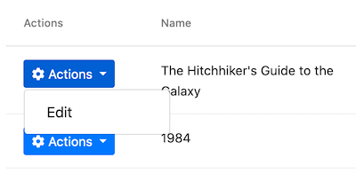

# Web应用程序开发教程 - 第三章: 创建,更新和删除图书
````json
//[doc-params]
{
    "UI": ["MVC","NG"],
    "DB": ["EF","Mongo"]
}
````
{{
if UI == "MVC"
  UI_Text="mvc"
else if UI == "NG"
  UI_Text="angular"
else
  UI_Text="?"
end
if DB == "EF"
  DB_Text="Entity Framework Core"
else if DB == "Mongo"
  DB_Text="MongoDB"
else
  DB_Text="?"
end
}}

## 关于本教程

在本系列教程中, 你将构建一个名为 `Acme.BookStore` 的用于管理书籍及其作者列表的基于ABP的应用程序.  它是使用以下技术开发的:

* **{{DB_Text}}** 做为ORM提供程序.
* **{{UI_Value}}** 做为UI框架.

本教程分为以下部分:

- [Part 1: 创建服务端](Part-1.md)
- [Part 2: 图书列表页面](Part-2.md)
- **Part 3: 创建,更新和删除图书**(本章)
- [Part 4: 集成测试](Part-4.md)
- [Part 5: 授权](Part-5.md)
- [Part 6: 作者: 领域层](Part-6.md)
- [Part 7: 作者: 数据库集成](Part-7.md)
- [Part 8: 作者: 应用服务层](Part-8.md)
- [Part 9: 作者: 用户页面](Part-9.md)
- [Part 10: 图书到作者的关系](Part-10.md)

## 下载源码

本教程根据你的**UI** 和 **Database**偏好有多个版,我们准备了两种可供下载的源码组合:

* [MVC (Razor Pages) UI 与 EF Core](https://github.com/abpframework/abp-samples/tree/master/BookStore-Mvc-EfCore)
* [Angular UI 与 MongoDB](https://github.com/abpframework/abp-samples/tree/master/BookStore-Angular-MongoDb)

{{if UI == "MVC"}}

## 创建新书籍

通过本节, 你将会了解如何创建一个 modal form 来实现新增书籍的功能. 最终成果如下图所示:


### 创建 modal form

在 `Acme.BookStore.Web` 项目的 `Pages/Books` 目录下新建一个 `CreateModal.cshtml` Razor页面:


#### CreateModal.cshtml.cs

打开 `CreateModal.cshtml.cs` 代码文件,用如下代码替换 `CreateModalModel` 类的实现:

````C#
using System.Threading.Tasks;
using Acme.BookStore.Books;
using Microsoft.AspNetCore.Mvc;

namespace Acme.BookStore.Web.Pages.Books
{
    public class CreateModalModel : BookStorePageModel
    {
        [BindProperty]
        public CreateUpdateBookDto Book { get; set; }

        private readonly IBookAppService _bookAppService;

        public CreateModalModel(IBookAppService bookAppService)
        {
            _bookAppService = bookAppService;
        }

        public void OnGet()
        {
            Book = new CreateUpdateBookDto();
        }

        public async Task<IActionResult> OnPostAsync()
        {
            await _bookAppService.CreateAsync(Book);
            return NoContent();
        }
    }
}
````

* 该类派生于 `BookStorePageModel` 而非默认的 `PageModel`. `BookStorePageModel` 继承了 `PageModel` 并且添加了一些可以被你的page model类使用的通用属性和方法.
* `Book` 属性上的 `[BindProperty]` 特性将post请求提交上来的数据绑定到该属性上.
* 该类通过构造函数注入了 `IBookAppService` 应用服务,并且在 `OnPostAsync` 处理程序中调用了服务的 `CreateAsync` 方法.
* 它在 `OnGet` 方法中创建一个新的 `CreateUpdateBookDto` 对象。 ASP.NET Core不需要像这样创建一个新实例就可以正常工作. 但是它不会为你创建实例,并且如果你的类在类构造函数中具有一些默认值分配或代码执行,它们将无法工作. 对于这种情况,我们为某些 `CreateUpdateBookDto` 属性设置了默认值.

#### CreateModal.cshtml

打开 `CreateModal.cshtml` 文件并粘贴如下代码:

````html
@page
@using Acme.BookStore.Localization
@using Acme.BookStore.Web.Pages.Books
@using Microsoft.Extensions.Localization
@using Volo.Abp.AspNetCore.Mvc.UI.Bootstrap.TagHelpers.Modal
@model CreateModalModel
@inject IStringLocalizer<BookStoreResource> L
@{
    Layout = null;
}
<abp-dynamic-form abp-model="Book" asp-page="/Books/CreateModal">
    <abp-modal>
        <abp-modal-header title="@L["NewBook"].Value"></abp-modal-header>
        <abp-modal-body>
            <abp-form-content />
        </abp-modal-body>
        <abp-modal-footer buttons="@(AbpModalButtons.Cancel|AbpModalButtons.Save)"></abp-modal-footer>
    </abp-modal>
</abp-dynamic-form>
````

* 这个 modal 使用 `abp-dynamic-form` [tag Helper](../UI/AspNetCore/Tag-Helpers/Dynamic-Forms.md) 根据 `CreateUpdateBookDto` 类自动构建了表单.
* `abp-model` 指定了 `Book` 属性为模型对象.
* `data-ajaxForm` 设置了表单通过AJAX提交,而不是经典的页面回发.
* `abp-form-content` tag helper 作为表单控件渲染位置的占位符 (这是可选的,只有你在 `abp-dynamic-form` 中像本示例这样添加了其他内容才需要).

> 提示: 就像在本示例中一样,`Layout` 应该为 `null`,因为当通过AJAX加载模态时,我们不希望包括所有布局.

### 添加 "New book" 按钮

打开 `Pages/Books/Index.cshtml` 并按如下代码修改 `abp-card-header` :

````html
<abp-card-header>
    <abp-row>
        <abp-column size-md="_6">
            <abp-card-title>@L["Books"]</abp-card-title>
        </abp-column>
        <abp-column size-md="_6" class="text-right">
            <abp-button id="NewBookButton"
                        text="@L["NewBook"].Value"
                        icon="plus"
                        button-type="Primary"/>
        </abp-column>
    </abp-row>
</abp-card-header>
````

`Index.cshtml` 的内容最终如下所示:

````html
@page
@using Acme.BookStore.Localization
@using Acme.BookStore.Web.Pages.Books
@using Microsoft.Extensions.Localization
@model IndexModel
@inject IStringLocalizer<BookStoreResource> L
@section scripts
{
    <abp-script src="/Pages/Books/Index.js"/>
}

<abp-card>
    <abp-card-header>
        <abp-row>
            <abp-column size-md="_6">
                <abp-card-title>@L["Books"]</abp-card-title>
            </abp-column>
            <abp-column size-md="_6" class="text-right">
                <abp-button id="NewBookButton"
                            text="@L["NewBook"].Value"
                            icon="plus"
                            button-type="Primary"/>
            </abp-column>
        </abp-row>
    </abp-card-header>
    <abp-card-body>
        <abp-table striped-rows="true" id="BooksTable"></abp-table>
    </abp-card-body>
</abp-card>
````

如下图所示,只是在表格 **右上方** 添加了 **New book** 按钮:


打开 `Pages/book/index.js` 在 `datatable` 配置代码后面添加如下代码:

````js
var createModal = new abp.ModalManager(abp.appPath + 'Books/CreateModal');

createModal.onResult(function () {
    dataTable.ajax.reload();
});

$('#NewBookButton').click(function (e) {
    e.preventDefault();
    createModal.open();
});
````

* `abp.ModalManager` 是一个在客户端打开和管理modal的辅助类.它基于Twitter Bootstrap的标准modal组件通过简化的API抽象隐藏了许多细节.
* `createModal.onResult(...)` 用于在创建书籍后刷新数据表格.
* `createModal.open();` 用于打开模态创建新书籍.

`Index.js` 的内容最终如下所示:

````js
$(function () {
    var l = abp.localization.getResource('BookStore');

    var dataTable = $('#BooksTable').DataTable(
        abp.libs.datatables.normalizeConfiguration({
            serverSide: true,
            paging: true,
            order: [[1, "asc"]],
            searching: false,
            scrollX: true,
            ajax: abp.libs.datatables.createAjax(acme.bookStore.books.book.getList),
            columnDefs: [
                {
                    title: l('Name'),
                    data: "name"
                },
                {
                    title: l('Type'),
                    data: "type",
                    render: function (data) {
                        return l('Enum:BookType:' + data);
                    }
                },
                {
                    title: l('PublishDate'),
                    data: "publishDate",
                    render: function (data) {
                        return luxon
                            .DateTime
                            .fromISO(data, {
                                locale: abp.localization.currentCulture.name
                            }).toLocaleString();
                    }
                },
                {
                    title: l('Price'),
                    data: "price"
                },
                {
                    title: l('CreationTime'), data: "creationTime",
                    render: function (data) {
                        return luxon
                            .DateTime
                            .fromISO(data, {
                                locale: abp.localization.currentCulture.name
                            }).toLocaleString(luxon.DateTime.DATETIME_SHORT);
                    }
                }
            ]
        })
    );

    var createModal = new abp.ModalManager(abp.appPath + 'Books/CreateModal');

    createModal.onResult(function () {
        dataTable.ajax.reload();
    });

    $('#NewBookButton').click(function (e) {
        e.preventDefault();
        createModal.open();
    });
});
````

现在,你可以 **运行程序** 通过新的 modal form 来创建书籍了.

## 更新书籍

在 `Acme.BookStore.Web` 项目的 `Pages/Books` 目录下新建一个名叫 `EditModal.cshtml` 的Razor页面:


### EditModal.cshtml.cs

打开 `EditModal.cshtml.cs` 文件(`EditModalModel`类) 并替换成以下代码:

````csharp
using System;
using System.Threading.Tasks;
using Acme.BookStore.Books;
using Microsoft.AspNetCore.Mvc;

namespace Acme.BookStore.Web.Pages.Books
{
    public class EditModalModel : BookStorePageModel
    {
        [HiddenInput]
        [BindProperty(SupportsGet = true)]
        public Guid Id { get; set; }

        [BindProperty]
        public CreateUpdateBookDto Book { get; set; }

        private readonly IBookAppService _bookAppService;

        public EditModalModel(IBookAppService bookAppService)
        {
            _bookAppService = bookAppService;
        }

        public async Task OnGetAsync()
        {
            var bookDto = await _bookAppService.GetAsync(Id);
            Book = ObjectMapper.Map<BookDto, CreateUpdateBookDto>(bookDto);
        }

        public async Task<IActionResult> OnPostAsync()
        {
            await _bookAppService.UpdateAsync(Id, Book);
            return NoContent();
        }
    }
}
````

* `[HiddenInput]` 和 `[BindProperty]` 是标准的 ASP.NET Core MVC 特性.这里启用 `SupportsGet` 从Http请求的查询字符串中获取Id的值.
* 在 `OnGetAsync` 方法中,将 `BookAppService.GetAsync` 方法返回的 `BookDto` 映射成 `CreateUpdateBookDto` 并赋值给Book属性.
* `OnPostAsync` 方法直接使用 `BookAppService.UpdateAsync` 来更新实体.

### BookDto 到 CreateUpdateBookDto 对象映射

为了执行 `BookDto` 到 `CreateUpdateBookDto` 对象映射,请打开 `Acme.BookStore.Web` 项目中的 `BookStoreWebAutoMapperProfile.cs` 并更改它,如下所示:

````csharp
using AutoMapper;

namespace Acme.BookStore.Web
{
    public class BookStoreWebAutoMapperProfile : Profile
    {
        public BookStoreWebAutoMapperProfile()
        {
            CreateMap<BookDto, CreateUpdateBookDto>();
        }
    }
}
````

* 我们添加了 `CreateMap<BookDto, CreateUpdateBookDto>();` 作为映射定义.

> 请注意,我们在Web层中进行映射定义是一种最佳实践,因为仅在该层中需要它.

### EditModal.cshtml

将 `EditModal.cshtml` 页面内容替换成如下代码:

````html
@page
@using Acme.BookStore.Localization
@using Acme.BookStore.Web.Pages.Books
@using Microsoft.Extensions.Localization
@using Volo.Abp.AspNetCore.Mvc.UI.Bootstrap.TagHelpers.Modal
@model EditModalModel
@inject IStringLocalizer<BookStoreResource> L
@{
    Layout = null;
}
<abp-dynamic-form abp-model="Book" asp-page="/Books/EditModal">
    <abp-modal>
        <abp-modal-header title="@L["Update"].Value"></abp-modal-header>
        <abp-modal-body>
            <abp-input asp-for="Id" />
            <abp-form-content />
        </abp-modal-body>
        <abp-modal-footer buttons="@(AbpModalButtons.Cancel|AbpModalButtons.Save)"></abp-modal-footer>
    </abp-modal>
</abp-dynamic-form>
````

这个页面内容和 `CreateModal.cshtml` 非常相似,除了以下几点:

* 它包含`id`属性的`abp-input`, 用于存储编辑书的 `id` (它是隐藏的Input)
* 此页面指定的post地址是`Books/EditModal`.

### 为表格添加 "操作（Actions）" 下拉菜单

我们将为表格每行添加下拉按钮 ("Actions"):

打开 `Pages/Books/Index.js` 页面,并按下方所示修改表格部分的代码:

````js
$(function () {
    var l = abp.localization.getResource('BookStore');
    var createModal = new abp.ModalManager(abp.appPath + 'Books/CreateModal');
    var editModal = new abp.ModalManager(abp.appPath + 'Books/EditModal');

    var dataTable = $('#BooksTable').DataTable(
        abp.libs.datatables.normalizeConfiguration({
            serverSide: true,
            paging: true,
            order: [[1, "asc"]],
            searching: false,
            scrollX: true,
            ajax: abp.libs.datatables.createAjax(acme.bookStore.books.book.getList),
            columnDefs: [
                {
                    title: l('Actions'),
                    rowAction: {
                        items:
                            [
                                {
                                    text: l('Edit'),
                                    action: function (data) {
                                        editModal.open({ id: data.record.id });
                                    }
                                }
                            ]
                    }
                },
                {
                    title: l('Name'),
                    data: "name"
                },
                {
                    title: l('Type'),
                    data: "type",
                    render: function (data) {
                        return l('Enum:BookType:' + data);
                    }
                },
                {
                    title: l('PublishDate'),
                    data: "publishDate",
                    render: function (data) {
                        return luxon
                            .DateTime
                            .fromISO(data, {
                                locale: abp.localization.currentCulture.name
                            }).toLocaleString();
                    }
                },
                {
                    title: l('Price'),
                    data: "price"
                },
                {
                    title: l('CreationTime'), data: "creationTime",
                    render: function (data) {
                        return luxon
                            .DateTime
                            .fromISO(data, {
                                locale: abp.localization.currentCulture.name
                            }).toLocaleString(luxon.DateTime.DATETIME_SHORT);
                    }
                }
            ]
        })
    );

    createModal.onResult(function () {
        dataTable.ajax.reload();
    });

    editModal.onResult(function () {
        dataTable.ajax.reload();
    });

    $('#NewBookButton').click(function (e) {
        e.preventDefault();
        createModal.open();
    });
});
````

* 增加了一个新的 `ModalManager` 名为 `editModal` 打开编辑模态框.
* 在 `columnDefs` 部分的开头添加了一个新列,用于"*Actions*"下拉按钮.
* "*Edit*" 动作简单地调用 `editModal.open()` 打开编辑模态框.
* `editModal.onResult(...)` 当你关闭编程模态框时进行回调刷新数据表格.

你可以运行应用程序,并通过选择一本书的编辑操作编辑任何一本书.

最终的UI看起来如下:


## 删除书籍

打开 `Pages/book/index.js` 文件,在 `rowAction` `items` 下新增一项:

````js
{
    text: l('Delete'),
    confirmMessage: function (data) {
        return l('BookDeletionConfirmationMessage', data.record.name);
    },
    action: function (data) {
        acme.bookStore.books.book
            .delete(data.record.id)
            .then(function() {
                abp.notify.info(l('SuccessfullyDeleted'));
                dataTable.ajax.reload();
            });
    }
}
````

* `confirmMessage` 用来在实际执行 `action` 之前向用户进行确认.
* 通过javascript代理方法 `acme.bookStore.books.book.delete(...)` 执行一个AJAX请求来删除一个book实体.
* `abp.notify.info` 用来在执行删除操作后显示一个toastr通知信息.

由于我们使用了两个新的本地化文本(`BookDeletionConfirmationMessage`和`SuccesslyDeleted`),因此你需要将它们添加到本地化文件(`Acme.BookStore.Domain.Shared`项目的`Localization/BookStore`文件夹下的`en.json`):

````json
"BookDeletionConfirmationMessage": "Are you sure to delete the book '{0}'?",
"SuccessfullyDeleted": "Successfully deleted!"
````

`Index.js` 的内容最终如下所示:

````js
$(function () {
    var l = abp.localization.getResource('BookStore');
    var createModal = new abp.ModalManager(abp.appPath + 'Books/CreateModal');
    var editModal = new abp.ModalManager(abp.appPath + 'Books/EditModal');

    var dataTable = $('#BooksTable').DataTable(
        abp.libs.datatables.normalizeConfiguration({
            serverSide: true,
            paging: true,
            order: [[1, "asc"]],
            searching: false,
            scrollX: true,
            ajax: abp.libs.datatables.createAjax(acme.bookStore.books.book.getList),
            columnDefs: [
                {
                    title: l('Actions'),
                    rowAction: {
                        items:
                            [
                                {
                                    text: l('Edit'),
                                    action: function (data) {
                                        editModal.open({ id: data.record.id });
                                    }
                                },
                                {
                                    text: l('Delete'),
                                    confirmMessage: function (data) {
                                        return l(
                                            'BookDeletionConfirmationMessage',
                                            data.record.name
                                        );
                                    },
                                    action: function (data) {
                                        acme.bookStore.books.book
                                            .delete(data.record.id)
                                            .then(function() {
                                                abp.notify.info(
                                                    l('SuccessfullyDeleted')
                                                );
                                                dataTable.ajax.reload();
                                            });
                                    }
                                }
                            ]
                    }
                },
                {
                    title: l('Name'),
                    data: "name"
                },
                {
                    title: l('Type'),
                    data: "type",
                    render: function (data) {
                        return l('Enum:BookType:' + data);
                    }
                },
                {
                    title: l('PublishDate'),
                    data: "publishDate",
                    render: function (data) {
                        return luxon
                            .DateTime
                            .fromISO(data, {
                                locale: abp.localization.currentCulture.name
                            }).toLocaleString();
                    }
                },
                {
                    title: l('Price'),
                    data: "price"
                },
                {
                    title: l('CreationTime'), data: "creationTime",
                    render: function (data) {
                        return luxon
                            .DateTime
                            .fromISO(data, {
                                locale: abp.localization.currentCulture.name
                            }).toLocaleString(luxon.DateTime.DATETIME_SHORT);
                    }
                }
            ]
        })
    );

    createModal.onResult(function () {
        dataTable.ajax.reload();
    });

    editModal.onResult(function () {
        dataTable.ajax.reload();
    });

    $('#NewBookButton').click(function (e) {
        e.preventDefault();
        createModal.open();
    });
});
````

你可以运行程序并尝试删除一本书.

{{end}}

{{if UI == "NG"}}

## 创建新书籍

下面的章节中,你将学习到如何创建一个新的模态对话框来新增书籍.

### BookComponent

打开  `/src/app/book/book.component.ts` 使用以下内容替换:

```js
import { ListService, PagedResultDto } from '@abp/ng.core';
import { Component, OnInit } from '@angular/core';
import { BookDto } from './models';
import { BookService } from './services';

@Component({
  selector: 'app-book',
  templateUrl: './book.component.html',
  styleUrls: ['./book.component.scss'],
  providers: [ListService],
})
export class BookComponent implements OnInit {
  book = { items: [], totalCount: 0 } as PagedResultDto<BookDto>;

  isModalOpen = false; // add this line

  constructor(public readonly list: ListService, private bookService: BookService) {}

  ngOnInit() {
    const bookStreamCreator = (query) => this.bookService.getListByInput(query);

    this.list.hookToQuery(bookStreamCreator).subscribe((response) => {
      this.book = response;
    });
  }

  // add new method
  createBook() {
    this.isModalOpen = true;
  }
}
```

* 我们定义了一个名为 `isModalOpen` 的变量和 `createBook` 方法.

打开 `/src/app/book/book.component.html` 做以下更改:

```html
<div class="card">
  <div class="card-header">
    <div class="row">
      <div class="col col-md-6">
        <h5 class="card-title"></h5>
      </div>        
      <div class="text-right col col-md-6">
          
        <!-- Add the "new book" button here -->
        <div class="text-lg-right pt-2">
          <button id="create" class="btn btn-primary" type="button" (click)="createBook()">
            <i class="fa fa-plus mr-1"></i>
            <span></span>
          </button>
        </div>
          
      </div>
    </div>
  </div>
  <div class="card-body">
    <!-- ngx-datatable should be here! -->
  </div>
</div>

<!-- Add the modal here -->
<abp-modal [(visible)]="isModalOpen">
  <ng-template #abpHeader>
    <h3></h3>
  </ng-template>

  <ng-template #abpBody> </ng-template>

  <ng-template #abpFooter>
    <button type="button" class="btn btn-secondary" abpClose>
      
    </button>
  </ng-template>
</abp-modal>
```

* 添加了 `New book` 按钮到卡片头部.
* 添加了 `abp-modal` 渲染模态框,允许用户创建新书. `abp-modal` 是显示模态框的预构建组件. 你也可以使用其它方法显示模态框,但 `abp-modal` 提供了一些附加的好处.

你可以打开浏览器,点击**New book**按钮看到模态框.


### 添加响应式表单

[响应式表单](https://angular.io/guide/reactive-forms) 提供一种模型驱动的方法来处理其值随时间变化的表单输入.

打开  `/src/app/book/book.component.ts` 使用以下内容替换:

```js
import { ListService, PagedResultDto } from '@abp/ng.core';
import { Component, OnInit } from '@angular/core';
import { BookDto, BookType } from './models'; // add BookType
import { BookService } from './services';
import { FormGroup, FormBuilder, Validators } from '@angular/forms'; // add this

@Component({
  selector: 'app-book',
  templateUrl: './book.component.html',
  styleUrls: ['./book.component.scss'],
  providers: [ListService],
})
export class BookComponent implements OnInit {
  book = { items: [], totalCount: 0 } as PagedResultDto<BookDto>;

  form: FormGroup; // add this line

  bookType = BookType; // add this line

  // add bookTypes as a list of BookType enum members
  bookTypes = Object.keys(this.bookType).filter(
    (key) => typeof this.bookType[key] === 'number'
  );

  isModalOpen = false;

  constructor(
    public readonly list: ListService,
    private bookService: BookService,
    private fb: FormBuilder // inject FormBuilder
  ) {}

  ngOnInit() {
    const bookStreamCreator = (query) => this.bookService.getListByInput(query);

    this.list.hookToQuery(bookStreamCreator).subscribe((response) => {
      this.book = response;
    });
  }

  createBook() {
    this.buildForm(); // add this line
    this.isModalOpen = true;
  }

  // add buildForm method
  buildForm() {
    this.form = this.fb.group({
      name: ['', Validators.required],
      type: [null, Validators.required],
      publishDate: [null, Validators.required],
      price: [null, Validators.required],
    });
  }

  // add save method
  save() {
    if (this.form.invalid) {
      return;
    }

    this.bookService.createByInput(this.form.value).subscribe(() => {
      this.isModalOpen = false;
      this.form.reset();
      this.list.get();
    });
  }
}
```

* 导入了 `FormGroup, FormBuilder and Validators`.
* 添加了 `form: FormGroup` 变量.
* 添加了 `bookType` 属性,你可以从模板中获取 `BookType` 枚举成员.
* 添加了 `bookTypes` 属性作为 `BookType` 枚举成员列表. 将在表单选项中使用.
* 我们注入了 `fb: FormBuilder` 服务到构造函数. [FormBuilder](https://angular.io/api/forms/FormBuilder) 服务为生成控件提供了方便的方法. 它减少了构建复杂表单所需的样板文件的数量.
* 我们添加了 `buildForm` 方法到文件末尾, 在 `createBook` 方法调用 `buildForm()` 方法. 该方法创建一个响应式表单去创建新书.
* 添加了`save` 方法.

打开 `/src/app/book/book.component.html`,使用以下内容替换 `<ng-template #abpBody> </ng-template>`:

```html
<ng-template #abpBody>
  <form [formGroup]="form" (ngSubmit)="save()">
    <div class="form-group">
      <label for="book-name">Name</label><span> * </span>
      <input type="text" id="book-name" class="form-control" formControlName="name" autofocus />
    </div>

    <div class="form-group">
      <label for="book-price">Price</label><span> * </span>
      <input type="number" id="book-price" class="form-control" formControlName="price" />
    </div>

    <div class="form-group">
      <label for="book-type">Type</label><span> * </span>
      <select class="form-control" id="book-type" formControlName="type">
        <option [ngValue]="null">Select a book type</option>
        <option [ngValue]="bookType[type]" *ngFor="let type of bookTypes"> </option>
      </select>
    </div>

    <div class="form-group">
      <label>Publish date</label><span> * </span>
      <input
        #datepicker="ngbDatepicker"
        class="form-control"
        name="datepicker"
        formControlName="publishDate"
        ngbDatepicker
        (click)="datepicker.toggle()"
      />
    </div>
  </form>
</ng-template>
```

同时使用下面的代码部分替换 `<ng-template #abpFooter> </ng-template>`:

````html
<ng-template #abpFooter>
  <button type="button" class="btn btn-secondary" abpClose>
      
  </button>

  <!--added save button-->
  <button class="btn btn-primary" (click)="save()" [disabled]="form.invalid">
        <i class="fa fa-check mr-1"></i>
        
  </button>
</ng-template>
````

### Datepicker

我们在这个组件中使用了[NgBootstrap datepicker](https://ng-bootstrap.github.io/#/components/datepicker/overview). 因此需要添加与此组件相关的依赖项.

打开 `/src/app/book/book.module.ts` 使用以下内容替换:

```js
import { NgModule } from '@angular/core';
import { SharedModule } from '../shared/shared.module';
import { BookRoutingModule } from './book-routing.module';
import { BookComponent } from './book.component';
import { NgbDatepickerModule } from '@ng-bootstrap/ng-bootstrap'; // add this line

@NgModule({
  declarations: [BookComponent],
  imports: [
    BookRoutingModule,
    SharedModule,
    NgbDatepickerModule, // add this line
  ]
})
export class BookModule { }
```

* 我们导入了 `NgbDatepickerModule`  来使用日期选择器.

打开  `/src/app/book/book.component.ts` 使用以内内容替换:

```js
import { ListService, PagedResultDto } from '@abp/ng.core';
import { Component, OnInit } from '@angular/core';
import { BookDto, BookType } from './models';
import { BookService } from './services';
import { FormGroup, FormBuilder, Validators } from '@angular/forms';

// added this line
import { NgbDateNativeAdapter, NgbDateAdapter } from '@ng-bootstrap/ng-bootstrap';

@Component({
  selector: 'app-book',
  templateUrl: './book.component.html',
  styleUrls: ['./book.component.scss'],
  providers: [
    ListService,
    { provide: NgbDateAdapter, useClass: NgbDateNativeAdapter } // add this line
  ],
})
export class BookComponent implements OnInit {
  book = { items: [], totalCount: 0 } as PagedResultDto<BookDto>;

  form: FormGroup;

  bookType = BookType;

  bookTypes = Object.keys(this.bookType).filter(
    (key) => typeof this.bookType[key] === 'number'
  );

  isModalOpen = false;

  constructor(
    public readonly list: ListService,
    private bookService: BookService,
    private fb: FormBuilder
  ) {}

  ngOnInit() {
    const bookStreamCreator = (query) => this.bookService.getListByInput(query);

    this.list.hookToQuery(bookStreamCreator).subscribe((response) => {
      this.book = response;
    });
  }

  createBook() {
    this.buildForm();
    this.isModalOpen = true;
  }

  buildForm() {
    this.form = this.fb.group({
      name: ['', Validators.required],
      type: [null, Validators.required],
      publishDate: [null, Validators.required],
      price: [null, Validators.required],
    });
  }

  save() {
    if (this.form.invalid) {
      return;
    }

    this.bookService.createByInput(this.form.value).subscribe(() => {
      this.isModalOpen = false;
      this.form.reset();
      this.list.get();
    });
  }
}
```

* 导入了 `NgbDateNativeAdapter` 和 `NgbDateAdapter`.
* 我们添加了一个新的 `NgbDateAdapter` 提供程序,它将Datepicker值转换为 `Date` 类型. 有关更多详细信息,请参见[datepicker adapters](https://ng-bootstrap.github.io/#/components/datepicker/overview).

现在你可以打开浏览器看到以下变化:


## 更新书籍

打开 `/src/app/book/book.component.ts` 使用以下内容替换:

```js
import { ListService, PagedResultDto } from '@abp/ng.core';
import { Component, OnInit } from '@angular/core';
import { BookDto, BookType, CreateUpdateBookDto } from './models';
import { BookService } from './services';
import { FormGroup, FormBuilder, Validators } from '@angular/forms';
import { NgbDateNativeAdapter, NgbDateAdapter } from '@ng-bootstrap/ng-bootstrap';

@Component({
  selector: 'app-book',
  templateUrl: './book.component.html',
  styleUrls: ['./book.component.scss'],
  providers: [ListService, { provide: NgbDateAdapter, useClass: NgbDateNativeAdapter }],
})
export class BookComponent implements OnInit {
  book = { items: [], totalCount: 0 } as PagedResultDto<BookDto>;

  selectedBook = new BookDto(); // declare selectedBook

  form: FormGroup;

  bookType = BookType;

  bookTypes = Object.keys(this.bookType).filter(
    (key) => typeof this.bookType[key] === 'number'
  );

  isModalOpen = false;

  constructor(
    public readonly list: ListService,
    private bookService: BookService,
    private fb: FormBuilder
  ) {}

  ngOnInit() {
    const bookStreamCreator = (query) => this.bookService.getListByInput(query);

    this.list.hookToQuery(bookStreamCreator).subscribe((response) => {
      this.book = response;
    });
  }

  createBook() {
    this.selectedBook = new BookDto(); // reset the selected book
    this.buildForm();
    this.isModalOpen = true;
  }

  // Add editBook method
  editBook(id: string) {
    this.bookService.getById(id).subscribe((book) => {
      this.selectedBook = book;
      this.buildForm();
      this.isModalOpen = true;
    });
  }

  buildForm() {
    this.form = this.fb.group({
      name: [this.selectedBook.name || '', Validators.required],
      type: [this.selectedBook.type || null, Validators.required],
      publishDate: [
        this.selectedBook.publishDate ? new Date(this.selectedBook.publishDate) : null,
        Validators.required,
      ],
      price: [this.selectedBook.price || null, Validators.required],
    });
  }

  // change the save method
  save() {
    if (this.form.invalid) {
      return;
    }

    const request = this.selectedBook.id
      ? this.bookService.updateByIdAndInput(this.form.value, this.selectedBook.id)
      : this.bookService.createByInput(this.form.value);

    request.subscribe(() => {
      this.isModalOpen = false;
      this.form.reset();
      this.list.get();
    });
  }
}
```

* 我们声明了类型为 `BookDto` 的 `selectedBook` 变量.
* 我们添加了 `editBook`  方法, 根据给定图书 `Id` 设置 `selectedBook` 对象.
* 我们替换了 `buildForm` 方法使用 `selectedBook` 数据创建表单.
* 我们替换了 `createBook` 方法,设置 `selectedBook` 为空对象.
* 我们替换了 `save` 方法.

### 添加 "Actions" 下拉框到表格

打开 `/src/app/book/book.component.html` 在 `ngx-datatable` 第一列添加  `ngx-datatable-column`  定义:

```html
<ngx-datatable-column
  [name]="'::Actions' | abpLocalization"
  [maxWidth]="150"
  [sortable]="false"
>
  <ng-template let-row="row" ngx-datatable-cell-template>
    <div ngbDropdown container="body" class="d-inline-block">
      <button
        class="btn btn-primary btn-sm dropdown-toggle"
        data-toggle="dropdown"
        aria-haspopup="true"
        ngbDropdownToggle
      >
        <i class="fa fa-cog mr-1"></i>
      </button>
      <div ngbDropdownMenu>
        <button ngbDropdownItem (click)="editBook(row.id)">
          
        </button>
      </div>
    </div>
  </ng-template>
</ngx-datatable-column>
```

在表格的第一列添加了一个 "Actions" 下拉菜单,如下图所示:



同时如下所示更改 `ng-template #abpHeader` 部分:

```html
<ng-template #abpHeader>
    <h3></h3>
</ng-template>
```

模板将在标题中显示 **Edit** 文本用于编辑记录操作, **New Book** 用于添加新记录操作.

## 删除书籍

打开 `/src/app/book/book.component.ts` 注入 `ConfirmationService`.

所示替换构造函数:

```js
// ...

// add new imports
import { ConfirmationService, Confirmation } from '@abp/ng.theme.shared';

//change the constructor
constructor(
  public readonly list: ListService,
  private bookService: BookService,
  private fb: FormBuilder,
  private confirmation: ConfirmationService // inject the ConfirmationService
) {}

// Add a delete method
delete(id: string) {
  this.confirmation.warn('::AreYouSureToDelete', '::AreYouSure').subscribe((status) => {
    if (status === Confirmation.Status.confirm) {
      this.bookService.deleteById(id).subscribe(() => this.list.get());
    }
  });
}
```

* 我们注入了 `ConfirmationService`.
* 我们注入了 `ConfirmationService` 到构造函数.
* 添加了 `delete` 方法.

> 参阅[确认弹层文档](../UI/Angular/Confirmation-Service)了解该服务的更多信息.

### 添加删除按钮:

打开 `/src/app/book/book.component.html` 修改 `ngbDropdownMenu` 添加删除按钮:

```html
<div ngbDropdownMenu>
  <!-- add the Delete button -->
    <button ngbDropdownItem (click)="delete(row.id)">
        
    </button>
</div>
```

最终操作下拉框UI看起来如下:


点击 `delete` 动作调用 `delete` 方法,然后无法显示一个确认弹层如下图所示.


{{end}}

## 下一章

查看本教程的[下一章](Part-4.md).
