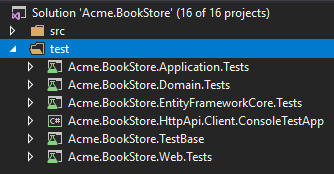
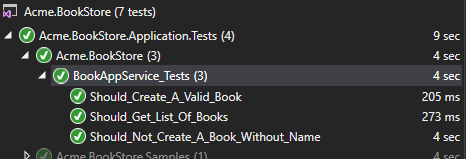

# Web应用程序开发教程 - 第三章: 集成测试
````json
//[doc-params]
{
    "UI": ["MVC","Blazor","BlazorServer","NG"],
    "DB": ["EF","Mongo"]
}
````
## 关于本教程

在本系列教程中, 你将构建一个名为 `Acme.BookStore` 的用于管理书籍及其作者列表的基于ABP的应用程序.  它是使用以下技术开发的:

* **{{DB_Text}}** 做为ORM提供程序.
* **{{UI_Value}}** 做为UI框架.

本教程分为以下部分:

- [Part 1: 创建服务端](Part-1.md)
- [Part 2: 图书列表页面](Part-2.md)
- [Part 3: 创建,更新和删除图书](Part-3.md)
- **Part 4: 集成测试 (本章)**
- [Part 5: 授权](Part-5.md)
- [Part 6: 作者: 领域层](Part-6.md)
- [Part 7: 作者: 数据库集成](Part-7.md)
- [Part 8: 作者: 应用服务层](Part-8.md)
- [Part 9: 作者: 用户页面](Part-9.md)
- [Part 10: 图书到作者的关系](Part-10.md)

## 下载源码

本教程根据你的**UI** 和 **数据库**偏好有多个版本,我们准备了几种可供下载的源码组合:

* [MVC (Razor Pages) UI 与 EF Core](https://github.com/abpframework/abp-samples/tree/master/BookStore-Mvc-EfCore)
* [Blazor UI 与 EF Core](https://github.com/abpframework/abp-samples/tree/master/BookStore-Blazor-EfCore)
* [Angular UI 与 MongoDB](https://github.com/abpframework/abp-samples/tree/master/BookStore-Angular-MongoDb)

> 如果你在Windows中遇到 "文件名太长" or "解压错误", 很可能与Windows最大文件路径限制有关. Windows文件路径的最大长度为250字符. 为了解决这个问题,参阅 [在Windows 10中启用长路径](https://docs.microsoft.com/en-us/windows/win32/fileio/maximum-file-path-limitation?tabs=cmd#enable-long-paths-in-windows-10-version-1607-and-later).

> 如果你遇到与Git相关的长路径错误, 尝试使用下面的命令在Windows中启用长路径. 参阅 https://github.com/msysgit/msysgit/wiki/Git-cannot-create-a-file-or-directory-with-a-long-path
> `git config --system core.longpaths true`

{{if UI == "MVC" && DB == "EF"}}

### 视频教程

本章也被录制为视频教程 **<a href="https://www.youtube.com/watch?v=aidRB4YFDLM&list=PLsNclT2aHJcPNaCf7Io3DbMN6yAk_DgWJ&index=4" target="_blank">发布在YouTube</a>**.

{{end}}

## 解决方案中的测试项目

这一部分涵盖了 **服务器端** 测试. 解决方案中有多个测试项目:



> 根据你选择的UI和数据库, 测试项目略微有所不同. 例如, 如果选择MongoDB, 那么 `Acme.BookStore.EntityFrameworkCore.Tests` 会变为 `Acme.BookStore.MongoDB.Tests`.

每个项目用于测试相关的应用程序项目.测试项目使用以下库进行测试:

* [xunit](https://xunit.github.io/) 作为主测试框架.
* [Shoudly](http://shouldly.readthedocs.io/en/latest/) 作为断言库.
* [NSubstitute](http://nsubstitute.github.io/) 作为模拟库.

{{if DB=="EF"}}

> 测试项目配置为使用 **SQLite内存** 作为数据库. 创建一个单独的数据库实例并使用[数据种子系统](../Data-Seeding.md)初始化种子数据,为每个测试准备一个新的数据库.

{{else if DB=="Mongo"}}

> **[Mongo2Go](https://github.com/Mongo2Go/Mongo2Go)**库用于模拟MongoDB数据库. 创建一个单独的数据库实例并使用[数据种子系统](../Data-Seeding.md)初始化种子数据,为每个测试准备一个新的数据库.

{{end}}

## 添加测试数据

如果你已经按照[第一部分](Part-1.md)中的描述创建了数据种子贡献者,则相同的数据也在测试中可用. 因此你可以跳过此部分. 如果你尚未创建种子贡献者,可以使用 `BookStoreTestDataSeedContributor` 来为要在以下测试中使用的相同数据提供种子.

## 测试 BookAppService

在 `Acme.BookStore.Application.Tests` 项目的 `Books` 命名空间(文件夹)中创建一个名叫 `BookAppService_Tests` 的测试类:

````csharp
using System;
using System.Linq;
using System.Threading.Tasks;
using Shouldly;
using Volo.Abp.Application.Dtos;
using Volo.Abp.Validation;
using Xunit;

namespace Acme.BookStore.Books
{ {{if DB=="Mongo"}}
    [Collection(BookStoreTestConsts.CollectionDefinitionName)]{{end}}
    public class BookAppService_Tests : BookStoreApplicationTestBase
    {
        private readonly IBookAppService _bookAppService;

        public BookAppService_Tests()
        {
            _bookAppService = GetRequiredService<IBookAppService>();
        }

        [Fact]
        public async Task Should_Get_List_Of_Books()
        {
            //Act
            var result = await _bookAppService.GetListAsync(
                new PagedAndSortedResultRequestDto()
            );

            //Assert
            result.TotalCount.ShouldBeGreaterThan(0);
            result.Items.ShouldContain(b => b.Name == "1984");
        }
    }
}
````

* 测试方法 `Should_Get_List_Of_Books` 直接使用 `BookAppService.GetListAsync` 方法来获取用户列表,并执行检查.
* 我们可以安全地检查 "1984" 这本书的名称,因为我们知道这本书可以在数据库中找到,我们已将其添加到种子数据中.

新增测试方法,用以测试创建一个**合法**book实体的场景:

````csharp
[Fact]
public async Task Should_Create_A_Valid_Book()
{
    //Act
    var result = await _bookAppService.CreateAsync(
        new CreateUpdateBookDto
        {
            Name = "New test book 42",
            Price = 10,
            PublishDate = DateTime.Now,
            Type = BookType.ScienceFiction
        }
    );

    //Assert
    result.Id.ShouldNotBe(Guid.Empty);
    result.Name.ShouldBe("New test book 42");
}
````

新增测试方法,用以测试创建一个非法book实体失败的场景:

````csharp
[Fact]
public async Task Should_Not_Create_A_Book_Without_Name()
{
    var exception = await Assert.ThrowsAsync<AbpValidationException>(async () =>
    {
        await _bookAppService.CreateAsync(
            new CreateUpdateBookDto
            {
                Name = "",
                Price = 10,
                PublishDate = DateTime.Now,
                Type = BookType.ScienceFiction
            }
        );
    });

    exception.ValidationErrors
        .ShouldContain(err => err.MemberNames.Any(mem => mem == "Name"));
}
````

* 由于 `Name` 是空值, ABP 抛出一个 `AbpValidationException` 异常.

最终的测试类如下所示:

````csharp
using System;
using System.Linq;
using System.Threading.Tasks;
using Shouldly;
using Volo.Abp.Application.Dtos;
using Volo.Abp.Validation;
using Xunit;

namespace Acme.BookStore.Books
{ {{if DB=="Mongo"}}
    [Collection(BookStoreTestConsts.CollectionDefinitionName)]{{end}}
    public class BookAppService_Tests : BookStoreApplicationTestBase
    {
        private readonly IBookAppService _bookAppService;

        public BookAppService_Tests()
        {
            _bookAppService = GetRequiredService<IBookAppService>();
        }

        [Fact]
        public async Task Should_Get_List_Of_Books()
        {
            //Act
            var result = await _bookAppService.GetListAsync(
                new PagedAndSortedResultRequestDto()
            );

            //Assert
            result.TotalCount.ShouldBeGreaterThan(0);
            result.Items.ShouldContain(b => b.Name == "1984");
        }

        [Fact]
        public async Task Should_Create_A_Valid_Book()
        {
            //Act
            var result = await _bookAppService.CreateAsync(
                new CreateUpdateBookDto
                {
                    Name = "New test book 42",
                    Price = 10,
                    PublishDate = DateTime.Now,
                    Type = BookType.ScienceFiction
                }
            );

            //Assert
            result.Id.ShouldNotBe(Guid.Empty);
            result.Name.ShouldBe("New test book 42");
        }

        [Fact]
        public async Task Should_Not_Create_A_Book_Without_Name()
        {
            var exception = await Assert.ThrowsAsync<AbpValidationException>(async () =>
            {
                await _bookAppService.CreateAsync(
                    new CreateUpdateBookDto
                    {
                        Name = "",
                        Price = 10,
                        PublishDate = DateTime.Now,
                        Type = BookType.ScienceFiction
                    }
                );
            });

            exception.ValidationErrors
                .ShouldContain(err => err.MemberNames.Any(mem => mem == "Name"));
        }
    }
}
````

打开**测试资源管理器**(测试 -> Windows -> 测试资源管理器)并**执行所有**测试:



恭喜你, **绿色图标**表示测试已成功通过!

## 下一章

查看本教程的[下一章](Part-5.md).
