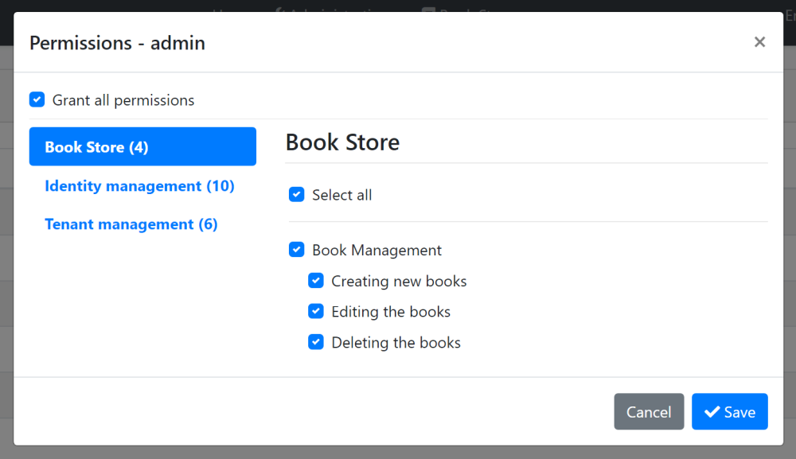

# Web应用程序开发教程 - 第五章: 授权
````json
//[doc-params]
{
    "UI": ["MVC","Blazor","BlazorServer","NG"],
    "DB": ["EF","Mongo"]
}
````
## 关于本教程

在本系列教程中, 你将构建一个名为 `Acme.BookStore` 的用于管理书籍及其作者列表的基于ABP的应用程序.  它是使用以下技术开发的:

* **{{DB_Text}}** 做为ORM提供程序.
* **{{UI_Value}}** 做为UI框架.

本教程分为以下部分:

- [Part 1: 创建服务端](Part-1.md)
- [Part 2: 图书列表页面](Part-2.md)
- [Part 3: 创建,更新和删除图书](Part-2.md)
- [Part 4: 集成测试](Part-4.md)
- **Part 5: 授权**(本章)
- [Part 6: 作者: 领域层](Part-6.md)
- [Part 7: 作者: 数据库集成](Part-7.md)
- [Part 8: 作者: 应用服务层](Part-8.md)
- [Part 9: 作者: 用户页面](Part-9.md)
- [Part 10: 图书到作者的关系](Part-10.md)

## 下载源码

本教程根据你的**UI** 和 **数据库**偏好有多个版本,我们准备了几种可供下载的源码组合:

* [MVC (Razor Pages) UI 与 EF Core](https://github.com/abpframework/abp-samples/tree/master/BookStore-Mvc-EfCore)
* [Blazor UI 与 EF Core](https://github.com/abpframework/abp-samples/tree/master/BookStore-Blazor-EfCore)
* [Angular UI 与 MongoDB](https://github.com/abpframework/abp-samples/tree/master/BookStore-Angular-MongoDb)

> 如果你在Windows中遇到 "文件名太长" or "解压错误", 很可能与Windows最大文件路径限制有关. Windows文件路径的最大长度为250字符. 为了解决这个问题,参阅 [在Windows 10中启用长路径](https://docs.microsoft.com/en-us/windows/win32/fileio/maximum-file-path-limitation?tabs=cmd#enable-long-paths-in-windows-10-version-1607-and-later).

> 如果你遇到与Git相关的长路径错误, 尝试使用下面的命令在Windows中启用长路径. 参阅 https://github.com/msysgit/msysgit/wiki/Git-cannot-create-a-file-or-directory-with-a-long-path
> `git config --system core.longpaths true`

{{if UI == "MVC" && DB == "EF"}}

### 视频教程

本章也被录制为视频教程 **<a href="https://www.youtube.com/watch?v=1WsfMITN_Jk&list=PLsNclT2aHJcPNaCf7Io3DbMN6yAk_DgWJ&index=5" target="_blank">发布在YouTube</a>**.

{{end}}

## 权限

ABP框架提供了一个基于ASP.NET Core[授权基础架构](https://docs.microsoft.com/en-us/aspnet/core/security/authorization/introduction)的[授权系统](../Authorization.md). 基于标准授权基础架构的一个主要功能是添加了 **权限系统**, 这个系统允许定义权限并且根据角色, 用户或客户端启用/禁用权限.

### 权限名称

权限必须有唯一的名称 (一个 `字符串`). 最好的方法是把它定义为一个 `常量`, 这样我们就可以重用这个权限名称了.

打开 `Acme.BookStore.Application.Contracts` 项目中的 `BookStorePermissions` 类 (位于 `Permissions` 文件夹) 并替换为以下代码:

````csharp
namespace Acme.BookStore.Permissions
{
    public static class BookStorePermissions
    {
        public const string GroupName = "BookStore";

        public static class Books
        {
            public const string Default = GroupName + ".Books";
            public const string Create = Default + ".Create";
            public const string Edit = Default + ".Edit";
            public const string Delete = Default + ".Delete";
        }
    }
}
````

权限名称具有层次结构. 例如, "创建图书" 权限被定义为 `BookStore.Books.Create`. ABP不强制必须如此, 但这是一种有益的做法.

### 权限定义

在使用权限前必须定义它们.

打开 `Acme.BookStore.Application.Contracts` 项目中的 `BookStorePermissionDefinitionProvider` 类 (位于 `Permissions` 文件夹) 并替换为以下代码:

````csharp
using Acme.BookStore.Localization;
using Volo.Abp.Authorization.Permissions;
using Volo.Abp.Localization;

namespace Acme.BookStore.Permissions
{
    public class BookStorePermissionDefinitionProvider : PermissionDefinitionProvider
    {
        public override void Define(IPermissionDefinitionContext context)
        {
            var bookStoreGroup = context.AddGroup(BookStorePermissions.GroupName, L("Permission:BookStore"));

            var booksPermission = bookStoreGroup.AddPermission(BookStorePermissions.Books.Default, L("Permission:Books"));
            booksPermission.AddChild(BookStorePermissions.Books.Create, L("Permission:Books.Create"));
            booksPermission.AddChild(BookStorePermissions.Books.Edit, L("Permission:Books.Edit"));
            booksPermission.AddChild(BookStorePermissions.Books.Delete, L("Permission:Books.Delete"));
        }

        private static LocalizableString L(string name)
        {
            return LocalizableString.Create<BookStoreResource>(name);
        }
    }
}
````

这个类定义了一个 **权限组** (在UI上分组权限, 下文会看到) 和 权限组中的**4个权限**. 而且, **创建**, **编辑** 和 **删除** 是 `BookStorePermissions.Books.Default` 权限的子权限. **仅当父权限被选择**时, 子权限才能被选择.

最后, 编辑本地化文件 (`Acme.BookStore.Domain.Shared` 项目的 `Localization/BookStore` 文件夹中的 `en.json`) 定义上面使用的本地化键:

````json
"Permission:BookStore": "Book Store",
"Permission:Books": "Book Management",
"Permission:Books.Create": "Creating new books",
"Permission:Books.Edit": "Editing the books",
"Permission:Books.Delete": "Deleting the books"
````

> 本地化键名可以是任意的, 并没有强制的规则. 但我们推荐上面使用的约定.

### 权限管理界面

完成权限定义后, 可以在**权限管理模态窗口**看到它们.

在*管理 -> Identity -> 角色* 页面, 选择admin角色的 *权限* 操作, 打开权限管理模态窗口:



授予你希望的权限并保存.

> **提示**: 如果运行 `Acme.BookStore.DbMigrator` 应用程序, 新权限会被自动授予admin.

## 授权

现在, 你可以使用权限授权图书管理.

### 应用层 和 HTTP API

打开 the `BookAppService` 类, 设置策略名称为上面定义的权限名称.

````csharp
using System;
using Acme.BookStore.Permissions;
using Volo.Abp.Application.Dtos;
using Volo.Abp.Application.Services;
using Volo.Abp.Domain.Repositories;

namespace Acme.BookStore.Books
{
    public class BookAppService :
        CrudAppService<
            Book, //The Book entity
            BookDto, //Used to show books
            Guid, //Primary key of the book entity
            PagedAndSortedResultRequestDto, //Used for paging/sorting
            CreateUpdateBookDto>, //Used to create/update a book
        IBookAppService //implement the IBookAppService
    {
        public BookAppService(IRepository<Book, Guid> repository)
            : base(repository)
        {
            GetPolicyName = BookStorePermissions.Books.Default;
            GetListPolicyName = BookStorePermissions.Books.Default;
            CreatePolicyName = BookStorePermissions.Books.Create;
            UpdatePolicyName = BookStorePermissions.Books.Edit;
            DeletePolicyName = BookStorePermissions.Books.Delete;
        }
    }
}
````

加入代码到构造器. 基类中的 `CrudAppService` 自动在CRUD操作中使用这些权限. 这不仅实现了 **应用服务** 的安全性, 也实现了 **HTTP API** 安全性, 因为如前解释的, HTTP API 自动使用这些服务. (参阅 [自动 API controllers](../API/Auto-API-Controllers.md)).

> 在稍后开发作者管理功能时, 你将会看到声明式授权, 使用 `[Authorize(...)]` 特性.

{{if UI == "MVC"}}

### Razor 页面

虽然安全的 HTTP API和应用服务阻止未授权用户使用服务, 但他们依然可以导航到图书管理页面. 虽然当页面发起第一个访问服务器的AJAX请求时会收到授权异常, 但为了更好的用户体验和安全性, 我们应该对页面进行授权.

打开 `BookStoreWebModule` 在 `ConfigureServices` 方法中加入以下代码:

````csharp
Configure<RazorPagesOptions>(options =>
{
    options.Conventions.AuthorizePage("/Books/Index", BookStorePermissions.Books.Default);
    options.Conventions.AuthorizePage("/Books/CreateModal", BookStorePermissions.Books.Create);
    options.Conventions.AuthorizePage("/Books/EditModal", BookStorePermissions.Books.Edit);
});
````

现在未授权用户会被重定向至**登录页面**.

#### 隐藏新建图书按钮

图书管理页面有一个 *新建图书* 按钮, 当用户没有 *图书新建* 权限时就不可见的.


打开 the `Pages/Books/Index.cshtml` 文件, 替换内容为以下代码:

````html
@page
@using Acme.BookStore.Localization
@using Acme.BookStore.Permissions
@using Acme.BookStore.Web.Pages.Books
@using Microsoft.AspNetCore.Authorization
@using Microsoft.Extensions.Localization
@model IndexModel
@inject IStringLocalizer<BookStoreResource> L
@inject IAuthorizationService AuthorizationService
@section scripts
{
    <abp-script src="/Pages/Books/Index.js"/>
}

<abp-card>
    <abp-card-header>
        <abp-row>
            <abp-column size-md="_6">
                <abp-card-title>@L["Books"]</abp-card-title>
            </abp-column>
            <abp-column size-md="_6" class="text-right">
                @if (await AuthorizationService.IsGrantedAsync(BookStorePermissions.Books.Create))
                {
                    <abp-button id="NewBookButton"
                                text="@L["NewBook"].Value"
                                icon="plus"
                                button-type="Primary"/>
                }
            </abp-column>
        </abp-row>
    </abp-card-header>
    <abp-card-body>
        <abp-table striped-rows="true" id="BooksTable"></abp-table>
    </abp-card-body>
</abp-card>
````

* 加入 `@inject IAuthorizationService AuthorizationService` 以访问授权服务.
* 使用 `@if (await AuthorizationService.IsGrantedAsync(BookStorePermissions.Books.Create))` 检查图书创建权限,  条件显示 *新建图书* 按钮.

### JavaScript端

图书管理页面中的图书表格每行都有操作按钮. 操作按钮包括 *编辑* 和 *删除* 操作:


如果用户没有权限, 应该隐藏相关的操作. 表格行中的操作有一个 `visible` 属性, 可以设置为 `false` 隐藏操作项.

打开 `Acme.BookStore.Web` 项目中的 `Pages/Books/Index.js`, 为 `编辑` 操作加入 `visible` 属性:

````js
{
    text: l('Edit'),
    visible: abp.auth.isGranted('BookStore.Books.Edit'), //CHECK for the PERMISSION
    action: function (data) {
        editModal.open({ id: data.record.id });
    }
}
````

对 `Delete` 操作进行同样的操作:

````js
visible: abp.auth.isGranted('BookStore.Books.Delete')
````

* `abp.auth.isGranted(...)` 检查前面定义的权限.
* `visible` 也可以是一个返回 `bool` 值的函数. 这个函数可以稍后根据某些条件计算.

### 菜单项

即使我们在图书管理页面的所有层都控制了权限, 应用程序的主菜单依然会显示. 我们应该隐藏用户没有权限的菜单项.

打开 `BookStoreMenuContributor` 类, 找到下面的代码:

````csharp
context.Menu.AddItem(
    new ApplicationMenuItem(
        "BooksStore",
        l["Menu:BookStore"],
        icon: "fa fa-book"
    ).AddItem(
        new ApplicationMenuItem(
            "BooksStore.Books",
            l["Menu:Books"],
            url: "/Books"
        )
    )
);
````

替换为以下代码:

````csharp
var bookStoreMenu = new ApplicationMenuItem(
    "BooksStore",
    l["Menu:BookStore"],
    icon: "fa fa-book"
);

context.Menu.AddItem(bookStoreMenu);

//CHECK the PERMISSION
if (await context.IsGrantedAsync(BookStorePermissions.Books.Default))
{
    bookStoreMenu.AddItem(new ApplicationMenuItem(
        "BooksStore.Books",
        l["Menu:Books"],
        url: "/Books"
    ));
}
````

你需要为 `ConfigureMenuAsync` 方法加入 `async` 关键字, 并重新组织返回值. 最终的 `BookStoreMenuContributor` 类应该如下:

````csharp
using System.Threading.Tasks;
using Microsoft.Extensions.DependencyInjection;
using Microsoft.Extensions.Localization;
using Acme.BookStore.Localization;
using Acme.BookStore.MultiTenancy;
using Acme.BookStore.Permissions;
using Volo.Abp.TenantManagement.Web.Navigation;
using Volo.Abp.UI.Navigation;

namespace Acme.BookStore.Web.Menus
{
    public class BookStoreMenuContributor : IMenuContributor
    {
        public async Task ConfigureMenuAsync(MenuConfigurationContext context)
        {
            if (context.Menu.Name == StandardMenus.Main)
            {
                await ConfigureMainMenuAsync(context);
            }
        }

        private async Task ConfigureMainMenuAsync(MenuConfigurationContext context)
        {
            if (!MultiTenancyConsts.IsEnabled)
            {
                var administration = context.Menu.GetAdministration();
                administration.TryRemoveMenuItem(TenantManagementMenuNames.GroupName);
            }

            var l = context.GetLocalizer<BookStoreResource>();

            context.Menu.Items.Insert(0, new ApplicationMenuItem("BookStore.Home", l["Menu:Home"], "~/"));

            var bookStoreMenu = new ApplicationMenuItem(
                "BooksStore",
                l["Menu:BookStore"],
                icon: "fa fa-book"
            );

            context.Menu.AddItem(bookStoreMenu);

            //CHECK the PERMISSION
            if (await context.IsGrantedAsync(BookStorePermissions.Books.Default))
            {
                bookStoreMenu.AddItem(new ApplicationMenuItem(
                    "BooksStore.Books",
                    l["Menu:Books"],
                    url: "/Books"
                ));
            }
        }
    }
}
````

{{else if UI == "NG"}}

### Angular Guard 配置

UI的第一步是防止未认证用户看见"图书"菜单项并进入图书管理页面.

打开 `/src/app/book/book-routing.module.ts` 替换为以下代码:

````js
import { NgModule } from '@angular/core';
import { Routes, RouterModule } from '@angular/router';
import { AuthGuard, PermissionGuard } from '@abp/ng.core';
import { BookComponent } from './book.component';

const routes: Routes = [
  { path: '', component: BookComponent, canActivate: [AuthGuard, PermissionGuard] },
];

@NgModule({
  imports: [RouterModule.forChild(routes)],
  exports: [RouterModule],
})
export class BookRoutingModule {}
````

* 从 `@abp/ng.core` 引入 `AuthGuard` 和 `PermissionGuard`.
* 在路由定义中添加 `canActivate: [AuthGuard, PermissionGuard]`.

打开 `/src/app/route.provider.ts`, 在 `/books` 路由中添加 `requiredPolicy: 'BookStore.Books'`. `/books` 路由应该如以下配置:

````js
{
  path: '/books',
  name: '::Menu:Books',
  parentName: '::Menu:BookStore',
  layout: eLayoutType.application,
  requiredPolicy: 'BookStore.Books',
}
````

### 隐藏新建图书按钮

当用户没有 *图书新建* 权限时, 图书管理页面上的 *新建图书* 按钮应该不可见.


打开 `/src/app/book/book.component.html` 文件, 替换创建按钮的HTML内容如下:

````html
<!-- Add the abpPermission directive -->
<button *abpPermission="'BookStore.Books.Create'" id="create" class="btn btn-primary" type="button" (click)="createBook()">
  <i class="fa fa-plus mr-1"></i>
  <span></span>
</button>
````

* 加入 `*abpPermission="'BookStore.Books.Create'"`, 当用户没有权限时隐藏按钮.

### 隐藏编辑和删除操作

图书管理页面中的图书表格每行都有操作按钮. 操作按钮包括 *编辑* 和 *删除* 操作:


如果用户没有权限, 应该隐藏相关的操作.

打开 `/src/app/book/book.component.html` 文件, 替换编辑和删除按钮的内容如下:

````html
<!-- Add the abpPermission directive -->
<button *abpPermission="'BookStore.Books.Edit'" ngbDropdownItem (click)="editBook(row.id)">
  
</button>

<!-- Add the abpPermission directive -->
<button *abpPermission="'BookStore.Books.Delete'" ngbDropdownItem (click)="delete(row.id)">
  
</button>
````

* 加入 `*abpPermission="'BookStore.Books.Create'"`, 当用户没有编辑权限时隐藏按钮.
* 加入 `*abpPermission="'BookStore.Books.Delete'"`, 当用户没有删除权限时隐藏按钮.

{{else if UI == "Blazor"}}

### Razor验证组件

打开 `Acme.BookStore.Blazor` 项目中的 `/Pages/Books.razor` 文件, 在` @page` 指令和命名空间引入(`@using` 行)后添加 `Authorize` 特性, 如下所示:

````html
@page "/books"
@attribute [Authorize(BookStorePermissions.Books.Default)]
@using Acme.BookStore.Permissions
@using Microsoft.AspNetCore.Authorization
...
````

添加这个特性阻止未登录用户或未授权用户访问这个页面. 用户重试后, 会被重定向到登录页面.

### 显示/隐藏操作

图书管理页面上的每一种图书都有 *新建* 按钮和 *编辑*, *删除* 操作. 如果用户没有相关权限, 这些按钮/操作应该被隐藏.

基类 `AbpCrudPageBase` 已经具有这些操作需要的功能.

#### 设置策略 (权限) 名称

加入以下代码到 `Books.razor` 文件结尾:

````csharp
@code
{
    public Books() // Constructor
    {
        CreatePolicyName = BookStorePermissions.Books.Create;
        UpdatePolicyName = BookStorePermissions.Books.Edit;
        DeletePolicyName = BookStorePermissions.Books.Delete;
    }
}
````

基类 `AbpCrudPageBase` 自动检查相关操作的权限. 如果需要手动检查, 它也定义了相应的属性.

* `HasCreatePermission`: True, 如果用户具有新建实体的权限.
* `HasUpdatePermission`: True, 如果用户具有编辑/更新实体的权限.
* `HasDeletePermission`: True, 如果用户具有删除实体的权限.

> **Blazor 提示**: 当添加少量代码到 `@code` 是没有问题的. 当添加的代码变长时, 建议使用代码后置方法以便于维护. 我们将在作者部分使用这个方法.

#### 隐藏新建图书按钮

检查 *新建图书* 按钮权限:

````xml
@if (HasCreatePermission)
{
    <Button Color="Color.Primary"
            Clicked="OpenCreateModalAsync">@L["NewBook"]</Button>
}
````

#### 隐藏编辑/删除操作

`EntityAction` 组件定义了 `Visible` 属性 (参数) 以条件显示操作.

更新 `EntityActions` 部分:

````xml
<EntityActions TItem="BookDto" EntityActionsColumn="@EntityActionsColumn">
    <EntityAction TItem="BookDto"
                  Text="@L["Edit"]"
                  Visible=HasUpdatePermission
                  Clicked="() => OpenEditModalAsync(context)" />
    <EntityAction TItem="BookDto"
                  Text="@L["Delete"]"
                  Visible=HasDeletePermission
                  Clicked="() => DeleteEntityAsync(context)"
                  ConfirmationMessage="()=>GetDeleteConfirmationMessage(context)" />
</EntityActions>
````

#### 关于权限缓存

你可以运行和测试权限. 从admin角色中移除一个图书相关权限, 观察到相关按钮/操作从UI上消失.

在客户端, **ABP框架缓存当前用户的权限** . 所以, 当你修改了你的权限, 你需要手工 **刷新页面**. 如果不刷新并试图使用被禁的操作, 你会从服务器收到一个HTTP 403 (forbidden) 响应.

> 修改角色或用户的权限在服务端立即生效. 所以, 缓存系统不会导致安全问题.

### 菜单项

即使我们在图书管理页面的所有层都控制了权限, 应用程序的主菜单依然会显示. 我们应该隐藏用户没有权限的菜单项.

打开 `Acme.BookStore.Blazor` 项目中的 `BookStoreMenuContributor` 类, 找到以下代码:

````csharp
context.Menu.AddItem(
    new ApplicationMenuItem(
        "BooksStore",
        l["Menu:BookStore"],
        icon: "fa fa-book"
    ).AddItem(
        new ApplicationMenuItem(
            "BooksStore.Books",
            l["Menu:Books"],
            url: "/books"
        )
    )
);
````

替换为以下代码:

````csharp
var bookStoreMenu = new ApplicationMenuItem(
    "BooksStore",
    l["Menu:BookStore"],
    icon: "fa fa-book"
);

context.Menu.AddItem(bookStoreMenu);

//CHECK the PERMISSION
if (await context.IsGrantedAsync(BookStorePermissions.Books.Default))
{
    bookStoreMenu.AddItem(new ApplicationMenuItem(
        "BooksStore.Books",
        l["Menu:Books"],
        url: "/books"
    ));
}
````

你需要为 `ConfigureMenuAsync` 方法加入 `async` 关键字并重新整理返回值. 最终的 `ConfigureMainMenuAsync` 方法如下:

````csharp
private async Task ConfigureMainMenuAsync(MenuConfigurationContext context)
{
    var l = context.GetLocalizer<BookStoreResource>();

    context.Menu.Items.Insert(
        0,
        new ApplicationMenuItem(
            "BookStore.Home",
            l["Menu:Home"],
            "/",
            icon: "fas fa-home"
        )
    );

    var bookStoreMenu = new ApplicationMenuItem(
        "BooksStore",
        l["Menu:BookStore"],
        icon: "fa fa-book"
    );

    context.Menu.AddItem(bookStoreMenu);

    //CHECK the PERMISSION
    if (await context.IsGrantedAsync(BookStorePermissions.Books.Default))
    {
        bookStoreMenu.AddItem(new ApplicationMenuItem(
            "BooksStore.Books",
            l["Menu:Books"],
            url: "/books"
        ));
    }
}
````

{{end}}

## 下一章

查看本教程的[下一章](Part-6.md).
