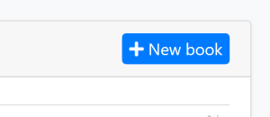

# Web应用程序开发教程 - 第五章: 授权
````json
//[doc-params]
{
    "UI": ["MVC","Blazor","BlazorServer","NG"],
    "DB": ["EF","Mongo"]
}
````
## 关于本教程

在本系列教程中, 你将构建一个名为 `Acme.BookStore` 的用于管理书籍及其作者列表的基于ABP的应用程序.  它是使用以下技术开发的:

* **{{DB_Text}}** 做为ORM提供程序.
* **{{UI_Value}}** 做为UI框架.

本教程分为以下部分:

- [Part 1: 创建服务端](Part-1.md)
- [Part 2: 图书列表页面](Part-2.md)
- [Part 3: 创建,更新和删除图书](Part-3.md)
- [Part 4: 集成测试](Part-4.md)
- **Part 5: 授权**(本章)
- [Part 6: 作者: 领域层](Part-6.md)
- [Part 7: 作者: 数据库集成](Part-7.md)
- [Part 8: 作者: 应用服务层](Part-8.md)
- [Part 9: 作者: 用户页面](Part-9.md)
- [Part 10: 图书到作者的关系](Part-10.md)

### 下载源代码

本教程根据你的**UI** 和 **Database**偏好有多个版,我们准备了两种可供下载的源码组合:

* [MVC (Razor Pages) UI with EF Core](https://github.com/abpframework/abp-samples/tree/master/BookStore-Mvc-EfCore)
* [Blazor UI with EF Core](https://github.com/abpframework/abp-samples/tree/master/BookStore-Blazor-EfCore)
* [Angular UI with MongoDB](https://github.com/abpframework/abp-samples/tree/master/BookStore-Angular-MongoDb)

> 如果您在 Windows 上遇到“文件名太长”或“解压缩错误”，可能与 Windows 最大文件路径限制有关。Windows 的最大文件路径限制为 250 个字符.要解决此问题， [请在 Windows 10 中启用长路径选项](https://docs.microsoft.com/zh-cn/windows/win32/fileio/maximum-file-path-limitation?tabs=cmd#enable-long-paths-in-windows-10-version-1607-and-later).

> 如果您 Git 遇到长路径相关的错误, 请尝试以下命令在 Windows 中启用长路径.见 https://github.com/msysgit/msysgit/wiki/Git-cannot-create-a-file-or-directory-with-a-long-path
> `git config --system core.longpaths true`

{{if UI == "MVC" && DB == "EF"}}

### 视频教程

这部分也被录制为视频教程并 **<a href="https://www.youtube.com/watch?v=1WsfMITN_Jk&list=PLsNclT2aHJcPNaCf7Io3DbMN6yAk_DgWJ&index=5" target="_blank">发布在 YouTube 上</a>**.

{{end}}

## 权限

ABP 框架提供了一个基于 ASP.NET Core 的[授权基础架构](https://docs.microsoft.com/zh-cn/aspnet/core/security/authorization/introduction)的[授权系统](../Authorization.md).在标准授权基础架构之上添加的一项主要功能为**权限系统**，它允许定义权限并启用/禁用每个角色、用户或客户端.

### 权限名称

权限必须具有唯一的名称 (a `string`). 最好的方法是将其定义为 `常数`, 这样我们就可以重用权限名称.

打开项目`Acme.BookStore.Application.Contracts`里的`BookStorePermissions`类（在 `Permissions` 文件夹中）并更改内容如下所示：

````csharp
namespace Acme.BookStore.Permissions
{
    public static class BookStorePermissions
    {
        public const string GroupName = "BookStore";

        public static class Books
        {
            public const string Default = GroupName + ".Books";
            public const string Create = Default + ".Create";
            public const string Edit = Default + ".Edit";
            public const string Delete = Default + ".Delete";
        }
    }
}
````

这是定义权限名称的分层方式。例如, "create book" 权限名称被定义为 `BookStore.Books.Create`. ABP 不会强制您使用此结构，但我们发现这种方式很有用.

### 权限定义

您应该在使用之前定义好权限.

打开项目 `Acme.BookStore.Application.Contracts` 内的 `BookStorePermissionDefinitionProvider` 类（在Permissions文件夹中）并更改内容如下所示：

````csharp
using Acme.BookStore.Localization;
using Volo.Abp.Authorization.Permissions;
using Volo.Abp.Localization;

namespace Acme.BookStore.Permissions
{
    public class BookStorePermissionDefinitionProvider : PermissionDefinitionProvider
    {
        public override void Define(IPermissionDefinitionContext context)
        {
            var bookStoreGroup = context.AddGroup(BookStorePermissions.GroupName, L("Permission:BookStore"));

            var booksPermission = bookStoreGroup.AddPermission(BookStorePermissions.Books.Default, L("Permission:Books"));
            booksPermission.AddChild(BookStorePermissions.Books.Create, L("Permission:Books.Create"));
            booksPermission.AddChild(BookStorePermissions.Books.Edit, L("Permission:Books.Edit"));
            booksPermission.AddChild(BookStorePermissions.Books.Delete, L("Permission:Books.Delete"));
        }

        private static LocalizableString L(string name)
        {
            return LocalizableString.Create<BookStoreResource>(name);
        }
    }
}
````

该类定义了一个 **权限组**（对 UI 上的权限进行分组，将在下面看到）和该组内的**4 个权限**.此外，**Create**, **Edit** 和 **Delete** 是 `BookStorePermissions.Books.Default` 权限的子级. **只有选择了父级** 才能选择子级权限.

最后，编辑本地化文件（`en.json` 在 `Acme.BookStore.Domain.Shared` 项目的 `Localization/BookStore`文件夹下  ）以定义上面使用的本地化键：

````json
"Permission:BookStore": "Book Store",
"Permission:Books": "Book Management",
"Permission:Books.Create": "Creating new books",
"Permission:Books.Edit": "Editing the books",
"Permission:Books.Delete": "Deleting the books"
````

> 本地化键名是任意的，没有强制规则.但我们更喜欢上面使用的约定.

### 权限管理界面

定义权限后，您可以在**权限管理模式**中看到它们.

进入*管理 -> 身份认证管理 -> 角色*页面，为 admin 角色选择*权限*操作以打开权限管理模式：


授予您想要的权限并保存.

> **提示**：如果您运行 `Acme.BookStore.DbMigrator` 应用程序，新权限会自动授予管理员角色.

## 授权

现在，您可以使用权限来授权图书管理.

### 应用层和 HTTP API

打开`BookAppService`类添加策略名称并设置为上面定义的权限名称：

````csharp
using System;
using Acme.BookStore.Permissions;
using Volo.Abp.Application.Dtos;
using Volo.Abp.Application.Services;
using Volo.Abp.Domain.Repositories;

namespace Acme.BookStore.Books
{
    public class BookAppService :
        CrudAppService<
            Book, //The Book entity
            BookDto, //Used to show books
            Guid, //Primary key of the book entity
            PagedAndSortedResultRequestDto, //Used for paging/sorting
            CreateUpdateBookDto>, //Used to create/update a book
        IBookAppService //implement the IBookAppService
    {
        public BookAppService(IRepository<Book, Guid> repository)
            : base(repository)
        {
            GetPolicyName = BookStorePermissions.Books.Default;
            GetListPolicyName = BookStorePermissions.Books.Default;
            CreatePolicyName = BookStorePermissions.Books.Create;
            UpdatePolicyName = BookStorePermissions.Books.Edit;
            DeletePolicyName = BookStorePermissions.Books.Delete;
        }
    }
}
````

向构造函数添加代码。`CrudAppService` 基类自动在 CRUD 操作上使用这些权限。这使**应用程序服务**安全，但也使**HTTP API**安全，因为该服务自动用作于 HTTP API，如前所述(请参阅[自动 API 控制器](../API/Auto-API-Controllers.md)).

> 稍后在开发作者管理功能时，您将看到使用 `[Authorize(...)]` 特性的声明性授权.

{{if UI == "MVC"}}

### Razor Page

在保护 HTTP API 和应用程序服务防止未经授权的用户使用服务的同时，他们仍然可以导航到图书管理页面。虽然当页面对服务器进行第一次 AJAX 调用时它们会获得授权异常，但我们还应该授权页面以获得更好的用户体验和安全性.

打开 `BookStoreWebModule` 并在 `ConfigureServices` 方法中添加以下代码块：

````csharp
Configure<RazorPagesOptions>(options =>
{
    options.Conventions.AuthorizePage("/Books/Index", BookStorePermissions.Books.Default);
    options.Conventions.AuthorizePage("/Books/CreateModal", BookStorePermissions.Books.Create);
    options.Conventions.AuthorizePage("/Books/EditModal", BookStorePermissions.Books.Edit);
});
````

现在，未经授权的用户被重定向到**登录页面**.

#### 隐藏"New Book"按钮

图书管理页面有一个*New Book*按钮,如果当前用户没有*创建图书*权限,该按钮应该是不可见的.



打开 `Pages/Books/Index.cshtml` 文件然后修改内容如下图：

````html
@page
@using Acme.BookStore.Localization
@using Acme.BookStore.Permissions
@using Acme.BookStore.Web.Pages.Books
@using Microsoft.AspNetCore.Authorization
@using Microsoft.Extensions.Localization
@model IndexModel
@inject IStringLocalizer<BookStoreResource> L
@inject IAuthorizationService AuthorizationService
@section scripts
{
    <abp-script src="/Pages/Books/Index.js"/>
}

<abp-card>
    <abp-card-header>
        <abp-row>
            <abp-column size-md="_6">
                <abp-card-title>@L["Books"]</abp-card-title>
            </abp-column>
            <abp-column size-md="_6" class="text-right">
                @if (await AuthorizationService.IsGrantedAsync(BookStorePermissions.Books.Create))
                {
                    <abp-button id="NewBookButton"
                                text="@L["NewBook"].Value"
                                icon="plus"
                                button-type="Primary"/>
                }
            </abp-column>
        </abp-row>
    </abp-card-header>
    <abp-card-body>
        <abp-table striped-rows="true" id="BooksTable"></abp-table>
    </abp-card-body>
</abp-card>
````

* 添加 `@inject IAuthorizationService AuthorizationService` 访问授权服务.
* 使用 `@if (await AuthorizationService.IsGrantedAsync(BookStorePermissions.Books.Create))` 检查图书创建权限以有条件地呈现 *New Book* 按钮.

### JavaScript 端

图书管理页面中的图书表的每一行都有一个操作按钮。操作按钮包括 *Edit* and *Delete* 操作：


如果当前用户没有授予相关权限，我们应该隐藏该操作. Datatables 行操作有一个 `visible` 选项,如果设置为false可以隐藏该操作项.

打开 `Acme.BookStore.Web` 项目里的 `Pages/Books/Index.js` ,给 `Edit` 操作添加一个`visible` 选项,如下图:

````js
{
    text: l('Edit'),
    visible: abp.auth.isGranted('BookStore.Books.Edit'), //CHECK for the PERMISSION
    action: function (data) {
        editModal.open({ id: data.record.id });
    }
}
````

`Delete` 选项也是一样的操作:

````js
visible: abp.auth.isGranted('BookStore.Books.Delete')
````

* `abp.auth.isGranted(...)` 用于检查之前定义的权限.
* `visible` 也可以是一个返回 `bool` 的函数，如果该值稍后会根据某些条件进行计算.

### 菜单项

即使我们已经保护了图书管理页面的所有层,它仍然在应用程序的主菜单中可见.如果当前用户没有权限，我们应该隐藏菜单项.

打开 `BookStoreMenuContributor` 类, 找到下面的代码块:

````csharp
context.Menu.AddItem(
    new ApplicationMenuItem(
        "BooksStore",
        l["Menu:BookStore"],
        icon: "fa fa-book"
    ).AddItem(
        new ApplicationMenuItem(
            "BooksStore.Books",
            l["Menu:Books"],
            url: "/Books"
        )
    )
);
````

并将此代码块替换为以下内容:

````csharp
var bookStoreMenu = new ApplicationMenuItem(
    "BooksStore",
    l["Menu:BookStore"],
    icon: "fa fa-book"
);

context.Menu.AddItem(bookStoreMenu);

//CHECK the PERMISSION
if (await context.IsGrantedAsync(BookStorePermissions.Books.Default))
{
    bookStoreMenu.AddItem(new ApplicationMenuItem(
        "BooksStore.Books",
        l["Menu:Books"],
        url: "/Books"
    ));
}
````

您还需要添加 `async` 关键字到 `ConfigureMenuAsync` 方法并重新排列返回值.最后 `BookStoreMenuContributor` 类应该如下：

````csharp
using System.Threading.Tasks;
using Microsoft.Extensions.DependencyInjection;
using Microsoft.Extensions.Localization;
using Acme.BookStore.Localization;
using Acme.BookStore.MultiTenancy;
using Acme.BookStore.Permissions;
using Volo.Abp.TenantManagement.Web.Navigation;
using Volo.Abp.UI.Navigation;

namespace Acme.BookStore.Web.Menus
{
    public class BookStoreMenuContributor : IMenuContributor
    {
        public async Task ConfigureMenuAsync(MenuConfigurationContext context)
        {
            if (context.Menu.Name == StandardMenus.Main)
            {
                await ConfigureMainMenuAsync(context);
            }
        }

        private async Task ConfigureMainMenuAsync(MenuConfigurationContext context)
        {
            if (!MultiTenancyConsts.IsEnabled)
            {
                var administration = context.Menu.GetAdministration();
                administration.TryRemoveMenuItem(TenantManagementMenuNames.GroupName);
            }

            var l = context.GetLocalizer<BookStoreResource>();

            context.Menu.Items.Insert(0, new ApplicationMenuItem("BookStore.Home", l["Menu:Home"], "~/"));

            var bookStoreMenu = new ApplicationMenuItem(
                "BooksStore",
                l["Menu:BookStore"],
                icon: "fa fa-book"
            );

            context.Menu.AddItem(bookStoreMenu);

            //CHECK the PERMISSION
            if (await context.IsGrantedAsync(BookStorePermissions.Books.Default))
            {
                bookStoreMenu.AddItem(new ApplicationMenuItem(
                    "BooksStore.Books",
                    l["Menu:Books"],
                    url: "/Books"
                ));
            }
        }
    }
}
````

{{else if UI == "NG"}}

### Angular 防护配置

UI 的第一步是防止未经授权的用户看到"Books"菜单项并进入图书管理页面.

打开 `/src/app/book/book-routing.module.ts` 并替换为以下内容:

````js
import { NgModule } from '@angular/core';
import { Routes, RouterModule } from '@angular/router';
import { AuthGuard, PermissionGuard } from '@abp/ng.core';
import { BookComponent } from './book.component';

const routes: Routes = [
  { path: '', component: BookComponent, canActivate: [AuthGuard, PermissionGuard] },
];

@NgModule({
  imports: [RouterModule.forChild(routes)],
  exports: [RouterModule],
})
export class BookRoutingModule {}
````

* 从 `@abp/ng.core`导入`AuthGuard`和`PermissionGuard`.
* 添加 `canActivate: [AuthGuard, PermissionGuard]` 到路由定义中.

打开 `/src/app/route.provider.ts`并添加`requiredPolicy: 'BookStore.Books'` 到 `/books`路由. `/books`路由块应如下所示:

````js
{
  path: '/books',
  name: '::Menu:Books',
  parentName: '::Menu:BookStore',
  layout: eLayoutType.application,
  requiredPolicy: 'BookStore.Books',
}
````

### 隐藏"New Book"按钮

图书管理页面有一个*New Book*按钮,如果当前用户没有*创建图书*权限,该按钮应该是不可见的.


打开`/src/app/book/book.component.html`文件，替换创建按钮的HTML内容如下图:

````html
<!-- Add the abpPermission directive -->
<button *abpPermission="'BookStore.Books.Create'" id="create" class="btn btn-primary" type="button" (click)="createBook()">
  <i class="fa fa-plus mr-1"></i>
  <span></span>
</button>
````

* 刚刚添加了`*abpPermission="'BookStore.Books.Create'"`，如果当前用户没有权限，则隐藏按钮.

### 隐藏"Edit"和"Delete"操作

图书管理页面中的图书表的每一行都有一个操作按钮。 操作按钮包括 *Edit* 和 *Delete* 操作:


如果当前用户没有授予相关权限，我们应该隐藏该操作项.

打开`/src/app/book/book.component.html`文件,替换"edit"和"delete"按钮内容如下图:

````html
<!-- Add the abpPermission directive -->
<button *abpPermission="'BookStore.Books.Edit'" ngbDropdownItem (click)="editBook(row.id)">
  
</button>

<!-- Add the abpPermission directive -->
<button *abpPermission="'BookStore.Books.Delete'" ngbDropdownItem (click)="delete(row.id)">
  
</button>
````

* 添加`*abpPermission="'BookStore.Books.Edit'"`，如果当前用户没有编辑权限，则隐藏"edit"操作.
* 添加了`*abpPermission="'BookStore.Books.Delete'"`，如果当前用户没有删除权限，则隐藏"delete"操作.

{{else if UI == "Blazor"}}

### 授权 Razor 组件

打开 `Acme.BookStore.Blazor` 项目中的 `/Pages/Books.razor` 文件,并在 `@page` 指令和以下命名空间导入（`@using` 行）之后添加一个 `Authorize` 属性,如 如下图:

````html
@page "/books"
@attribute [Authorize(BookStorePermissions.Books.Default)]
@using Acme.BookStore.Permissions
@using Microsoft.AspNetCore.Authorization
...
````

如果当前未登录或未授予给定权限,添加此特性可防止进入此页面. 在尝试的情况下,用户将被重定向到登录页面.

### 显示/隐藏操作

图书管理页面有一个 *New Book* 按钮以及每本书的 *Edit* 和 *Delete* 操作. 如果当前用户没有授予相关权限，我们应该隐藏这些按钮/操作.

`AbpCrudPageBase`基类已经具备了此类操作所需的功能.

#### 设置策略（权限）名称

将以下代码块添加到 `Books.razor` 文件的末尾:

````csharp
@code
{
    public Books() // Constructor
    {
        CreatePolicyName = BookStorePermissions.Books.Create;
        UpdatePolicyName = BookStorePermissions.Books.Edit;
        DeletePolicyName = BookStorePermissions.Books.Delete;
    }
}
````

`AbpCrudPageBase`基类会自动检查相关操作的这些权限.如果我们需要手动检查它们,它还为我们定义了指定的属性:

* `HasCreatePermission`: True，如果当前用户有权创建实体.
* `HasUpdatePermission`：True, 如果当前用户有权编辑/更新实体.
* `HasDeletePermission`: True，如果当前用户有权删除实体.

> **Blazor Tip**: 虽然将 C# 代码添加到 `@code` 块中对于小的代码部分来说很好，但是当代码块变得更长时，建议使用代码隐藏方法来开发更易于维护的代码库. 我们将在作者部分使用这种方法.

#### 隐藏"New Book"按钮

用 `if` 块包裹 *New Book* 按钮，如下所示:

````xml
@if (HasCreatePermission)
{
    <Button Color="Color.Primary"
            Clicked="OpenCreateModalAsync">@L["NewBook"]</Button>
}
````

#### 隐藏"Edit/Delete"操作

`EntityAction` 组件定义了 `Visible` 属性（参数）以有条件地显示操作.

更新 `EntityActions` 部分,如下所示:

````xml
<EntityActions TItem="BookDto" EntityActionsColumn="@EntityActionsColumn">
    <EntityAction TItem="BookDto"
                  Text="@L["Edit"]"
                  Visible=HasUpdatePermission
                  Clicked="() => OpenEditModalAsync(context)" />
    <EntityAction TItem="BookDto"
                  Text="@L["Delete"]"
                  Visible=HasDeletePermission
                  Clicked="() => DeleteEntityAsync(context)"
                  ConfirmationMessage="()=>GetDeleteConfirmationMessage(context)" />
</EntityActions>
````

#### 关于权限缓存

您可以运行和测试权限. 从管理员角色中删除与图书相关的权限,以查看相关按钮/操作从 UI 中消失.

**ABP 框架缓存权限** 在客户端的当前用户. 因此,当您为自己更改权限时，您需要手动**刷新页面**才能生效. 如果您不刷新并尝试使用禁止的操作,您会从服务器收到 HTTP 403（禁止）响应.

> 更改服务器端立即可用的角色或用户的权限. 所以,这个缓存系统不会引起任何安全问题.

### 菜单项

即使我们已经保护了图书管理页面的所有层,它仍然在应用程序的主菜单中可见. 如果当前用户没有权限,我们应该隐藏菜单项.

打开 `Acme.BookStore.Blazor` 项目中的 `BookStoreMenuContributor` 类,找到下面的代码块:

````csharp
context.Menu.AddItem(
    new ApplicationMenuItem(
        "BooksStore",
        l["Menu:BookStore"],
        icon: "fa fa-book"
    ).AddItem(
        new ApplicationMenuItem(
            "BooksStore.Books",
            l["Menu:Books"],
            url: "/books"
        )
    )
);
````

并将此代码块替换为以下内容:

````csharp
var bookStoreMenu = new ApplicationMenuItem(
    "BooksStore",
    l["Menu:BookStore"],
    icon: "fa fa-book"
);

context.Menu.AddItem(bookStoreMenu);

//CHECK the PERMISSION
if (await context.IsGrantedAsync(BookStorePermissions.Books.Default))
{
    bookStoreMenu.AddItem(new ApplicationMenuItem(
        "BooksStore.Books",
        l["Menu:Books"],
        url: "/books"
    ));
}
````

您还需要在 `ConfigureMenuAsync` 方法中添加 `async` 关键字并重新排列返回值. 最终的 `ConfigureMainMenuAsync` 方法应如下所示:

````csharp
private async Task ConfigureMainMenuAsync(MenuConfigurationContext context)
{
    var l = context.GetLocalizer<BookStoreResource>();

    context.Menu.Items.Insert(
        0,
        new ApplicationMenuItem(
            "BookStore.Home",
            l["Menu:Home"],
            "/",
            icon: "fas fa-home"
        )
    );

    var bookStoreMenu = new ApplicationMenuItem(
        "BooksStore",
        l["Menu:BookStore"],
        icon: "fa fa-book"
    );

    context.Menu.AddItem(bookStoreMenu);

    //CHECK the PERMISSION
    if (await context.IsGrantedAsync(BookStorePermissions.Books.Default))
    {
        bookStoreMenu.AddItem(new ApplicationMenuItem(
            "BooksStore.Books",
            l["Menu:Books"],
            url: "/books"
        ));
    }
}
````

{{end}}

## 下一部分

请参阅本教程的 [下一部分](Part-6.md).
