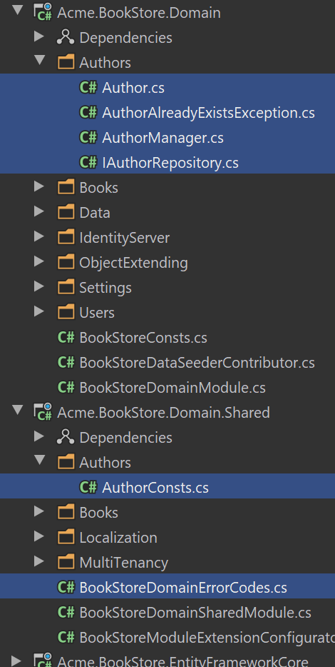

# Web应用程序开发教程 - 第六章: 作者: 领域层
````json
//[doc-params]
{
    "UI": ["MVC","Blazor","BlazorServer","NG"],
    "DB": ["EF","Mongo"]
}
````
## 关于本教程

在本系列教程中, 你将构建一个名为 `Acme.BookStore` 的用于管理书籍及其作者列表的基于ABP的应用程序.  它是使用以下技术开发的:

* **{{DB_Text}}** 做为ORM提供程序.
* **{{UI_Value}}** 做为UI框架.

本教程分为以下部分:

- [Part 1: 创建服务端](Part-1.md)
- [Part 2: 图书列表页面](Part-2.md)
- [Part 3: 创建,更新和删除图书](Part-2.md)
- [Part 4: 集成测试](Part-4.md)
- [Part 5: 授权](Part-5.md)
- **Part 6: 作者: 领域层**(本章)
- [Part 7: 作者: 数据库集成](Part-7.md)
- [Part 8: 作者: 应用服务层](Part-8.md)
- [Part 9: 作者: 用户页面](Part-9.md)
- [Part 10: 图书到作者的关系](Part-10.md)

## 下载源码

本教程根据你的**UI** 和 **数据库**偏好有多个版本,我们准备了几种可供下载的源码组合:

* [MVC (Razor Pages) UI 与 EF Core](https://github.com/abpframework/abp-samples/tree/master/BookStore-Mvc-EfCore)
* [Blazor UI 与 EF Core](https://github.com/abpframework/abp-samples/tree/master/BookStore-Blazor-EfCore)
* [Angular UI 与 MongoDB](https://github.com/abpframework/abp-samples/tree/master/BookStore-Angular-MongoDb)

> 如果你在Windows中遇到 "文件名太长" or "解压错误", 很可能与Windows最大文件路径限制有关. Windows文件路径的最大长度为250字符. 为了解决这个问题,参阅 [在Windows 10中启用长路径](https://docs.microsoft.com/en-us/windows/win32/fileio/maximum-file-path-limitation?tabs=cmd#enable-long-paths-in-windows-10-version-1607-and-later).

> 如果你遇到与Git相关的长路径错误, 尝试使用下面的命令在Windows中启用长路径. 参阅 https://github.com/msysgit/msysgit/wiki/Git-cannot-create-a-file-or-directory-with-a-long-path
> `git config --system core.longpaths true`

## 简介

在前面的章节中, 我们使用 ABP 框架轻松地构建了一些服务;

* 使用 [CrudAppService](../Application-Services.md) 基类, 而不是为标准的增删改查操作手工开发应用服务.
* 使用 [generic repositories](../Repositories.md) 自动完成数据层功能.

对于 "作者" 部分;

* 我们将要展示在需要的情况下, 如何 **手工做一些事情**.
* 我们将要实现一些 **领域驱动设计 (DDD) 最佳实践**.

> **开发将会逐层完成, 一次聚焦一层. 在真实项目中, 你会逐个功能(垂直)开发, 如同前面的教程. 通过这种方式, 你可以体验这两种方式**

## 作者实体

在 `Acme.BookStore.Domain` 项目中创建 `Authors` 文件夹 (命名空间), 在其中加入 `Author` 类:

````csharp
using System;
using JetBrains.Annotations;
using Volo.Abp;
using Volo.Abp.Domain.Entities.Auditing;

namespace Acme.BookStore.Authors
{
    public class Author : FullAuditedAggregateRoot<Guid>
    {
        public string Name { get; private set; }
        public DateTime BirthDate { get; set; }
        public string ShortBio { get; set; }

        private Author()
        {
            /* This constructor is for deserialization / ORM purpose */
        }

        internal Author(
            Guid id,
            [NotNull] string name,
            DateTime birthDate,
            [CanBeNull] string shortBio = null)
            : base(id)
        {
            SetName(name);
            BirthDate = birthDate;
            ShortBio = shortBio;
        }

        internal Author ChangeName([NotNull] string name)
        {
            SetName(name);
            return this;
        }

        private void SetName([NotNull] string name)
        {
            Name = Check.NotNullOrWhiteSpace(
                name,
                nameof(name),
                maxLength: AuthorConsts.MaxNameLength
            );
        }
    }
}
````

* 由 `FullAuditedAggregateRoot<Guid>` 继承使得实体支持[软删除](../Data-Filtering.md) (指实体被删除时, 它并没有从数据库中被删除, 而只是被标记删除), 实体也具有了 [审计](../Entities.md) 属性.
* `Name` 属性的 `private set` 限制从类的外部设置这个属性. 有两种方法设置名字 (两种都进行了验证):
  * 当新建一个作者时, 通过构造器.
  * 使用 `ChangeName` 方法更新名字.
* `构造器` 和 `ChangeName` 方法的访问级别是 `internal`, 强制这些方法只能在领域层由 `AuthorManager` 使用. 稍后将对此进行解释.
* `Check` 类是一个ABP框架工具类, 用于检查方法参数 (如果参数非法会抛出 `ArgumentException`).

`AuthorConsts` 是一个简单的类, 它位于 `Acme.BookStore.Domain.Shared` 项目的 `Authors` 命名空间 (文件夹)中:

````csharp
namespace Acme.BookStore.Authors
{
    public static class AuthorConsts
    {
        public const int MaxNameLength = 64;
    }
}
````

在 `Acme.BookStore.Domain.Shared` 项目中创建这个类, 因为[数据传输类](../Data-Transfer-Objects.md) (DTOs) 稍后会再一次用到它.

## AuthorManager: 领域服务

`Author` 构造器和 `ChangeName` 方法的访问级别是 `internal`, 所以它们只能在领域层使用. 在 `Acme.BookStore.Domain` 项目中的 `Authors` 文件夹 (命名空间)创建 `AuthorManager` 类:

````csharp
using System;
using System.Threading.Tasks;
using JetBrains.Annotations;
using Volo.Abp;
using Volo.Abp.Domain.Services;

namespace Acme.BookStore.Authors
{
    public class AuthorManager : DomainService
    {
        private readonly IAuthorRepository _authorRepository;

        public AuthorManager(IAuthorRepository authorRepository)
        {
            _authorRepository = authorRepository;
        }

        public async Task<Author> CreateAsync(
            [NotNull] string name,
            DateTime birthDate,
            [CanBeNull] string shortBio = null)
        {
            Check.NotNullOrWhiteSpace(name, nameof(name));

            var existingAuthor = await _authorRepository.FindByNameAsync(name);
            if (existingAuthor != null)
            {
                throw new AuthorAlreadyExistsException(name);
            }

            return new Author(
                GuidGenerator.Create(),
                name,
                birthDate,
                shortBio
            );
        }

        public async Task ChangeNameAsync(
            [NotNull] Author author,
            [NotNull] string newName)
        {
            Check.NotNull(author, nameof(author));
            Check.NotNullOrWhiteSpace(newName, nameof(newName));

            var existingAuthor = await _authorRepository.FindByNameAsync(newName);
            if (existingAuthor != null && existingAuthor.Id != author.Id)
            {
                throw new AuthorAlreadyExistsException(newName);
            }

            author.ChangeName(newName);
        }
    }
}
````

* `AuthorManager` 强制使用一种可控的方式创建作者和修改作者的名字. 应用层 (后面会介绍) 将会使用这些方法.

> **DDD 提示**: 如非必须并且用于执行核心业务规则, 不要引入领域服务方法. 对于这个场景, 我们使用这个服务保证名字的唯一性.

两个方法都检查是否存在同名用户, 如果存在, 抛出业务异常 `AuthorAlreadyExistsException`, 这个异常定义在 `Acme.BookStore.Domain` 项目 (`Authors` 文件夹中):

````csharp
using Volo.Abp;

namespace Acme.BookStore.Authors
{
    public class AuthorAlreadyExistsException : BusinessException
    {
        public AuthorAlreadyExistsException(string name)
            : base(BookStoreDomainErrorCodes.AuthorAlreadyExists)
        {
            WithData("name", name);
        }
    }
}
````

`BusinessException` 是一个特殊的异常类型. 在需要时抛出领域相关异常是一个好的实践. ABP框架会自动处理它, 并且它也容易本地化. `WithData(...)` 方法提供额外的数据给异常对象, 这些数据将会在本地化中或出于其它一些目的被使用.

打开 `Acme.BookStore.Domain.Shared` 项目中的 `BookStoreDomainErrorCodes` 并修改为:

````csharp
namespace Acme.BookStore
{
    public static class BookStoreDomainErrorCodes
    {
        public const string AuthorAlreadyExists = "BookStore:00001";
    }
}
````

这里定义了一个字符串, 表示应用程序抛出的错误码, 这个错误码可以被客户端应用程序处理. 为了用户, 你可能希望本地化它. 打开 `Acme.BookStore.Domain.Shared` 项目中的 `Localization/BookStore/en.json` , 加入以下项:

````json
"BookStore:00001": "There is already an author with the same name: {name}"
````

当 `AuthorAlreadyExistsException` 被抛出, 终端用户将会在UI上看到组织好的错误消息.

## IAuthorRepository

`AuthorManager` 注入了 `IAuthorRepository`, 所以我们需要定义它. 在 `Acme.BookStore.Domain` 项目的 `Authors` 文件夹 (命名空间) 中创建这个新接口:

````csharp
using System;
using System.Collections.Generic;
using System.Threading.Tasks;
using Volo.Abp.Domain.Repositories;

namespace Acme.BookStore.Authors
{
    public interface IAuthorRepository : IRepository<Author, Guid>
    {
        Task<Author> FindByNameAsync(string name);

        Task<List<Author>> GetListAsync(
            int skipCount,
            int maxResultCount,
            string sorting,
            string filter = null
        );
    }
}
````

* `IAuthorRepository` 扩展了标准 `IRepository<Author, Guid>` 接口, 所以所有的标准 [repository](../Repositories.md) 方法对于 `IAuthorRepository` 都是可用的.
* `FindByNameAsync` 在 `AuthorManager` 中用来根据姓名查询用户.
* `GetListAsync` 用于应用层以获得一个排序的, 经过过滤的作者列表, 显示在UI上.

我们会在下一章实现这个repository.

> 这两个方法似乎 **看上去没有必要**, 因为标准repositories已经是 `IQueryable`, 你可以直接使用它们, 而不是自定义方法. 在实际应用程序中, 这么做是没问题的. 但在这个 **学习指南**中, 解释如何在需要时创建自定义repository方法是有价值的.

## 结论

这一章覆盖了图书管理程序作者相关功能的领域层. 在这一章中创建/更新的文件在下图中被高亮:



## 下一章

查看本教程的[下一章](Part-7.md).
