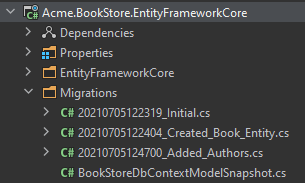

# Web应用程序开发教程 - 第七章: 数据库集成
````json
//[doc-params]
{
    "UI": ["MVC","Blazor","BlazorServer","NG"],
    "DB": ["EF","Mongo"]
}
````
## 关于本教程

在本系列教程中, 你将构建一个名为 `Acme.BookStore` 的用于管理书籍及其作者列表的基于ABP的应用程序.  它是使用以下技术开发的:

* **{{DB_Value}}** 做为ORM提供程序.
* **{{UI_Value}}** 做为UI框架.

本教程分为以下部分:

- [Part 1: 创建服务端](Part-1.md)
- [Part 2: 图书列表页面](Part-2.md)
- [Part 3: 创建,更新和删除图书](Part-2.md)
- [Part 4: 集成测试](Part-4.md)
- [Part 5: 授权](Part-5.md)
- [Part 6: 作者: 领域层](Part-6.md)
- **Part 7: 数据库集成**(本章)
- [Part 8: 作者: 应用服务层](Part-8.md)
- [Part 9: 作者: 用户页面](Part-9.md)
- [Part 10: 图书到作者的关系](Part-10.md)

## 下载源码

本教程根据你的**UI** 和 **数据库**偏好有多个版本,我们准备了几种可供下载的源码组合:

* [MVC (Razor Pages) UI 与 EF Core](https://github.com/abpframework/abp-samples/tree/master/BookStore-Mvc-EfCore)
* [Blazor UI 与 EF Core](https://github.com/abpframework/abp-samples/tree/master/BookStore-Blazor-EfCore)
* [Angular UI 与 MongoDB](https://github.com/abpframework/abp-samples/tree/master/BookStore-Angular-MongoDb)

> 如果你在Windows中遇到 "文件名太长" or "解压错误", 很可能与Windows最大文件路径限制有关. Windows文件路径的最大长度为250字符. 为了解决这个问题,参阅 [在Windows 10中启用长路径](https://docs.microsoft.com/en-us/windows/win32/fileio/maximum-file-path-limitation?tabs=cmd#enable-long-paths-in-windows-10-version-1607-and-later).

> 如果你遇到与Git相关的长路径错误, 尝试使用下面的命令在Windows中启用长路径. 参阅 https://github.com/msysgit/msysgit/wiki/Git-cannot-create-a-file-or-directory-with-a-long-path
> `git config --system core.longpaths true`

## 简介

这章阐述如何为前一章介绍的 `作者` 实体配置数据库集成.

{{if DB=="EF"}}

## DB Context

打开 `Acme.BookStore.EntityFrameworkCore` 项目中的 `BookStoreDbContext` 加入 `DbSet` 属性:

````csharp
public DbSet<Author> Authors { get; set; }
````

定位到相同项目中的 `BookStoreDbContext` 类中的 `OnModelCreating` 方法, 加入以下代码到方法的结尾:

````csharp
builder.Entity<Author>(b =>
{
    b.ToTable(BookStoreConsts.DbTablePrefix + "Authors",
        BookStoreConsts.DbSchema);

    b.ConfigureByConvention();

    b.Property(x => x.Name)
        .IsRequired()
        .HasMaxLength(AuthorConsts.MaxNameLength);

    b.HasIndex(x => x.Name);
});
````

这和前面的 `Book` 实体做的一样, 所以不再赘述.

## 创建数据库迁移

配置启动解决方案为使用 [Entity Framework Core Code First Migrations](https://docs.microsoft.com/en-us/ef/core/managing-schemas/migrations/). 因为我们还没有修改数据库映射配置，所以需要创建一个新的迁移并对数据库应用变更.

打开命令行终端, 切换当前目录为 `Acme.BookStore.EntityFrameworkCore` 项目目录, 输入以下命令:

````bash
dotnet ef migrations add Added_Authors
````

这会在项目中添加一个迁移类:



你可以在同一个命令行终端中使用以下命令对数据库应用更改:

````bash
dotnet ef database update
````

> 如果你使用 Visual Studio, 可能希望在 *Package Manager Console (PMC)* 使用 `Add-Migration Added_Authors -c BookStoreMigrationsDbContext` 和 `Update-Database -c BookStoreMigrationsDbContext` 命令. 如果这样, 保证 {{if UI=="MVC"}}`Acme.BookStore.Web`{{else if UI=="BlazorServer"}}`Acme.BookStore.Blazor`{{else if UI=="Blazor" || UI=="NG"}}`Acme.BookStore.HttpApi.Host`{{end}} 是启动项目并且在PMC中 `Acme.BookStore.EntityFrameworkCore` 是 *默认项目* .

{{else if DB=="Mongo"}}

## DB Context

打开 `Acme.BookStore.MongoDB` 项目 `MongoDb 文件夹`中的 `BookStoreMongoDbContext`, 在类中加入以下属性:

````csharp
public IMongoCollection<Author> Authors => Collection<Author>();
````

{{end}}

## 实现 IAuthorRepository

{{if DB=="EF"}}

在 `Acme.BookStore.EntityFrameworkCore` 项目 (`Authors` 文件夹)中创建一个新类 `EfCoreAuthorRepository`, 粘贴以下代码:

````csharp
using System;
using System.Collections.Generic;
using System.Linq;
using System.Linq.Dynamic.Core;
using System.Threading.Tasks;
using Acme.BookStore.EntityFrameworkCore;
using Microsoft.EntityFrameworkCore;
using Volo.Abp.Domain.Repositories.EntityFrameworkCore;
using Volo.Abp.EntityFrameworkCore;

namespace Acme.BookStore.Authors
{
    public class EfCoreAuthorRepository
        : EfCoreRepository<BookStoreDbContext, Author, Guid>,
            IAuthorRepository
    {
        public EfCoreAuthorRepository(
            IDbContextProvider<BookStoreDbContext> dbContextProvider)
            : base(dbContextProvider)
        {
        }

        public async Task<Author> FindByNameAsync(string name)
        {
            var dbSet = await GetDbSetAsync();
            return await dbSet.FirstOrDefaultAsync(author => author.Name == name);
        }

        public async Task<List<Author>> GetListAsync(
            int skipCount,
            int maxResultCount,
            string sorting,
            string filter = null)
        {
            var dbSet = await GetDbSetAsync();
            return await dbSet
                .WhereIf(
                    !filter.IsNullOrWhiteSpace(),
                    author => author.Name.Contains(filter)
                 )
                .OrderBy(sorting)
                .Skip(skipCount)
                .Take(maxResultCount)
                .ToListAsync();
        }
    }
}
````

* 继承自 `EfCoreRepository`, 所以继承了标准repository的方法实现.
* `WhereIf` 是ABP 框架的快捷扩展方法. 它仅当第一个条件满足时, 执行 `Where` 查询. (根据名字查询, 仅当 filter 不为空). 你可以不使用这个方法, 但这些快捷方法可以提高效率.
* `sorting` 可以是一个字符串, 如 `Name`, `Name ASC` 或 `Name DESC`. 通过使用 [System.Linq.Dynamic.Core](https://www.nuget.org/packages/System.Linq.Dynamic.Core) NuGet 包是可能的.

> 参阅 [EF Core 集成文档](../Entity-Framework-Core.md) 获得基于EF Core的repositories的更多信息.

{{else if DB=="Mongo"}}

在 `Acme.BookStore.MongoDB` 项目 (`Authors` 文件夹)中创建一个新类 `MongoDbAuthorRepository`, 粘贴以下代码:

```csharp
using System;
using System.Linq;
using System.Linq.Dynamic.Core;
using System.Collections.Generic;
using System.Threading.Tasks;
using Acme.BookStore.MongoDB;
using MongoDB.Driver;
using MongoDB.Driver.Linq;
using Volo.Abp.Domain.Repositories.MongoDB;
using Volo.Abp.MongoDB;

namespace Acme.BookStore.Authors
{
    public class MongoDbAuthorRepository
        : MongoDbRepository<BookStoreMongoDbContext, Author, Guid>,
        IAuthorRepository
    {
        public MongoDbAuthorRepository(
            IMongoDbContextProvider<BookStoreMongoDbContext> dbContextProvider
            ) : base(dbContextProvider)
        {
        }

        public async Task<Author> FindByNameAsync(string name)
        {
            var queryable = await GetMongoQueryableAsync();
            return await queryable.FirstOrDefaultAsync(author => author.Name == name);
        }

        public async Task<List<Author>> GetListAsync(
            int skipCount,
            int maxResultCount,
            string sorting,
            string filter = null)
        {
            var queryable = await GetMongoQueryableAsync();
            return await queryable
                .WhereIf<Author, IMongoQueryable<Author>>(
                    !filter.IsNullOrWhiteSpace(),
                    author => author.Name.Contains(filter)
                )
                .OrderBy(sorting)
                .As<IMongoQueryable<Author>>()
                .Skip(skipCount)
                .Take(maxResultCount)
                .ToListAsync();
        }
    }
}
```

* 继承自 `MongoDbRepository`, 所以继承了标准repository的方法实现.
* `WhereIf` 是ABP 框架的快捷扩展方法. 它仅当第一个条件满足时, 执行 `Where` 查询. (根据名字查询, 仅当 filter 不为空). 你可以不使用这个方法, 但这些快捷方法可以提高效率.
* `sorting` 可以是一个字符串, 如 `Name`, `Name ASC` 或 `Name DESC`. 通过使用 [System.Linq.Dynamic.Core](https://www.nuget.org/packages/System.Linq.Dynamic.Core) NuGet 包是可能的.

> 参阅 [MongoDB 集成文档](../MongoDB.md) 获得基于MongoDB的repositories的更多信息.

{{end}}

## 下一章

查看本教程的[下一章](Part-8.md).
