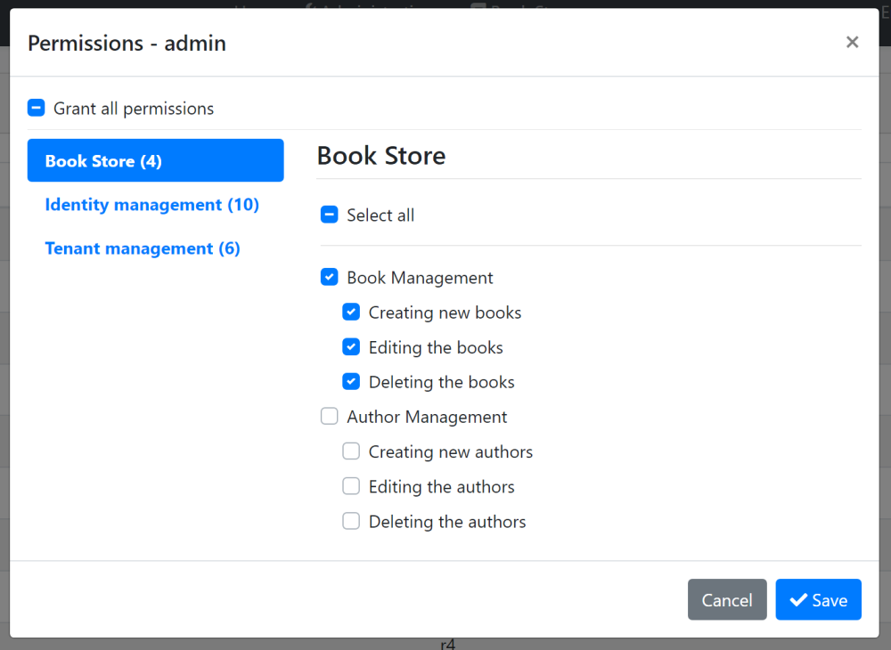
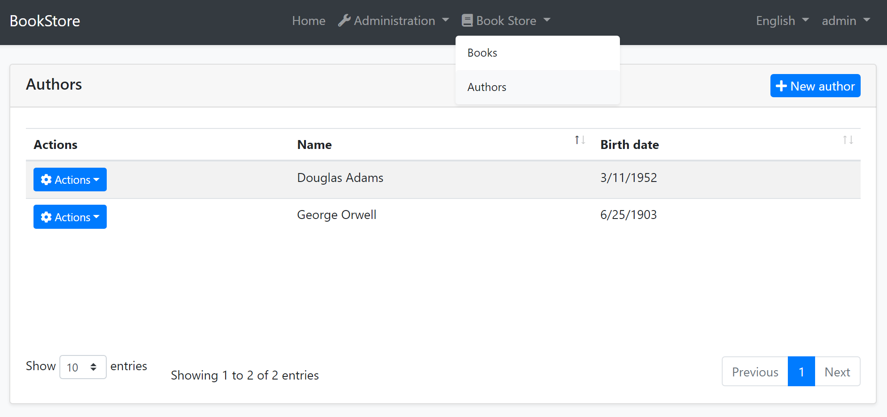
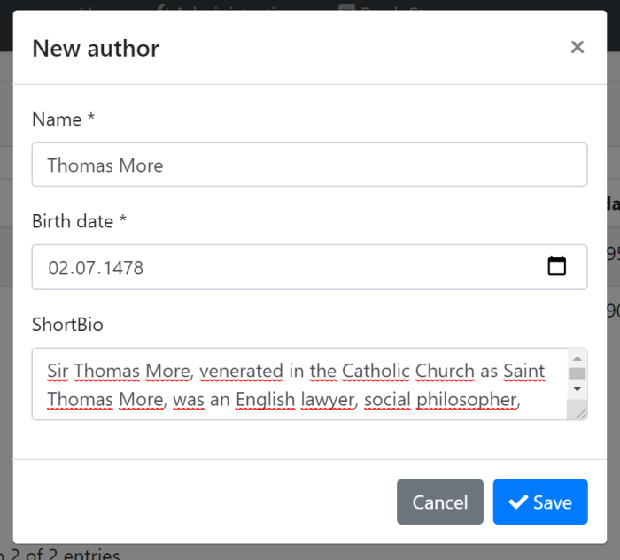
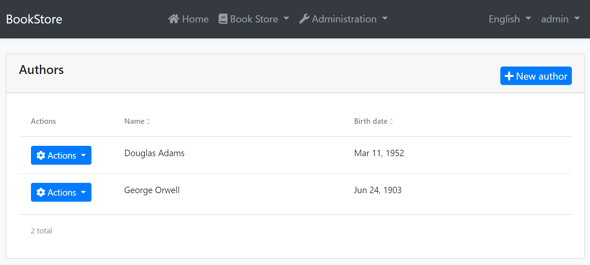

# Web应用程序开发教程 - 第九章: 作者: 用户页面
````json
//[doc-params]
{
    "UI": ["MVC","Blazor","BlazorServer","NG"],
    "DB": ["EF","Mongo"]
}
````
## 关于本教程

在本系列教程中, 你将构建一个名为 `Acme.BookStore` 的用于管理书籍及其作者列表的基于ABP的应用程序.  它是使用以下技术开发的:

* **{{DB_Text}}** 做为ORM提供程序.
* **{{UI_Value}}** 做为UI框架.

本教程分为以下部分:

- [Part 1: 创建服务端](Part-1.md)
- [Part 2: 图书列表页面](Part-2.md)
- [Part 3: 创建,更新和删除图书](Part-2.md)
- [Part 4: 集成测试](Part-4.md)
- [Part 5: 授权](Part-5.md)
- [Part 6: 作者: 领域层](Part-6.md)
- [Part 7: 作者: 数据库集成](Part-7.md)
- [Part 8: 作者: 应用服务层](Part-8.md)
- **Part 9: 作者: 用户页面 (本章)**
- [Part 10: 图书到作者的关系](Part-10.md)

## 下载源码

本教程根据你的**UI** 和 **数据库**偏好有多个版本,我们准备了几种可供下载的源码组合:

* [MVC (Razor Pages) UI 与 EF Core](https://github.com/abpframework/abp-samples/tree/master/BookStore-Mvc-EfCore)
* [Blazor UI 与 EF Core](https://github.com/abpframework/abp-samples/tree/master/BookStore-Blazor-EfCore)
* [Angular UI 与 MongoDB](https://github.com/abpframework/abp-samples/tree/master/BookStore-Angular-MongoDb)

> 如果你在Windows中遇到 "文件名太长" or "解压错误", 很可能与Windows最大文件路径限制有关. Windows文件路径的最大长度为250字符. 为了解决这个问题,参阅 [在Windows 10中启用长路径](https://docs.microsoft.com/en-us/windows/win32/fileio/maximum-file-path-limitation?tabs=cmd#enable-long-paths-in-windows-10-version-1607-and-later).

> 如果你遇到与Git相关的长路径错误, 尝试使用下面的命令在Windows中启用长路径. 参阅 https://github.com/msysgit/msysgit/wiki/Git-cannot-create-a-file-or-directory-with-a-long-path
> `git config --system core.longpaths true`

## 简介

这章阐述如何为前一章介绍的 `作者` 实体创建CRUD页面.

{{if UI == "MVC"}}

## 作者列表页面

在 `Acme.BookStore.Web` 项目的 `Pages/Authors` 文件夹下创建一个新的razor页面, `Index.cshtml`, 修改文件内容如下.

### Index.cshtml

````html
@page
@using Acme.BookStore.Localization
@using Acme.BookStore.Permissions
@using Acme.BookStore.Web.Pages.Authors
@using Microsoft.AspNetCore.Authorization
@using Microsoft.Extensions.Localization
@inject IStringLocalizer<BookStoreResource> L
@inject IAuthorizationService AuthorizationService
@model IndexModel

@section scripts
{
    <abp-script src="/Pages/Authors/Index.js"/>
}

<abp-card>
    <abp-card-header>
        <abp-row>
            <abp-column size-md="_6">
                <abp-card-title>@L["Authors"]</abp-card-title>
            </abp-column>
            <abp-column size-md="_6" class="text-right">
                @if (await AuthorizationService
                    .IsGrantedAsync(BookStorePermissions.Authors.Create))
                {
                    <abp-button id="NewAuthorButton"
                                text="@L["NewAuthor"].Value"
                                icon="plus"
                                button-type="Primary"/>
                }
            </abp-column>
        </abp-row>
    </abp-card-header>
    <abp-card-body>
        <abp-table striped-rows="true" id="AuthorsTable"></abp-table>
    </abp-card-body>
</abp-card>
````

这是一个简单的页面, 和我们以前创建的图书页面一样. 它导入了一个JavaScript文件, 我们后面会进行介绍这个文件.

### IndexModel.cshtml.cs

````csharp
using Microsoft.AspNetCore.Mvc.RazorPages;

namespace Acme.BookStore.Web.Pages.Authors
{
    public class IndexModel : PageModel
    {
        public void OnGet()
        {

        }
    }
}
````

### Index.js

````js
$(function () {
    var l = abp.localization.getResource('BookStore');
    var createModal = new abp.ModalManager(abp.appPath + 'Authors/CreateModal');
    var editModal = new abp.ModalManager(abp.appPath + 'Authors/EditModal');

    var dataTable = $('#AuthorsTable').DataTable(
        abp.libs.datatables.normalizeConfiguration({
            serverSide: true,
            paging: true,
            order: [[1, "asc"]],
            searching: false,
            scrollX: true,
            ajax: abp.libs.datatables.createAjax(acme.bookStore.authors.author.getList),
            columnDefs: [
                {
                    title: l('Actions'),
                    rowAction: {
                        items:
                            [
                                {
                                    text: l('Edit'),
                                    visible:
                                        abp.auth.isGranted('BookStore.Authors.Edit'),
                                    action: function (data) {
                                        editModal.open({ id: data.record.id });
                                    }
                                },
                                {
                                    text: l('Delete'),
                                    visible:
                                        abp.auth.isGranted('BookStore.Authors.Delete'),
                                    confirmMessage: function (data) {
                                        return l(
                                            'AuthorDeletionConfirmationMessage',
                                            data.record.name
                                        );
                                    },
                                    action: function (data) {
                                        acme.bookStore.authors.author
                                            .delete(data.record.id)
                                            .then(function() {
                                                abp.notify.info(
                                                    l('SuccessfullyDeleted')
                                                );
                                                dataTable.ajax.reload();
                                            });
                                    }
                                }
                            ]
                    }
                },
                {
                    title: l('Name'),
                    data: "name"
                },
                {
                    title: l('BirthDate'),
                    data: "birthDate",
                    render: function (data) {
                        return luxon
                            .DateTime
                            .fromISO(data, {
                                locale: abp.localization.currentCulture.name
                            }).toLocaleString();
                    }
                }
            ]
        })
    );

    createModal.onResult(function () {
        dataTable.ajax.reload();
    });

    editModal.onResult(function () {
        dataTable.ajax.reload();
    });

    $('#NewAuthorButton').click(function (e) {
        e.preventDefault();
        createModal.open();
    });
});
````

简单来说, 这个JavaScript页面:

* 创建了一个具有 `操作`, `姓名` 和 `生日` 列的数据表格.
  * `Actions` 列用来添加 *编辑* 和 *删除* 操作.
  * `生日` 提供了一个 `render` 函数, 使用 [luxon](https://moment.github.io/luxon/) 库格式化 `DateTime` 值.
* 使用 `abp.ModalManager` 打开 *新建* 和 *编辑* 模态表单.

这块代码与以前创建的图书页面非常相似, 所以我们不再赘述.

### 本地化

这个页面使用了一些需要声明的本地化键. 打开 `Acme.BookStore.Domain.Shared` 项目中 `Localization/BookStore` 文件夹下的 `en.json` 文件, 加入以下条目:

````json
"Menu:Authors": "Authors",
"Authors": "Authors",
"AuthorDeletionConfirmationMessage": "Are you sure to delete the author '{0}'?",
"BirthDate": "Birth date",
"NewAuthor": "New author"
````

注意我们加入了额外的键. 它们会在下面的小节中被使用.

### 加入主菜单

打开 `Acme.BookStore.Web` 项目的 `Menus` 文件夹中的 `BookStoreMenuContributor.cs` , 在 `ConfigureMainMenuAsync` 方法的结尾加入以下代码:

````csharp
if (await context.IsGrantedAsync(BookStorePermissions.Authors.Default))
{
    bookStoreMenu.AddItem(new ApplicationMenuItem(
        "BooksStore.Authors",
        l["Menu:Authors"],
        url: "/Authors"
    ));
}
````

### 运行应用程序

运行并登录应用程序. **因为你还没有权限, 所以不能看见菜单项**. 转到 `Identity/Roles` 页面, 点击 *操作* 按钮并选择**管理员角色**的*权限*操作:



如你所见, 管理员角色还没有*作者管理*权限. 单击复选框并保存, 赋予权限. **刷新页面**后, 你会在主菜单中的*图书商店*下看到*作者*菜单项:



页面是完全可以工作的, 除了 *新建作者* 和 *操作/编辑*, 因为它们还没有实现 .

> **提示**: 如果你在定义一个新权限后运行 `.DbMigrator` 控制台程序, 它会自动将这些权限赋予管理员角色, 你不需要手工赋予权限.

## 新建模态窗口

在 `Acme.BookStore.Web` 项目的 `Pages/Authors` 文件夹下创建一个 razor 页面 `CreateModal.cshtml`, 修改它的内容如下:

### CreateModal.cshtml

```html
@page
@using Acme.BookStore.Localization
@using Acme.BookStore.Web.Pages.Authors
@using Microsoft.Extensions.Localization
@using Volo.Abp.AspNetCore.Mvc.UI.Bootstrap.TagHelpers.Modal
@model CreateModalModel
@inject IStringLocalizer<BookStoreResource> L
@{
    Layout = null;
}
<form asp-page="/Authors/CreateModal">
    <abp-modal>
        <abp-modal-header title="@L["NewAuthor"].Value"></abp-modal-header>
        <abp-modal-body>
            <abp-input asp-for="Author.Name" />
            <abp-input asp-for="Author.BirthDate" />
            <abp-input asp-for="Author.ShortBio" />
        </abp-modal-body>
        <abp-modal-footer buttons="@(AbpModalButtons.Cancel|AbpModalButtons.Save)"></abp-modal-footer>
    </abp-modal>
</form>
```

之前我们已经使用ABP框架的 [动态表单](../UI/AspNetCore/Tag-Helpers/Dynamic-Forms.md)开发了图书页面. 这里可以使用相同的方法, 但我们希望展示如何手工完成它. 实际上, 没有那么手工化, 因为在这个例子中我们使用了 `abp-input` 标签简化了表单元素的创建.

你当然可以使用标准Bootstrap HTML结构, 但是这需要写很多代码. `abp-input` 自动添加验证, 本地化和根据数据类型生成标准元素.

### CreateModal.cshtml.cs

```csharp
using System;
using System.ComponentModel.DataAnnotations;
using System.Threading.Tasks;
using Acme.BookStore.Authors;
using Microsoft.AspNetCore.Mvc;
using Volo.Abp.AspNetCore.Mvc.UI.Bootstrap.TagHelpers.Form;

namespace Acme.BookStore.Web.Pages.Authors
{
    public class CreateModalModel : BookStorePageModel
    {
        [BindProperty]
        public CreateAuthorViewModel Author { get; set; }

        private readonly IAuthorAppService _authorAppService;

        public CreateModalModel(IAuthorAppService authorAppService)
        {
            _authorAppService = authorAppService;
        }

        public void OnGet()
        {
            Author = new CreateAuthorViewModel();
        }

        public async Task<IActionResult> OnPostAsync()
        {
            var dto = ObjectMapper.Map<CreateAuthorViewModel, CreateAuthorDto>(Author);
            await _authorAppService.CreateAsync(dto);
            return NoContent();
        }

        public class CreateAuthorViewModel
        {
            [Required]
            [StringLength(AuthorConsts.MaxNameLength)]
            public string Name { get; set; }

            [Required]
            [DataType(DataType.Date)]
            public DateTime BirthDate { get; set; }

            [TextArea]
            public string ShortBio { get; set; }
        }
    }
}
```

这个页面模型类注入和使用 `IAuthorAppService` 创建新作者. 它和图书创建模型类之间主要的区别是这个模型类为视图模型声明了一个新类 `CreateAuthorViewModel`, 而不是重用 `CreateAuthorDto`.

这么做的主要原因是展示在页面中如何使用不同的模型. 但还有一个好处: 我们为类成员添加了两个不存在于 `CreateAuthorDto` 中的特性:

* 为 `BirthDate` 添加 `[DataType(DataType.Date)]` 特性, 这会在UI为这个属性显示一个日期选择控件.
* 为 `ShortBio` 添加 `[TextArea]` 特性, 这会显示一个多行文本框, 而不是标准文本框.

通过这种方式, 可以根据UI需求定制视图模型类, 而无需修改DTO. 这么做的一个结果是: 使用 `ObjectMapper` 将 `CreateAuthorViewModel` 映射到 `CreateAuthorDto`. 为了完成映射, 需要在 `BookStoreWebAutoMapperProfile` 构造函数中加入新的映射代码:

````csharp
using Acme.BookStore.Authors; // ADDED NAMESPACE IMPORT
using Acme.BookStore.Books;
using AutoMapper;

namespace Acme.BookStore.Web
{
    public class BookStoreWebAutoMapperProfile : Profile
    {
        public BookStoreWebAutoMapperProfile()
        {
            CreateMap<BookDto, CreateUpdateBookDto>();

            // ADD a NEW MAPPING
            CreateMap<Pages.Authors.CreateModalModel.CreateAuthorViewModel,
                      CreateAuthorDto>();
        }
    }
}
````

当你重新运行应用程序后, 点击"新建作者" 按钮会打开一个新的模态窗口.



## 编辑模态窗口

在 `Acme.BookStore.Web` 项目的 `Pages/Authors` 文件夹下创建一个 razor 页面 `EditModal.cshtml`, 修改它的内容如下:

### EditModal.cshtml

````html
@page
@using Acme.BookStore.Localization
@using Acme.BookStore.Web.Pages.Authors
@using Microsoft.Extensions.Localization
@using Volo.Abp.AspNetCore.Mvc.UI.Bootstrap.TagHelpers.Modal
@model EditModalModel
@inject IStringLocalizer<BookStoreResource> L
@{
    Layout = null;
}
<form asp-page="/Authors/EditModal">
    <abp-modal>
        <abp-modal-header title="@L["Update"].Value"></abp-modal-header>
        <abp-modal-body>
            <abp-input asp-for="Author.Id" />
            <abp-input asp-for="Author.Name" />
            <abp-input asp-for="Author.BirthDate" />
            <abp-input asp-for="Author.ShortBio" />
        </abp-modal-body>
        <abp-modal-footer buttons="@(AbpModalButtons.Cancel|AbpModalButtons.Save)"></abp-modal-footer>
    </abp-modal>
</form>
````

### EditModal.cshtml.cs

```csharp
using System;
using System.ComponentModel.DataAnnotations;
using System.Threading.Tasks;
using Acme.BookStore.Authors;
using Microsoft.AspNetCore.Mvc;
using Volo.Abp.AspNetCore.Mvc.UI.Bootstrap.TagHelpers.Form;

namespace Acme.BookStore.Web.Pages.Authors
{
    public class EditModalModel : BookStorePageModel
    {
        [BindProperty]
        public EditAuthorViewModel Author { get; set; }

        private readonly IAuthorAppService _authorAppService;

        public EditModalModel(IAuthorAppService authorAppService)
        {
            _authorAppService = authorAppService;
        }

        public async Task OnGetAsync(Guid id)
        {
            var authorDto = await _authorAppService.GetAsync(id);
            Author = ObjectMapper.Map<AuthorDto, EditAuthorViewModel>(authorDto);
        }

        public async Task<IActionResult> OnPostAsync()
        {
            await _authorAppService.UpdateAsync(
                Author.Id,
                ObjectMapper.Map<EditAuthorViewModel, UpdateAuthorDto>(Author)
            );

            return NoContent();
        }

        public class EditAuthorViewModel
        {
            [HiddenInput]
            public Guid Id { get; set; }

            [Required]
            [StringLength(AuthorConsts.MaxNameLength)]
            public string Name { get; set; }

            [Required]
            [DataType(DataType.Date)]
            public DateTime BirthDate { get; set; }

            [TextArea]
            public string ShortBio { get; set; }
        }
    }
}
```

这个类与 `CreateModal.cshtml.cs` 类似, 主要不同是:

* 使用 `IAuthorAppService.GetAsync(...)` 方法从应用层获取正在编辑的作者.
* `EditAuthorViewModel` 拥有一个额外的 `Id` 属性, 它被 `[HiddenInput]` 特性标记, 会为这个属性在页面上创建一个隐藏输入框.

这个类要求在 `BookStoreWebAutoMapperProfile` 类中添加两个对象映射声明:

```csharp
using Acme.BookStore.Authors;
using Acme.BookStore.Books;
using AutoMapper;

namespace Acme.BookStore.Web
{
    public class BookStoreWebAutoMapperProfile : Profile
    {
        public BookStoreWebAutoMapperProfile()
        {
            CreateMap<BookDto, CreateUpdateBookDto>();

            CreateMap<Pages.Authors.CreateModalModel.CreateAuthorViewModel,
                      CreateAuthorDto>();

            // ADD THESE NEW MAPPINGS
            CreateMap<AuthorDto, Pages.Authors.EditModalModel.EditAuthorViewModel>();
            CreateMap<Pages.Authors.EditModalModel.EditAuthorViewModel,
                      UpdateAuthorDto>();
        }
    }
}
```

这就是全部了! 你可以运行应用程序并尝试编辑一个作者.

{{else if UI == "NG"}}

## 作者管理页面

运行下面的命令行在angular应用程序的根目录创建一个名为 `AuthorModule` 新模块:

```bash
yarn ng generate module author --module app --routing --route authors
```

这上命令应该产生以下输出:

```bash
> yarn ng generate module author --module app --routing --route authors

yarn run v1.19.1
$ ng generate module author --module app --routing --route authors
CREATE src/app/author/author-routing.module.ts (344 bytes)
CREATE src/app/author/author.module.ts (349 bytes)
CREATE src/app/author/author.component.html (21 bytes)
CREATE src/app/author/author.component.spec.ts (628 bytes)
CREATE src/app/author/author.component.ts (276 bytes)
CREATE src/app/author/author.component.scss (0 bytes)
UPDATE src/app/app-routing.module.ts (1396 bytes)
Done in 2.22s.
```

### AuthorModule

打开 `/src/app/author/author.module.ts,` 替换成以下内容:

```js
import { NgModule } from '@angular/core';
import { SharedModule } from '../shared/shared.module';
import { AuthorRoutingModule } from './author-routing.module';
import { AuthorComponent } from './author.component';
import { NgbDatepickerModule } from '@ng-bootstrap/ng-bootstrap';

@NgModule({
  declarations: [AuthorComponent],
  imports: [SharedModule, AuthorRoutingModule, NgbDatepickerModule],
})
export class AuthorModule {}
```

- 添加 `SharedModule`. `SharedModule` 导出一些创建用户页面需要的通用模块.
- `SharedModule` 已经导出 `CommonModule`, 所以移除 `CommonModule`.
- 添加 `NgbDatepickerModule`, 后面用于作者创建和编辑表单.

### 菜单定义

打开 `src/app/route.provider.ts` 文件, 加入以下的菜单定义:

````js
{
  path: '/authors',
  name: '::Menu:Authors',
  parentName: '::Menu:BookStore',
  layout: eLayoutType.application,
  requiredPolicy: 'BookStore.Authors',
}
````

最终的 `configureRoutes` 函数声明应该如下:

```js
function configureRoutes(routes: RoutesService) {
  return () => {
    routes.add([
      {
        path: '/',
        name: '::Menu:Home',
        iconClass: 'fas fa-home',
        order: 1,
        layout: eLayoutType.application,
      },
      {
        path: '/book-store',
        name: '::Menu:BookStore',
        iconClass: 'fas fa-book',
        order: 2,
        layout: eLayoutType.application,
      },
      {
        path: '/books',
        name: '::Menu:Books',
        parentName: '::Menu:BookStore',
        layout: eLayoutType.application,
        requiredPolicy: 'BookStore.Books',
      },
      {
        path: '/authors',
        name: '::Menu:Authors',
        parentName: '::Menu:BookStore',
        layout: eLayoutType.application,
        requiredPolicy: 'BookStore.Authors',
      },
    ]);
  };
}
```

### 生成服务代理

[ABP CLI](https://docs.abp.io/en/abp/latest/CLI) 提供 `generate-proxy` 命令为HTTP APIs生成客户端代理, 使得使用HTTP APIs更容易. `generate-proxy` 命令运行前, 应用程序必须启动运行.

在 `angular` 文件夹运行以下命令:

```bash
abp generate-proxy -t ng
```

这个命令为作者服务和相关模型(DTO)类生成服务代理:


### AuthorComponent

打开 `/src/app/author/author.component.ts` 文件, 替换成以下内容:

```js
import { Component, OnInit } from '@angular/core';
import { ListService, PagedResultDto } from '@abp/ng.core';
import { AuthorService, AuthorDto } from '@proxy/authors';
import { FormGroup, FormBuilder, Validators } from '@angular/forms';
import { NgbDateNativeAdapter, NgbDateAdapter } from '@ng-bootstrap/ng-bootstrap';
import { ConfirmationService, Confirmation } from '@abp/ng.theme.shared';

@Component({
  selector: 'app-author',
  templateUrl: './author.component.html',
  styleUrls: ['./author.component.scss'],
  providers: [ListService, { provide: NgbDateAdapter, useClass: NgbDateNativeAdapter }],
})
export class AuthorComponent implements OnInit {
  author = { items: [], totalCount: 0 } as PagedResultDto<AuthorDto>;

  isModalOpen = false;

  form: FormGroup;

  selectedAuthor = {} as AuthorDto;

  constructor(
    public readonly list: ListService,
    private authorService: AuthorService,
    private fb: FormBuilder,
    private confirmation: ConfirmationService
  ) {}

  ngOnInit(): void {
    const authorStreamCreator = (query) => this.authorService.getList(query);

    this.list.hookToQuery(authorStreamCreator).subscribe((response) => {
      this.author = response;
    });
  }

  createAuthor() {
    this.selectedAuthor = {} as AuthorDto;
    this.buildForm();
    this.isModalOpen = true;
  }

  editAuthor(id: string) {
    this.authorService.get(id).subscribe((author) => {
      this.selectedAuthor = author;
      this.buildForm();
      this.isModalOpen = true;
    });
  }

  buildForm() {
    this.form = this.fb.group({
      name: [this.selectedAuthor.name || '', Validators.required],
      birthDate: [
        this.selectedAuthor.birthDate ? new Date(this.selectedAuthor.birthDate) : null,
        Validators.required,
      ],
    });
  }

  save() {
    if (this.form.invalid) {
      return;
    }

    if (this.selectedAuthor.id) {
      this.authorService
        .update(this.selectedAuthor.id, this.form.value)
        .subscribe(() => {
          this.isModalOpen = false;
          this.form.reset();
          this.list.get();
        });
    } else {
      this.authorService.create(this.form.value).subscribe(() => {
        this.isModalOpen = false;
        this.form.reset();
        this.list.get();
      });
    }
  }

  delete(id: string) {
    this.confirmation.warn('::AreYouSureToDelete', '::AreYouSure')
        .subscribe((status) => {
          if (status === Confirmation.Status.confirm) {
            this.authorService.delete(id).subscribe(() => this.list.get());
          }
        });
  }
}
```

打开 `/src/app/author/author.component.html` 文件, 替换成以下内容:

````html
<div class="card">
  <div class="card-header">
    <div class="row">
      <div class="col col-md-6">
        <h5 class="card-title">
          
        </h5>
      </div>
      <div class="text-right col col-md-6">
        <div class="text-lg-right pt-2">
          <button *abpPermission="'BookStore.Authors.Create'" id="create" class="btn btn-primary" type="button" (click)="createAuthor()">
            <i class="fa fa-plus mr-1"></i>
            <span></span>
          </button>
        </div>
      </div>
    </div>
  </div>
  <div class="card-body">
    <ngx-datatable [rows]="author.items" [count]="author.totalCount" [list]="list" default>
      <ngx-datatable-column
        [name]="'::Actions' | abpLocalization"
        [maxWidth]="150"
        [sortable]="false"
      >
        <ng-template let-row="row" ngx-datatable-cell-template>
          <div ngbDropdown container="body" class="d-inline-block">
            <button
              class="btn btn-primary btn-sm dropdown-toggle"
              data-toggle="dropdown"
              aria-haspopup="true"
              ngbDropdownToggle
            >
              <i class="fa fa-cog mr-1"></i>
            </button>
            <div ngbDropdownMenu>
              <button *abpPermission="'BookStore.Authors.Edit'" ngbDropdownItem (click)="editAuthor(row.id)">
                
              </button>
              <button *abpPermission="'BookStore.Authors.Delete'" ngbDropdownItem (click)="delete(row.id)">
                
              </button>
            </div>
          </div>
        </ng-template>
      </ngx-datatable-column>
      <ngx-datatable-column [name]="'::Name' | abpLocalization" prop="name"></ngx-datatable-column>
      <ngx-datatable-column [name]="'::BirthDate' | abpLocalization">
        <ng-template let-row="row" ngx-datatable-cell-template>
          
        </ng-template>
      </ngx-datatable-column>
    </ngx-datatable>
  </div>
</div>

<abp-modal [(visible)]="isModalOpen">
  <ng-template #abpHeader>
    <h3></h3>
  </ng-template>

  <ng-template #abpBody>
    <form [formGroup]="form" (ngSubmit)="save()">
      <div class="form-group">
        <label for="author-name">Name</label><span> * </span>
        <input type="text" id="author-name" class="form-control" formControlName="name" autofocus />
      </div>

      <div class="form-group">
        <label>Birth date</label><span> * </span>
        <input
          #datepicker="ngbDatepicker"
          class="form-control"
          name="datepicker"
          formControlName="birthDate"
          ngbDatepicker
          (click)="datepicker.toggle()"
        />
      </div>
    </form>
  </ng-template>

  <ng-template #abpFooter>
    <button type="button" class="btn btn-secondary" abpClose>
      
    </button>

    <button class="btn btn-primary" (click)="save()" [disabled]="form.invalid">
      <i class="fa fa-check mr-1"></i>
      
    </button>
  </ng-template>
</abp-modal>
````

### 本地化

这个页面使用了一些需要声明的本地化键. 打开 `Acme.BookStore.Domain.Shared` 项目中 `Localization/BookStore` 文件夹下的 `en.json` 文件, 加入以下条目:

````json
"Menu:Authors": "Authors",
"Authors": "Authors",
"AuthorDeletionConfirmationMessage": "Are you sure to delete the author '{0}'?",
"BirthDate": "Birth date",
"NewAuthor": "New author"
````

### 运行应用程序

运行并登录应用程序. **因为你还没有权限, 所以不能看见菜单项**. 转到 `Identity/Roles` 页面, 点击 *操作* 按钮并选择**管理员角色**的*权限*操作:


如你所见, 管理员角色还没有*作者管理*权限. 单击复选框并保存, 赋予权限. **刷新页面**后, 你会在主菜单中的*图书商店*下看到*作者*菜单项:



这就是全部了! 这是一个完整的, 可以工作的页面. 你可以新建, 编辑和删除作者.

> **提示**: 如果你在定义一个新权限后运行 `.DbMigrator` 控制台程序, 它会自动将这些权限赋予管理员角色, 你不需要手工赋予权限.

{{end}}

{{if UI == "Blazor" || UI == "BlazorServer"}}

## 作者管理页面

### 作者Razor组件

在 `Acme.BookStore.Blazor` 项目中新建一个 Razor组件页面 `/Pages/Authors.razor`, 替换成以下内容:

````xml
@page "/authors"
@using Acme.BookStore.Authors
@using Acme.BookStore.Localization
@using Volo.Abp.AspNetCore.Components.Web
@inherits BookStoreComponentBase
@inject IAuthorAppService AuthorAppService
@inject AbpBlazorMessageLocalizerHelper<BookStoreResource> LH
<Card>
    <CardHeader>
        <Row>
            <Column ColumnSize="ColumnSize.Is6">
                <h2>@L["Authors"]</h2>
            </Column>
            <Column ColumnSize="ColumnSize.Is6">
                <Paragraph Alignment="TextAlignment.Right">
                    @if (CanCreateAuthor)
                    {
                        <Button Color="Color.Primary"
                                Clicked="OpenCreateAuthorModal">
                            @L["NewAuthor"]
                        </Button>
                    }
                </Paragraph>
            </Column>
        </Row>
    </CardHeader>
    <CardBody>
        <DataGrid TItem="AuthorDto"
                  Data="AuthorList"
                  ReadData="OnDataGridReadAsync"
                  TotalItems="TotalCount"
                  ShowPager="true"
                  PageSize="PageSize">
            <DataGridColumns>
                <DataGridColumn Width="150px"
                                TItem="AuthorDto"
                                Field="@nameof(AuthorDto.Id)"
                                Sortable="false"
                                Caption="@L["Actions"]">
                    <DisplayTemplate>
                        <Dropdown>
                            <DropdownToggle Color="Color.Primary">
                                @L["Actions"]
                            </DropdownToggle>
                            <DropdownMenu>
                                @if (CanEditAuthor)
                                {
                                    <DropdownItem Clicked="() => OpenEditAuthorModal(context)">
                                        @L["Edit"]
                                    </DropdownItem>
                                }
                                @if (CanDeleteAuthor)
                                {
                                    <DropdownItem Clicked="() => DeleteAuthorAsync(context)">
                                        @L["Delete"]
                                    </DropdownItem>
                                }
                            </DropdownMenu>
                        </Dropdown>
                    </DisplayTemplate>
                </DataGridColumn>
                <DataGridColumn TItem="AuthorDto"
                                Field="@nameof(AuthorDto.Name)"
                                Caption="@L["Name"]"></DataGridColumn>
                <DataGridColumn TItem="AuthorDto"
                                Field="@nameof(AuthorDto.BirthDate)"
                                Caption="@L["BirthDate"]">
                    <DisplayTemplate>
                        @context.BirthDate.ToShortDateString()
                    </DisplayTemplate>
                </DataGridColumn>
            </DataGridColumns>
        </DataGrid>
    </CardBody>
</Card>

<Modal @ref="CreateAuthorModal">
    <ModalBackdrop />
    <ModalContent IsCentered="true">
        <Form>
            <ModalHeader>
                <ModalTitle>@L["NewAuthor"]</ModalTitle>
                <CloseButton Clicked="CloseCreateAuthorModal" />
            </ModalHeader>
            <ModalBody>
                <Validations @ref="@CreateValidationsRef" Model="@NewAuthor" ValidateOnLoad="false">
                    <Validation MessageLocalizer="@LH.Localize">
                        <Field>
                            <FieldLabel>@L["Name"]</FieldLabel>
                            <TextEdit @bind-Text="@NewAuthor.Name">
                                <Feedback>
                                    <ValidationError/>
                                </Feedback>
                            </TextEdit>
                        </Field>
                    </Validation>
                    <Field>
                        <FieldLabel>@L["BirthDate"]</FieldLabel>
                        <DateEdit TValue="DateTime" @bind-Date="@NewAuthor.BirthDate"/>
                    </Field>
                    <Validation MessageLocalizer="@LH.Localize">
                        <Field>
                            <FieldLabel>@L["ShortBio"]</FieldLabel>
                            <MemoEdit Rows="5" @bind-Text="@NewAuthor.ShortBio">
                                <Feedback>
                                    <ValidationError/>
                                </Feedback>
                            </MemoEdit>
                        </Field>
                    </Validation>
                </Validations>
            </ModalBody>
            <ModalFooter>
                <Button Color="Color.Secondary"
                        Clicked="CloseCreateAuthorModal">
                    @L["Cancel"]
                </Button>
                <Button Color="Color.Primary"
                        Type="@ButtonType.Submit"
                        PreventDefaultOnSubmit="true"
                        Clicked="CreateAuthorAsync">
                    @L["Save"]
                </Button>
            </ModalFooter>
        </Form>
    </ModalContent>
</Modal>

<Modal @ref="EditAuthorModal">
    <ModalBackdrop />
    <ModalContent IsCentered="true">
        <Form>
            <ModalHeader>
                        <ModalTitle>@EditingAuthor.Name</ModalTitle>
                        <CloseButton Clicked="CloseEditAuthorModal" />
                    </ModalHeader>
            <ModalBody>
                <Validations @ref="@EditValidationsRef" Model="@EditingAuthor" ValidateOnLoad="false">
                    <Validation MessageLocalizer="@LH.Localize">
                        <Field>
                            <FieldLabel>@L["Name"]</FieldLabel>
                            <TextEdit @bind-Text="@EditingAuthor.Name">
                                <Feedback>
                                    <ValidationError/>
                                </Feedback>
                            </TextEdit>
                        </Field>
                    </Validation>
                    <Field>
                        <FieldLabel>@L["BirthDate"]</FieldLabel>
                        <DateEdit TValue="DateTime" @bind-Date="@EditingAuthor.BirthDate"/>
                    </Field>
                    <Validation>
                        <Field>
                            <FieldLabel>@L["ShortBio"]</FieldLabel>
                            <MemoEdit Rows="5" @bind-Text="@EditingAuthor.ShortBio">
                                <Feedback>
                                    <ValidationError/>
                                </Feedback>
                            </MemoEdit>
                        </Field>
                    </Validation>
                </Validations>
            </ModalBody>
            <ModalFooter>
                <Button Color="Color.Secondary"
                        Clicked="CloseEditAuthorModal">
                    @L["Cancel"]
                </Button>
                <Button Color="Color.Primary"
                        Type="@ButtonType.Submit"
                        PreventDefaultOnSubmit="true"
                        Clicked="UpdateAuthorAsync">
                    @L["Save"]
                </Button>
            </ModalFooter>
        </Form>
    </ModalContent>
</Modal>
````

* 这些代码类似 `Books.razor`, 除了不继承自 `AbpCrudPageBase`, 它使用自己的实现.
* 注入 `IAuthorAppService` , 从UI使用服务器端的HTTP APIs . 我们可以直接注入应用服务接口并在 [动态 C# HTTP API 客户端代理系统](../API/Dynamic-CSharp-API-Clients.md)的帮助下像使用普通的方法一样使用它们, 动态 C# HTTP API 客户端代理系统会为我们调用REST API. 参考下面的 `Authors` 类获得使用方法.
* 注入 `IAuthorizationService` 检查 [权限](../Authorization.md).
* 注入 `IObjectMapper` 进行 [对象到对象映射](../Object-To-Object-Mapping.md).

在 `Pages` 文件夹下新建一个代码后置文件 `Authors.razor.cs`, 使用以下代码:

````csharp
using System;
using System.Collections.Generic;
using System.Linq;
using System.Threading.Tasks;
using Acme.BookStore.Authors;
using Acme.BookStore.Permissions;
using Blazorise;
using Blazorise.DataGrid;
using Microsoft.AspNetCore.Authorization;
using Volo.Abp.Application.Dtos;

namespace Acme.BookStore.Blazor.Pages
{
    public partial class Authors
    {
        private IReadOnlyList<AuthorDto> AuthorList { get; set; }

        private int PageSize { get; } = LimitedResultRequestDto.DefaultMaxResultCount;
        private int CurrentPage { get; set; }
        private string CurrentSorting { get; set; }
        private int TotalCount { get; set; }

        private bool CanCreateAuthor { get; set; }
        private bool CanEditAuthor { get; set; }
        private bool CanDeleteAuthor { get; set; }

        private CreateAuthorDto NewAuthor { get; set; }

        private Guid EditingAuthorId { get; set; }
        private UpdateAuthorDto EditingAuthor { get; set; }

        private Modal CreateAuthorModal { get; set; }
        private Modal EditAuthorModal { get; set; }

        private Validations CreateValidationsRef;

        private Validations EditValidationsRef;

        public Authors()
        {
            NewAuthor = new CreateAuthorDto();
            EditingAuthor = new UpdateAuthorDto();
        }

        protected override async Task OnInitializedAsync()
        {
            await SetPermissionsAsync();
            await GetAuthorsAsync();
        }

        private async Task SetPermissionsAsync()
        {
            CanCreateAuthor = await AuthorizationService
                .IsGrantedAsync(BookStorePermissions.Authors.Create);

            CanEditAuthor = await AuthorizationService
                .IsGrantedAsync(BookStorePermissions.Authors.Edit);

            CanDeleteAuthor = await AuthorizationService
                .IsGrantedAsync(BookStorePermissions.Authors.Delete);
        }

        private async Task GetAuthorsAsync()
        {
            var result = await AuthorAppService.GetListAsync(
                new GetAuthorListDto
                {
                    MaxResultCount = PageSize,
                    SkipCount = CurrentPage * PageSize,
                    Sorting = CurrentSorting
                }
            );

            AuthorList = result.Items;
            TotalCount = (int)result.TotalCount;
        }

        private async Task OnDataGridReadAsync(DataGridReadDataEventArgs<AuthorDto> e)
        {
            CurrentSorting = e.Columns
                .Where(c => c.Direction != SortDirection.None)
                .Select(c => c.Field + (c.Direction == SortDirection.Descending ? " DESC" : ""))
                .JoinAsString(",");
            CurrentPage = e.Page - 1;

            await GetAuthorsAsync();

            await InvokeAsync(StateHasChanged);
        }

        private void OpenCreateAuthorModal()
        {
            CreateValidationsRef.ClearAll();

            NewAuthor = new CreateAuthorDto();
            CreateAuthorModal.Show();
        }

        private void CloseCreateAuthorModal()
        {
            CreateAuthorModal.Hide();
        }

        private void OpenEditAuthorModal(AuthorDto author)
        {
            EditValidationsRef.ClearAll();

            EditingAuthorId = author.Id;
            EditingAuthor = ObjectMapper.Map<AuthorDto, UpdateAuthorDto>(author);
            EditAuthorModal.Show();
        }

        private async Task DeleteAuthorAsync(AuthorDto author)
        {
            var confirmMessage = L["AuthorDeletionConfirmationMessage", author.Name];
            if (!await Message.Confirm(confirmMessage))
            {
                return;
            }

            await AuthorAppService.DeleteAsync(author.Id);
            await GetAuthorsAsync();
        }

        private void CloseEditAuthorModal()
        {
            EditAuthorModal.Hide();
        }

        private async Task CreateAuthorAsync()
        {
            if (CreateValidationsRef.ValidateAll())
            {
                await AuthorAppService.CreateAsync(NewAuthor);
                await GetAuthorsAsync();
                CreateAuthorModal.Hide();
            }
        }

        private async Task UpdateAuthorAsync()
        {
            if (EditValidationsRef.ValidateAll())
            {
                await AuthorAppService.UpdateAsync(EditingAuthorId, EditingAuthor);
                await GetAuthorsAsync();
                EditAuthorModal.Hide();
            }
        }
    }
}
````

这个类定义了 `Authors.razor` 页面使用的属性和方法.

### 对象映射

`Authors` 类使用 `OpenEditAuthorModal` 方法中的 `IObjectMapper`. 所以需要定义这个映射.

打开 `Acme.BookStore.Blazor` 项目中的 `BookStoreBlazorAutoMapperProfile.cs`, 在构造函数中加入一个映射:

````csharp
CreateMap<AuthorDto, UpdateAuthorDto>();
````

你在文件开头需要 `using Acme.BookStore.Authors;` 声明语句.

### 加入主菜单

打开 `Acme.BookStore.Blazor` 项目的 `Menus` 文件夹中的 `BookStoreMenuContributor.cs` , 在 `ConfigureMainMenuAsync` 方法的结尾加入以下代码:

````csharp
if (await context.IsGrantedAsync(BookStorePermissions.Authors.Default))
{
    bookStoreMenu.AddItem(new ApplicationMenuItem(
        "BooksStore.Authors",
        l["Menu:Authors"],
        url: "/authors"
    ));
}
````

### 本地化

我们需要本地化上面的代码. 打开 `Acme.BookStore.Domain.Shared` 项目中 `Localization/BookStore` 文件夹下的 `en.json` 文件, 加入以下条目:

````json
"Menu:Authors": "Authors",
"Authors": "Authors",
"AuthorDeletionConfirmationMessage": "Are you sure to delete the author '{0}'?",
"BirthDate": "Birth date",
"NewAuthor": "New author"
````

### 运行应用程序

运行并登录应用程序. **因为你还没有权限, 所以不能看见菜单项**. 转到 `Identity/Roles` 页面, 点击 *操作* 按钮并选择**管理员角色**的*权限*操作:


如你所见, 管理员角色还没有*作者管理*权限. 单击复选框并保存, 赋予权限. **刷新页面**后, 你会在主菜单中的*图书商店*下看到*作者*菜单项:


这就是全部了! 这是一个完整的, 可以工作的页面. 你可以新建, 编辑和删除作者.

> **提示**: 如果你在定义一个新权限后运行 `.DbMigrator` 控制台程序, 它会自动将这些权限赋予管理员角色, 你不需要手工赋予权限.

{{end}}

## 下一章

查看本教程的[下一章](Part-10.md).
