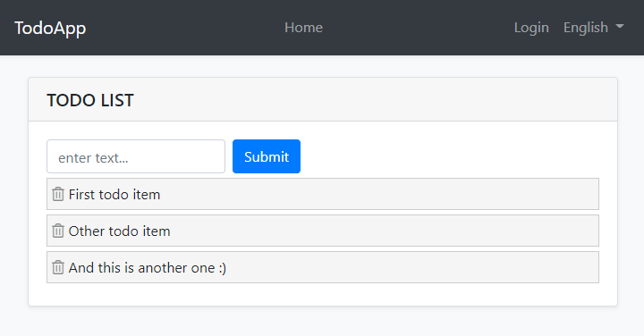
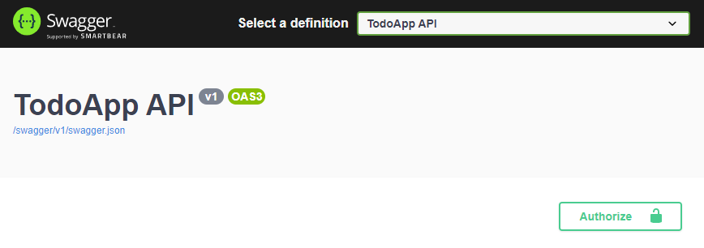
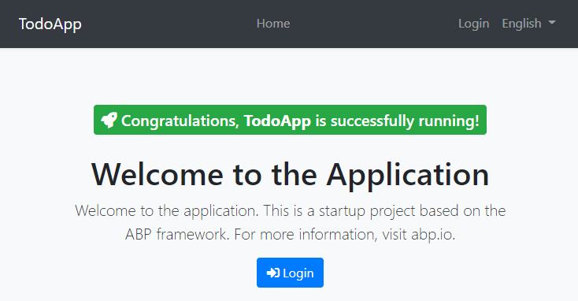
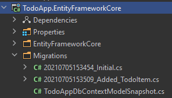
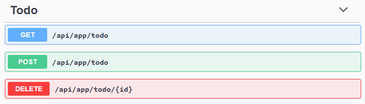
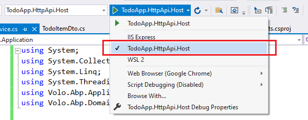

# 快速入门

````json
//[doc-params]
{
    "UI": ["MVC", "Blazor", "BlazorServer", "NG"],
    "DB": ["EF", "Mongo"]
}
````

这是一个由单个部分组成的快速入门教程, 旨在使用ABP框架构建一个简单的待办事项应用程序.  这是最终应用程序的屏幕截图: 



你可以在[这里](https://github.com/abpframework/abp-samples/tree/master/TodoApp)找到已完成的项目源代码. 

## 先决条件

* 一个集成开发环境 (比如: [Visual Studio](https://visualstudio.microsoft.com/vs/)) 它需要支持 [.NET 5.0+](https://dotnet.microsoft.com/download/dotnet) 的开发. 

{{if DB=="Mongo"}}

* [MongoDB Server 4.0+](https://docs.mongodb.com/manual/administration/install-community/)

{{end}}

{{if UI=="NG"}}

* [Node v14.x](https://nodejs.org/)

{{end}}

## 创建新的解决方案

我们将使用[ABP CLI](../../CLI.md) 创建带有ABP框架的新解决方案.  你可以在命令行终端中运行以下命令来安装它: 

````bash
dotnet tool install -g Volo.Abp.Cli
````

然后创建一个空文件夹, 打开命令行终端并在终端中执行以下命令: 

````bash
abp new TodoApp{{if UI=="Blazor"}} -u blazor{{else if UI=="BlazorServer"}} -u blazor-server{{else if UI=="NG"}} -u angular{{end}}{{if DB=="Mongo"}} -d mongodb{{end}}
````

{{if UI=="NG"}}

这将创建一个名为*TodoApp*的新解决方案, 其中包含`angular`和`aspnet core`文件夹.  一旦解决方案就绪, 请在你最喜欢的 IDE 中打开 ASP.NET Core 解决方案. 

{{else}}

这将创建一个名为*TodoApp*的新解决方案.  一旦解决方案就绪, 请在你最喜欢的 IDE 中打开它. 

{{end}}

### 创建数据库

如果你使用的是Visual Studio, 请右键单击`TodoApp.DbMigrator`项目, 选择*设置为启动项目*, 然后按*Ctrl+F5*运行它而不进行调试.  它将创建初始数据库并生成初始数据. 

{{if DB=="EF"}}

> 一些IDE (例如Rider) 可能会在第一次运行时遇到问题, 因为 *DbMigrator* 添加初始迁移并重新编译项目.  在这种情况下, 在 `.DbMigrator` 项目文件夹中打开命令行终端并执行 `dotnet run` 命令. 

{{end}}

### 运行应用程序

{{if UI=="MVC" || UI=="BlazorServer"}}

最好在开始开发之前运行一下应用程序.  确保 {{if UI=="BlazorServer"}}`TodoApp.Blazor`{{else}}`TodoApp.Web`{{end}} 是启动项目, 然后运行应用程序(Visual Studio中是Ctrl+F5)来查看初始UI: 

{{else if UI=="Blazor"}}

最好在开始开发之前运行一下应用程序.  解决方案中有两个主要应用程序

* `TodoApp.HttpApi.Host` 承载服务器端的 HTTP API. 
* `TodoApp.Blazor` 是客户端的Blazor WebAssembly应用程序. 

确保 `TodoApp.HttpApi.Host` 是启动项目, 然后运行应用程序(Visual Studio中的Ctrl+F5)打开[Swagger UI](https://swagger.io/tools/swagger-ui/)来查看服务器端的 HTTP API: 



你可以使用此 UI 探索和测试你的 HTTP API.  现在, 我们可以将 `TodoApp.Blazor` 设置为启动项目并运行它来打开实际的 Blazor 应用程序UI: 

{{else if UI=="NG"}}

最好在开始开发之前运行一下应用程序.  解决方案中有两个主要应用程序；

* `TodoApp.HttpApi.Host` (在.NET解决方案中)承载服务器端HTTP API. 
* `Angular` 文件夹包含 Angular 应用程序. 

确保 `TodoApp.HttpApi.Host` 是启动项目, 然后运行应用程序(Visual Studio中的Ctrl+F5)打开[Swagger UI](https://swagger.io/tools/swagger-ui/)来查看服务器端的 HTTP API: 


你可以使用此 UI 探索和测试你的 HTTP API.  如果该功能正常, 我们可以运行Angular 客户端应用程序. 

首先, 运行以下命令来还原NPM包: 

````bash
npm install
````

安装所有软件包需要一些时间.  然后可以使用以下命令运行应用程序: 

````bash
npm start
````

此命令需要时间, 但最终在你的默认浏览器中运行并打开应用程序: 

{{end}}



你可以单击 *登录* 按钮, 以`admin`作为用户名和`1q2w3E*` 作为密码登录到应用程序. 

一切就绪.  我们可以开始编程! 

## 领域层

此应用程序只有一个 [实体](../../Entities.md), 接下来我们开始创建它.  在 *TodoApp.Domain* 项目中创建一个新的 `TodoItem` 类: 

````csharp
using System;
using Volo.Abp.Domain.Entities;

namespace TodoApp
{
    public class TodoItem : BasicAggregateRoot<Guid>
    {
        public string Text { get; set; }
    }
}
````

`BasicAggregateRoot` 是创建根实体的最简单的基础类.  `Guid` 是这里实体的主键 (`Id`). 

## 数据库集成

{{if DB=="EF"}}

下一步是设置 [Entity Framework Core](../../Entity-Framework-Core.md)配置

### 映射配置

打开在 *TodoApp.EntityFrameworkCore* 项目中 `EntityFrameworkCore` 文件夹中的 `TodoAppDbContext` 类, 并向该类添加新的 `DbSet` 属性: 

````csharp
public DbSet<TodoItem> TodoItems { get; set; }
````

然后在 `TodoAppDbContext` 类中定位到 `OnModelCreating` 方法, 并为 `TodoItem` 实体添加映射代码: 

````csharp
protected override void OnModelCreating(ModelBuilder builder)
{
    base.OnModelCreating(builder);

    /* Include modules to your migration db context */

    builder.ConfigurePermissionManagement();
    ...

    /* Configure your own tables/entities inside here */
    builder.Entity<TodoItem>(b =>
    {
        b.ToTable("TodoItems");
    });
}
````

我们已经将 `TodoItem` 实体映射到数据库中的 `TodoItems` 表. 

### Code First 迁移

解决方案快速模版已经配置为使用Entity Framework Core的 [Code First 迁移](https://docs.microsoft.com/en-us/ef/core/managing-schemas/migrations).  由于我们已经更改了数据库映射配置, 因此我们应该创建一个新的迁移并将更改应用于数据库. 

在 *TodoApp.EntityFrameworkCore* 项目目录中打开一个命令行终端并输入以下命令: 

````bash
dotnet ef migrations add Added_TodoItem
````

这将向项目添加一个新的迁移类: 



你可以在同一命令行终端中使用以下命令将更改应用于数据库: 

````bash
dotnet ef database update
````

> 如果你使用的是Visual Studio, 则可能希望在 *包管理器控制台 (PMC)* 中使用 `Add-Migration Added_TodoItem` 和 `Update-Database` 命令.  在这种情况下, 请确保 {{if UI=="MVC"}}`TodoApp.Web`{{else if UI=="BlazorServer"}}`TodoApp.Blazor`{{else if UI=="Blazor" || UI=="NG"}}`TodoApp.HttpApi.Host`{{end}} 是启动项目, 并且 `TodoApp.EntityFrameworkCore` 是PMC中的 *默认项目*. 

{{else if DB=="Mongo"}}

下一步是设置 [MongoDB](../../MongoDB.md) 配置.  打开 *TodoApp.MongoDB* 项目中 `MongoDb` 文件夹的`TodoAppMongoDbContext` 类并做出以下更改；

1. 向类添加新属性: 

````csharp
public IMongoCollection<TodoItem> TodoItems => Collection<TodoItem>();
````

2. 在 `CreateModel` 方法中添加以下代码: 

````csharp
modelBuilder.Entity<TodoItem>(b =>
{
    b.CollectionName = "TodoItems";
});
````

{{end}}

现在, 我们可以使用ABP仓库保存和检索待办事项, 如我们在下一节所做的那样. 

## 应用层

[应用程序服务](../../Application-Services.md) 用于执行应用程序的用例.  我们需要执行以下用例: 

* 获取待办事项列表
* 创建新的待办事项
* 删除现有的待办事项

### 应用服务接口

我们可以先从为应用程序服务定义接口开始.  在 *TodoApp.Application.Contracts* 项目中创建新的 `ITodoAppService` 接口, 如下所示: 

````csharp
using System;
using System.Collections.Generic;
using System.Threading.Tasks;
using Volo.Abp.Application.Services;

namespace TodoApp
{
    public interface ITodoAppService : IApplicationService
    {
        Task<List<TodoItemDto>> GetListAsync();
        Task<TodoItemDto> CreateAsync(string text);
        Task DeleteAsync(Guid id);
    }
}
````

### 数据传输对象

`GetListAsync` 和`CreateAsync` 方法返回 `TodoItemDto`.  `应用程序服务` 通常获取并返回 DTO([数据传输对象](../../Data-Transfer-Objects.md)) 而不是实体.  因此, 我们应该在这里定义DTO类.  在 *TodoApp.Application.Contracts* 项目中创建新的 `TodoItemDto` 类: 

````csharp
using System;

namespace TodoApp
{
    public class TodoItemDto
    {
        public Guid Id { get; set; }
        public string Text { get; set; }
    }
}
````

这是一个非常简单的DTO类, 它与我们的 `TodoItem` 实体相对应.  接下来, 我们准备实现 `ITodoAppService`接口. 

### 应用服务实现

在 *TodoApp.Application* 项目中创建 `TodoAppService` 类, 如下所示: 

````csharp
using System;
using System.Collections.Generic;
using System.Linq;
using System.Threading.Tasks;
using Volo.Abp.Application.Services;
using Volo.Abp.Domain.Repositories;

namespace TodoApp
{
    public class TodoAppService : ApplicationService, ITodoAppService
    {
        private readonly IRepository<TodoItem, Guid> _todoItemRepository;

        public TodoAppService(IRepository<TodoItem, Guid> todoItemRepository)
        {
            _todoItemRepository = todoItemRepository;
        }

        // TODO: Implement the methods here...
    }
}
````

该类继承自ABP框架的`ApplicationService`类, 并实现了之前定义的 `ITodoAppService`接口.  ABP为实体提供默认的泛型 [仓储](../../Repositories.md).  我们可以使用它们来执行基本的数据库操作. 此类中 [注入](../../Dependency-Injection.md) 的 `IRepository<TodoItem, Guid>`, 它就是 `TodoItem` 实体的默认存储库.  我们将使用它来实现之前描述的用例. 

#### 获取待办事项

让我们先实现 `GetListAsync` 方法: 

````csharp
public async Task<List<TodoItemDto>> GetListAsync()
{
    var items = await _todoItemRepository.GetListAsync();
    return items
        .Select(item => new TodoItemDto
        {
            Id = item.Id,
            Text = item.Text
        }).ToList();
}
````

我们只是从数据库中获取完整的`TodoItem`列表, 将它们映射到`TodoItemDto`对象并作为结果返回. 

#### 创建一个新的待办事项

下一个我们可以实现方法是 `CreateAsync` , 如下所示: 

````csharp
public async Task<TodoItemDto> CreateAsync(string text)
{
    var todoItem = await _todoItemRepository.InsertAsync(
        new TodoItem {Text = text}
    );

    return new TodoItemDto
    {
        Id = todoItem.Id,
        Text = todoItem.Text
    };
}
````

仓储的 `InsertAsync` 方法将给定的`TodoItem`插入数据库, 并返回相同的`TodoItem` 对象.  它还设置了`Id`, 因此我们可以在返回对象上使用它.  我们只是通过从新的 `TodoItem` 实体创建和返回 `TodoItemDto`. 

#### 删除待办事项

最后, 我们来实现 `DeleteAsync` 方法, 代码如下: 

````csharp
public async Task DeleteAsync(Guid id)
{
    await _todoItemRepository.DeleteAsync(id);
}
````

至此, 应用程序服务已准备好了让UI层来使用. 

## 用户界面层

现在是在UI上显示待办事项的时候了!  在开始编写代码之前, 最好记住我们正在尝试构建的内容.  这里是示例程序的最终用户界面的截图: 


> **我们将在本教程中保持最简洁的UI端, 以使本教程简单且重点突出.  请参阅 [web应用程序开发教程](../Part-1.md) 来了解构建实际应用各个方面.**

{{if UI=="MVC"}}

### Index.cshtml.cs

打开在 *TodoApp.Web* 项目的 `Pages` 文件夹中`Index.cshtml.cs`文件, 并用以下代码块替换它的默认内容: 

````csharp
using System.Collections.Generic;
using System.Threading.Tasks;

namespace TodoApp.Web.Pages
{
    public class IndexModel : TodoAppPageModel
    {
        public List<TodoItemDto> TodoItems { get; set; }

        private readonly ITodoAppService _todoAppService;

        public IndexModel(ITodoAppService todoAppService)
        {
            _todoAppService = todoAppService;
        }

        public async Task OnGetAsync()
        {
            TodoItems = await _todoAppService.GetListAsync();
        }
    }
}
````

此类使用 `ITodoAppService` 获取待办事项列表并将它赋值给 `TodoItems` 属性.  我们将用它来渲染razor页面上的待办事项目列表. 

### Index.cshtml

打开 *TodoApp.Web* 项目中`Pages`文件夹下的`Index.cshtml`, 并替换为以下内容: 

````xml
@page
@model TodoApp.Web.Pages.IndexModel
@section styles {
    <abp-style src="/Pages/Index.css" />
}
@section scripts {
    <abp-script src="/Pages/Index.js" />
}
<div class="container">
    <abp-card>
        <abp-card-header>
            <abp-card-title>
                TODO LIST
            </abp-card-title>
        </abp-card-header>
        <abp-card-body>            
            <!-- FORM FOR NEW TODO ITEMS -->
            <form id="NewItemForm" class="form-inline">
                <input id="NewItemText" 
                       type="text" 
                       class="form-control mr-2" 
                       placeholder="enter text...">
                <button type="submit" class="btn btn-primary">Submit</button>
            </form>

            <!-- TODO ITEMS LIST -->
            <ul id="TodoList">
                @foreach (var todoItem in Model.TodoItems)
                {
                    <li data-id="@todoItem.Id">
                        <i class="fa fa-trash-o"></i> @todoItem.Text
                    </li>
                }
            </ul>
        </abp-card-body>
    </abp-card>
</div>
````

我们使用 ABP 的 [卡片标签助手](../../UI/AspNetCore/Tag-Helpers/Cards.md) 来创建一个简单的卡片视图.  你可以直接使用标准引导HTML结构, 但ABP [标签助手](../../UI/AspNetCore/Tag-Helpers/Index.md) 使它更容易并且更安全. 

此页面导入一个 CSS 和 JavaScript 文件, 所以我们需要创建它们. 

### Index.js

打开 *TodoApp.Web* 项目中`Pages`文件夹下的`Index.js`, 并替换为以下内容: 

````js
$(function () {

    // DELETING ITEMS /////////////////////////////////////////
    $('#TodoList').on('click', 'li i', function(){
        var $li = $(this).parent();
        var id = $li.attr('data-id');

        todoApp.todo.delete(id).then(function(){
            $li.remove();
            abp.notify.info('Deleted the todo item.');
        });
    });

    // CREATING NEW ITEMS /////////////////////////////////////
    $('#NewItemForm').submit(function(e){
        e.preventDefault();

        var todoText = $('#NewItemText').val();        
        todoApp.todo.create(todoText).then(function(result){
            $('<li data-id="' + result.id + '">')
                .html('<i class="fa fa-trash-o"></i> ' + result.text)
                .appendTo($('#TodoList'));
            $('#NewItemText').val('');
        });
    });
});
````

在第一部分中, 我们注册了在待办事项旁边的删除图标的点击事件, 来删除服务器上的相关项目并在UI上显示通知.  此外, 我们会从 DOM 中移除已删除的项目, 所以我们不需要刷新页面. 

在第二部分中, 我们在服务器上创建一个新的待办事项.  如果成功, 我们将操纵DOM来将新的 `<li>` 元素插入到待办事项列表.  这样我们不需要在创建新的待办事项后刷新整个页面. 

这里有趣的部分是我们如何与服务器通信.  请参阅 *动态JavaScript代理和自动API控制器* 部分来了解其工作原理.  但是现在让我们继续并完成这个应用程序. 

### Index.css

最后, 请打开 *TodoApp.Web* 项目的 `Pages` 文件夹中的 `Index.css` 文件, 并替换为以下内容: 

````css
#TodoList{
    list-style: none;
    margin: 0;
    padding: 0;
}

#TodoList li {
    padding: 5px;
    margin: 5px 0px;
    border: 1px solid #cccccc;
    background-color: #f5f5f5;
}

#TodoList li i
{
    opacity: 0.5;
}

#TodoList li i:hover
{
    opacity: 1;
    color: #ff0000;
    cursor: pointer;
}
````

这是待办事项页面的简单样式.  我们相信你可以做得更好 :)

现在, 你可以再次运行应用程序并看到结果. 

### 动态JavaScript代理和自动API控制器

在 `Index.js` 文件中, 我们使用了 `todoApp.todo.delete(...)` 和 `todoApp.todo.create(...)` 方法来与服务器通信.  这些函数是由ABP框架动态创建的, 这要归功于 [动态JavaScript客户端代理](../../UI/AspNetCore/Dynamic-JavaScript-Proxies.md) 系统.  它们执行 HTTP API 到服务器调用并返回一个Promise对象,  这样你就可以使用 `then` 函数注册一个回调, 像之前所做的那样. 

但是, 你可能会注意到我们还没有创建任何API控制器, 所以服务器如何处理这些请求?  这个问题为我们引出了ABP 框架的 [自动API控制器](../../API/Auto-API-Controllers.md) 功能.  它通过约定自动将应用程序服务转换为 API 控制器. 

如果你在应用程序URL中输入 `/swagger` 来打开 [Swagger UI](https://swagger.io/tools/swagger-ui/) , 就会看到Todo API: 



{{else if UI=="Blazor" || UI=="BlazorServer"}}

### Index.razor.cs

打开在*TodoApp.Blazor*项目的`Pages`文件夹中`Index.razor.cs`文件, 并替换为一下内容: 

````csharp
using Microsoft.AspNetCore.Components;
using System.Collections.Generic;
using System.Threading.Tasks;

namespace TodoApp.Blazor.Pages
{
    public partial class Index
    {
        [Inject]
        private ITodoAppService TodoAppService { get; set; }

        private List<TodoItemDto> TodoItems { get; set; } = new List<TodoItemDto>();
        private string NewTodoText { get; set; }

        protected async override Task OnInitializedAsync()
        {
            TodoItems = await TodoAppService.GetListAsync();
        }

        private async Task Create()
        {
            var result = await TodoAppService.CreateAsync(NewTodoText);
            TodoItems.Add(result);
            NewTodoText = null;
        }

        private async Task Delete(TodoItemDto todoItem)
        {
            await TodoAppService.DeleteAsync(todoItem.Id);
            await Notify.Info("Deleted the todo item.");
            TodoItems.Remove(todoItem);
        }
    }
}
````

此类使用 `ITodoAppService` 来执行待办事项的操作.  它在创建和删除操作后操纵 `TodoItems` 列表.  这样, 我们不需要从服务器刷新整个待办事项列表. 

{{if UI=="Blazor"}}

请参阅下面的 *动态C#代理和自动API控制器* 部分, 来了解我们如何在浏览器上运行的 Blazor 应用程序中使用注入和应用服务接口的!  但是现在让我们继续并完成这个应用程序. 

{{end # Blazor}}

### Index.razor

打开在 *TodoApp.Blazor* 项目的`Pages`文件夹中 `Index.razor`文件, 并替换为以下代码块内容: 

````xml
@page "/"
@inherits TodoAppComponentBase
<div class="container">
    <Card>
        <CardHeader>
            <CardTitle>
                TODO LIST
            </CardTitle>
        </CardHeader>
        <CardBody>
            <!-- FORM FOR NEW TODO ITEMS -->
            <form id="NewItemForm" 
                  @onsubmit:preventDefault
                  @onsubmit="() => Create()"
                  class="form-inline">
                <input type="text" 
                       @bind-value="@NewTodoText"
                       class="form-control mr-2" 
                       placeholder="enter text...">
                <button type="submit" class="btn btn-primary">Submit</button>
            </form>

            <!-- TODO ITEMS LIST -->
            <ul id="TodoList">
                @foreach (var todoItem in TodoItems)
                {
                    <li data-id="@todoItem.Id">
                        <i class="far fa-trash-alt"
                           @onclick="() => Delete(todoItem)"
                           ></i> @todoItem.Text
                    </li>
                }
            </ul>
        </CardBody>
    </Card>
</div>
````

### Index.razor.css

最后, 请打开 *TodoApp.Blazor* 项目的 `Pages` 文件夹中的 `Index.razor.css`文件, 并替换为以下内容: 

````css
#TodoList{
    list-style: none;
    margin: 0;
    padding: 0;
}

#TodoList li {
    padding: 5px;
    margin: 5px 0px;
    border: 1px solid #cccccc;
    background-color: #f5f5f5;
}

#TodoList li i
{
    opacity: 0.5;
}

#TodoList li i:hover
{
    opacity: 1;
    color: #ff0000;
    cursor: pointer;
}
````

这是待办事项页面的简单样式.  我们相信你可以做得更好 :)

现在, 你可以再次运行应用程序来查看结果. 

{{if UI=="Blazor"}}

### 动态C#代理和自动API控制器

在 `Index.razor.cs` 文件中, 我们已经注入(使用 `[Inject]` 特性)并像使用本地服务一样使用 `ITodoAppService`.  请记住, Blazor应用程序是在浏览器上运行, 但此应用程序服务的实现却是在服务器上运行的. 

这个神奇的过程是由ABP框架的 [动态C#客户端代理](../../API/Dynamic-CSharp-API-Clients.md) 系统完成.  它使用标准的`HttpClient` 并执行HTTP API到远程服务器请求.  它还为我们处理所有标准任务, 包括授权、JSON序列化和异常处理. 

但是, 你可能会问我们还没有创建任何API控制器, 那么服务器如何处理这些请求呢?  这个问题为我们引出了ABP 框架的 [自动API控制器](../../API/Auto-API-Controllers.md) 功能.  它通过约定自动将应用程序服务转换为 API 控制器. 

如果你运行 `TodoApp.HttpApi.Host` 应用程序, 你可以看到Todo API: 


{{end # Blazor}}

{{else if UI=="NG"}}

### 服务代理生成

ABP提供了一个便捷的功能来自动创建客户端服务, 以方便地使用由服务器提供的HTTP API. 

你首先需要运行 `TodoApp.HttpApi.Host` 项目, 因为代理生成器从服务器应用程序读取API定义. 

> **请注意**: IIS Express有一个问题: 它不允许从另一个进程连接到应用程序.  如果你使用的是Visual Studio, 请在 “运行” 按钮下拉列表中选择`TodoApp.HttpApi.Host` 来替代IIS Express, 如下图所示: 



当启动 `TodoApp.HttpApi.Host` 项目后, 在`angular`文件夹中打开一个命令行终端并输入以下命令: 

````bash
abp generate-proxy
````

如果一切顺利, 它应该生成如下输出: 

````bash
CREATE src/app/proxy/generate-proxy.json (170978 bytes)
CREATE src/app/proxy/README.md (1000 bytes)
CREATE src/app/proxy/todo.service.ts (794 bytes)
CREATE src/app/proxy/models.ts (66 bytes)
CREATE src/app/proxy/index.ts (58 bytes)
````

然后, 我们可以使用 `todoService` 来使用服务器端HTTP API, 就像我们将在下一节中做的那样. 

### home.component.ts

打开 `/angular/src/app/home/home.component.ts` 文件, 并用以下代码块替换其内容: 

````js
import { ToasterService } from '@abp/ng.theme.shared';
import { Component, OnInit } from '@angular/core';
import { TodoItemDto, TodoService } from '@proxy';

@Component({
  selector: 'app-home',
  templateUrl: './home.component.html',
  styleUrls: ['./home.component.scss']
})
export class HomeComponent implements OnInit {

  todoItems: TodoItemDto[];
  newTodoText: string;

  constructor(
      private todoService: TodoService,
      private toasterService: ToasterService)
  { }

  ngOnInit(): void {
    this.todoService.getList().subscribe(response => {
      this.todoItems = response;
    });
  }

  create(): void{
    this.todoService.create(this.newTodoText).subscribe((result) => {
      this.todoItems = this.todoItems.concat(result);
      this.newTodoText = null;
    });
  }

  delete(id: string): void {
    this.todoService.delete(id).subscribe(() => {
      this.todoItems = this.todoItems.filter(item => item.id !== id);
      this.toasterService.info('Deleted the todo item.');
    });
  }  
}

````

我们已经实现了使用 `todoService` 来获取待办事项目列表, 并将返回值赋值给 `todoItems` 数组.  我们还添加了 `create` 和 `delete` 方法.  这些方法将在视图端使用. 

### home.component.html

打开 `/angular/src/app/home/home.component.html` 文件, 并用以下代码块替换其内容: 

````html
<div class="container">
  <div class="card">
    <div class="card-header">
      <div class="card-title">TODO LIST</div>
    </div>
    <div class="card-body">
      <!-- FORM FOR NEW TODO ITEMS -->
      <form class="form-inline" (ngSubmit)="create()">
        <input
          name="NewTodoText"
          type="text"
          [(ngModel)]="newTodoText"
          class="form-control mr-2"
          placeholder="enter text..."
        />
        <button type="submit" class="btn btn-primary">Submit</button>
      </form>

      <!-- TODO ITEMS LIST -->
      <ul id="TodoList">
        <li *ngFor="let todoItem of todoItems">
          <i class="fa fa-trash-o" (click)="delete(todoItem.id)"></i> 
        </li>
      </ul>
    </div>
  </div>
</div>
````

### home.component.scss

最后, 打开`/angular/src/app/home/home.component.scss` 文件, 并用以下代码块替换其内容: 

````css
#TodoList{
    list-style: none;
    margin: 0;
    padding: 0;
}

#TodoList li {
    padding: 5px;
    margin: 5px 0px;
    border: 1px solid #cccccc;
    background-color: #f5f5f5;
}

#TodoList li i
{
    opacity: 0.5;
}

#TodoList li i:hover
{
    opacity: 1;
    color: #ff0000;
    cursor: pointer;
}
````

这是待办事项页面的简单样式.  我们相信你可以做得更好 :)

现在, 你可以再次运行应用程序来查看结果. 

{{end}}

## 总结

在这个教程中, 我们已经建立了一个非常简单的应用程序来熟悉 ABP 框架.  如果你想要构建一个实际场景的应用程序,  请查看 [web 应用程序开发教程](../Part-1.md), 该教程涵盖了真实的 Web 应用程序开发的所有方面. 

## 源代码

你可以在[这里](https://github.com/abpframework/abp-samples/tree/master/TodoApp)找到已完成的项目源代码. 

## 另请参见

* [Web应用程序开发教程](../Part-1.md)
