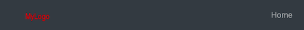
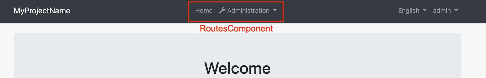

## 替换组件

你可以将一些ABP的组件替换为你自己的自定义组件.

你可以**替换**但**不能自定义**默认ABP组件的原因是禁用或更改该组件的一部分可能会导致问题. 所以我们把这些组件称为可替换组件.

### 如何替换组件

创建一个你想要使用的新组件,添加到 `AppModule` 中的 `declarations` 和`entryComponents` 中.

然后打开 `app.component.ts` 使用 `AddReplaceableComponent` 将你的组件替换ABP组件. 如下所示:

```js
import { AddReplaceableComponent } from '@abp/ng.core'; // imported AddReplaceableComponent action
import { eIdentityComponents } from '@abp/ng.identity'; // imported eIdentityComponents enum
import { Store } from '@ngxs/store'; // imported Store
//...

@Component(/* component metadata */)
export class AppComponent {
  constructor(
    private store: Store // injected Store
  )
  {
    // dispatched the AddReplaceableComponent action
    this.store.dispatch(
      new AddReplaceableComponent({
        component: YourNewRoleComponent,
        key: eIdentityComponents.Roles,
      }),
    );
  }
}
```


### 如何替换布局

每个ABP主题模块有3个布局,分别是`ApplicationLayoutComponent`, `AccountLayoutComponent`, `EmptyLayoutComponent`. 这些布局可以用相同的方式替换.

> 一个布局组件模板应该包含 `<router-outlet></router-outlet>` 元素.

下面的例子解释了如何更换 `ApplicationLayoutComponent`:

运行以下命令在 `angular` 文件夹中生成布局:

```bash
yarn ng generate component my-application-layout
```

在你的布局模板(`my-application-layout.component.html`)中添加以下代码:

```html
<router-outlet></router-outlet>
```

打开 `src/app` 文件夹下的 `app.component.ts` 文件添加以下内容:

```js
import { AddReplaceableComponent } from '@abp/ng.core'; // imported AddReplaceableComponent
import { eThemeBasicComponents } from '@abp/ng.theme.basic'; // imported eThemeBasicComponents enum for component keys
import { Store } from '@ngxs/store'; // imported Store
import { MyApplicationLayoutComponent } from './my-application-layout/my-application-layout.component'; // imported MyApplicationLayoutComponent

@Component(/* component metadata */)
export class AppComponent {
  constructor(
    private store: Store, // injected Store
  ) {
    // dispatched the AddReplaceableComponent action
    this.store.dispatch(
      new AddReplaceableComponent({
        component: MyApplicationLayoutComponent,
        key: eThemeBasicComponents.ApplicationLayout,
      }),
    );
  }
}
```

### 布局组件


#### 如何替换LogoComponent


在 `angular` 目录下运行以下命令创建新的组件 `LogoComponent`:

```bash
yarn ng generate component logo --inlineTemplate --inlineStyle --entryComponent

# You don't need the --entryComponent option in Angular 9
```

打开 `src/app/logo` 目录下生成的 `logo.component.ts` 并使用以下内容替换它:

```js
import { Component } from '@angular/core';

@Component({
  selector: 'app-logo',
  template: `
    <a class="navbar-brand" routerLink="/">
      <!-- Change the img src -->
      
    </a>
  `,
})
export class LogoComponent {}
```

打开 `src/app` 目录下的 `app.component.ts` 做以下修改:

```js
import { ..., AddReplaceableComponent } from '@abp/ng.core'; // imported AddReplaceableComponent
import { Store } from '@ngxs/store'; // imported Store
import { LogoComponent } from './logo/logo.component'; // imported NavItemsComponent
import { eThemeBasicComponents } from '@abp/ng.theme.basic'; // imported eThemeBasicComponents
//...

@Component(/* component metadata */)
export class AppComponent implements OnInit {
  constructor(..., private store: Store) {} // injected Store

  ngOnInit() {
    //...

    // added dispatch
    this.store.dispatch(
      new AddReplaceableComponent({
        component: LogoComponent,
        key: eThemeBasicComponents.Logo,
      }),
    );
  }
}
```

最终UI如下:



#### 如何替换RoutesComponent



在 `angular` 目录下运行以下命令创建新的组件 `RoutesComponent`:


```bash
yarn ng generate component routes --entryComponent

# You don't need the --entryComponent option in Angular 9
```

打开 `src/app/routes` 目录下生成的 `routes.component.ts` 并使用以下内容替换它:

```js
import { ABP, ReplaceableComponents } from '@abp/ng.core';
import {
  Component,
  HostBinding,
  Inject,
  Renderer2,
  TrackByFunction,
  AfterViewInit,
} from '@angular/core';
import { fromEvent } from 'rxjs';
import { debounceTime } from 'rxjs/operators';

@Component({
  selector: 'app-routes',
  templateUrl: 'routes.component.html',
})
export class RoutesComponent implements AfterViewInit {
  @HostBinding('class.mx-auto')
  marginAuto = true;

  smallScreen = window.innerWidth < 992;

  constructor(private renderer: Renderer2) {}

  ngAfterViewInit() {
    fromEvent(window, 'resize')
      .pipe(debounceTime(150))
      .subscribe(() => {
        this.smallScreen = window.innerWidth < 992;
      });
  }
}
```

打开 `src/app/routes` 目录下生成的 `routes.component.html` 并使用以下内容替换它:

```html
<ul class="navbar-nav">
  <li class="nav-item">
    <a class="nav-link" routerLink="/"
      ><i class="fas fa-home"></i> </a
    >
  </li>
  <li class="nav-item">
    <a class="nav-link" routerLink="/my-page"><i class="fas fa-newspaper mr-1"></i>My Page</a>
  </li>
  <li
    #navbarRootDropdown
    [abpVisibility]="routeContainer"
    class="nav-item dropdown"
    display="static"
    (click)="
      navbarRootDropdown.expand
        ? (navbarRootDropdown.expand = false)
        : (navbarRootDropdown.expand = true)
    "
  >
    <a class="nav-link dropdown-toggle" data-toggle="dropdown" href="javascript:void(0)">
      <i class="fas fa-wrench"></i>
      
    </a>
    <div
      #routeContainer
      class="dropdown-menu border-0 shadow-sm"
      (click)="$event.preventDefault(); $event.stopPropagation()"
      [class.d-block]="smallScreen && navbarRootDropdown.expand"
    >
      <div
        class="dropdown-submenu"
        ngbDropdown
        #dropdownSubmenu="ngbDropdown"
        placement="right-top"
        [autoClose]="true"
        *abpPermission="'AbpIdentity.Roles || AbpIdentity.Users'"
      >
        <div ngbDropdownToggle [class.dropdown-toggle]="false">
          <a
            abpEllipsis="210px"
            [abpEllipsisEnabled]="!smallScreen"
            role="button"
            class="btn d-block text-left dropdown-toggle"
          >
            <i class="fa fa-id-card-o"></i>
            
          </a>
        </div>
        <div
          #childrenContainer
          class="dropdown-menu border-0 shadow-sm"
          [class.d-block]="smallScreen && dropdownSubmenu.isOpen()"
        >
          <div class="dropdown-submenu" *abpPermission="'AbpIdentity.Roles'">
            <a class="dropdown-item" routerLink="/identity/roles">
              </a
            >
          </div>
          <div class="dropdown-submenu" *abpPermission="'AbpIdentity.Users'">
            <a class="dropdown-item" routerLink="/identity/users">
              </a
            >
          </div>
        </div>
      </div>

      <div
        class="dropdown-submenu"
        ngbDropdown
        #dropdownSubmenu="ngbDropdown"
        placement="right-top"
        [autoClose]="true"
        *abpPermission="'AbpTenantManagement.Tenants'"
      >
        <div ngbDropdownToggle [class.dropdown-toggle]="false">
          <a
            abpEllipsis="210px"
            [abpEllipsisEnabled]="!smallScreen"
            role="button"
            class="btn d-block text-left dropdown-toggle"
          >
            <i class="fa fa-users"></i>
            
          </a>
        </div>
        <div
          #childrenContainer
          class="dropdown-menu border-0 shadow-sm"
          [class.d-block]="smallScreen && dropdownSubmenu.isOpen()"
        >
          <div class="dropdown-submenu" *abpPermission="'AbpTenantManagement.Tenants'">
            <a class="dropdown-item" routerLink="/tenant-management/tenants">
              </a
            >
          </div>
        </div>
      </div>
    </div>
  </li>
</ul>
```

打开 `src/app` 目录下的 `app.component.ts` 做以下修改:

```js
import { ..., AddReplaceableComponent } from '@abp/ng.core'; // imported AddReplaceableComponent
import { Store } from '@ngxs/store'; // imported Store
import { RoutesComponent } from './routes/routes.component'; // imported NavItemsComponent
import { eThemeBasicComponents } from '@abp/ng.theme.basic'; // imported eThemeBasicComponents
//...

@Component(/* component metadata */)
export class AppComponent implements OnInit {
  constructor(..., private store: Store) {} // injected Store

  ngOnInit() {
    //...

    // added dispatch
    this.store.dispatch(
      new AddReplaceableComponent({
        component: RoutesComponent,
        key: eThemeBasicComponents.Routes,
      }),
    );
  }
}
```

最终UI如下:


#### 如何替换NavItemsComponent


在 `angular` 目录下运行以下命令创建新的组件 `NavItemsComponent`:

```bash
yarn ng generate component nav-items --entryComponent

# You don't need the --entryComponent option in Angular 9
```

打开 `src/app/nav-items` 目录下生成的 `nav-items.component.ts` 并使用以下内容替换它:

```js
import {
  ApplicationConfiguration,
  AuthService,
  ConfigState,
  SessionState,
  SetLanguage,
} from '@abp/ng.core';
import { Component, AfterViewInit } from '@angular/core';
import { Navigate, RouterState } from '@ngxs/router-plugin';
import { Select, Store } from '@ngxs/store';
import { Observable, fromEvent } from 'rxjs';
import { map, debounceTime } from 'rxjs/operators';
import snq from 'snq';

@Component({
  selector: 'app-nav-items',
  templateUrl: 'nav-items.component.html',
})
export class NavItemsComponent implements AfterViewInit {
  @Select(ConfigState.getOne('currentUser'))
  currentUser$: Observable<ApplicationConfiguration.CurrentUser>;

  @Select(ConfigState.getDeep('localization.languages'))
  languages$: Observable<ApplicationConfiguration.Language[]>;

  smallScreen = window.innerWidth < 992;

  get defaultLanguage$(): Observable<string> {
    return this.languages$.pipe(
      map(
        languages =>
          snq(
            () => languages.find(lang => lang.cultureName === this.selectedLangCulture).displayName,
          ),
        '',
      ),
    );
  }

  get dropdownLanguages$(): Observable<ApplicationConfiguration.Language[]> {
    return this.languages$.pipe(
      map(
        languages =>
          snq(() => languages.filter(lang => lang.cultureName !== this.selectedLangCulture)),
        [],
      ),
    );
  }

  get selectedLangCulture(): string {
    return this.store.selectSnapshot(SessionState.getLanguage);
  }

  constructor(private store: Store, private authService: AuthService) {}

  ngAfterViewInit() {
    fromEvent(window, 'resize')
      .pipe(debounceTime(150))
      .subscribe(() => {
        this.smallScreen = window.innerWidth < 992;
      });
  }

  onChangeLang(cultureName: string) {
    this.store.dispatch(new SetLanguage(cultureName));
  }

  logout() {
    this.authService.logout().subscribe(() => {
      this.store.dispatch(
        new Navigate(['/'], null, {
          state: { redirectUrl: this.store.selectSnapshot(RouterState).state.url },
        }),
      );
    });
  }
}
```

打开 `src/app/nav-items` 目录下生成的 `nav-items.component.html` 并使用以下内容替换它:

```html
<ul class="navbar-nav">
  <input type="search" placeholder="Search" class="bg-transparent border-0 text-white" />
  <li *ngIf="(dropdownLanguages$ | async)?.length > 0" class="nav-item">
    <div class="dropdown" ngbDropdown #languageDropdown="ngbDropdown" display="static">
      <a
        ngbDropdownToggle
        class="nav-link"
        href="javascript:void(0)"
        role="button"
        id="dropdownMenuLink"
        data-toggle="dropdown"
        aria-haspopup="true"
        aria-expanded="false"
      >
        
      </a>
      <div
        class="dropdown-menu dropdown-menu-right border-0 shadow-sm"
        aria-labelledby="dropdownMenuLink"
        [class.d-block]="smallScreen && languageDropdown.isOpen()"
      >
        <a
          *ngFor="let lang of dropdownLanguages$ | async"
          href="javascript:void(0)"
          class="dropdown-item"
          (click)="onChangeLang(lang.cultureName)"
          ></a
        >
      </div>
    </div>
  </li>

  <li class="nav-item">
    <ng-template #loginBtn>
      <a role="button" class="nav-link" routerLink="/account/login"></a>
    </ng-template>
    <div
      *ngIf="(currentUser$ | async)?.isAuthenticated; else loginBtn"
      ngbDropdown
      class="dropdown"
      #currentUserDropdown="ngbDropdown"
      display="static"
    >
      <a
        ngbDropdownToggle
        class="nav-link"
        href="javascript:void(0)"
        role="button"
        id="dropdownMenuLink"
        data-toggle="dropdown"
        aria-haspopup="true"
        aria-expanded="false"
      >
        
      </a>
      <div
        class="dropdown-menu dropdown-menu-right border-0 shadow-sm"
        aria-labelledby="dropdownMenuLink"
        [class.d-block]="smallScreen && currentUserDropdown.isOpen()"
      >
        <a class="dropdown-item" routerLink="/account/manage-profile"
          ><i class="fa fa-cog mr-1"></i></a
        >
        <a class="dropdown-item" href="javascript:void(0)" (click)="logout()"
          ><i class="fa fa-power-off mr-1"></i></a
        >
      </div>
    </div>
  </li>
</ul>
```

打开 `src/app` 目录下的 `app.component.ts` 做以下修改:

```js
import { ..., AddReplaceableComponent } from '@abp/ng.core'; // imported AddReplaceableComponent
import { Store } from '@ngxs/store'; // imported Store
import { NavItemsComponent } from './nav-items/nav-items.component'; // imported NavItemsComponent
import { eThemeBasicComponents } from '@abp/ng.theme.basic'; // imported eThemeBasicComponents
//...

@Component(/* component metadata */)
export class AppComponent implements OnInit {
  constructor(..., private store: Store) {} // injected Store

  ngOnInit() {
    //...

    // added dispatch
    this.store.dispatch(
      new AddReplaceableComponent({
        component: NavItemsComponent,
        key: eThemeBasicComponents.NavItems,
      }),
    );
  }
}
```

最终UI如下:


## 另请参阅

- [如何替换PermissionManagementComponent](./Permission-Management-Component-Replacement.md)

## 下一步是什么?

- [自定义设置页面](./Custom-Setting-Page.md)
