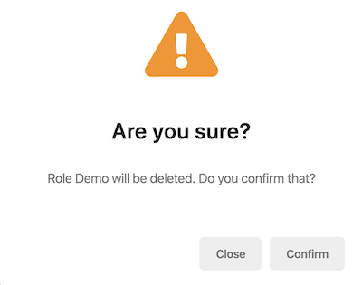

# 确认弹层

你可以使用@abp/ng.theme.shared包中提供 `ConfirmationService` 放置在你项目的级别来显示确认弹层

## 入门

你不必在模块或组件级别提供 `ConfirmationService`,它已经在**根**级别提供,你可以在你的组件,指令或服务直接注入并使用它.

```js
import { ConfirmationService } from '@abp/ng.theme.shared';

@Component({
  /* class metadata here */
})
class DemoComponent {
  constructor(private confirmation: ConfirmationService) {}
}
```

## 用法

你可以使用 `ConfirmationService` 的 `success`, `warn`, `error` 和 `info` 方法显示一个确认弹层.

### 如何显示一个确认弹层

```js
const confirmationStatus$ = this.confirmation.success('Message', 'Title');
```

- `ConfirmationService` 方法接收三个参数,分别是 `message`, `title`, 和 `options`.
- `success`, `warn`, `error`, 和 `info` 方法返回一个[RxJS Subject](https://rxjs-dev.firebaseapp.com/guide/subject)监听确认弹层关闭事件. 事件值类型是 [`Confirmation.Status`](https://github.com/abpframework/abp/blob/master/npm/ng-packs/packages/theme-shared/src/lib/models/confirmation.ts#L24)枚举.

### 如何监听关闭事件

你可以订阅确认弹层关闭事件,例:

```js
import { Confirmation, ConfirmationService } from '@abp/ng.theme.shared';

constructor(private confirmation: ConfirmationService) {}

this.confirmation
  .warn('::WillBeDeleted', { key: '::AreYouSure', defaultValue: 'Are you sure?' })
  .subscribe((status: Confirmation.Status) => {
    // your code here
  });
```

- `message` 和 `title` 参数接收字符串,本地化Key或本地化对象. 参阅[本地化文档](./Localization.md)
- `Confirmation.Status` 是一个枚举,具有三个属性;
    - `Confirmation.Status.confirm` 是一个关闭事件值,当通过确认按钮关闭弹出窗口时触发此事件.
    - `Confirmation.Status.reject` 是一个关闭事件值,当通过取消按钮关闭弹出窗口时触发此事件.
    - `Confirmation.Status.dismiss` 是一个关闭事件值,当通过按Escape键关闭弹出窗口时触发此事件.

如果你对确认状态不感兴趣,则不必订阅返回的observable:

```js
this.confirmation.error('You are not authorized.', 'Error');
```

### 如何显示具有给定选项的确认弹层

选项可以作为第三个参数传递给`success`, `warn`, `error`, 和 `info` 方法:

```js
const options: Partial<Confirmation.Options> = {
  hideCancelBtn: false,
  hideYesBtn: false,
  dismissible: false,
  cancelText: 'Close',
  yesText: 'Confirm',
  messageLocalizationParams: ['Demo'],
  titleLocalizationParams: [],
};

this.confirmation.warn(
  'AbpIdentity::RoleDeletionConfirmationMessage',
  'Are you sure?',
  options,
);
```

- `hideCancelBtn` 选项为 `true` 时隐藏取消按钮. 默认值为 `false`.
- `hideYesBtn` 选项为 `true` 时隐藏确认按钮. 默认值为 `false`.
- `dismissible`选项允许通过按Escape键或单击背景来取消确认弹出窗口. 默认值为 `true`.
- `cancelText` 是取消按钮的文本,可以传递本地化键或本地化对象. 默认值为 `AbpUi::Cancel`.
- `yesText` 是确定按钮的文本,可以传递本地化键或本地化对象. 默认值为 `AbpUi::Yes`.
- `messageLocalizationParams`是用于消息本地化的插值参数.
- `titleLocalizationParams` 是标题本地化的插值参数.

使用以上选项确认弹层窗口如下所示:



你可以传递HTML字符串作为标题,消息或按钮文本. 例如:

```js
const options: Partial<Confirmation.Options> = {
  yesText: '<i class="fa fa-trash mr-1"></i>Yes, delete it',
};

this.confirmation.warn(
  `
    <strong>Role Demo</strong> will be <strong>deleted</strong>
    <br>
    Do you confirm that?
  `,
  '<span class="my-custom-title">Are you sure?</span>',
  options,
);
```

由于这些值现在是HTML,因此应该手动处理本地化. 参阅[LocalizationService](./Localization#using-the-localization-service)了解如何实现.

> 注意,Angular会清除所有字符串,并且并非每个HTML字符串都可以使用. 仅显示被Angular视为"安全"的值.

### 如何删除一个确认弹层

打开的确认弹出窗口可以通过 `clear` 方法手动删除:

```js
this.confirmation.clear();
```

## API

### success

```js
success(
  message: Config.LocalizationParam,
  title: Config.LocalizationParam,
  options?: Partial<Confirmation.Options>,
): Observable<Confirmation.Status>
```

> 请参见[`Config.LocalizationParam`类型](https://github.com/abpframework/abp/blob/master/npm/ng-packs/packages/core/src/lib/models/config.ts#L46)和[Confirmation名称空间](https://github.com/abpframework/abp/blob/master/npm/ng-packs/packages/theme-shared/src/lib/models/confirmation.ts)


### warn

```js
warn(
  message: Config.LocalizationParam,
  title: Config.LocalizationParam,
  options?: Partial<Confirmation.Options>,
): Observable<Confirmation.Status>
```

### error

```js
error(
  message: Config.LocalizationParam,
  title: Config.LocalizationParam,
  options?: Partial<Confirmation.Options>,
): Observable<Confirmation.Status>
```

### info

```js
info(
  message: Config.LocalizationParam,
  title: Config.LocalizationParam,
  options?: Partial<Confirmation.Options>,
): Observable<Confirmation.Status>
```

### clear

```js
clear(
  status: Confirmation.Status = Confirmation.Status.dismiss
): void
```

- `status` 参数是确认关闭事件的值.


## 下一步是什么?

- [Toast Overlay](./Toaster-Service.md)
