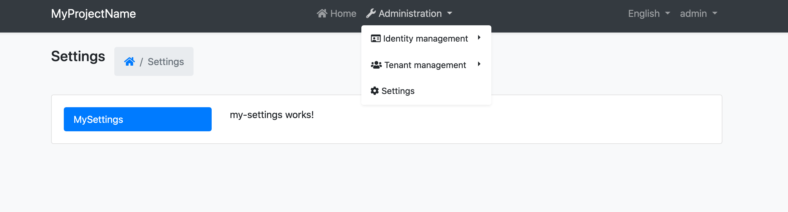

# 自定义设置页面

不同的模块提供它们的设置选项卡. 你可以通过3个步骤在项目中自定义设置页面.

1. 创建一个组件

```js
import { Select } from '@ngxs/store';
import { Component } from '@angular/core';

@Component({
  selector: 'app-your-custom-settings',
  template: `
    custom-settings works! 
  `,
})
export class YourCustomSettingsComponent {
  // Your component logic
}
```

2. 添加 `YourCustomSettingsComponent` 到 `AppModule` 中的 `declarations`和 `entryComponents` 数组中.

3. 打开 `app.component.ts` 在 `ngOnInit` 添加以下内容:

```js
import { addSettingTab } from '@abp/ng.theme.shared';
// ...

ngOnInit() {
  addSettingTab({
    component: YourCustomSettingsComponent,
    name: 'Type here the setting tab title (you can type a localization key, e.g: AbpAccount::Login',
    order: 4,
    requiredPolicy: 'type here a policy key'
  });
}
```

导航到 `/setting-management` 路由你会看到以下变化:



## 下一步是什么?

- [懒加载 Scripts 与 Styles](./Lazy-Load-Service.md)
