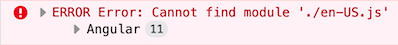

# 本地化

在阅读本地化管道和本地化服务之前你应该了解本地化Key.

本地化key格式由两个部分组成,分别是**资源名**和**Key**
`ResourceName::Key`

> 如果你没有指定资源名称,它默认是在 `environment.ts` 中声明的 `defaultResourceName`.

```js
const environment = {
  //...
  localization: {
    defaultResourceName: 'MyProjectName',
  },
};
```

所以这两个结果是一样的:

```html
<h1></h1>

<h1></h1>
```

## 使用本地化管道

你可以使用 `abpLocalization` 管道来获取本地化的文本. 例:

```html
<h1></h1>
```

管道将用本地化的文本替换Key.

你还可以指定一个默认值,如下所示:

```html
<h1></h1>
```

要使用插值,必须将插值作为管道参数给出. 例如:

本地化数据存储在键值对中:

```js
{
  //...
  AbpAccount: { // AbpAccount is the resource name
    Key: "Value",
    PagerInfo: "Showing {0} to {1} of {2} entries"
  }
}
```

所以我们可以这样使用Key:

```html
<h1></h1>

<!-- Output: Showing 20 to 30 of 50 entries -->
```

### 使用本地化服务

首先应该从 **@abp/ng.core** 导入 `LocalizationService`.

```js
import { LocalizationService } from '@abp/ng.core';

class MyClass {
  constructor(private localizationService: LocalizationService) {}
}
```

之后你就可以使用本地化服务.

> 你可以将插值参数作为参数添加到 `instant()` 和 `get()` 方法中.

```js
this.localizationService.instant('AbpIdentity::UserDeletionConfirmation', 'John');

// with fallback value
this.localizationService.instant(
  { key: 'AbpIdentity::UserDeletionConfirmation', defaultValue: 'Default Value' },
  'John',
);

// Output
// User 'John' will be deleted. Do you confirm that?
```

要获取[_Observable_](https://rxjs.dev/guide/observable)的本地化文本,应该使用 `get` 方法而不是 `instant`:

```js
this.localizationService.get('Resource::Key');

// with fallback value
this.localizationService.get({ key: 'Resource::Key', defaultValue: 'Default Value' });
```

### 使用配置状态

要使用 `getLocalization` 方法,你应该导入 `ConfigState`.

```js
import { ConfigState } from '@abp/ng.core';
```

然后你可以按以下方式使用它:

```js
this.store.selectSnapshot(ConfigState.getLocalization('ResourceName::Key'));
```

`getLocalization` 方法可以与 `本地化key` 和  [`LocalizationWithDefault`](https://github.com/abpframework/abp/blob/dev/npm/ng-packs/packages/core/src/lib/models/config.ts#L34) 接口一起使用.

```js
this.store.selectSnapshot(
  ConfigState.getLocalization(
    {
      key: 'AbpIdentity::UserDeletionConfirmation',
      defaultValue: 'Default Value',
    },
    'John',
  ),
);
```

本地化资源存储在 `ConfigState` 的 `localization` 属性中.

## RTL支持

从v2.9开始,ABP支持RTL. 如果使用v2.9及更高版本生成新项目,你无需进行任何更改. 如果要从早期版本迁移项目,请按照以下2个步骤操作:

#### 步骤 1. 为 Bootstrap LRT和RTL创建Chunks

在[angular.json中找到样式配置](https://angular.io/guide/workspace-config#style-script-config)确保项目中的chunks含有 `bootstrap-rtl.min` 和 `bootstrap-ltr.min`:

```json
{
  "projects": {
    "MyProjectName": {
      "architect": {
        "build": {
          "options": {
            "styles": [
              {
                "input": "node_modules/@fortawesome/fontawesome-free/css/all.min.css",
                "inject": true,
                "bundleName": "fontawesome-all.min"
              },
              {
                "input": "node_modules/@fortawesome/fontawesome-free/css/v4-shims.min.css",
                "inject": true,
                "bundleName": "fontawesome-v4-shims.min"
              },
              {
                "input": "node_modules/@abp/ng.theme.shared/styles/bootstrap-rtl.min.css",
                "inject": false,
                "bundleName": "bootstrap-rtl.min"
              },
              {
                "input": "node_modules/bootstrap/dist/css/bootstrap.min.css",
                "inject": true,
                "bundleName": "bootstrap-ltr.min"
              },
              "apps/dev-app/src/styles.scss"
            ],
          }
        }
      }
    }
  }
}
```

#### 步骤 2. 清除AppComponent中延迟加载的Fontawesome

如果你如上所述为Fontawesome创建并且注入了chunks,就不再需要v2.9版本之前的实现的 `AppComponent` 延迟加载. 删除它们即可,新版的 `AppComponent` 如下所示:

```js
import { Component } from '@angular/core';

@Component({
  selector: 'app-root',
  template: `
    <abp-loader-bar></abp-loader-bar>
    <router-outlet></router-outlet>
  `,
})
export class AppComponent {}
```

## 文化名称到语言环境文件名的映射

.NET中定义的某些文化名称与Angular语言环境不匹配. 在这种情况下Angular应用程序在运行时会引发如下错误:



如果你看到这样的错误,你应该像下面这样传递 `cultureNameLocaleFileMap` 属性到CoreModule的forRoot静态方法.

```js
// app.module.ts

@NgModule({
  imports: [
    // other imports
     CoreModule.forRoot({
      // other options
      cultureNameLocaleFileMap: { 
        "DotnetCultureName": "AngularLocaleFileName",
        "pt-BR": "pt"  // example
      }
    })
    //...
```

查看 [Angular中所有的语言环境文件](https://github.com/angular/angular/tree/master/packages/common/locales).

## 另请参阅

* [ASP.NET Core中的本地化](../../Localization.md)

## 下一步是什么?

* [权限管理](./Permission-Management.md)