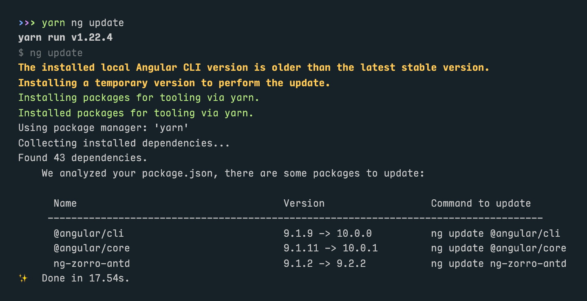

# Angular UI v2.9 迁移到 v3.0 指南

## 在v3.0改变了什么?

### Angular 10

新的ABP Angular UI基于Angular 10和TypeScript 3.9,我们已经放弃了对Angular 8的支持. 不过ABP模块将继续与Angular 9兼容使用. 因此如果你的项目是Angular 9,则无需更新为 Angular10. 更新通常很容易.

#### 如何迁移?

在你的根文件夹中打开一个终端,然后运行以下命令:

```sh
yarn ng update @angular/cli @angular/core --force
```

这会做如下修改:

- 更新你的package.json并安装新的软件包
- 修改tsconfig.json文件创建一个"Solution Style"配置
- 重命名 `browserslist` 为 `.browserslistrc`

另一方面,如果你单独使用 `yarn ng update` 命令检查首先要更新哪些包会更好. Angular会给你一个要更新的包列表.



当Angular报告上面的包后,运行命令:

```sh
yarn ng update @angular/cli @angular/core ng-zorro-antd --force
```

> 如果Angular提示你的仓库有中未提交的更改,可以提交/存储它,也可以在命令中添加 `--allow-dirty` 参数.

### 配置模块

在ABP v2.x中,每个延迟加载的模块都有一个可通过单独的程序包使用的配置模块,模块配置如下:

```js
import { AccountConfigModule } from '@abp/ng.account.config';

@NgModule({
  imports: [
    // other imports
    AccountConfigModule.forRoot({ redirectUrl: '/' }),
  ],
  // providers, declarations, and bootstrap
})
export class AppModule {}
```

...在app-routing.module.ts...

```js
const routes: Routes = [
  // other route configuration
  {
    path: 'account',
    loadChildren: () => import(
      './lazy-libs/account-wrapper.module'
    ).then(m => m.AccountWrapperModule),
  },
];
```

虽然有效,但有一些缺点:

- 每个模块都有两个独立的程序包,但实际上这些程序包是相互依赖的.
- 配置延迟加载的模块需要包装模块.
- ABP Commercial具有可扩展性系统,在根模块上配置可扩展模块会增加 bundle 的大小.

在ABP v3.0中,我们为每个配置模块引入了辅助入口点,并且提供了一种在没有包装的情况下配置延迟加载的模块的新方法. 现在模块配置如下所示:

```js
import { AccountConfigModule } from '@abp/ng.account/config';

@NgModule({
  imports: [
    // other imports
    AccountConfigModule.forRoot(),
  ],
  // providers, declarations, and bootstrap
})
export class AppModule {}
```

... 在app-routing.module.ts...

```js
const routes: Routes = [
  // other route configuration
  {
    path: 'account',
    loadChildren: () => import('@abp/ng.account')
      .then(m => m.AccountModule.forLazy({ redirectUrl: '/' })),
  },
];
```

这项更改帮助我们减少了捆绑包的大小并大大缩短了构建时间. 我们相信你会注意到你的应用程序有所不同.

#### 一个更好的例子

AppModule:

```js
import { AccountConfigModule } from '@abp/ng.account/config';
import { CoreModule } from '@abp/ng.core';
import { IdentityConfigModule } from '@abp/ng.identity/config';
import { SettingManagementConfigModule } from '@abp/ng.setting-management/config';
import { TenantManagementConfigModule } from '@abp/ng.tenant-management/config';
import { ThemeBasicModule } from '@abp/ng.theme.basic';
import { ThemeSharedModule } from '@abp/ng.theme.shared';
import { NgModule } from '@angular/core';
import { BrowserModule } from '@angular/platform-browser';
import { BrowserAnimationsModule } from '@angular/platform-browser/animations';
import { NgxsModule } from '@ngxs/store';
import { environment } from '../environments/environment';
import { AppRoutingModule } from './app-routing.module';

@NgModule({
  imports: [
    BrowserModule,
    BrowserAnimationsModule,
    AppRoutingModule,
    CoreModule.forRoot({
      environment,
      sendNullsAsQueryParam: false,
      skipGetAppConfiguration: false,
    }),
    ThemeSharedModule.forRoot(),
    AccountConfigModule.forRoot(),
    IdentityConfigModule.forRoot(),
    TenantManagementConfigModule.forRoot(),
    SettingManagementConfigModule.forRoot(),
    ThemeBasicModule.forRoot(),
    NgxsModule.forRoot(),
  ],
  // providers, declarations, and bootstrap
})
export class AppModule {}
```

AppRoutingModule:

```js
import { NgModule } from '@angular/core';
import { RouterModule, Routes } from '@angular/router';

const routes: Routes = [
  {
    path: '',
    pathMatch: 'full',
    loadChildren: () => import('./home/home.module').then(m => m.HomeModule),
  },
  {
    path: 'account',
    loadChildren: () =>
      import('@abp/ng.account').then(m => m.AccountModule.forLazy({ redirectUrl: '/' })),
  },
  {
    path: 'identity',
    loadChildren: () => import('@abp/ng.identity').then(m => m.IdentityModule.forLazy()),
  },
  {
    path: 'tenant-management',
    loadChildren: () =>
      import('@abp/ng.tenant-management').then(m => m.TenantManagementModule.forLazy()),
  },
  {
    path: 'setting-management',
    loadChildren: () =>
      import('@abp/ng.setting-management').then(m => m.SettingManagementModule.forLazy()),
  },
];

@NgModule({
  imports: [RouterModule.forRoot(routes)],
  exports: [RouterModule],
})
export class AppRoutingModule {}
```

> 你可能已经注意到我们在AppComponent模板中使用了 `<abp-dynamic-layout>` 而不是 `<router-outlet>`. 我们这样做是为了避免不必要的渲染和闪烁. 这不是强制的,但是我们建议在你的应用程序路由中做同样的事情.

#### 如何迁移?

- 使用 `yarn remove` 删除你的项目的配置包.
- 从辅助入口点(例如`@abp/ng.identity/config`)导入配置模块.
- 调用所有新配置模块的静态 `forRoot`方法,即使配置没有被传递.
- 调用 `ThemeBasicModule` 的静态 `forRoot` 方法(或商业上的 `ThemeLeptonModule`),并从导入中删除 `SharedModule`(除非已在其中添加了根模块所需的任何内容).
- 在app路由模块中直接导入延迟ABP模块 (如 `() => import('@abp/ng.identity').then(...)`).
- 在所有延迟模块 `then` 中调用的静态 `forLazy` 方法,即使配置没有被传递.
- [可选]添加 `<abp-dynamic-layout></abp-dynamic-layout>` 到AppComponent模板并且删除 `<router-outlet></router-outlet>`,获得更好的性能和UX.

### RoutesService

在ABP v2.x中,通过以下两种方式之一将路由添加到菜单:

- [通过 `AppRoutingModule` 的 `routes` 属性](https://docs.abp.io/en/abp/2.9.0/UI/Angular/Modifying-the-Menu#via-routes-property-in-approutingmodule)
- [通过 ConfigState](https://docs.abp.io/en/abp/2.9.0/UI/Angular/Modifying-the-Menu#via-configstate)

从v3.0开始，我们更改了添加和修改路由的方式. 我们不再将路由存储在 `ConfigState`中(破坏性更改). 而是有一个名为 `RoutesService` 的新服务,该服务用于添加,修补或删除菜单项. 详情请查看[文档](Modifying-the-Menu.md).

#### 如何迁移?

- 检查你是否曾经使用 `ConfigState` 或 `ConfigStateService` 添加路由. 请用 `RoutesService` 的 `add` 方法替换它们.
- 检查你是否曾经修补的路由. 将其替换为 `RoutesService` 的 `patch` 方法.
- 仔细检查你是否使用绝对路径,并在 `add` 或 `patch` 方法调用中为子菜单项提供 `parentName` 而不是 `children` 属性.

### NavItemsService

在ABP v2.x中,[通过LayoutStateService](https://docs.abp.io/en/abp/2.9.0/UI/Angular/Modifying-the-Menu#how-to-add-an-element-to-right-part-of-the-menu)添加导航元素.

从v3.0开始,我们改变了添加和修改导航项的方式,以前的方法不再可用(破坏性更改). 详情请查看[文档](Modifying-the-Menu.md).

#### 如何迁移?

- 用 `NavItemsService` 的 `addItems` 方法替换所有 `dispatchAddNavigationElement` 调用.

### ngx-datatable

在v3之前,我们一直使用自定义组件 `abp-table` 作为默认表. 但是数据表是复杂的组件,要实现功能齐全的数据表需要大量的精力,我们计划将其引入其他功能.

从ABP v3开始,我们已切换到经过严格测试,执行良好的数据表格:[ngx-datatable](https://github.com/swimlane/ngx-datatable). 所有的ABP模块都已经实现了ngx-datatable. `ThemeSharedModule` 已经导出了 `NgxDatatableModule`. 因此如果你在终端运行 `yarn add @swimlane/ngx-datatable` 来安装这个包,它将在你的应用的所有模块中可用.

为了正确设置样式,你需要在angular.json文件的样式部分中添加以下内容(在其他所有元素之上):

```json
"styles": [
  {
    "input": "node_modules/@swimlane/ngx-datatable/index.css",
    "inject": true,
    "bundleName": "ngx-datatable-index"
  },
  {
    "input": "node_modules/@swimlane/ngx-datatable/assets/icons.css",
    "inject": true,
    "bundleName": "ngx-datatable-icons"
  },
  {
    "input": "node_modules/@swimlane/ngx-datatable/themes/material.css",
    "inject": true,
    "bundleName": "ngx-datatable-material"
  },
  // other styles
]
```

由于尚未删除 `abp-table`, 因此以前由ABP v2.x构建的模块不会突然丢失所有. 但是它们的外观与内置ABP v3模块有所不同, 因此你可能希望将这些模块中的表转换为ngx-datatable. 为了减少将abp-table转换为ngx-datatable所需的工作量,我们修改了 `ListService` 以使其与 `ngx-datatable` 一起很好地工作,并引入了两个新指令: `NgxDatatableListDirective` 和 `NgxDatatableDefaultDirective`.

这些指令的用法很简单:

```js
@Component({
  providers: [ListService],
})
export class SomeComponent {
  data$ = this.list.hookToQuery(
    query => this.dataService.get(query)
  );

  constructor(
    public readonly list: ListService,
    public readonly dataService: SomeDataService,
  ) {}
}
```

...在组件模板...

```html
<ngx-datatable
  [rows]="(data$ | async)?.items || []"
  [count]="(data$ | async)?.totalCount || 0"
  [list]="list"
  default
>
  <!-- column templates here -->
</ngx-datatable>
```

通过 `NgxDatatableListDirective` 绑定注入的 `ListService` 实例后,你不再需要担心分页或排序. 同样 `NgxDatatableDefaultDirective` 去除了几个属性绑定,以使ngx-datatable适合我们的样式.

#### 一个更好的例子

```html
<ngx-datatable
  [rows]="items"
  [count]="count"
  [list]="list"
  default
>
  <!-- the grid actions column -->
  <ngx-datatable-column
    name=""
    [maxWidth]="150"
    [width]="150"
    [sortable]="false"
  >
    <ng-template
      ngx-datatable-cell-template
      let-row="row"
      let-i="rowIndex"
    >
      <abp-grid-actions
        [index]="i"
        [record]="row"
        text="AbpUi::Actions"
      ></abp-grid-actions>
    </ng-template>
  </ngx-datatable-column>

  <!-- a basic column -->
  <ngx-datatable-column
    prop="someProp"
    [name]="'::SomeProp' | abpLocalization"
    [width]="200"
  ></ngx-datatable-column>

  <!-- a column with a custom template -->
  <ngx-datatable-column
    prop="someOtherProp"
    [name]="'::SomeOtherProp' | abpLocalization"
    [width]="250"
  >
    <ng-template
      ngx-datatable-cell-template
      let-row="row"
      let-i="index"
    >
      <div abpEllipsis></div>
    </ng-template>
  </ngx-datatable-column>
</ngx-datatable>
```

#### 如何迁移?

- 安装 `@swimlane/ngx-datatable` 包.
- 添加ngx-datatable样式到angular.json文件.
- 如果可以的话,根据上面的例子更新你的模.
- 如果你稍后需要这样做,并且打算保留abp-table一段时间,请确保根据此处描述的[破坏性更改](List-Service.md)更新分页.

**重要说明:**abp-table没有被删除,但已被弃用并在以后的版本中删除. 请考虑切换到ngx-datatable.

### 扩展系统[商业版]

扩展程序系统现在是开源的, 可以从 `@abp/ng.theme.shared/extensions` 而不是从 `@volo/abp.commercial.ng.ui` 中获取. 同样,根据config软件包的新结构,如上所述通过 `forLazy` 静态方法进行配置.

#### 如何迁移?

如果你以前从未使用过扩展系统,则无需执行任何操作. 否则请再次检查文档以查看更改. 扩展系统本身的工作原理与以前相同,唯一的变化是你从中导入的包,静态方法以及您将贡献者传递给的模块.


### Lepton 主题Logo [商业版]

在ABP v2.x中,Lepton每个颜色主题都有一个亮徽标和一个暗徽标. 我们意识到我们可以使它仅使用一个浅色和一个深色徽标. 因此我们更改了Lepton查找徽标图像的方式,现在你只需要在项目中包含 `logo-light.png` 和 `logo-dark.png`.

#### 如何迁移?

如果你之前已切换模板徽标PNG,则更改很简单:

- 转到 `/assets/images/logo` 目录.
- 重命名 `theme1.png` 为 `logo-light.png` 并且重命名 `theme1-reverse.png` 为 `logo-dark.png`.
- 删除所有其他 `theme*.png` 文件.

如果你更换了徽标组件,则更改有些不同,但仍然很简单. `LayoutStateService` 有两个新成员: `primaryLogoColor` 和 `secondaryLogoColor`. 它们有 `'light'` 和 `'dark'` 设置值做为可观察流. 你可以使用 `async` 管道在自定义徽标组件模板中使用它们的值. 这是一个完整的示例,其中涵盖了主要和辅助(帐户)布局徽标. 

```js
import { AddReplaceableComponent } from '@abp/ng.core';
import { CommonModule } from '@angular/common';
import { APP_INITIALIZER, Component, Injector, NgModule } from '@angular/core';
import { Store } from '@ngxs/store';
import { eAccountComponents } from '@volo/abp.ng.account';
import {
  AccountLayoutComponent,
  eThemeLeptonComponents,
  LayoutStateService,
} from '@volo/abp.ng.theme.lepton';
import { Observable } from 'rxjs';
import { map } from 'rxjs/operators';

@Component({
  template: `
    <div class="account-brand p-4 text-center mb-1" *ngIf="isAccount; else link">
      <ng-template [ngTemplateOutlet]="link"></ng-template>
    </div>

    <ng-template #link>
      <a [style.background-image]="logoUrl | async" class="navbar-brand" routerLink="/"></a>
    </ng-template>
  `,
})
export class LogoComponent {
  isAccount: boolean;

  logoColor: Observable<'dark' | 'light'>;

  get logoUrl() {
    return this.logoColor.pipe(map(color => `url(/assets/images/logo/logo-${color}.png)`));
  }

  constructor(injector: Injector) {
    const layout = injector.get(LayoutStateService);
    this.isAccount = Boolean(injector.get(AccountLayoutComponent, false));
    this.logoColor = this.isAccount ? layout.secondaryLogoColor : layout.primaryLogoColor;
  }
}

@NgModule({
  imports: [CommonModule],
  declarations: [LogoComponent],
  exports: [LogoComponent],
})
export class LogoModule {}

export const APP_LOGO_PROVIDER = [
  { provide: APP_INITIALIZER, useFactory: switchLogos, multi: true, deps: [Store] },
];

export function switchLogos(store: Store) {
  return () => {
    store.dispatch(
      new AddReplaceableComponent({
        component: LogoComponent,
        key: eThemeLeptonComponents.Logo,
      }),
    );

    store.dispatch(
      new AddReplaceableComponent({
        component: LogoComponent,
        key: eAccountComponents.Logo,
      }),
    );
  };
}
```

只要将 `APP_LOGO_PROVIDER` 添加到根模块的提供程序(通常是 `AppModule` ),你就会有一个调整主题颜色的自定义徽标组件.

### 过时的接口

某些接口早已被标记为已弃用,现在已将其删除.

#### 如何迁移?

请检查你是否仍在使用[Issue中列出的任何内容](https://github.com/abpframework/abp/issues/4281).

## 下一步是什么?

* [环境](./Environment.md)