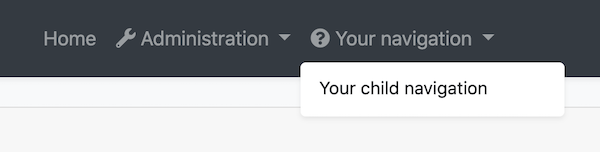
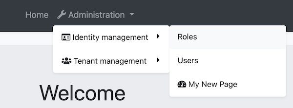
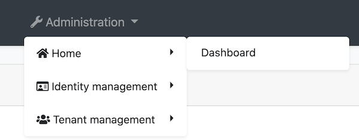
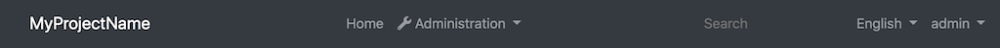

# 修改菜单


菜单在 @abp/ng.theme.basic包 `ApplicationLayoutComponent` 内部. 有几种修改菜单的方法,本文档介绍了这些方法. 如果你想完全替换菜单,请参考[组件替换文档]了解如何替换布局.

<!-- TODO: Replace layout replacement document with component replacement. Layout replacement document will be created.-->

## 如何添加Logo

环境变量中的 `logoUrl` 是logo的url.

你可以在 `src/assets` 文件夹下添加logo并设置 `logoUrl`:

```js
export const environment = {
  // other configurations
  application: {
    name: 'MyProjectName',
    logoUrl: 'assets/logo.png',
  },
  // other configurations
};
```

## 如何添加导航元素

### 通过 AppRoutingModule 中的 `routes` 属性

你可以通过在 `app-routing.module` 中将路由作为子属性添加到路由配置的 `data` 属性来定义路由. `@abp/ng.core` 包组织路由并将其存储在 `ConfigState` 中.`ApplicationLayoutComponent` 从存储中获取路由显示在菜单上.

你可以像以下一样添加 `routes` 属性:

```js
{
  path: 'your-path',
  data: {
    routes: {
      name: 'Your navigation',
      order: 3,
      iconClass: 'fas fa-question-circle',
      requiredPolicy: 'permission key here',
      children: [
        {
          path: 'child',
          name: 'Your child navigation',
          order: 1,
          requiredPolicy: 'permission key here',
        },
      ],
    } as ABP.Route, // can be imported from @abp/ng.core
  }
}
```

- `name` 是导航元素的标签,可以传递本地化密钥或本地化对象.
- `order` 排序导航元素.
- `iconClass` 是 `i` 标签的类,在导航标签的左侧.
- `requiredPolicy` 是访问页面所需的权限key. 参阅 [权限管理文档](./Permission-Management.md)
- `children` is an array and is used for declaring child navigation elements. The child navigation element will be placed as a child route which will be available at `'/your-path/child'` based on the given `path` property.
- `children` 是一个数组,用于声明子菜单,它基于给定的 `path` 属性,路径是在`/your-path/child`.

添加了上面描述的route属性后,导航菜单如下图所示:



## 通过 ConfigState

`ConfigStateService` 的 `dispatchAddRoute` 方法可以向菜单添加一个新的导航元素.

```js
// this.config is instance of ConfigStateService

const newRoute: ABP.Route = {
  name: 'My New Page',
  iconClass: 'fa fa-dashboard',
  path: 'page',
  invisible: false,
  order: 2,
  requiredPolicy: 'MyProjectName.MyNewPage',
} as Omit<ABP.Route, 'children'>;

this.config.dispatchAddRoute(newRoute);
// returns a state stream which emits after dispatch action is complete
```

`newRoute` 放在根级别,没有任何父路由,url将为`/path`.

如果你想 **添加子路由, 你可以这样做:**

```js
// this.config is instance of ConfigStateService
// eIdentityRouteNames enum can be imported from @abp/ng.identity

const newRoute: ABP.Route = {
  parentName: eIdentityRouteNames.IdentityManagement,
  name: 'My New Page',
  iconClass: 'fa fa-dashboard',
  path: 'page',
  invisible: false,
  order: 3,
  requiredPolicy: 'MyProjectName.MyNewPage'
} as Omit<ABP.Route, 'children'>;

this.config.dispatchAddRoute(newRoute);
// returns a state stream which emits after dispatch action is complete
```

`newRoute` 做为 `eIdentityRouteNames.IdentityManagement` 的子路由添加, url 设置为 `'/identity/page'`.

新路由看起来像这样:



## 如何修改一个导航元素

`DispatchPatchRouteByName` 方法通过名称查找路由,并使用二个参数传递的新配置替换存储中的配置.

```js
// this.config is instance of ConfigStateService
// eIdentityRouteNames enum can be imported from @abp/ng.identity

const newRouteConfig: Partial<ABP.Route> = {
  iconClass: 'fas fa-home',
  parentName: eIdentityRouteNames.Administration,
  order: 0,
  children: [
    {
      name: 'Dashboard',
      path: 'dashboard',
    },
  ],
};

this.config.dispatchPatchRouteByName('::Menu:Home', newRouteConfig);
// returns a state stream which emits after dispatch action is complete
```

* 根据给定的 `parentName` 将 _Home_ 导航移动到 _Administration_ 下拉框下.
* 添加了 icon.
* 指定了顺序.
* 添加了名为 _Dashboard_ 的子路由.

修改后,导航元素看起来像这样:



## 如何在菜单的右侧添加元素

右侧的元素存储在 @abp/ng.theme.basic 包的 `LayoutState` 中.

`LayoutStateService` 的 `dispatchAddNavigationElement` 方法添加元素到右侧的菜单.

你可以通过将模板添加到 `app.component` 调用 `dispatchAddNavigationElement` 方法来插入元素:

```js
import { Layout, LayoutStateService } from '@abp/ng.theme.basic'; // added this line

@Component({
  selector: 'app-root',
  template: `
  
    <!-- Added below content -->
    <ng-template #search
      ><input type="search" placeholder="Search" class="bg-transparent border-0"
    /></ng-template>
  `,
})
export class AppComponent {
  // Added ViewChild
  @ViewChild('search', { static: false, read: TemplateRef }) searchElementRef: TemplateRef<any>;

  constructor(private layout: LayoutStateService) {} // injected LayoutStateService

  // Added ngAfterViewInit
  ngAfterViewInit() {
    const newElement = {
      name: 'Search',
      element: this.searchElementRef,
      order: 1,
    } as Layout.NavigationElement;

    this.layout.dispatchAddNavigationElement(newElement);
  }
}
```

上面我们在菜单添加了一个搜索输入,最终UI如下:s



## 如何删除右侧菜单元素

TODO

## 下一步是什么?

* [组件替换](./Component-Replacement.md)
