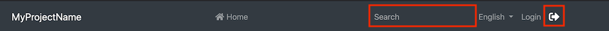

# 修改菜单

菜单在 @abp/ng.theme.basic包 `ApplicationLayoutComponent` 内部. 有几种修改菜单的方法,本文档介绍了这些方法. 如果你想完全替换菜单,请参考[组件替换文档]了解如何替换布局.

## 如何添加Logo

环境变量中的 `logoUrl` 是logo的url.

你可以在 `src/assets` 文件夹下添加logo并设置 `logoUrl`:

```js
export const environment = {
  // other configurations
  application: {
    name: 'MyProjectName',
    logoUrl: 'assets/logo.png',
  },
  // other configurations
};
```

## 如何添加导航元素

### 通过 `RoutesService`

你可以通过调用 `RoutesService` 的 `add` 方法添加路由到菜单,它是一个单例的服务,在root中提供,你可以立即注入使用它.

```js
import { RoutesService, eLayoutType } from '@abp/ng.core';
import { Component } from '@angular/core';

@Component(/* component metadata */)
export class AppComponent {
  constructor(routes: RoutesService) {
    routes.add([
      {
        path: '/your-path',
        name: 'Your navigation',
        order: 101,
        iconClass: 'fas fa-question-circle',
        requiredPolicy: 'permission key here',
        layout: eLayoutType.application,
      },
      {
        path: '/your-path/child',
        name: 'Your child navigation',
        parentName: 'Your navigation',
        order: 1,
        requiredPolicy: 'permission key here',
      },
    ]);
  }
}
```

另一种方法是使用路由提供程序. 首先创建一个提供程序:

```js
// route.provider.ts
import { RoutesService, eLayoutType } from '@abp/ng.core';
import { APP_INITIALIZER } from '@angular/core';

export const APP_ROUTE_PROVIDER = [
  { provide: APP_INITIALIZER, useFactory: configureRoutes, deps: [RoutesService], multi: true },
];

function configureRoutes(routes: RoutesService) {
  return () => {
    routes.add([
      {
        path: '/your-path',
        name: 'Your navigation',
        requiredPolicy: 'permission key here',
        order: 101,
        iconClass: 'fas fa-question-circle',
        layout: eLayoutType.application,
      },
      {
        path: '/your-path/child',
        name: 'Your child navigation',
        parentName: 'Your navigation',
        requiredPolicy: 'permission key here',
        order: 1,
      },
    ]);
  };
}
```

...然后在app.module.ts ...

```js
import { NgModule } from '@angular/core';
import { APP_ROUTE_PROVIDER } from './route.provider';

@NgModule({
  providers: [APP_ROUTE_PROVIDER],
  // imports, declarations, and bootstrap
})
export class AppModule {}
```

下面是每个属性的工作原理:

- `path` 是导航元素的绝对路径.
- `name` 是导航元素的label. 可以使用本地化Key和本地化对象.
- `parentName` 是菜单中父路由的 `name` 的引用,用于创建多级菜单项.
- `requiredPolicy` 是用于访问该页面的权限Key. 参阅[权限管理文档](Permission-Management.md).
- `order` 是导航元素的排序. `Administration` 的顺序是 `100`. 在排序top级别菜单项时请记得这一点.
- `iconClass` 是 `i` 标签的class, 它放在导航label的左边.
- `layout` 定义路由使用哪个布局加载. (默认: `eLayoutType.empty`).
- `invisible` 使该项在菜单中不可见. (默认: `false`).

### 通过 `AppRoutingModule` 的 `routes` 属性

你可以通过在 `app-routing.module` 中将路由作为子属性添加到路由配置的 `data` 属性来定义路由. `@abp/ng.core` 包组织路由并将其存储在 `ConfigState` 中.`ApplicationLayoutComponent` 从存储中获取路由显示在菜单上.

你可以像以下一样添加 `routes` 属性:

```js
{
  path: 'your-path',
  data: {
    routes: {
      name: 'Your navigation',
      order: 101,
      iconClass: 'fas fa-question-circle',
      requiredPolicy: 'permission key here',
      children: [
        {
          path: 'child',
          name: 'Your child navigation',
          order: 1,
          requiredPolicy: 'permission key here',
        },
      ],
    },
  },
}
```

或者你可以这样做:

```js
{
  path: 'your-path',
  data: {
    routes: [
      {
        path: '/your-path',
        name: 'Your navigation',
        order: 101,
        iconClass: 'fas fa-question-circle',
        requiredPolicy: 'permission key here',
      },
      {
        path: '/your-path/child',
        name: 'Your child navigation',
        parentName: 'Your navigation',
        order: 1,
        requiredPolicy: 'permission key here',
      },
    ] as ABP.Route[], // can be imported from @abp/ng.core
  },
}
```

第二种方法的优点是你不必绑定到父/子结构,可以使用任何喜欢的路由.

如上所述添加 `routes` 属性后,导航菜单看起来像这样:


## 如何修补或删除导航元素

`RoutesService` 的 `patch` 方法通过名称查找路由,并将配置替换为第二个参数传递的新配置.  `remove` 方法会找到一个路由并将其连同其子路由一起删除.

```js
// this.routes is instance of RoutesService
// eThemeSharedRouteNames enum can be imported from @abp/ng.theme.shared

const dashboardRouteConfig: ABP.Route = {
  path: '/dashboard',
  name: '::Menu:Dashboard',
  parentName: '::Menu:Home',
  order: 1,
  layout: eLayoutType.application,
};

const newHomeRouteConfig: Partial<ABP.Route> = {
  iconClass: 'fas fa-home',
  parentName: eThemeSharedRouteNames.Administration,
  order: 0,
};

this.routes.add([dashboardRouteConfig]);
this.routes.patch('::Menu:Home', newHomeRouteConfig);
this.routes.remove(['Your navigation']);
```

- 根据给定的 `parentName` 将 _Home_ 导航移动到 _Administration_ 下拉菜单下.
- 为 _Home_ 添加了图标.
- 指定 _Home_ 的顺序为列表的第一项.
- 为  _Home_ 添加了一个名为 _Dashboard_ 的子路由.
- 删除 _Your navigation_ 与其子路由.

上述操作后,新的菜单看起来如下:


## 如何在菜单的右侧添加元素

你可以通过调用 `NavItemsService` 的 `addItems` 方法将元素添加到菜单的右侧. 这是一个单例服务,即以根身份提供. 因此你可以立即注入并使用它.

```js
import { NavItemsService } from '@abp/ng.theme.shared';
import { Component } from '@angular/core';

@Component({
  template: `
    <input type="search" placeholder="Search" class="bg-transparent border-0 color-white" />
  `,
})
export class MySearchInputComponent {}


@Component(/* component metadata */)
export class AppComponent {
  constructor(private navItems: NavItemsService) {
    navItems.addItems([
      {
        id: 'MySearchInput',
        order: 1,
        component: MySearchInputComponent,
      },
      {
        id: 'SignOutIcon',
        html: '<i class="fas fa-sign-out-alt fa-lg text-white m-2"><i>',
        action: () => console.log('Clicked the sign out icon'),
        order: 101, // puts as last element
      },
    ]);
  }
}
```

上面我们在菜单添加了一个搜索输入和退出登录图标,最终UI如下:



> 默认元素的排序为 `100`. 如果要将自定义元素放在默认值之前,请指定一个排序,最高为 `99`. 如果要将自定义元素放在默认值之后,请指定排序从 `101` 开始. 最后如果必须在默认值之间放置一个项目,请按如下所述修补默认元素顺序. 但有一个警告:我们将来可能会添加另一个默认元素,排序也为 `100`.

## 如何修补或删除右侧部分元素

`NavItemsService` 的 `patchItem` 方法通过 `id` 查找元素,并将配置替换为第二个参数传递的新配置.  `removeItem` 方法会找到一个元素并删除.

```js
export class AppComponent {
  constructor(private navItems: NavItemsService) {
    navItems.patchItem(eThemeBasicComponents.Languages, {
      requiredPolicy: 'new policy here',
      order: 1,
    });

    navItems.removeItem(eThemeBasicComponents.CurrentUser);
  }
}
```

* 使用新的 `requiredPolicy` 和新的 `order` 修补了语言下拉菜单元素.
* 删除了当前用户的下拉菜单元素.

## 下一步是什么?

* [组件替换](./Component-Replacement.md)
