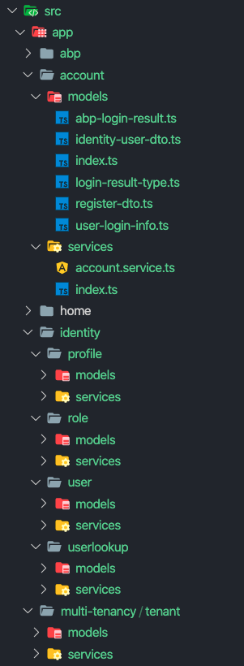

## 服务代理

从Angular应用程序中调用服务器中的REST端点是很常见的, 在这种情况下我们通常创建**服务**(在服务器端具有针对每个服务方法的方法)和**模型对象**(与服务器端[DTO](../../Data-Transfer-Objects)匹配).

除了手动创建这样的服务器交互服务之外,我们还可以使用[NSWAG](https://github.com/RicoSuter/NSwag)之类的工具来为我们生成服务代理. 但使用NSWAG过程中我们遇到以下问题:

* 它生成一个**大的单个.ts文件**,该文件存在一些问题;
  * 当你的应用程序增长时,它会变的**越来越大**.
  * 它不适合ABP框架的[模块化](../../Module-Development-Basics)方法
* 它创建了一些**难看的代码**. 我们希望有一个干净的代码(就像我们手动编写一样).
* 它不能生成在服务器端声明的相同**方法签名**(因为swagger.json并不完全反映后端服务的方法签名). 我们已经创建了一个端点公开了服务器端方法信息,以便客户端生成更好的一致的客户端代理.

ABP CLI 的`generate-proxies` 命令在 `src/app` 文件夹中创建按模块名称分隔的文件夹,自动生成typescript客户端代理.

在angular应用程序的**根文件夹**中运行以下命令:

```bash
abp generate-proxy -t ng
```

它只为你自己的应用程序的服务创建代理. 不会为你正在使用的应用程序模块的服务创建代理(默认情况下). 有几个选项,参见[CLI文档](../../CLI).

使用 `--module all` 选项生成的文件如下所示:



### Services

每个生成的服务都与后端控制器匹配. 服务方法通过[RestService](./Http-Requests#restservice)调用后端API.

在每个服务中都定义了一个名为 `apiName` 的变量(自v2.4起可用). `apiName` 与模块的 `RemoteServiceName` 匹配. 在每次请求时该变量将作为参数传递给 `RestService`. 如果环境中未定义微服务API, `RestService` 使用默认值. 请参阅[从应用程序配置中获取特定的API端点](./Http-Requests#how-to-get-a-specific-api-endpoint-from-application-config)

服务的 `providerIn` 属性定义为 `'root'`. 因此无需将服务作为提供程序添加到模块. 你可以通过将服务注入到构造函数中来使用它,如下所示:

```js
import { AbpApplicationConfigurationService } from '../abp/applicationconfiguration/services';

//...
export class HomeComponent{
  constructor(private appConfigService: AbpApplicationConfigurationService) {}

  ngOnInit() {
    this.appConfigService.get().subscribe()
  }
}
```

Angular编译器会从最终输出中删除那些没有被注入的服务. 参见[摇树优化的提供者文档](https://angular.cn/guide/dependency-injection-providers#tree-shakable-providers).

### Models

生成的模型与后端中的dto匹配. 每个模型在 `src/app/*/models` 文件夹生成一个类.

`@abp/ng.core` 包有一些[基类](https://github.com/abpframework/abp/blob/dev/npm/ng-packs/packages/core/src/lib/models/dtos.ts). 一些模型扩展了这些类.

可以如下所示创建一个类的实例:

```js
import { IdentityRoleCreateDto } from '../identity/role/models'
//...
const instance = new IdentityRoleCreateDto({name: 'Role 1', isDefault: false, isPublic: true})
```

可以选择将初始值传递给每个类构造函数.

## 下一步是什么?

* [HTTP请求](./Http-Requests)