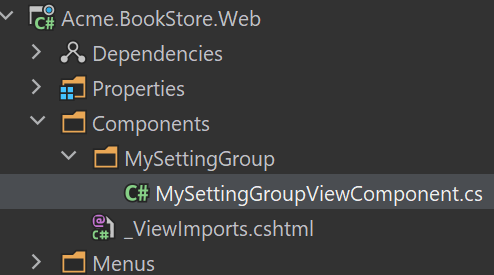

# 自定义设置页面

一些模块内置了设置页面,你也可以在项目中添加自己的设置页面.

### 创建视图组件

在 `Components` 目录下创建 `MySettingGroup` 文件夹, 添加一个名为 `MySettingGroupViewComponent` 的视图组件:



打开 `MySettingGroupViewComponent.cs` 替换为以下内容:

```csharp
public class MySettingGroupViewComponent : AbpViewComponent
{
    public virtual IViewComponentResult Invoke()
    {
        return View("~/Components/MySettingGroup/Default.cshtml");
    }
}
```

> 你还可以使用 `InvokeAsync` 方法,在这个示例中我们使用 `Invoke` 方法.

### Default.cshtml

在 `MySettingGroup` 目录下创建 `Default.cshtml` 文件.

打开 `Default.cshtml` 替换为以下内容:

```html
<div>
  <p>My setting group page</p>
</div>
```

### BookStoreSettingPageContributor

在 `Settings` 目录下创建 `BookStoreSettingPageContributor.cs` 文件.


文件内容如下:

```csharp
public class BookStoreSettingPageContributor : ISettingPageContributor
{
    public Task ConfigureAsync(SettingPageCreationContext context)
    {
        context.Groups.Add(
            new SettingPageGroup(
                "Volo.Abp.MySettingGroup",
                "MySettingGroup",
                typeof(MySettingGroupViewComponent)
            )
        );

        return Task.CompletedTask;
    }

    public Task<bool> CheckPermissionsAsync(SettingPageCreationContext context)
    {
        // You can check the permissions here
        return Task.FromResult(true);
    }
}
```

打开 `BookStoreWebModule.cs` 文件添加以下代码:

```csharp
Configure<SettingManagementPageOptions>(options =>
{
    options.Contributors.Add(new BookStoreSettingPageContributor());
});
```

### 运行应用程序

导航到 `/SettingManagement` 路由查看更改:

