# ASP.NET Core (MVC / Razor Pages) 用户界面自定义指南

本文档解释了如何重写ASP.NET Core MVC / Razor Page 应用程序依赖[应用模块](../../Modules/Index.md)的用户界面.

## 重写页面

本节介绍了[Razor 页面](https://docs.microsoft.com/zh-cn/aspnet/core/razor-pages/)开发,它是ASP.NET Core推荐的服务端渲染用户页面的方法. 预构建的模块通常使用Razor页面替代经典的MVC方式(下一节也介绍MVC模式).

你通过有三种重写页面的需求:

* 仅**重写页面模型**(C#)端执行其他逻辑,不更改UI.
* 仅**重写Razor页面**(.cshtml文件),不更改逻辑.
* **完全重写** 页面.

### 重写页面模型 (C#)

````csharp
using System.Threading.Tasks;
using Microsoft.AspNetCore.Mvc;
using Volo.Abp.DependencyInjection;
using Volo.Abp.Identity;
using Volo.Abp.Identity.Web.Pages.Identity.Users;

namespace Acme.BookStore.Web.Pages.Identity.Users
{
    [Dependency(ReplaceServices = true)]
    [ExposeServices(typeof(EditModalModel))]
    public class MyEditModalModel : EditModalModel
    {
        public MyEditModalModel(
            IIdentityUserAppService identityUserAppService,
            IIdentityRoleAppService identityRoleAppService
            ) : base(
                identityUserAppService,
                identityRoleAppService)
        {
        }

        public async override Task<IActionResult> OnPostAsync()
        {
            //TODO: Additional logic
            await base.OnPostAsync();
            //TODO: Additional logic
        }
    }
}
````

* 这个类继承并替换 `EditModalModel` ,重写了 `OnPostAsync` 方法在基类代码的前后执行附加逻辑
* 它使用 `ExposeServices` 和 `Dependency` attributes去替换这个类.

### 重写Razor页面 (.CSHTML)

同一路径下创建相同的`.cshtml`文件可以实现重写功能(razor page, razor view, view component... 等.)

#### 示例

这个示例重写了[账户模块](../../Modules/Account.md)定义的**登录页面**UI

账户模块在 `Pages/Account` 文件夹下定义了 `Login.cshtml` 文件. 所以你可以在同一路径下创建文件覆盖它:
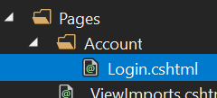

通常你想要拷贝模块的 `.cshtml` 原文件,然后进行需要的更改. 你可以在[这里](https://github.com/abpframework/abp/blob/dev/modules/account/src/Volo.Abp.Account.Web/Pages/Account/Login.cshtml)找到源文件. 不要拷贝 `Login.cshtml.cs` 文件,它是隐藏razor页面的代码,我们不希望覆盖它(见下节).

这就够了,接下来你可以对文件内容做你想要的更改.

### 完全重写Razo页面

也许你想要完全重写页面,Razor和页面相关的C#文件.

在这种情况下;

1. 像上面描述过的那样重写C#页面模型类,但不需要替换已存在的页面模型类.
2. 像上面描述过的那样重写Razor页面,并且更改@model指向新的页面模型

#### 示例

这个示例重写了[账户模块](../../Modules/Account.md)定义的**登录页面**

创建一个继承自 `LoginModel`(定义在`Volo.Abp.Account.Web.Pages.Account`命名空间下)的页面模型类:

````csharp
public class MyLoginModel : LoginModel
{
    public MyLoginModel(
        IAuthenticationSchemeProvider schemeProvider,
        IOptions<AbpAccountOptions> accountOptions
        ) : base(
        schemeProvider,
        accountOptions)
    {

    }

    public override Task<IActionResult> OnPostAsync(string action)
    {
        //TODO: Add logic
        return base.OnPostAsync(action);
    }

    //TODO: Add new methods and properties...
}
````

如果需要,你可以重写任何方法或添加新的属性/方法

> 注意我们没有使用 `[Dependency(ReplaceServices = true)]` 或 `[ExposeServices(typeof(LoginModel))]`,因为我们不想替换依赖注入中已存在的类,我们定义了一个新的.

拷贝 `Login.cshtml` 到你们解决方案,更改 **@model** 指定到 `MyLoginModel`:

````xml
@page
...
@model Acme.BookStore.Web.Pages.Account.MyLoginModel
...
````

这就够了,接下来你可以做任何想要更改.

#### 不使用继承替换页面模型

你不需要继承源页面模型类(像之前的示例). 你可以完全**重写实现**你自己的页面. 在这种事情下你可以从 `PageModel`,`AbpPageModel` 或任何你需要的合适的基类派生.

## 重写视图组件

在ABP框架,预构建的模块和主题定义了一些**可重用的视图组件**. 这些视图组件可以像页面一样被替换.

### 示例

下面是应用程序启动模板自带的 **基本主题** 的截图.

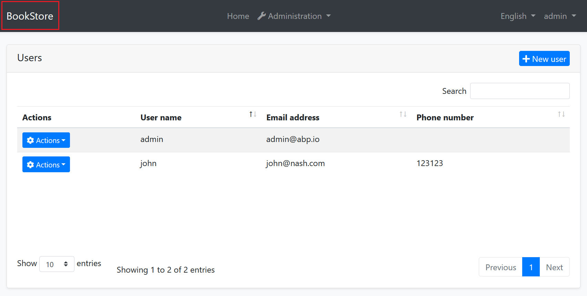

[基本主题](../../Themes/Basic.md) 为layout定义了一些视图组件. 例如上面带有红色矩形的突出显示区域称为 **Brand组件**, 你可能想添加自己的**自己的应用程序logo**来自定义此组件. 让我们来看看如何去做.

首先创建你的logo并且放到你的web应用程序文件夹中,我们使用 `wwwroot/logos/bookstore-logo.png` 路径. 然后在 `Themes/Basic/Components/Brand` 文件夹下复制[Brand组件视图](https://github.com/abpframework/abp/blob/dev/modules/basic-theme/src/Volo.Abp.AspNetCore.Mvc.UI.Theme.Basic/Themes/Basic/Components/Brand/Default.cshtml). 结果应该是类似下面的图片:

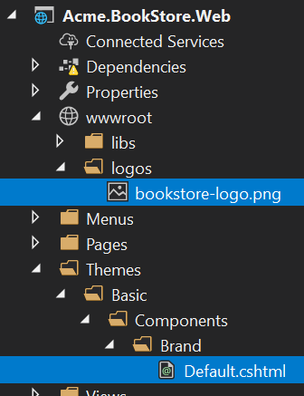

然后对 `Default.cshtml` 文件做你想要的更改. 例如内容可以是这样的:

````xml
<a href="/">
    
</a>
````

现在你可以运行应用程序看到结果:

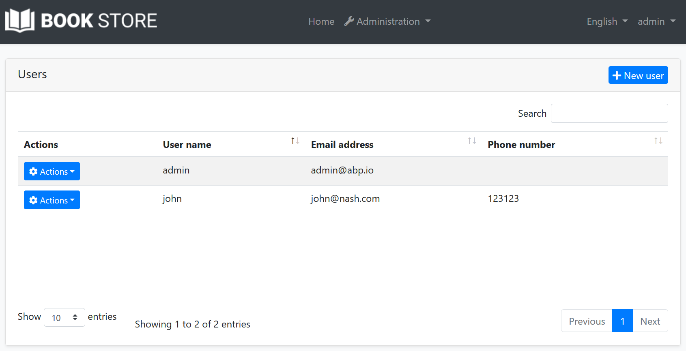

如果你需要,你也可以仅使用依赖注入系统替换组件[背后的C#类代码](https://github.com/abpframework/abp/blob/dev/modules/basic-theme/src/Volo.Abp.AspNetCore.Mvc.UI.Theme.Basic/Themes/Basic/Components/Brand/MainNavbarBrandViewComponent.cs)

### 重写主题

正如上所解释的,你可以更改任何组件,layout或c#类. 参阅[主题文档]了解更多关于主题系统的信息.

## 重写静态资源

重写模块的静态资源(像JavaScript,Css或图片文件)是很简单的. 只需要在解决方案的相同路径创建文件,[虚拟文件系统](../../Virtual-File-System.md)会自动处理它.

## 操作捆绑

[捆绑 & 压缩](Bundling-Minification.md) 系统提供了**动态可扩展的** 系统去创建**script**和**style**捆绑. 它允许你扩展和操作现有的包.

### 示例: 添加全局CSS文件

例如APP框架定义了一个**全局样式捆绑**添加到所有的页面(事实上由主题添加layout). 让我们添加一个**自定义样式文件**到这个捆绑文件的最后,我们可以覆盖任何全局样式.

创建在 `wwwroot` 文件夹下创建一个CSS文件

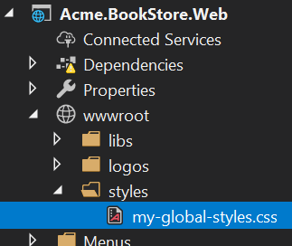

在CSS文件中定义一些规则. 例如:

````css
.card-title {
    color: orange;
    font-size: 2em;
    text-decoration: underline;
}

.btn-primary {
    background-color: red;
}
````

然后在你的[模块](../../Module-Development-Basics.md) `ConfigureServices` 方法添加这个文件到标准的全局样式捆绑包:

````csharp
Configure<AbpBundlingOptions>(options =>
{
    options.StyleBundles.Configure(
        StandardBundles.Styles.Global, //The bundle name!
        bundleConfiguration =>
        {
            bundleConfiguration.AddFiles("/styles/my-global-styles.css");
        }
    );
});
````

#### 全局脚本捆绑包

就像 `StandardBundles.Styles.Global` 一样,还有一个 `StandardBundles.Scripts.Global`,你可以添加文件或操作现有文件.

### 示例: 操作捆绑包文件

上面的示例中添加了新文件到捆绑包. 如果你创建 **bundle contributor** 类则可以做到更多. 示例:

````csharp
public class MyGlobalStyleBundleContributor : BundleContributor
{
    public override void ConfigureBundle(BundleConfigurationContext context)
    {
        context.Files.Clear();
        context.Files.Add("/styles/my-global-styles.css");
    }
}
````

然后你可以添加这个contributor到已存在的捆绑中:

````csharp
Configure<AbpBundlingOptions>(options =>
{
    options.StyleBundles.Configure(
        StandardBundles.Styles.Global,
        bundleConfiguration =>
        {
            bundleConfiguration.AddContributors(typeof(MyGlobalStyleBundleContributor));
        }
    );
});
````

示例中清除了所有的CSS文件,在现实中这并不是一个好主意,你可以找到某个特定的文件替换成你自己的文件.

### 示例: 为特定页面添加JavaScript文件

上面的示例将全局包添加到布局中. 如果要在依赖模块中为特定页面定义添加CSS/JavaScript文件(或替换文件)怎么做?

假设你想要用户进入身份模块的**角色管理**页面时运行**JavaScript代码**.

首先在 `wwwroot`, `Pages` 或 `Views` 文件夹下创建一个标准的JavaScript文件(默认ABP支持这些文件夹下的静态文件). 根据约定我们推荐 `Pages/Identity/Roles` 文件夹:

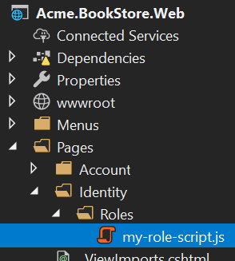

该文件的内容很简单:

````js
$(function() {
    abp.log.info('My custom role script file has been loaded!');
});
````

然后将这个文件添加到角色管页面理捆绑包中:

````csharp
Configure<AbpBundlingOptions>(options =>
{
    options.ScriptBundles
        .Configure(
            typeof(Volo.Abp.Identity.Web.Pages.Identity.Roles.IndexModel).FullName,
            bundleConfig =>
            {
                bundleConfig.AddFiles("/Pages/Identity/Roles/my-role-script.js");
            });
});
````

`typeof(Volo.Abp.Identity.Web.Pages.Identity.Roles.IndexModel).FullName` 是获取角色管理页面捆绑包名称的安全方式:

> 请注意并非每个页面都定义了这个页面的捆绑包. 它们仅在需要时定义.

除了添加新的CSS/JavaScript文件到页面,你也可以以替换(通过捆绑包contributor)已存在.

## 布局定制

布局由主题([参阅主题](Theming.md))定义设计. 它们不包含在下载的应用程序解决方案中. 通过这种方式你可以轻松的**更改**主题并获取新的功能. 你不能**直接更改**应用程序中的布局代码,除非你用自己的布局替换它(在下一部分中说明).

有一些通用的方法可以**自定义布局**,将在下一节中介绍.

### 菜单贡献者

ABP框架定义了两个**标准菜单**:

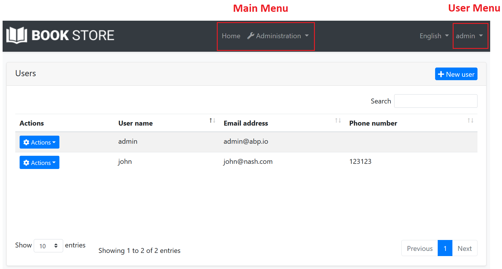

* `StandardMenus.Main`: 应用程序的主菜单.
* `StandardMenus.User`: 用户菜单 (通常在屏幕的右上方).

显示菜单是主题的责任,但**菜单项**由模板和你的应用程序代码决定. 只需要实现 `IMenuContributor` 接口并在 `ConfigureMenuAsync` 方法操作菜单项.

渲染菜单时需要执行菜单贡献者. **应用程序启动模板** 已经定义了菜单贡献者,所以你可以使用它. 参阅[导航菜单](Navigation-Menu.md)文档了解更多.

### 工具栏贡献者

[工具栏系统](Toolbars.md)用于在用户界面定义 **工具栏** . 模块 (或你的应用程序)可以将 **项** 添加到工具栏, 随后主题将在**布局**上呈现工具栏.

只有一个 **标准工具栏** (名称为 "Main" - 定义为常量: `StandardToolbars.Main`). 对于基本主题,按如下呈现: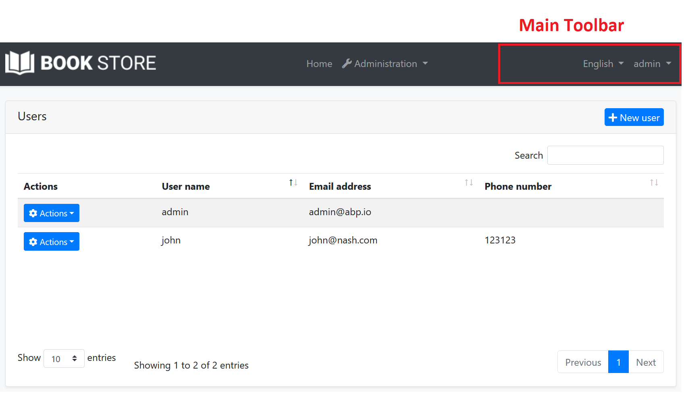

在上面的屏幕快照中,主工具栏添加了两个项目:语言开关组件和用户菜单. 你可以在此处添加自己的项.

#### 示例: 添加通知图标

在这个示例中,我们会添加一个**通知(响铃)图标**到语言切换项的左侧. 工具栏的项项目是一个**视图组件**. 所以,在你的项目中创建一个新的视图组件:

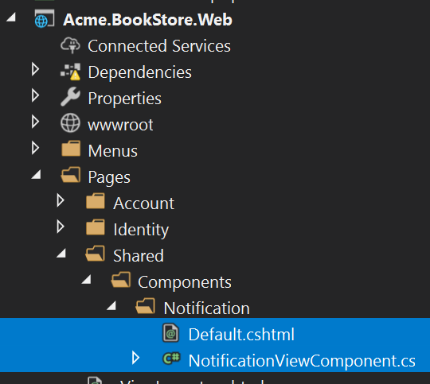

**NotificationViewComponent.cs**

````csharp
public class NotificationViewComponent : AbpViewComponent
{
    public async Task<IViewComponentResult> InvokeAsync()
    {
        return View("/Pages/Shared/Components/Notification/Default.cshtml");
    }
}
````

**Default.cshtml**

````xml
<div id="MainNotificationIcon" style="color: white; margin: 8px;">
    <i class="far fa-bell"></i>
</div>
````

现在,我们创建一个类实现 `IToolbarContributor` 接口:

````csharp
public class MyToolbarContributor : IToolbarContributor
{
    public Task ConfigureToolbarAsync(IToolbarConfigurationContext context)
    {
        if (context.Toolbar.Name == StandardToolbars.Main)
        {
            context.Toolbar.Items
                .Insert(0, new ToolbarItem(typeof(NotificationViewComponent)));
        }

        return Task.CompletedTask;
    }
}
````

这个类向 `Main` 工具栏的第一项添加了 `NotificationViewComponent`.

最后你需要将这个贡献者添加到 `AbpToolbarOptions`,在你模块类的 `ConfigureServices` 方法:

````csharp
Configure<AbpToolbarOptions>(options =>
{
    options.Contributors.Add(new MyToolbarContributor());
});
````

这就够了,当你运行应用程序后会看到工具栏上的通知图标:

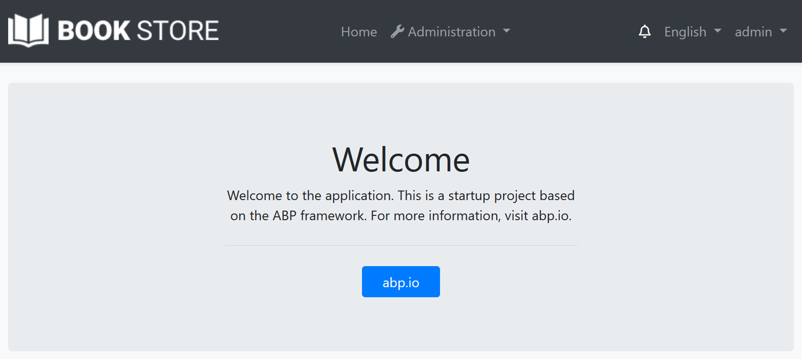

示例中的 `NotificationViewComponent` 返回没有任何数据的视图. 在实际场景中,你可能想**查询数据库**(或调用HTTP API)获取通知并传递给视图. 如果需要可以将 `JavaScript` 或 `CSS` 文件添加到工具栏的全局捆绑包中(如前所述).

参阅[工具栏文档](Toolbars.md)了解更多关于工具栏系统.

### 布局钩子

[布局钩子](Layout-Hooks.md) 系统允许你在布局页面的某些特定部分 **添加代码** . 所有主题的所有布局都应该实现这些钩子. 然后你可以将**视图组件**添加到钩子.

#### 示例: 添加谷歌统计

假设你想要添加谷歌统计脚本到布局(将适用所有的页面). 首先在你的项目中**创建一个视图组件**:

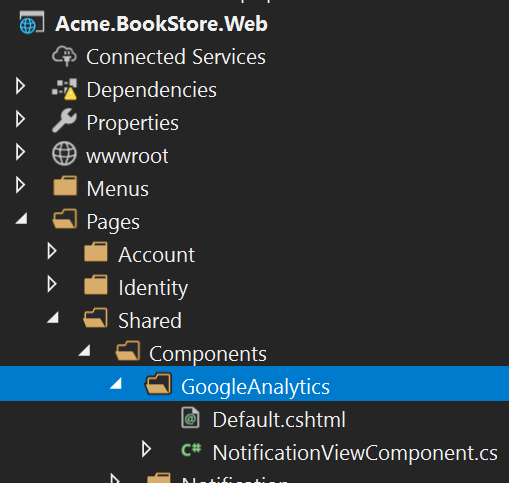

**NotificationViewComponent.cs**

````csharp
public class GoogleAnalyticsViewComponent : AbpViewComponent
{
    public IViewComponentResult Invoke()
    {
        return View("/Pages/Shared/Components/GoogleAnalytics/Default.cshtml");
    }
}
````

**Default.cshtml**

````html
<script>
    (function(i,s,o,g,r,a,m){i['GoogleAnalyticsObject']=r;i[r]=i[r]||function(){
            (i[r].q=i[r].q||[]).push(arguments)},i[r].l=1*new Date();a=s.createElement(o),
            m=s.getElementsByTagName(o)[0];a.async=1;a.src=g;m.parentNode.insertBefore(a,m)
    })(window,document,'script','//www.google-analytics.com/analytics.js','ga');

    ga('create', 'UA-xxxxxx-1', 'auto');
    ga('send', 'pageview');
</script>
````

在你自己的代码中更改 `UA-xxxxxx-1` .

然后你可以在你模块的 `ConfigureServices` 方法将这个组件添加到任何的钩子点:

````csharp
Configure<AbpLayoutHookOptions>(options =>
{
    options.Add(
        LayoutHooks.Head.Last, //The hook name
        typeof(GoogleAnalyticsViewComponent) //The component to add
    );
});
````

现在谷歌统计代码将在页面的 `head` 所为最后一项插入. 你(或你在使用的模块)可以将多个项添加到相同的钩子,它们都会添加到布局.

在上面我们添加 `GoogleAnalyticsViewComponent` 到所有的布局,你可能只想添加到指定的布局:

````csharp
Configure<AbpLayoutHookOptions>(options =>
{
    options.Add(
        LayoutHooks.Head.Last,
        typeof(GoogleAnalyticsViewComponent),
        layout: StandardLayouts.Application //Set the layout to add
    );
});
````

参阅下面的布局部分,以了解有关布局系统的更多信息.

### 布局

布局系统允许主题定义标准,命名布局并且允许任何页面选择使用合适的布局. 有三种预定义的布局:

* "**Application**": 应用程序的主要(和默认)布局. 它通常包含页眉,菜单(侧栏),页脚,工具栏等.
* "**Account**": 登录,注册和其他类似页面使用此布局. 默认它用于 `/Pages/Account` 文件夹下的页面.
* "**Empty**": 空的最小的布局.

这些名称在 `StandardLayouts` 类定义为常量. 这是标准的布局名称,所有的主题开箱即用的实现. 你也可以创建自己的布局.

#### 布局位置

你可以在[这里](https://github.com/abpframework/abp/blob/dev/modules/basic-theme/src/Volo.Abp.AspNetCore.Mvc.UI.Theme.Basic/Themes/Basic/Layouts)找到基本主题的布局文件. 你可以将它们作用构建自己的布局的参考,也可以在必要时覆盖它们.

#### ITheme

ABP框架使用 `ITheme` 服务通过局部名称获取布局位置. 你可以替换此服务动态的选择布局位置.

#### IThemeManager

`IThemeManager` 用于获取当前主题,并得到了布局路径. 任何页面可以都决定自己的布局. 例:

````html
@using Volo.Abp.AspNetCore.Mvc.UI.Theming
@inject IThemeManager ThemeManager
@{
    Layout = ThemeManager.CurrentTheme.GetLayout(StandardLayouts.Empty);
}
````

此页面将使用空白布局. 它使用 `ThemeManager.CurrentTheme.GetEmptyLayout()` 扩展方法.

如果你设置特定目录下所有页面的布局,可以在该文件夹下的 `_ViewStart.cshtml` 文件编写以上代码.
