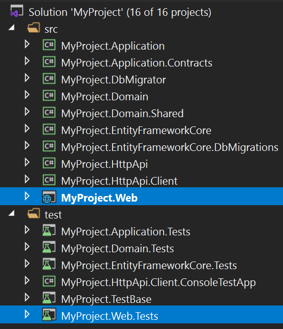
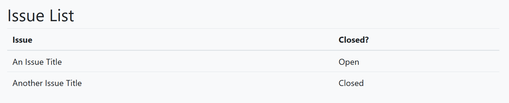

# ASP.NET Core MVC / Razor Pages: 测试

> 你可以参考[ASP.NET Core集成测试文档](https://docs.microsoft.com/en-us/aspnet/core/test/integration-tests)了解ASP.NET Core集成测试的详细内容. 本文档解释了ABP框架提供的附加测试基础设施.

## 应用程序启动模板

应用程序启动模板的`.Web`项目其中包含应用程序的UI视图/页面/组件, 并提供`.Web.Tests`项目来测试这些内容.



## 测试Razor页面

假设你已经创建了一个名为`Issues.cshtml`的Razor页面, 包含以下内容;

**Issues.cshtml.cs**

````csharp
using System.Collections.Generic;
using System.Threading.Tasks;
using Microsoft.AspNetCore.Mvc.RazorPages;
using MyProject.Issues;

namespace MyProject.Web.Pages
{
    public class IssuesModel : PageModel
    {
        public List<IssueDto> Issues { get; set; }

        private readonly IIssueAppService _issueAppService;

        public IssuesModel(IIssueAppService issueAppService)
        {
            _issueAppService = issueAppService;
        }

        public async Task OnGetAsync()
        {
            Issues = await _issueAppService.GetListAsync();
        }
    }
}
````

**Issues.cshtml**

````html
@page
@model MyProject.Web.Pages.IssuesModel
<h2>Issue List</h2>
<table id="IssueTable" class="table">
    <thead>
        <tr>
            <th>Issue</th>
            <th>Closed?</th>
        </tr>
    </thead>
    <tbody>
        @foreach (var issue in Model.Issues)
        {
            <tr>
                <td>@issue.Title</td>
                <td>
                    @if (issue.IsClosed)
                    {
                        <span>Closed</span>
                    }
                    else
                    {
                        <span>Open</span>
                    }
                </td>
            </tr>
        }
    </tbody>
</table>
````

本页仅创建一个包含issue的表格:



你可以在`.Web.Tests`项目中编写一个测试类如下所示:

````csharp
using System.Threading.Tasks;
using HtmlAgilityPack;
using Shouldly;
using Xunit;

namespace MyProject.Pages
{
    public class Issues_Tests : MyProjectWebTestBase
    {
        [Fact]
        public async Task Should_Get_Table_Of_Issues()
        {
            // Act

            var response = await GetResponseAsStringAsync("/Issues");

            //Assert

            var htmlDocument = new HtmlDocument();
            htmlDocument.LoadHtml(response);

            var tableElement = htmlDocument.GetElementbyId("IssueTable");
            tableElement.ShouldNotBeNull();

            var trNodes = tableElement.SelectNodes("//tbody/tr");
            trNodes.Count.ShouldBeGreaterThan(0);
        }
    }
}
````

`GetResponseAsStringAsync`是一个快捷方法, 它来自执行HTTP GET请求的基类, 检查生成的HTTP状态是否为`200`, 并将响应作为`string`返回.

> 你可以使用`Client`对象(类型为`HttpClient`)对服务器执行任何类型的请求, 并读取响应.`GetResponseAsStringAsync`只是一种快捷方法.

本例使用[HtmlAgilityPack](https://html-agility-pack.net/)库来解析传入的HTML并测试它是否包含issue表格.

> 本例假设的数据库中存在一些初始issue. 请参阅[测试文档](../../Testing.md)的*种子数据*部分, 了解如何设置种子数据, 以便可以假定数据库中有一些可用的初始数据.

## 控制器测试

测试控制器也不例外. 只需使用正确的URL向服务器执行请求, 获取响应并做出断言.

### 查看结果

如果控制器返回一个视图, 你可以使用类似的代码来测试返回的HTML. 参见上面的Razor页面示例.

### 对象结果

如果控制器返回对象结果, 则可以使用`GetResponseAsObjectAsync`方法. 

假设你有一个如下定义的控制器:

````csharp
using System.Collections.Generic;
using System.Threading.Tasks;
using Microsoft.AspNetCore.Mvc;
using MyProject.Issues;
using Volo.Abp.AspNetCore.Mvc;

namespace MyProject.Web.Controllers
{
    [Route("api/issues")]
    public class IssueController : AbpController
    {
        private readonly IIssueAppService _issueAppService;

        public IssueController(IIssueAppService issueAppService)
        {
            _issueAppService = issueAppService;
        }

        [HttpGet]
        public async Task<List<IssueDto>> GetAsync()
        {
            return await _issueAppService.GetListAsync();
        }
    }
}
````

你可以编写测试代码来调用API并获得结果:

````csharp
using System.Collections.Generic;
using System.Threading.Tasks;
using MyProject.Issues;
using Shouldly;
using Xunit;

namespace MyProject.Pages
{
    public class Issues_Tests : MyProjectWebTestBase
    {
        [Fact]
        public async Task Should_Get_Issues_From_Api()
        {
            var issues = await GetResponseAsObjectAsync<List<IssueDto>>("/api/issues");
            
            issues.ShouldNotBeNull();
            issues.Count.ShouldBeGreaterThan(0);
        }
    }
}
````

## 测试JavaScript代码

ABP框架不提供任何基础设施来测试JavaScript代码. 你可以使用任何测试框架和工具来测试JavaScript代码.

## 测试基础设施

[Volo.Abp.AspNetCore.TestBase](https://www.nuget.org/packages/Volo.Abp.AspNetCore.TestBase) 提供了集成到ABP框架和ASP.NET Core的测试基础设施.

> Volo.Abp.AspNetCore.TestBase 已经安装在 `.Web.Tests` 项目中.

此包提供的`AbpAspNetCoreIntegratedTestBase`作为派生测试类的基类. 上面使用的`MyProjectWebTestBase`继承自`AbpAspNetCoreIntegratedTestBase`, 因此我们间接继承了`AbpAspNetCoreIntegratedTestBase`.

### 基本属性

`AbpAspNetCoreIntegratedTestBase` 提供了测试中使用的以下基本属性:

* `Server`: 在测试中托管web应用程序的`TestServer`实例.
* `Client`: 为执行对测试服务器的请求配置`HttpClient`实例.
* `ServiceProvider`: 可以在你需要时处理服务提供服务.

### 基本方法

`AbpAspNetCoreIntegratedTestBase` 提供了以下方法, 如果需要自定义测试服务器, 可以重写这些方法:

* `ConfigureServices` 仅为派生测试类注册/替换服务时可以重写使用.
* `CreateHostBuilder` 可用于自定义生成 `IHostBuilder`.

另请参阅

* [总览/服务器端测试](../../Testing.md)
