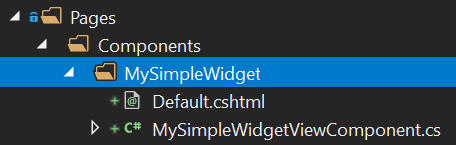

# 小部件

ABP为创建**可重用的部件**提供了模型和基础设施. 部件系统是[ASP.NET Core ViewComponents](https://docs.microsoft.com/en-us/aspnet/core/mvc/views/view-components)的扩展. 在你有以下需求时,小部件会非常有用;

* 在可复用的 **[模块](../../Module-Development-Basics.md)** 中定义部件.
* 在部件中引用 **scripts & styles** 脚本.
* 使用部件创建 **仪表盘**.
* 支持 **[授权](../../Authorization.md)** 与 **[捆绑`bundling`](Bundling-Minification.md)** 的部件

## 基本部件定义

### 创建一个视图组件

第一部,创建一个新的ASP.NET Core View Component:



**MySimpleWidgetViewComponent.cs**:

````csharp
using Microsoft.AspNetCore.Mvc;
using Volo.Abp.AspNetCore.Mvc;

namespace DashboardDemo.Web.Pages.Components.MySimpleWidget
{
    public class MySimpleWidgetViewComponent : AbpViewComponent
    {
        public IViewComponentResult Invoke()
        {
            return View();
        }
    }
}
````

继承 `AbpViewComponent` 不是必需的. 你也可以继承ASP.NET Core的 `ViewComponent`. `AbpViewComponent` 只是定义了一些基本的实用属性.

**Default.cshtml**:

```xml
<div class="my-simple-widget">
    <h2>My Simple Widget</h2>
    <p>This is a simple widget!</p>
</div>
```

### 定义部件

添加 `Widget` attribute 到 `MySimpleWidgetViewComponent` 类,将此视图组件标记为部件:

````csharp
using Microsoft.AspNetCore.Mvc;
using Volo.Abp.AspNetCore.Mvc;
using Volo.Abp.AspNetCore.Mvc.UI.Widgets;

namespace DashboardDemo.Web.Pages.Components.MySimpleWidget
{
    [Widget]
    public class MySimpleWidgetViewComponent : AbpViewComponent
    {
        public IViewComponentResult Invoke()
        {
            return View();
        }
    }
}
````

## 渲染部件

渲染部件的用法是ASP.NET Core的标准用法. 在razor view/page中使用 `Component.InvokeAsync` 方法, 就像渲染一个View Component一样. 例如:

````xml
@await Component.InvokeAsync("MySimpleWidget")
@await Component.InvokeAsync(typeof(MySimpleWidgetViewComponent))
````

第一行代码使用名称渲染了部件,第二行代码使用type渲染了View Comonent.

## 部件名称

默认下名称是根据View Conponent组件的名称计算的, 比如你的视图组件名是 `MySimpleWidgetViewComponent`, 那么部件的名称就是 `MySimpleWidget` (删除`ViewComponent`后缀). 这与ASP.NET Core的默认视图组件名称的方式一样.

想要自定义组件名称,只需要使用ASP.NET Core的 `ViewComponent` attribute:

```csharp
using Microsoft.AspNetCore.Mvc;
using Volo.Abp.AspNetCore.Mvc;
using Volo.Abp.AspNetCore.Mvc.UI.Widgets;

namespace DashboardDemo.Web.Pages.Components.MySimpleWidget
{
    [Widget]
    [ViewComponent(Name = "MyCustomNamedWidget")]
    public class MySimpleWidgetViewComponent : AbpViewComponent
    {
        public IViewComponentResult Invoke()
        {
            return View("~/Pages/Components/MySimpleWidget/Default.cshtml");
        }
    }
}
```

ABP会通过自定义的名称去处理部件.

> 如果视图组件名与视图组件的文件夹名称不匹配,那么需要像本例中那样去手动编写视图路径.

### 显示名称

你还可以定义对于使用者友好的本地化显示名称. 需要时在UI中使用显示名称. 显示名称是可选的,在 `Widget` attribute 的`DisplayName`属性中定义:

````csharp
using DashboardDemo.Localization;
using Microsoft.AspNetCore.Mvc;
using Volo.Abp.AspNetCore.Mvc;
using Volo.Abp.AspNetCore.Mvc.UI.Widgets;

namespace DashboardDemo.Web.Pages.Components.MySimpleWidget
{
    [Widget(
        DisplayName = "MySimpleWidgetDisplayName", //Localization key
        DisplayNameResource = typeof(DashboardDemoResource) //localization resource
        )]
    public class MySimpleWidgetViewComponent : AbpViewComponent
    {
        public IViewComponentResult Invoke()
        {
            return View();
        }
    }
}
````

参阅 [本地化文档](../../Localization.md) 学习关于本地化资源的更多内容.

## 引用 Style & Script

当部件含有样式和scirpt文件时,会存在一些挑战;

* 使用部件的页面应该将 **script & styles** 文件引用到页面中.
* 页面还需要解析部件的 `依赖库/文件`.

将资源与部件正确的关联在一起时,ABP会解决这些问题. 使用正确的方法,就不用担心部件的依赖关系.

### 定义一个简单的文件路径

下面的示例中部件添加了样式和scirpt文件:

````csharp
using Microsoft.AspNetCore.Mvc;
using Volo.Abp.AspNetCore.Mvc;
using Volo.Abp.AspNetCore.Mvc.UI.Widgets;

namespace DashboardDemo.Web.Pages.Components.MySimpleWidget
{
    [Widget(
        StyleFiles = new[] { "/Pages/Components/MySimpleWidget/Default.css" },
        ScriptFiles = new[] { "/Pages/Components/MySimpleWidget/Default.js" }
        )]
    public class MySimpleWidgetViewComponent : AbpViewComponent
    {
        public IViewComponentResult Invoke()
        {
            return View();
        }
    }
}
````

ABP会考虑到这些依赖关系, 在view/page中使用正确的方法添加部件 . 样式和script可以是物理文件也可以是虚拟文件. 它于[虚拟文件系统](../../Virtual-File-System.md)完全集成].

### 定义 Bundle

页面中使用的组件的所有资源都做为捆绑包添加(如果没有其他配置,会在生产中合并和压缩). 除了简单的添加文件,你还可以充分的利用捆绑功能.

下面的示例与上面的代码相同,但是在添加文件时文件路径替换成了  `BundleContributor`:

````csharp
using System.Collections.Generic;
using Microsoft.AspNetCore.Mvc;
using Volo.Abp.AspNetCore.Mvc;
using Volo.Abp.AspNetCore.Mvc.UI.Bundling;
using Volo.Abp.AspNetCore.Mvc.UI.Widgets;

namespace DashboardDemo.Web.Pages.Components.MySimpleWidget
{
    [Widget(
        StyleTypes = new []{ typeof(MySimpleWidgetStyleBundleContributor) },
        ScriptTypes = new[]{ typeof(MySimpleWidgetScriptBundleContributor) }
        )]
    public class MySimpleWidgetViewComponent : AbpViewComponent
    {
        public IViewComponentResult Invoke()
        {
            return View();
        }
    }

    public class MySimpleWidgetStyleBundleContributor : BundleContributor
    {
        public override void ConfigureBundle(BundleConfigurationContext context)
        {
            context.Files
              .AddIfNotContains("/Pages/Components/MySimpleWidget/Default.css");
        }
    }

    public class MySimpleWidgetScriptBundleContributor : BundleContributor
    {
        public override void ConfigureBundle(BundleConfigurationContext context)
        {
            context.Files
              .AddIfNotContains("/Pages/Components/MySimpleWidget/Default.js");
        }
    }
}

````

捆绑系统非常强大,如果你的部件使用了JavaScript库来呈现图表, 你可以将它声明为依赖项, 如果之前未添加JavaScript库. 则会自动添加到页面中. 使用这种方式让页面使用部件时不用关心依赖项.

参阅 [捆包&压缩 文档](Bundling-Minification.md) 了解更多内容.

## 授权

某些组件可能只对通过身份验证或授权的用户可用,这时可以使用 `Widget` attribute 的以下属性:

* `RequiresAuthentication` (`bool`): 设置为true,只有通过身份验证的用户(登录用户)可用.
* `RequiredPolicies` (`List<string>`): 授权用户的策略名称列表. 有关策略的详细信息请参阅[授权文档](../../Authorization.md).

示例:

````csharp
using Microsoft.AspNetCore.Mvc;
using Volo.Abp.AspNetCore.Mvc;
using Volo.Abp.AspNetCore.Mvc.UI.Widgets;

namespace DashboardDemo.Web.Pages.Components.MySimpleWidget
{
    [Widget(RequiredPolicies = new[] { "MyPolicyName" })]
    public class MySimpleWidgetViewComponent : AbpViewComponent
    {
        public IViewComponentResult Invoke()
        {
            return View();
        }
    }
}
````

## 部件选项

`AbpWidgetOptions` 是 `Widget` attribute 替代, 你可以使用它去配置部件:

```csharp
Configure<AbpWidgetOptions>(options =>
{
    options.Widgets.Add<MySimpleWidgetViewComponent>();
});
```

将上面的代码写到[模块](../../Module-Development-Basics.md)的 `ConfigureServices` 方法中. `AbpWidgetOptions` 可以完成 `Widget` attribute 的所有功能. 比如为组件添加样式:

````csharp
Configure<AbpWidgetOptions>(options =>
{
    options.Widgets
        .Add<MySimpleWidgetViewComponent>()
        .WithStyles("/Pages/Components/MySimpleWidget/Default.css");
});
````

> 提示: `AbpWidgetOptions` 还可以更改现有的部件配置. 如果要修改应用程序使用的模块内的组件配置,这会很有用. 使用 `options.Widgets.Find` 获取现有的 `WidgetDefinition`.