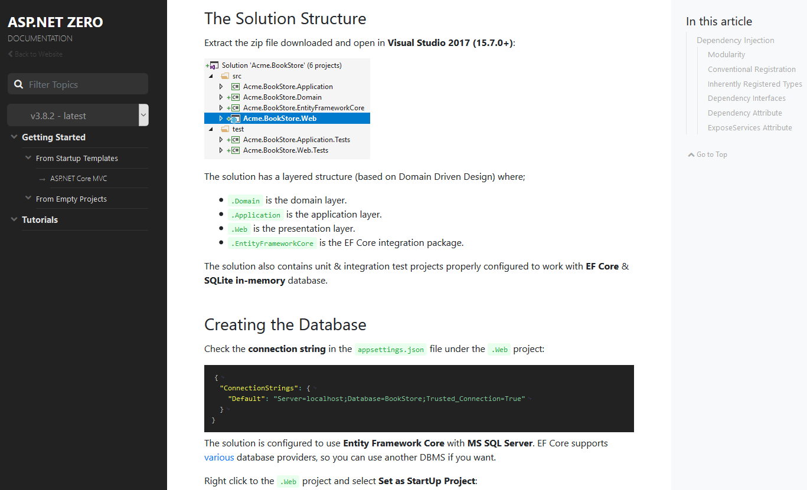

# Docs Module
This module is used to create technical documentation web sites. [abp.io](https://abp.io) web site uses this module for its documentation.

### Screenshot

### Main Features

* Can read documents from a Github repository.
* Supports Markdown document formatting.
* Supports versioning (integrated to Github releases).
* Support multiple projects.
