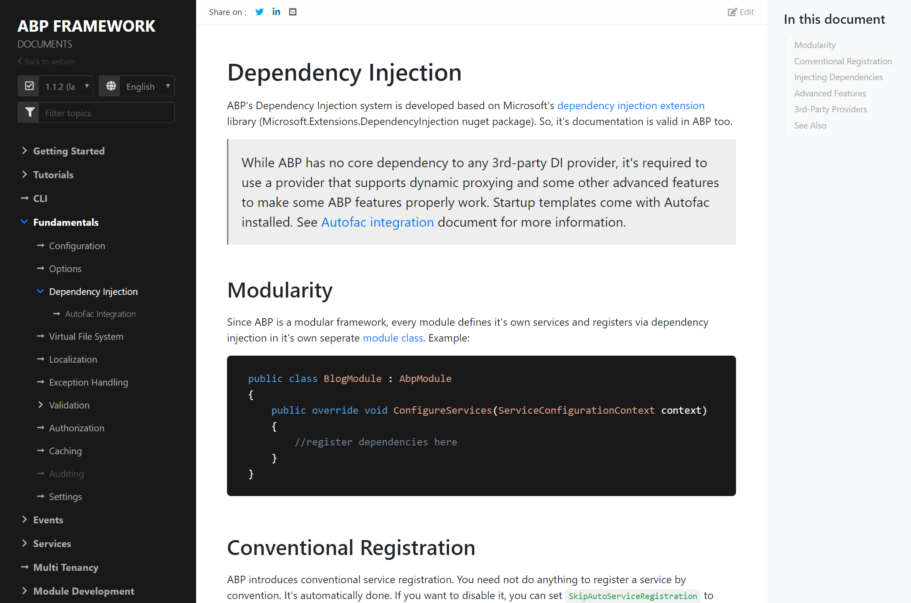

# Docs Module
This module is used to create technical documentation web sites;

* Built-in **GitHub integration**: Directly write and manage documents on GitHub.
* **Versioning** support directly integrated to GitHub releases.
* Supports **multi-language** (with fallback support to the default language).
* Supports the **Markdown** and HTML formats.
* Provides a **navigation** and an **outline** section.
* Allows to host **multiple projects** documentation in a single application.
* Links to the file on GitHub, so anyone can easily contribute by clicking to the **Edit link**.
* In addition to the GitHub source, allows to simply use a folder as the documentation source.

ABP Framework uses this module to host its documentation. See [docs.abp.io](https://docs.abp.io/). A screenshot from the ABP documentation:

