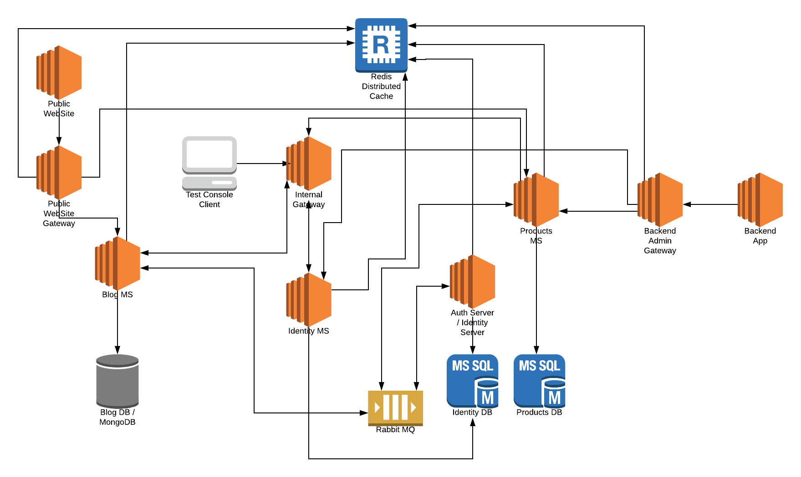

# Microservice Demo Overall

## Introduction

The goal of this work is to show how to create a complete microservice solution based on the ABP framework.

## Tooling

* **[ASP.NET Core](https://docs.microsoft.com/en-us/aspnet/core/?view=aspnetcore-2.2)** as the web framework.
* **[ABP](https://abp.io)** as the application framework.
* **[Ocelot](https://github.com/ThreeMammals/Ocelot)** as the API Gateway.
* **[IdentityServer4](https://identityserver.io/)** as the authentication server/framework.
* [**Redis**](https://redis.io/) for distributed cache.
* [**RabbitMQ**](https://www.rabbitmq.com/) for distributed messaging.
* **[Serilog](https://serilog.net/)** for logging.

## Diagram

